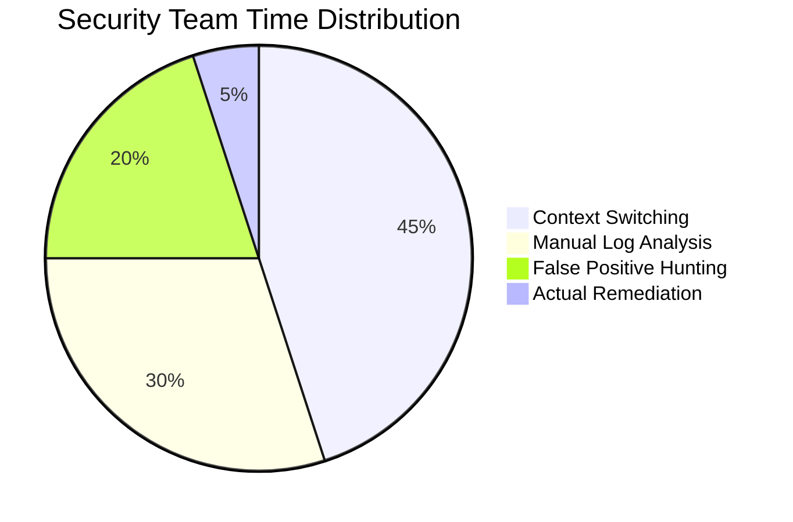
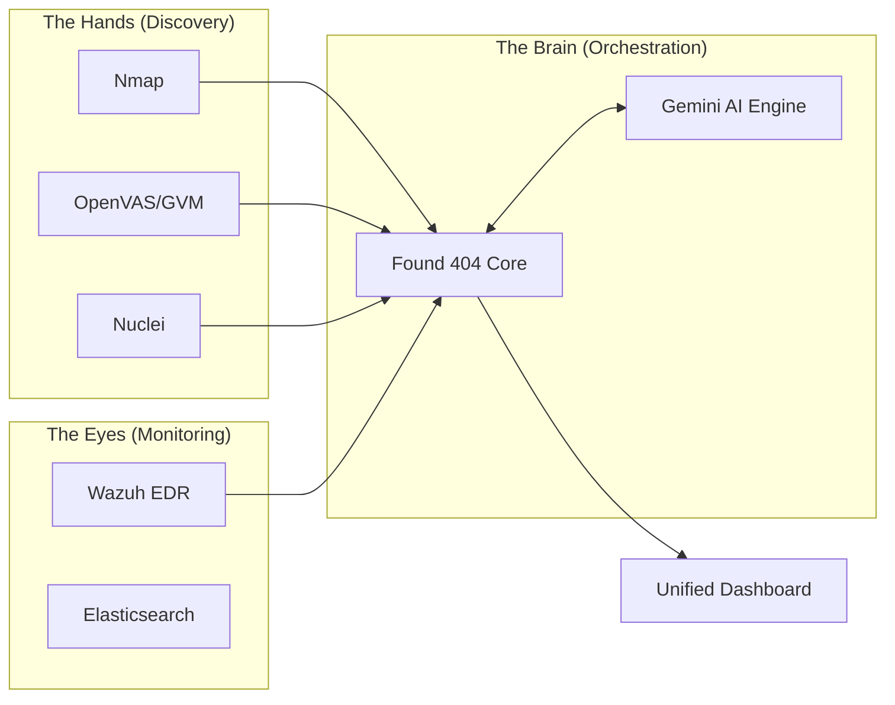
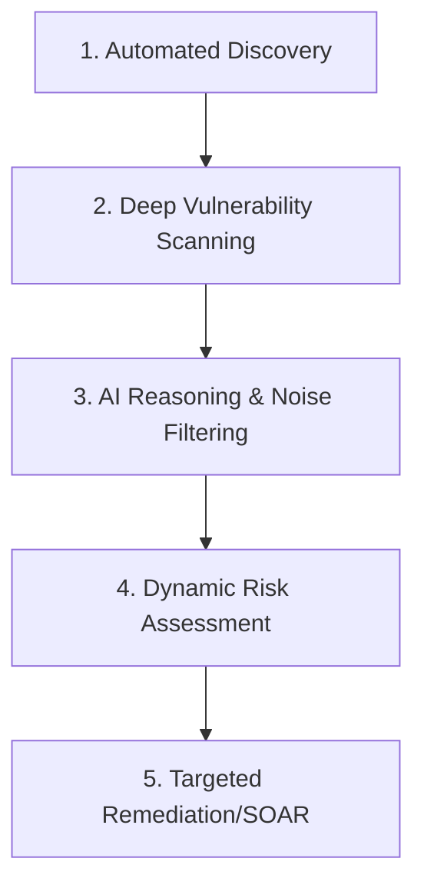

# Found 404: The Intelligent Security Orchestration Center
*Graduation Project Presentation*

---

## Slide 1: Title Slide
**Title:** Found 404: The Intelligent Security Orchestration Center
**Subtitle:** Redefining Unified Threat Management through Autonomous AI Agents
**Presenter:** [Your Name/Team]
**Key Message:** Introducing a new era of security where disparate tools are unified into a single, intelligent organism.

---

## Slide 2: Project Vision - The Orchestration Brain
**Core Idea:** Transforming fragmented security into a logical, professional flow.
- **The Philosophy:** Stop managing tools; start managing security outcomes.
- **The Goal:** To orchestrate different security technologies (Scanners, SIEMs, IDS) into a single unified "brain."
- **Professional Impact:** A simple, high-level interface that hides complex back-end operations while delivering professional-grade intelligence.

---

## Slide 3: The Modern Security Gap
**The Problem:** Tool Fatigue and Information Overload.

- Most security teams spend 95% of their time on "noise" and only 5% on "action."
- Found 404 fixes this by automating the noise-reduction process.

---

## Slide 4: Found 404: The Orchestration Center
**How it Works:** The central hub connecting the "Eyes," "Hands," and "Brain."

---

## Slide 5: The Full-Spectrum Workflow
**The Logic Flow:** From unknown asset to resolved threat.

- **Professionalism:** Every step is documented and justified by AI reasoning.

---

## Slide 6: Component 1: Autonomous Network Mapping
- **Active Discovery:** High-speed Nmap probes to identify "Shadow IT."
- **OS Fingerprinting:** Knowing exactly what is running (Linux, Windows, IoT).
- **Topology Intelligence:** Automatic generation of network maps.
- **The Value:** You cannot protect what you cannot see.

---

## Slide 7: Component 2: Multi-Engine Vulnerability scanning
**Synergy in Action:**
- **GVM (OpenVAS):** Deep, exhaustive infrastructure scanning.
- **Nuclei:** Fast, template-based attack signature detection.
- **Found 404 Role:** It merges these results, removes duplicates, and presents a single "Threat Truth."

---

## Slide 8: Component 3: AI Agent Orchestration (Gemini)
**Turning Raw Data into Wisdom:**
- **Raw Data:** `CVE-2021-44228 detected in /opt/app/log4j.jar`
- **Gemini Interpretation:** "This is a critical Log4Shell vulnerability. Because this server is public-facing, you must patch immediately. Here are the 3 commands to run..."
- **The Role:** The AI acts as a 24/7 Tier-3 Security Analyst.

---

## Slide 9: Component 4: Interactive Risk Topology
**Visualizing the Battleground:**
- **D3.js Visualization:** A living, breathing map of your network.
- **Heat Mapping:** High-risk nodes pulse and glow red.
- **Drill-Down:** Click any node to see its "Security DNA" and AI-suggested fixes.
- **HCI Principles:** Designed for instant situational awareness.

---

## Slide 10: Found 404 vs. SIEM
| Feature | Traditional SIEM | Found 404 (Orchestration) |
| :--- | :--- | :--- |
| **Data Focus** | Passive Logs/Historical | Active Discovery + Live Logs |
| **Complexity** | Extremely High (Manual Rules) | Simple (AI-Driven Logic) |
| **Outcome** | "Something happened" | "Here is the threat & how to fix it" |

---

## Slide 11: Found 404 vs. SOAR
| Feature | Traditional SOAR | Found 404 (Orchestration) |
| :--- | :--- | :--- |
| **Playbooks** | Static/Rigid scripts | Dynamic AI Reasoning |
| **Intelligence** | External Feeds Only | Internal Context + Web Intelligence |
| **Cost** | High Licensing Fees | Low-Cost / Open Architecture |

---

## Slide 12: Unique Value Proposition
1. **Unified Interface:** One dashboard for 6+ security tools.
2. **Contextual Awareness:** Scans understand the "Value" of the asset.
3. **Hyper-Automation:** From discovery to remediation in minutes, not days.
4. **Explainable Security:** Complex CVEs translated for business owners.

---

## Slide 13: Operational Utility (The "Why")
**Why it's useful:**
- **Cost Reduction:** Replaces multiple expensive enterprise licenses.
- **Speed:** Accelerates "Time-to-Remediation" by up to 80%.
- **Skill Bridging:** Enables junior analysts to perform at a senior level using the AI "Brain."
- **Consistency:** Professional-grade scans running 24/7 without human fatigue.

---

## Slide 14: Real-World Use Case: The "Web Breach"
1. **Detection:** Wazuh flags a suspicious login.
2. **Investigation:** Found 404 triggers a Nuclei scan on the targeted node.
3. **Reasoning:** Gemini analyzes the scan + log and identifies a SQL injection path.
4. **Action:** Dashboard notifies the admin and suggests blocking the attacker IP via n8n.
5. **Result:** Threat neutralized before data exfiltration.

---

## Slide 15: Conclusion & Future Vision
**Summary:**
- Found 404 is more than a dashboard; it's a **Security Force Multiplier.**
- It orchestrates the best open-source tools with world-class AI.
- **Future:** Fully autonomous "Self-Healing" networks where the AI blocks threats in milliseconds.

**Thank You! Questions?**
