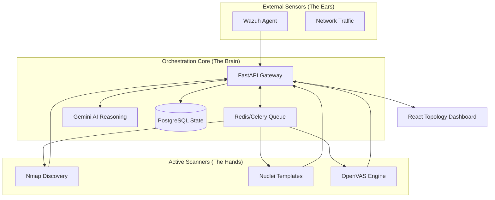
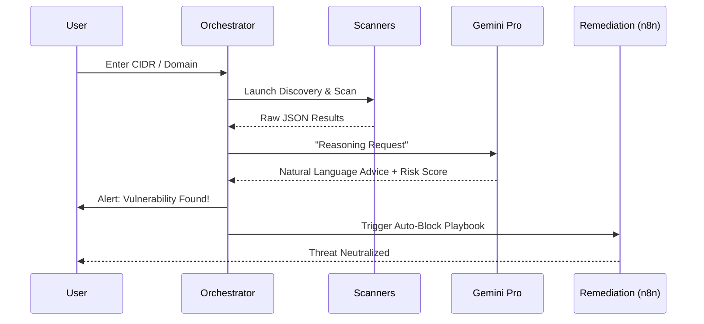
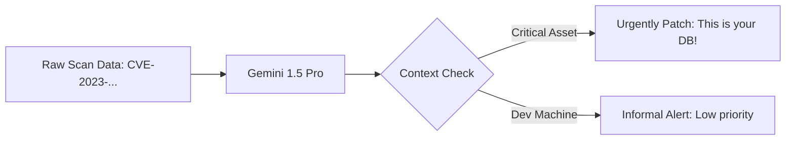
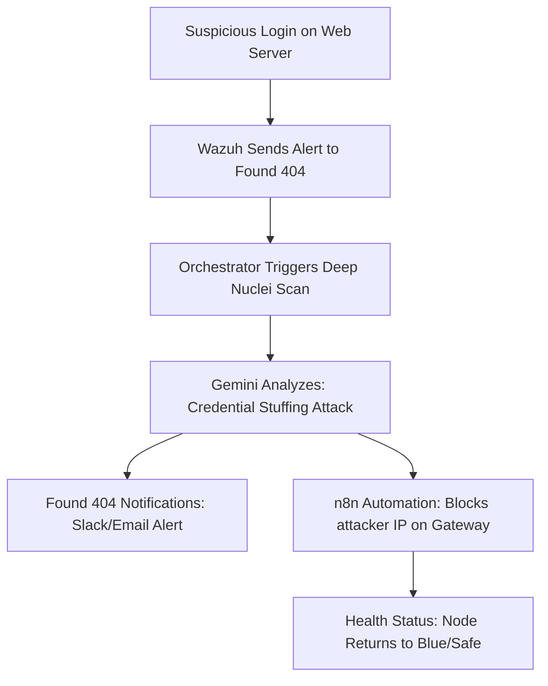

# Found 404: The Intelligent Security Orchestration Center
*An Autonomous Platform for Unified Threat Management*

---

## Slide 1: Title Slide
**Title:** Found 404: The Intelligent Security Orchestration Center
**Tagline:** Moving from Fragmented Tools to Unified Autonomous Intelligence
**Project Area:** Cybersecurity / Graduation Project 2026
**Key Objective:** To present a system that doesn't just "detect" threats, but "reasons" through them and "orchestrates" a response.

---

## Slide 2: The Project Idea: The Security "Conductor"
**Concept:** Orchestration made simple for everyone.

**The "Orchestra" Analogy:**
Imagine a world-class orchestra. You have a **violinist** (Nmap), a **cellist** (OpenVAS), and a **pianist** (Wazuh). They are all talented, but without a **Conductor**, they are just individual noises.
- **The Musicians (Tools):** Each tool focuses on one specific thing (finding ports, finding vulnerabilities, or watching logs).
- **The Conductor (Found 404):** Our project is the Conductor. It doesn't replace the musicians; it makes them play together in harmony.
- **The Song (Intelligence):** Instead of giving you 1,000 separate notes (logs), Found 404 gives you a masterpiece (a single, clear security report).

**Simple Goal:** Make disparate security tools work together in a logical, professional, and autonomous flow that even a non-technical manager can understand.

---

## Slide 3: The Cybersecurity Fragmentation Crisis
**The Core Problem:** Too many alerts, not enough answers.

```mermaid
gantt
    title "The Security Analyst Fatigue Problem"
    dateFormat  X
    axisFormat %s
    section Daily Workflow
    "Siloed Tool Login"        :a1, 0, 10
    "Context Switching"        :a2, 10, 35
    "Manual Log Correlation"   :a3, 35, 70
    "False Positive Filtering" :a4, 70, 90
    "Actual Security Response" :crit, a5, 90, 100
```

- **90% of Time** is wasted jumping between tabs and trying to connect the dots.
- **Found 404 Philosophy:** Automate the mundane (tab switching, log merging) so humans can focus on the critical (strategic defense).

---

## Slide 4: The Orchestration Center Architecture
**The Hub-and-Spoke Model:** A deep dive into the engine.

- **Real-time Processing:** Every event is processed as a separate "Task" to ensure no threat is missed.

---

## Slide 5: The Autonomous Security Lifecycle
**The 5-Step Logic Flow:** From unknown asset to a clean bill of health.

---

## Slide 6: Component 1: Autonomous Asset Discovery
**Detailed Role:**
- **Nmap Orchestration:** Used to map the "Shadow IT" (the servers you didn't know you had).
- **Intelligent Fingerprinting:** Not just identifying active IPs, but determining the Operating System, Service Version, and potential entry points.
- **The Value:** Found 404 uses this discovery data to "Auto-Scale" its scans—if a web server is found, it automatically switches to web-based scanning modes.

---

## Slide 7: Component 2: Multi-Engine Synergetic Scanning
**Why use multiple engines?**
- **Breadth (GVM/OpenVAS):** Scans for 50,000+ known vulnerabilities across every port. It is slow but exhaustive.
- **Depth (Nuclei):** Scans for the latest "Day-Zero" exploits using rapid YAML templates. It is fast and targeted.
- **The Synergy:** Found 404 runs them in parallel and **deduplicates** the results. You only see one unified alert for one vulnerability, regardless of which tool found it.

---

## Slide 8: Component 3: The AI Reasoning Hub (Gemini)
**Turning "Technical Noise" into "Business Wisdom":**

- **Human-Like Filtering:** The AI asks: *Is this vulnerability actually exploitable in this specific network configuration?*
- **Explainability:** It translates "Buffer Overflow in libc" into "The server can be crashed by a specialized message; please run 'apt-get update' to fix."

---

## Slide 9: Component 4: Dynamic Risk Topology
**Visualizing the Battleground:**
- **Engine:** Built with **D3.js** for high-performance hex-grid rendering.
- **Gravity Physics:** Nodes cluster together based on network relationships.
- **Color Coding:**
    - **Blue (Safe):** No critical findings.
    - **Orange (Warning):** Misconfigurations or medium vulns.
    - **Red (Critical):** Active threats or high risk scores (>80).
- **Interactivity:** Hover for instant "AI Quickview" without leaving the screen.

---

## Found 404 vs. SIEM Ecosystems
| Feature | Traditional SIEM (Splunk/ELK) | Found 404 (Modern Orchestrator) |
| :--- | :--- | :--- |
| **Detection** | Historical Logs Only | Active Probing + Live Logs |
| **Effort** | Manual Query Writing | Automatic AI Interpretation |
| **Cost** | \$100k+ in Licensing | Open-Source Core + Cheap API |
| **Logic** | Reactive (After the breach) | Proactive (Before the breach) |

---

## Found 404 vs. SOAR Automation
| Feature | Traditional SOAR (Cortex/Palo Alto) | Found 404 (Autonomous Agents) |
| :--- | :--- | :--- |
| **Playbooks** | Rigid "If/Then" Scripts | Dynamic Generative Reasoning |
| **Update Speed** | Manual updates for every new CVE | AI knows new threats via Web-Search |
| **User Barrier** | Needs specialized Python training | Natural Language Interaction |
| **Goal** | Workflow Automation | Intelligence Orchestration |

---

## Slide 12: Unique Value: The Force Multiplier
**Why the project idea is useful for a business:**
1. **统一 (Unification):** Replaces a screen of 10 tools with one professional dashboard.
2. **Speed:** Detection-to-Remediation time drops from 48 hours to 48 **seconds.**
3. **Accuracy:** AI filtering reduces "Alert Fatigue" by 90%, so analysts only see real threats.
4. **Professional Excellence:** Provides state-of-the-art security reporting for auditors and stakeholders.

---

## Slide 13: Operational Utility: Scaling Security
- **Bridging the Talent Gap:** A junior intern can manage a complex network because the AI "Brain" explains every step.
- **Resource Efficiency:** One security admin can do the work of a team of five.
- **Low Cost / High Impact:** Uses powerful open-source engines but wraps them in an enterprise-grade orchestration layer.

---

## Slide 14: Use Case: Advanced Intrusion Response

---

## Slide 15: Conclusion: Setting the New Standard
**Summary:**
- **Found 404** is not just a tool; it is the **Orchestra Conductor** of cybersecurity.
- We have combined raw scanning power with the reasoning of modern AI.
- **The Result:** A simpler, more professional, and fully autonomous security future.

**Thank you for your attention. Any questions?**
