# Orchestration Security Center — FYP Figures

> All figures are rendered as Mermaid.js code blocks for native rendering in Markdown-compatible environments (GitHub, GitLab, VS Code, Obsidian).
> Visual style: minimalist, professional, consistent with IEEE/ACM academic standards.
>
> **Source:** Reconstructed from the legacy `FYP_Figures.md` (commit `22d37a33^`) and `docs/FYP.md` (commit `18e695cb^`), then cross-audited against the live codebase on **2026-05-24**.
> Each updated figure carries an *Updated 2026-05-24* note describing what changed since the original draft.

---

## Table of Contents

| # | Figure | Status |
|---|--------|--------|
| 3.1 | High-Level System Architecture | **Updated** |
| 3.2 | Agent Orchestration Pipeline | **Updated** |
| 3.3 | UnifiedRiskEngine Calculation Logic | **Updated** |
| 3.4 | Entity-Relationship Diagram (ERD) | **Updated** |
| 3.5 | Data Flow Diagram — Level 0 (Context) | **Updated** |
| 3.6 | Data Flow Diagram — Level 1 (Detailed) | **Updated** |
| 3.7 | Use Case Diagram | **Updated** |
| 3.8 | Docker Compose Service Architecture | **Updated** |
| 3.9 | Frontend Component Hierarchy | **Updated** |
| 3.10 | Dashboard UI Wireframe — Command Center | **Updated** |
| 3.11 | Dashboard UI Wireframe — Operations | **Updated** |
| 3.12 | Dashboard UI Wireframe — Threat Center | **Updated** |
| 3.13 | Lab Environment Network Topology | **NEW** |
| 3.14 | RBAC Role/Permission Matrix | **NEW** |
| 3.15 | Auth & JWT Token Lifecycle | **NEW** |
| 3.16 | Tamper-Evident AgentLog Hash Chain | **NEW** |
| 4.1 | Backend Project Directory Structure | **Updated** |
| 4.2 | Frontend Project Directory Structure | **Updated** |
| 4.3 – 4.11 | Application Screenshots | Captions only |
| 5.1 | Performance Benchmark — API Response Times | **Updated** |
| 5.2 | Risk Score Distribution Across Lab Targets | **Updated** |
| 5.3 | Scan Completion Time Comparison | **Updated** |

---

## Chapter 3 — Methodology / System Design

---

### Figure 3.1 — High-Level System Architecture

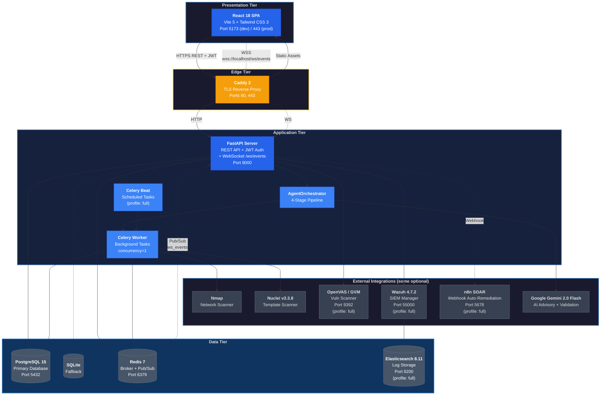
```mermaid
graph TB
    subgraph PresentationTier["<b>Presentation Tier</b>"]
        FE["<b>React 18 SPA</b><br/>Vite 5 + Tailwind CSS 3<br/>Port 5173 (dev) / 443 (prod)"]
    end

    subgraph EdgeTier["<b>Edge Tier</b>"]
        CADDY["<b>Caddy 2</b><br/>TLS Reverse Proxy<br/>Ports 80, 443"]
    end

    subgraph ApplicationTier["<b>Application Tier</b>"]
        API["<b>FastAPI Server</b><br/>REST API + JWT Auth<br/>+ WebSocket /ws/events<br/>Port 8000"]
        ORCH["<b>AgentOrchestrator</b><br/>4-Stage Pipeline"]
        CELERY["<b>Celery Worker</b><br/>Background Tasks<br/>concurrency=1"]
        BEAT["<b>Celery Beat</b><br/>Scheduled Tasks<br/>(profile: full)"]
    end

    subgraph DataTier["<b>Data Tier</b>"]
        PG[("<b>PostgreSQL 15</b><br/>Primary Database<br/>Port 5432")]
        SQLITE[("<b>SQLite</b><br/>Fallback")]
        REDIS[("<b>Redis 7</b><br/>Broker + Pub/Sub<br/>Port 6379")]
        ES[("<b>Elasticsearch 8.11</b><br/>Log Storage<br/>Port 9200<br/>(profile: full)")]
    end

    subgraph ExternalIntegrations["<b>External Integrations (some optional)</b>"]
        NMAP["<b>Nmap</b><br/>Network Scanner"]
        NUCLEI["<b>Nuclei v3.3.8</b><br/>Template Scanner"]
        OPENVAS["<b>OpenVAS / GVM</b><br/>Vuln Scanner<br/>Port 9392<br/>(profile: full)"]
        WAZUH["<b>Wazuh 4.7.2</b><br/>SIEM Manager<br/>Port 55000<br/>(profile: full)"]
        N8N["<b>n8n SOAR</b><br/>Webhook Auto-Remediation<br/>Port 5678<br/>(profile: full)"]
        GEMINI["<b>Google Gemini 2.0 Flash</b><br/>AI Advisory + Validation"]
    end

    FE -- "HTTPS REST + JWT" --> CADDY
    CADDY -- "HTTP" --> API
    CADDY -- "Static Assets" --> FE
    FE -. "WSS<br/>wss://localhost/ws/events" .-> CADDY
    CADDY -. "WS" .-> API
    API --> ORCH
    ORCH --> CELERY
    BEAT --> CELERY
    API --> PG
    API -.- SQLITE
    API --> REDIS
    CELERY --> PG
    CELERY --> REDIS
    CELERY --> NMAP
    CELERY --> NUCLEI
    API --> OPENVAS
    API --> WAZUH
    API -. "Webhook" .-> N8N
    ORCH --> GEMINI
    WAZUH --> ES
    REDIS -. "Pub/Sub<br/>ws_events" .-> API

    style PresentationTier fill:#1a1a2e,stroke:#4a90d9,stroke-width:2px,color:#e0e0e0
    style EdgeTier fill:#1a1a2e,stroke:#fbbf24,stroke-width:2px,color:#e0e0e0
    style ApplicationTier fill:#16213e,stroke:#4a90d9,stroke-width:2px,color:#e0e0e0
    style DataTier fill:#0f3460,stroke:#4a90d9,stroke-width:2px,color:#e0e0e0
    style ExternalIntegrations fill:#1a1a2e,stroke:#4a90d9,stroke-width:2px,color:#e0e0e0
    style FE fill:#2563eb,stroke:#1d4ed8,color:#fff
    style CADDY fill:#f59e0b,stroke:#d97706,color:#fff
    style API fill:#2563eb,stroke:#1d4ed8,color:#fff
    style ORCH fill:#3b82f6,stroke:#2563eb,color:#fff
    style CELERY fill:#3b82f6,stroke:#2563eb,color:#fff
    style BEAT fill:#3b82f6,stroke:#2563eb,color:#fff
    style PG fill:#475569,stroke:#64748b,color:#fff
    style SQLITE fill:#475569,stroke:#64748b,color:#fff
    style REDIS fill:#475569,stroke:#64748b,color:#fff
    style ES fill:#475569,stroke:#64748b,color:#fff
    style NMAP fill:#374151,stroke:#6b7280,color:#e0e0e0
    style NUCLEI fill:#374151,stroke:#6b7280,color:#e0e0e0
    style OPENVAS fill:#374151,stroke:#6b7280,color:#e0e0e0
    style WAZUH fill:#374151,stroke:#6b7280,color:#e0e0e0
    style N8N fill:#374151,stroke:#6b7280,color:#e0e0e0
    style GEMINI fill:#374151,stroke:#6b7280,color:#e0e0e0
```

**Figure 3.1:** *High-Level System Architecture Diagram — Four-tier architecture (Presentation, Edge, Application, Data) plus External Integrations. The React SPA reaches the FastAPI backend through a Caddy 2 TLS reverse proxy (ports 80/443). The application tier contains the FastAPI server, AgentOrchestrator (4-stage pipeline), Celery worker, and an optional Celery Beat scheduler. The data tier comprises PostgreSQL 15 (primary), SQLite (fallback), Redis 7 (broker + pub/sub for the `/ws/events` WebSocket channel), and Elasticsearch 8.11 (optional, behind the `full` Docker profile). External integrations include Nmap, Nuclei v3.3.8, OpenVAS/GVM (optional), Wazuh 4.7.2 SIEM (optional), n8n SOAR (optional), and Google Gemini 2.0 Flash.*

> **Updated 2026-05-24:** Added Caddy reverse proxy tier; renamed WebSocket endpoint from `/ws/logs` → `/ws/events`; reduced agent count from 5 → 4 stages; pinned Nuclei version (v3.3.8) and Wazuh version (4.7.2); flagged OpenVAS, Elasticsearch, Wazuh, n8n, and Celery Beat as `profile: full` (heavy/optional services); added SQLite as fallback database and JWT auth on the API layer.

---

### Figure 3.2 — Agent Orchestration Pipeline

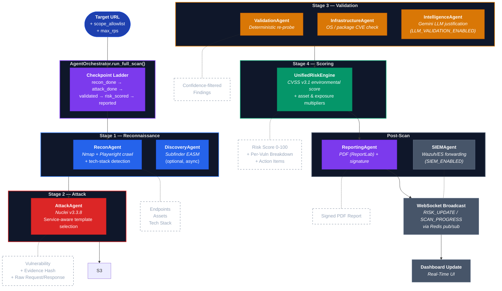
```mermaid
flowchart TB
    INPUT(["<b>Target URL</b><br/>+ scope_allowlist<br/>+ max_rps"]) --> ORCH

    subgraph Orchestrator["<b>AgentOrchestrator.run_full_scan()</b>"]
        ORCH["<b>Checkpoint Ladder</b><br/>recon_done → attack_done →<br/>validated → risk_scored → reported"]
    end

    ORCH --> S1

    subgraph Stage1["<b>Stage 1 — Reconnaissance</b>"]
        S1["<b>ReconAgent</b><br/><i>Nmap + Playwright crawl</i><br/>+ tech-stack detection"]
        S1B["<b>DiscoveryAgent</b><br/><i>Subfinder EASM</i><br/>(optional, async)"]
    end

    Stage1 --> S2

    subgraph Stage2["<b>Stage 2 — Attack</b>"]
        S2["<b>AttackAgent</b><br/><i>Nuclei v3.3.8</i><br/>Service-aware template selection"]
    end

    Stage2 --> S3

    subgraph Stage3["<b>Stage 3 — Validation</b>"]
        S3A["<b>ValidationAgent</b><br/><i>Deterministic re-probe</i>"]
        S3B["<b>InfrastructureAgent</b><br/><i>OS / package CVE check</i>"]
        S3C["<b>IntelligenceAgent</b><br/><i>Gemini LLM justification<br/>(LLM_VALIDATION_ENABLED)</i>"]
    end

    Stage3 --> S4

    subgraph Stage4["<b>Stage 4 — Scoring</b>"]
        S4["<b>UnifiedRiskEngine</b><br/><i>CVSS v3.1 environmental score</i><br/>+ asset & exposure multipliers"]
    end

    S4 --> S5

    subgraph PostScan["<b>Post-Scan</b>"]
        S5["<b>ReportingAgent</b><br/><i>PDF (ReportLab) + signature</i>"]
        S6["<b>SIEMAgent</b><br/><i>Wazuh/ES forwarding<br/>(SIEM_ENABLED)</i>"]
    end

    S5 --> WS["<b>WebSocket Broadcast</b><br/><i>RISK_UPDATE / SCAN_PROGRESS<br/>via Redis pub/sub</i>"]
    S6 -.- WS
    WS --> DASH["<b>Dashboard Update</b><br/><i>Real-Time UI</i>"]

    S1 -.- D1["Endpoints<br/>Assets<br/>Tech Stack"]
    S2 -.- D2["Vulnerability<br/>+ Evidence Hash<br/>+ Raw Request/Response"]
    S3A -.- D3["Confidence-filtered<br/>Findings"]
    S4 -.- D4["Risk Score 0-100<br/>+ Per-Vuln Breakdown<br/>+ Action Items"]
    S5 -.- D5["Signed PDF Report"]

    style INPUT fill:#1e40af,stroke:#1d4ed8,color:#fff
    style ORCH fill:#7c3aed,stroke:#6d28d9,color:#fff
    style S1 fill:#2563eb,stroke:#1d4ed8,color:#fff
    style S1B fill:#2563eb,stroke:#1d4ed8,color:#fff
    style S2 fill:#dc2626,stroke:#b91c1c,color:#fff
    style S3A fill:#d97706,stroke:#b45309,color:#fff
    style S3B fill:#d97706,stroke:#b45309,color:#fff
    style S3C fill:#d97706,stroke:#b45309,color:#fff
    style S4 fill:#059669,stroke:#047857,color:#fff
    style S5 fill:#7c3aed,stroke:#6d28d9,color:#fff
    style S6 fill:#475569,stroke:#64748b,color:#fff
    style WS fill:#475569,stroke:#64748b,color:#fff
    style DASH fill:#475569,stroke:#64748b,color:#fff
    style Stage1 fill:#0f172a,stroke:#3b82f6,stroke-width:2px,color:#e0e0e0
    style Stage2 fill:#0f172a,stroke:#dc2626,stroke-width:2px,color:#e0e0e0
    style Stage3 fill:#0f172a,stroke:#d97706,stroke-width:2px,color:#e0e0e0
    style Stage4 fill:#0f172a,stroke:#059669,stroke-width:2px,color:#e0e0e0
    style Orchestrator fill:#0f172a,stroke:#7c3aed,stroke-width:2px,color:#e0e0e0
    style PostScan fill:#0f172a,stroke:#475569,stroke-width:2px,color:#e0e0e0
    style D1 fill:none,stroke:#64748b,stroke-dasharray:5 5,color:#94a3b8
    style D2 fill:none,stroke:#64748b,stroke-dasharray:5 5,color:#94a3b8
    style D3 fill:none,stroke:#64748b,stroke-dasharray:5 5,color:#94a3b8
    style D4 fill:none,stroke:#64748b,stroke-dasharray:5 5,color:#94a3b8
    style D5 fill:none,stroke:#64748b,stroke-dasharray:5 5,color:#94a3b8
```

**Figure 3.2:** *Agent Orchestration Pipeline — Four logical stages coordinated by `AgentOrchestrator.run_full_scan()`. Stage 1 (Reconnaissance) uses `ReconAgent` (Nmap + Playwright crawl + tech-stack detection) and optionally `DiscoveryAgent` (subfinder-based EASM). Stage 2 (Attack) delegates to `AttackAgent`, which runs Nuclei v3.3.8 with template tags chosen by service-aware mapping. Stage 3 (Validation) runs `ValidationAgent` (re-probe), `InfrastructureAgent` (OS/package CVE check), and `IntelligenceAgent` (Gemini LLM, gated by `LLM_VALIDATION_ENABLED`). Stage 4 (Scoring) is the deterministic `UnifiedRiskEngine` with CVSS v3.1 environmental adjustment. After scoring, `ReportingAgent` produces a signed PDF and `SIEMAgent` (when enabled) forwards events to Wazuh/Elasticsearch. Each phase persists a `Scan.checkpoint`, so a Celery retry resumes from the last completed stage.*

> **Updated 2026-05-24:** Re-organised from "5 sequential agents" into "4 stages with multiple agents per stage" to reflect the actual class layout (`ReconAgent`, `AttackAgent`, `ValidationAgent`, `SIEMAgent`, `ReportingAgent` in `agent_orchestrator.py` plus `DiscoveryAgent`, `InfrastructureAgent`, `IntelligenceAgent` in standalone modules). Added the checkpoint-resume mechanism (`recon_done → attack_done → validated → risk_scored → reported`), feature-flag gating for LLM validation and SIEM forwarding, and Redis pub/sub as the transport for the `/ws/events` broadcast.

---

### Figure 3.3 — UnifiedRiskEngine Calculation Logic

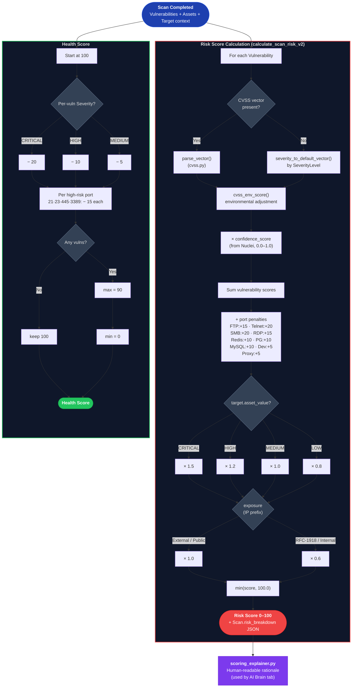
```mermaid
flowchart TB
    START(["<b>Scan Completed</b><br/>Vulnerabilities + Assets + Target context"]) --> RS_START

    subgraph RiskScore["<b>Risk Score Calculation (calculate_scan_risk_v2)</b>"]
        RS_START["For each Vulnerability"] --> CVSS_VEC{"CVSS vector<br/>present?"}
        CVSS_VEC -->|Yes| PARSE["parse_vector()<br/>(cvss.py)"]
        CVSS_VEC -->|No| DEFAULT["severity_to_default_vector()<br/>by SeverityLevel"]
        PARSE --> ENV["cvss_env_score()<br/>environmental adjustment"]
        DEFAULT --> ENV
        ENV --> CONF["× confidence_score<br/>(from Nuclei, 0.0–1.0)"]
        CONF --> SUM1["Sum vulnerability scores"]

        SUM1 --> PORT["+ port penalties<br/>FTP:+15 · Telnet:+20<br/>SMB:+20 · RDP:+15<br/>Redis:+10 · PG:+10<br/>MySQL:+10 · Dev:+5<br/>Proxy:+5"]
        PORT --> ASSET{"target.asset_value?"}
        ASSET -->|CRITICAL| M1["× 1.5"]
        ASSET -->|HIGH| M2["× 1.2"]
        ASSET -->|MEDIUM| M3["× 1.0"]
        ASSET -->|LOW| M4["× 0.8"]
        M1 --> EXP{"exposure<br/>(IP prefix)"}
        M2 --> EXP
        M3 --> EXP
        M4 --> EXP
        EXP -->|External / Public| E1["× 1.0"]
        EXP -->|RFC-1918 / Internal| E2["× 0.6"]
        E1 --> CAP["min(score, 100.0)"]
        E2 --> CAP
        CAP --> RS_OUT(["<b>Risk Score 0–100</b><br/>+ Scan.risk_breakdown JSON"])
    end

    START --> HS_START

    subgraph HealthScore["<b>Health Score</b>"]
        HS_START["Start at 100"] --> HSEV{"Per-vuln Severity?"}
        HSEV -->|CRITICAL| HD1["− 20"]
        HSEV -->|HIGH| HD2["− 10"]
        HSEV -->|MEDIUM| HD3["− 5"]
        HD1 --> HPORT["Per high-risk port<br/>21·23·445·3389: − 15 each"]
        HD2 --> HPORT
        HD3 --> HPORT
        HPORT --> HCAP{"Any vulns?"}
        HCAP -->|Yes| HC90["max = 90"]
        HCAP -->|No| HFLOOR["keep 100"]
        HC90 --> HMIN["min = 0"]
        HFLOOR --> HS_OUT(["<b>Health Score</b>"])
        HMIN --> HS_OUT
    end

    RS_OUT --> EXPLAIN["<b>scoring_explainer.py</b><br/>Human-readable rationale<br/>(used by AI Brain tab)"]

    style START fill:#1e40af,stroke:#1d4ed8,color:#fff
    style RiskScore fill:#0f172a,stroke:#ef4444,stroke-width:2px,color:#e0e0e0
    style HealthScore fill:#0f172a,stroke:#22c55e,stroke-width:2px,color:#e0e0e0
    style RS_OUT fill:#ef4444,stroke:#dc2626,color:#fff
    style HS_OUT fill:#22c55e,stroke:#16a34a,color:#fff
    style EXPLAIN fill:#7c3aed,stroke:#6d28d9,color:#fff
    style CVSS_VEC fill:#334155,stroke:#64748b,color:#e0e0e0
    style ASSET fill:#334155,stroke:#64748b,color:#e0e0e0
    style EXP fill:#334155,stroke:#64748b,color:#e0e0e0
    style HSEV fill:#334155,stroke:#64748b,color:#e0e0e0
    style HCAP fill:#334155,stroke:#64748b,color:#e0e0e0
```

**Figure 3.3:** *UnifiedRiskEngine Calculation Logic — Dual-path scoring. The Risk Score path (`calculate_scan_risk_v2`) iterates each vulnerability, parses its CVSS v3.1 vector (or falls back to a default vector keyed off the SeverityLevel enum), applies an environmental adjustment using the target's `asset_value`, `data_sensitivity`, and inferred exposure, multiplies by the Nuclei confidence score, then adds port-exposure penalties for nine high-risk services. The result is multiplied by an asset-criticality factor (×0.8 to ×1.5) and an exposure modifier (×0.6 for RFC-1918 internal, ×1.0 for public), capped at 100. The Health Score path applies fixed deductions per severity and per high-risk port (21, 23, 445, 3389), capped at 90 when any vulnerability exists and floored at 0. The full per-vuln breakdown is persisted to `Scan.risk_breakdown` JSON and humanised by `scoring_explainer.py` for the AI Brain tab.*

> **Updated 2026-05-24:** Replaced the static "+25/+15/+7/+2" severity-weight table with the actual `calculate_scan_risk_v2` path: CVSS v3.1 vector parsing, environmental adjustment, and per-vuln breakdown. Added the `scoring_explainer.py` post-step (used by the AI Brain tab). The legacy scalar `calculate_scan_risk()` method now delegates to v2 and is kept only for backward compatibility.

---

### Figure 3.4 — Entity-Relationship Diagram (ERD)

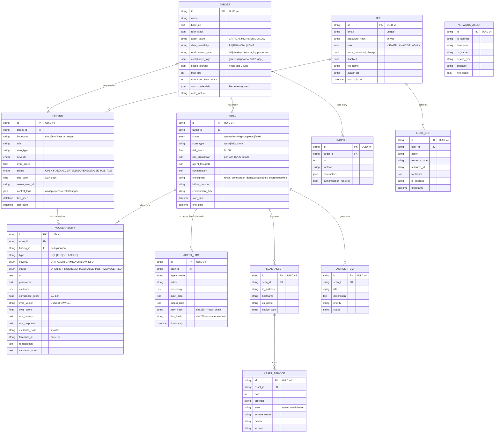
```mermaid
erDiagram
    USER {
        string id PK "UUID v4"
        string email "unique"
        string password_hash "bcrypt"
        enum role "VIEWER | ANALYST | ADMIN"
        bool force_password_change
        bool disabled
        string full_name
        string avatar_url
        datetime last_login_at
    }

    TARGET {
        string id PK "UUID v4"
        string name
        text base_url
        json tech_stack
        string asset_value "CRITICAL|HIGH|MEDIUM|LOW"
        string data_sensitivity "PII|FINANCIAL|NONE"
        string environment_type "lab|development|staging|production"
        json compliance_tags "[pci-dss,hipaa,iso-27001,gdpr]"
        json scope_allowlist "hosts and CIDRs"
        int max_rps
        int max_concurrent_scans
        json auth_credentials "Fernet-encrypted"
        string auth_method
    }

    SCAN {
        string id PK "UUID v4"
        string target_id FK
        enum status "queued|running|completed|failed"
        string scan_type "quick|full|custom"
        float risk_score "0-100"
        json risk_breakdown "per-vuln CVSS details"
        json agent_thoughts
        json configuration
        string checkpoint "recon_done|attack_done|validated|risk_scored|reported"
        string failure_reason
        string environment_type
        datetime start_time
        datetime end_time
    }

    VULNERABILITY {
        string id PK "UUID v4"
        string scan_id FK
        string finding_id FK "deduplication"
        string type "SQLi|XSS|BOLA|SSRF|..."
        enum severity "CRITICAL|HIGH|MEDIUM|LOW|INFO"
        enum status "OPEN|IN_PROGRESS|FIXED|FALSE_POSITIVE|ACCEPTED"
        text url
        text parameter
        json evidence
        float confidence_score "0.0-1.0"
        string cvss_vector "CVSS:3.1/AV:N/..."
        float cvss_score
        text raw_request
        text raw_response
        string evidence_hash "sha256"
        string template_id "nuclei id"
        text remediation
        text validation_notes
    }

    FINDING {
        string id PK "UUID v4"
        string target_id FK
        string fingerprint "sha256 unique per target"
        string title
        string vuln_type
        enum severity
        float cvss_score
        enum status "OPEN|FIXED|ACCEPTED|REOPENED|FALSE_POSITIVE"
        date due_date "SLA clock"
        string owner_user_id
        json control_tags "owasp/cwe/iso27001/nist/pci"
        datetime first_seen
        datetime last_seen
    }

    AGENT_LOG {
        string id PK "UUID v4"
        string scan_id FK
        string agent_name
        string action
        json reasoning
        json input_data
        json output_data
        string prev_hash "sha256 — hash chain"
        string this_hash "sha256 — tamper-evident"
        datetime timestamp
    }

    SCAN_ASSET {
        string id PK "UUID v4"
        string scan_id FK
        string ip_address
        string hostname
        string os_name
        string device_type
    }

    ASSET_SERVICE {
        string id PK "UUID v4"
        string asset_id FK
        int port
        string protocol
        string state "open|closed|filtered"
        string service_name
        string product
        string version
    }

    ENDPOINT {
        string id PK "UUID v4"
        string target_id FK
        text url
        string method
        json parameters
        bool authentication_required
    }

    ACTION_ITEM {
        string id PK "UUID v4"
        string scan_id FK
        string title
        text description
        string priority
        string status
    }

    AUDIT_LOG {
        string id PK "UUID v4"
        string user_id FK
        string action
        string resource_type
        string resource_id
        json metadata
        string ip_address
        datetime timestamp
    }

    NETWORK_ASSET {
        string id PK "UUID v4"
        string ip_address
        string hostname
        string os_name
        string device_type
        string criticality
        float risk_score
    }

    USER ||--o{ AUDIT_LOG : "performs"
    USER ||--o{ FINDING : "owns (owner_user_id)"
    TARGET ||--o{ SCAN : "has many"
    TARGET ||--o{ ENDPOINT : "has many"
    TARGET ||--o{ FINDING : "accumulates"
    SCAN ||--o{ VULNERABILITY : "discovers"
    SCAN ||--o{ SCAN_ASSET : "discovers"
    SCAN ||--o{ AGENT_LOG : "produces (hash-chained)"
    SCAN ||--o{ ACTION_ITEM : "generates"
    SCAN_ASSET ||--o{ ASSET_SERVICE : "runs"
    FINDING ||--o{ VULNERABILITY : "is observed as"
```

**Figure 3.4:** *Entity-Relationship Diagram (ERD) — Twelve-entity relational schema rooted at `User` (RBAC) and `Target` (CRUD). `User` has three roles (VIEWER, ANALYST, ADMIN) and is referenced by every `AuditLog` action. `Target` aggregates `Scan`, `Endpoint`, and `Finding`. Each `Scan` produces `Vulnerability`, `ScanAsset`, `AgentLog`, and `ActionItem` rows. The `Finding` entity deduplicates security issues across re-scans via a `fingerprint = sha256(target + type + url + parameter + evidence_signature)`; each `Vulnerability` is an "observation" of a `Finding`, so the lifecycle (OPEN → FIXED → REOPENED) survives multiple scans. `AgentLog` rows form a tamper-evident SHA-256 chain (`prev_hash → this_hash`) verified via `GET /api/v1/scans/{id}/audit/verify`. CVSS v3.1 vectors are stored per vulnerability for environmental scoring.*

> **Updated 2026-05-24:** Added `User` and `AuditLog` entities (Phase 3.1 RBAC). Added `Finding` entity with `fingerprint` for cross-scan deduplication (Phase 4.2). Added compliance `control_tags` on `Finding` (Phase 5.3). Added `cvss_vector`, `cvss_score`, `raw_request`, `raw_response`, `evidence_hash`, `template_id`, `validation_notes` on `Vulnerability` (Phase 1.2 + Phase 4.1). Added `risk_breakdown`, `checkpoint`, `failure_reason`, `environment_type` on `Scan` (Phase 2.3, 4.1, 5). Added `compliance_tags`, `scope_allowlist`, `max_rps`, `max_concurrent_scans`, `environment_type` on `Target` (Phase 2.4, 5). `AgentLog` now carries `prev_hash`/`this_hash` (Phase 5.1).

---

### Figure 3.5 — Data Flow Diagram — Level 0 (Context)

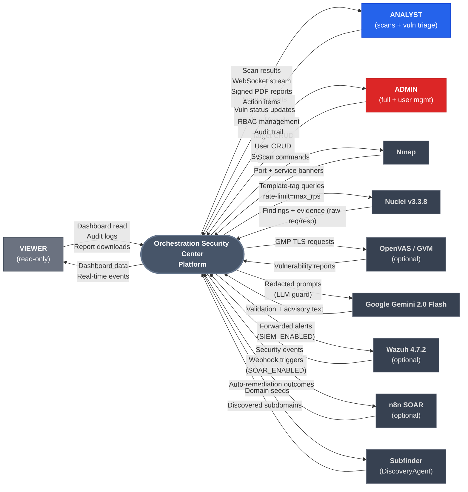
```mermaid
flowchart LR
    VIEWER["<b>VIEWER</b><br/>(read-only)"]
    ANALYST["<b>ANALYST</b><br/>(scans + vuln triage)"]
    ADMIN["<b>ADMIN</b><br/>(full + user mgmt)"]

    SYSTEM(["<b>Orchestration Security Center<br/>Platform</b>"])

    NMAP_E["<b>Nmap</b>"]
    NUCLEI_E["<b>Nuclei v3.3.8</b>"]
    OPENVAS_E["<b>OpenVAS / GVM</b><br/>(optional)"]
    GEMINI_E["<b>Google Gemini 2.0 Flash</b>"]
    WAZUH_E["<b>Wazuh 4.7.2</b><br/>(optional)"]
    N8N_E["<b>n8n SOAR</b><br/>(optional)"]
    SUBF_E["<b>Subfinder</b><br/>(DiscoveryAgent)"]

    VIEWER -- "Dashboard read<br/>Audit logs<br/>Report downloads" --> SYSTEM
    SYSTEM -- "Dashboard data<br/>Real-time events" --> VIEWER

    ANALYST -- "Scan requests<br/>Vuln status updates<br/>Finding lifecycle" --> SYSTEM
    SYSTEM -- "Scan results<br/>WebSocket stream<br/>Signed PDF reports<br/>Action items" --> ANALYST

    ADMIN -- "Target CRUD<br/>User CRUD<br/>System config" --> SYSTEM
    SYSTEM -- "RBAC management<br/>Audit trail" --> ADMIN

    SYSTEM -- "Scan commands" --> NMAP_E
    NMAP_E -- "Port + service banners" --> SYSTEM

    SYSTEM -- "Template-tag queries<br/>rate-limit=max_rps" --> NUCLEI_E
    NUCLEI_E -- "Findings + evidence (raw req/resp)" --> SYSTEM

    SYSTEM -- "GMP TLS requests" --> OPENVAS_E
    OPENVAS_E -- "Vulnerability reports" --> SYSTEM

    SYSTEM -- "Redacted prompts<br/>(LLM guard)" --> GEMINI_E
    GEMINI_E -- "Validation + advisory text" --> SYSTEM

    SYSTEM -- "Forwarded alerts<br/>(SIEM_ENABLED)" --> WAZUH_E
    WAZUH_E -- "Security events" --> SYSTEM

    SYSTEM -- "Webhook triggers<br/>(SOAR_ENABLED)" --> N8N_E
    N8N_E -- "Auto-remediation outcomes" --> SYSTEM

    SYSTEM -- "Domain seeds" --> SUBF_E
    SUBF_E -- "Discovered subdomains" --> SYSTEM

    style VIEWER fill:#6b7280,stroke:#4b5563,color:#fff
    style ANALYST fill:#2563eb,stroke:#1d4ed8,color:#fff
    style ADMIN fill:#dc2626,stroke:#b91c1c,color:#fff
    style SYSTEM fill:#475569,stroke:#64748b,color:#fff,stroke-width:3px
    style NMAP_E fill:#374151,stroke:#6b7280,color:#e0e0e0
    style NUCLEI_E fill:#374151,stroke:#6b7280,color:#e0e0e0
    style OPENVAS_E fill:#374151,stroke:#6b7280,color:#e0e0e0
    style GEMINI_E fill:#374151,stroke:#6b7280,color:#e0e0e0
    style WAZUH_E fill:#374151,stroke:#6b7280,color:#e0e0e0
    style N8N_E fill:#374151,stroke:#6b7280,color:#e0e0e0
    style SUBF_E fill:#374151,stroke:#6b7280,color:#e0e0e0
```

**Figure 3.5:** *Data Flow Diagram — Level 0 (Context) — The Orchestration Security Center represented as a single process interacting with three role-based human actors (VIEWER, ANALYST, ADMIN) and seven external tool/service entities. The VIEWER role consumes dashboard data and audit logs read-only; ANALYST initiates scans, updates vulnerability status, and downloads signed reports; ADMIN additionally performs target/user CRUD and reviews the audit trail. External integrations include Nmap (port scanning), Nuclei v3.3.8 (template-driven attack), OpenVAS/GVM (optional deep vuln scan), Google Gemini 2.0 Flash (LLM validation + advisory text via redacted prompts), Wazuh 4.7.2 (optional SIEM forwarding), n8n (optional SOAR webhooks), and Subfinder (EASM via DiscoveryAgent).*

> **Updated 2026-05-24:** Split the single "SME Administrator" actor into three RBAC roles (VIEWER, ANALYST, ADMIN) to match `UserRole` enum. Added Subfinder (DiscoveryAgent) and n8n SOAR as external entities. Annotated LLM prompts as "redacted" (via `llm_guard.py`). Marked Wazuh, OpenVAS, and n8n with the optional flag tied to environment-variable feature toggles (`SIEM_ENABLED`, `OPENVAS_ENABLED`, `SOAR_ENABLED`).

---

### Figure 3.6 — Data Flow Diagram — Level 1 (Detailed)

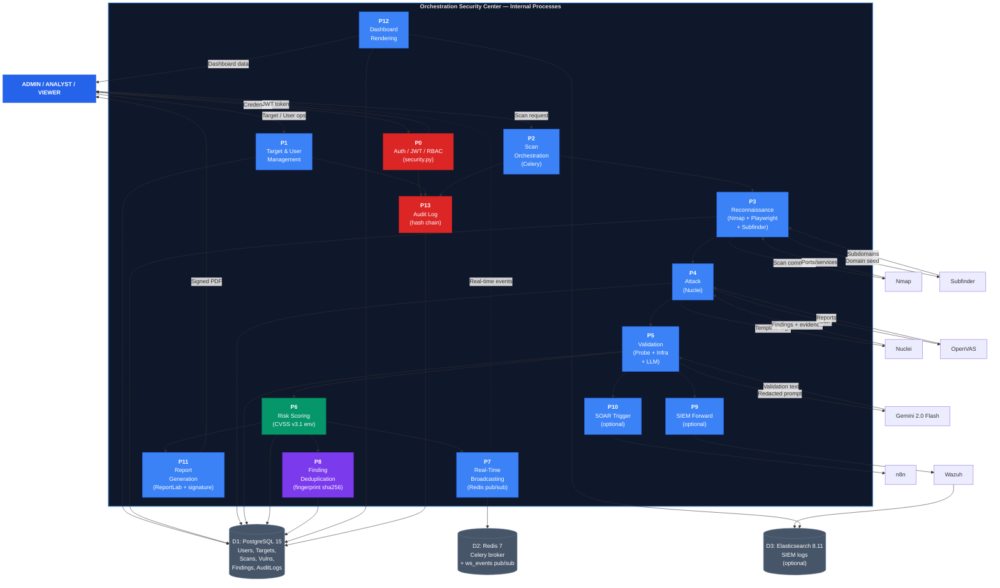
```mermaid
flowchart TB
    ADMIN["<b>ADMIN / ANALYST / VIEWER</b>"]

    subgraph System["<b>Orchestration Security Center — Internal Processes</b>"]
        P0["<b>P0</b><br/>Auth / JWT / RBAC<br/>(security.py)"]
        P1["<b>P1</b><br/>Target & User<br/>Management"]
        P2["<b>P2</b><br/>Scan<br/>Orchestration<br/>(Celery)"]
        P3["<b>P3</b><br/>Reconnaissance<br/>(Nmap + Playwright<br/>+ Subfinder)"]
        P4["<b>P4</b><br/>Attack<br/>(Nuclei)"]
        P5["<b>P5</b><br/>Validation<br/>(Probe + Infra<br/>+ LLM)"]
        P6["<b>P6</b><br/>Risk Scoring<br/>(CVSS v3.1 env)"]
        P7["<b>P7</b><br/>Real-Time<br/>Broadcasting<br/>(Redis pub/sub)"]
        P8["<b>P8</b><br/>Finding<br/>Deduplication<br/>(fingerprint sha256)"]
        P9["<b>P9</b><br/>SIEM Forward<br/>(optional)"]
        P10["<b>P10</b><br/>SOAR Trigger<br/>(optional)"]
        P11["<b>P11</b><br/>Report<br/>Generation<br/>(ReportLab + signature)"]
        P12["<b>P12</b><br/>Dashboard<br/>Rendering"]
        P13["<b>P13</b><br/>Audit Log<br/>(hash chain)"]
    end

    D1[("D1: PostgreSQL 15<br/>Users, Targets,<br/>Scans, Vulns,<br/>Findings, AuditLogs")]
    D2[("D2: Redis 7<br/>Celery broker<br/>+ ws_events pub/sub")]
    D3[("D3: Elasticsearch 8.11<br/>SIEM logs<br/>(optional)")]

    NMAP_E["Nmap"]
    NUCLEI_E["Nuclei"]
    OPENVAS_E["OpenVAS"]
    GEMINI_E["Gemini 2.0 Flash"]
    WAZUH_E["Wazuh"]
    N8N_E["n8n"]
    SUBF_E["Subfinder"]

    ADMIN -- "Credentials" --> P0
    P0 -- "JWT token" --> ADMIN
    ADMIN -- "Target / User ops" --> P1
    ADMIN -- "Scan request" --> P2
    P12 -- "Dashboard data" --> ADMIN
    P11 -- "Signed PDF" --> ADMIN
    P7 -. "Real-time events" .-> ADMIN

    P0 --> P13
    P1 --> P13
    P2 --> P13
    P1 --> D1
    P2 --> P3 --> P4 --> P5 --> P6 --> P8
    P6 --> P11
    P6 --> P7
    P5 --> P9
    P5 --> P10

    P3 -- "Scan commands" --> NMAP_E
    P3 -- "Domain seed" --> SUBF_E
    NMAP_E -- "Ports/services" --> P3
    SUBF_E -- "Subdomains" --> P3
    P4 -- "Template tags" --> NUCLEI_E
    NUCLEI_E -- "Findings + evidence" --> P4
    P4 -- "GMP" --> OPENVAS_E
    OPENVAS_E -- "Reports" --> P4
    P5 -- "Redacted prompt" --> GEMINI_E
    GEMINI_E -- "Validation text" --> P5

    P3 --> D1
    P4 --> D1
    P5 --> D1
    P6 --> D1
    P8 --> D1
    P7 --> D2
    P9 --> WAZUH_E
    P10 --> N8N_E
    WAZUH_E --> D3
    P12 --> D1
    P12 --> D3
    P13 --> D1

    style ADMIN fill:#2563eb,stroke:#1d4ed8,color:#fff
    style System fill:#0f172a,stroke:#4a90d9,stroke-width:2px,color:#e0e0e0
    style P0 fill:#dc2626,stroke:#b91c1c,color:#fff
    style P1 fill:#3b82f6,stroke:#2563eb,color:#fff
    style P2 fill:#3b82f6,stroke:#2563eb,color:#fff
    style P3 fill:#3b82f6,stroke:#2563eb,color:#fff
    style P4 fill:#3b82f6,stroke:#2563eb,color:#fff
    style P5 fill:#3b82f6,stroke:#2563eb,color:#fff
    style P6 fill:#059669,stroke:#047857,color:#fff
    style P7 fill:#3b82f6,stroke:#2563eb,color:#fff
    style P8 fill:#7c3aed,stroke:#6d28d9,color:#fff
    style P9 fill:#3b82f6,stroke:#2563eb,color:#fff
    style P10 fill:#3b82f6,stroke:#2563eb,color:#fff
    style P11 fill:#3b82f6,stroke:#2563eb,color:#fff
    style P12 fill:#3b82f6,stroke:#2563eb,color:#fff
    style P13 fill:#dc2626,stroke:#b91c1c,color:#fff
    style D1 fill:#475569,stroke:#64748b,color:#fff
    style D2 fill:#475569,stroke:#64748b,color:#fff
    style D3 fill:#475569,stroke:#64748b,color:#fff
```

**Figure 3.6:** *Data Flow Diagram — Level 1 (Detailed) — Decomposition of the platform into fourteen processes: P0 (Auth/JWT/RBAC), P1 (Target & User Management), P2 (Scan Orchestration via Celery), P3 (Reconnaissance), P4 (Attack), P5 (Validation), P6 (Risk Scoring — CVSS v3.1 environmental), P7 (Real-Time Broadcasting via Redis pub/sub), P8 (Finding Deduplication), P9 (SIEM Forwarding — optional), P10 (SOAR Trigger — optional), P11 (Report Generation + signature), P12 (Dashboard Rendering), P13 (Audit Log with hash chain). Three data stores: D1 (PostgreSQL 15 — all primary entities), D2 (Redis 7 — Celery broker and `ws_events` pub/sub channel), D3 (Elasticsearch 8.11 — SIEM logs, optional). Every privileged process (P0, P1, P2, P5, P10) writes to P13 for tamper-evident audit logging.*

> **Updated 2026-05-24:** Added P0 (Auth), P8 (Finding Dedup), P9 (SIEM), P10 (SOAR), P13 (Audit). Promoted Risk Scoring to its own process (P6). The legacy DFD's eight-process model is now superseded by this fourteen-process view to reflect actual code modules (`auth.py`, `finding_dedup.py`, `audit.py`, `soar_orchestrator.py`).

---

### Figure 3.7 — Use Case Diagram

```mermaid
flowchart LR
    VIEWER_A["<b>VIEWER</b>"]
    ANALYST_A["<b>ANALYST</b>"]
    ADMIN_A["<b>ADMIN</b>"]

    subgraph UseCases["<b>Orchestration Security Center — System Boundary</b>"]
        UC1["UC1: Login / Logout<br/><i>JWT, bcrypt, force-rotate</i>"]
        UC2["UC2: View Dashboard<br/><i>KPIs · Health · Trends</i>"]
        UC3["UC3: Monitor Scan Progress<br/><i>Real-time via /ws/events</i>"]
        UC4["UC4: View Vulnerabilities<br/><i>Read filters · severity · status</i>"]
        UC5["UC5: Explore Network Topology<br/><i>Force-directed graph</i>"]
        UC6["UC6: Download PDF Report<br/><i>Signed, executive</i>"]
        UC7["UC7: View SIEM Alerts<br/><i>Wazuh / ES events</i>"]
        UC8["UC8: View Audit Trail<br/><i>Hash-chain integrity</i>"]
        UC9["UC9: Initiate Scan<br/><i>Quick / Full / Custom</i>"]
        UC10["UC10: Update Vulnerability Status<br/><i>Triage workflow</i>"]
        UC11["UC11: Manage Findings<br/><i>Lifecycle: OPEN → FIXED → REOPENED</i>"]
        UC12["UC12: Configure OpenVAS Scan<br/><i>Schedule, execute, list</i>"]
        UC13["UC13: Manage Targets<br/><i>CRUD + scope_allowlist + max_rps</i>"]
        UC14["UC14: Manage Users<br/><i>Role assignment · disable</i>"]
        UC15["UC15: Configure Feature Flags<br/><i>SIEM · SOAR · LLM toggles</i>"]
        UC16["UC16: Verify AgentLog Hash Chain<br/><i>GET /scans/{id}/audit/verify</i>"]
        UC17["UC17: Tag Compliance Frameworks<br/><i>PCI-DSS · HIPAA · ISO-27001 · GDPR</i>"]
    end

    CELERY["⚙️<br/><b>Celery Worker</b>"]
    GEMINI["🤖<br/><b>Gemini AI</b>"]
    N8N_A["🔄<br/><b>n8n SOAR</b>"]

    %% VIEWER inherits UC1-UC8 (read-only)
    VIEWER_A --- UC1
    VIEWER_A --- UC2
    VIEWER_A --- UC3
    VIEWER_A --- UC4
    VIEWER_A --- UC5
    VIEWER_A --- UC6
    VIEWER_A --- UC7
    VIEWER_A --- UC8

    %% ANALYST adds UC9-UC11
    ANALYST_A --- UC9
    ANALYST_A --- UC10
    ANALYST_A --- UC11

    %% ADMIN adds UC12-UC17 (full)
    ADMIN_A --- UC12
    ADMIN_A --- UC13
    ADMIN_A --- UC14
    ADMIN_A --- UC15
    ADMIN_A --- UC16
    ADMIN_A --- UC17

    UC9 -.- CELERY
    UC3 -.- CELERY
    UC11 -.- GEMINI
    UC4 -.- GEMINI
    UC10 -.- N8N_A

    style VIEWER_A fill:#6b7280,stroke:#4b5563,color:#fff
    style ANALYST_A fill:#2563eb,stroke:#1d4ed8,color:#fff
    style ADMIN_A fill:#dc2626,stroke:#b91c1c,color:#fff
    style CELERY fill:#374151,stroke:#6b7280,color:#e0e0e0
    style GEMINI fill:#374151,stroke:#6b7280,color:#e0e0e0
    style N8N_A fill:#374151,stroke:#6b7280,color:#e0e0e0
    style UseCases fill:#0f172a,stroke:#4a90d9,stroke-width:2px,color:#e0e0e0
    style UC1 fill:#1e293b,stroke:#475569,color:#e0e0e0
    style UC2 fill:#1e293b,stroke:#475569,color:#e0e0e0
    style UC3 fill:#1e293b,stroke:#475569,color:#e0e0e0
    style UC4 fill:#1e293b,stroke:#475569,color:#e0e0e0
    style UC5 fill:#1e293b,stroke:#475569,color:#e0e0e0
    style UC6 fill:#1e293b,stroke:#475569,color:#e0e0e0
    style UC7 fill:#1e293b,stroke:#475569,color:#e0e0e0
    style UC8 fill:#1e293b,stroke:#475569,color:#e0e0e0
    style UC9 fill:#1e3a8a,stroke:#1d4ed8,color:#e0e0e0
    style UC10 fill:#1e3a8a,stroke:#1d4ed8,color:#e0e0e0
    style UC11 fill:#1e3a8a,stroke:#1d4ed8,color:#e0e0e0
    style UC12 fill:#7f1d1d,stroke:#b91c1c,color:#e0e0e0
    style UC13 fill:#7f1d1d,stroke:#b91c1c,color:#e0e0e0
    style UC14 fill:#7f1d1d,stroke:#b91c1c,color:#e0e0e0
    style UC15 fill:#7f1d1d,stroke:#b91c1c,color:#e0e0e0
    style UC16 fill:#7f1d1d,stroke:#b91c1c,color:#e0e0e0
    style UC17 fill:#7f1d1d,stroke:#b91c1c,color:#e0e0e0
```

**Figure 3.7:** *Use Case Diagram — System Actors and Interactions. Three primary actors (VIEWER, ANALYST, ADMIN) with inheritance: VIEWER owns eight read-only use cases (login, dashboard, scan monitoring, vulnerability view, topology, report download, SIEM alerts, audit trail); ANALYST inherits all VIEWER cases plus three write cases (initiate scan, update vulnerability status, manage findings); ADMIN inherits everything and additionally owns six administrative cases (OpenVAS scheduling, target CRUD, user management, feature-flag configuration, hash-chain verification, compliance tagging). Secondary actors: Celery Worker (drives scan execution and progress events), Google Gemini AI (LLM validation + advisory text), and n8n SOAR (auto-remediation webhooks).*

> **Updated 2026-05-24:** Expanded from ten use cases (single SME-Admin actor) to seventeen use cases across three RBAC roles. Added the hash-chain verification endpoint, compliance-tagging use case (Phase 5.3), finding-lifecycle management (Phase 4.2), feature-flag configuration, and n8n SOAR as a secondary actor.

---

### Figure 3.8 — Docker Compose Service Architecture

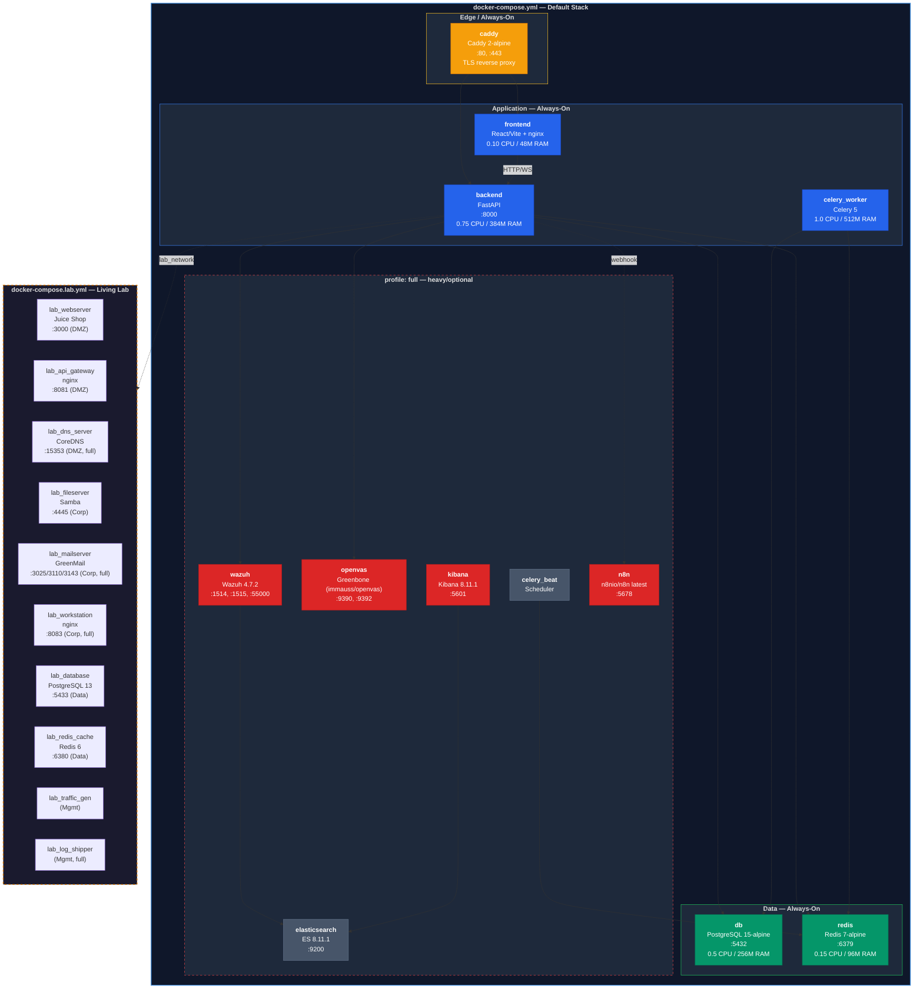
```mermaid
flowchart TB
    subgraph DockerCompose["<b>docker-compose.yml — Default Stack</b>"]
        subgraph EdgeLayer["<b>Edge / Always-On</b>"]
            CADDY_S["<b>caddy</b><br/>Caddy 2-alpine<br/>:80, :443<br/>TLS reverse proxy"]
        end

        subgraph AppLayer["<b>Application — Always-On</b>"]
            BE_S["<b>backend</b><br/>FastAPI<br/>:8000<br/>0.75 CPU / 384M RAM"]
            FE_S["<b>frontend</b><br/>React/Vite + nginx<br/>0.10 CPU / 48M RAM"]
            CW_S["<b>celery_worker</b><br/>Celery 5<br/>1.0 CPU / 512M RAM"]
        end

        subgraph DataLayer["<b>Data — Always-On</b>"]
            DB_S["<b>db</b><br/>PostgreSQL 15-alpine<br/>:5432<br/>0.5 CPU / 256M RAM"]
            RD_S["<b>redis</b><br/>Redis 7-alpine<br/>:6379<br/>0.15 CPU / 96M RAM"]
        end

        subgraph FullProfile["<b>profile: full — heavy/optional</b>"]
            CB_S["<b>celery_beat</b><br/>Scheduler"]
            OV_S["<b>openvas</b><br/>Greenbone (immauss/openvas)<br/>:9390, :9392"]
            EL_S["<b>elasticsearch</b><br/>ES 8.11.1<br/>:9200"]
            KB_S["<b>kibana</b><br/>Kibana 8.11.1<br/>:5601"]
            WZ_S["<b>wazuh</b><br/>Wazuh 4.7.2<br/>:1514, :1515, :55000"]
            N8N_S["<b>n8n</b><br/>n8nio/n8n latest<br/>:5678"]
        end
    end

    subgraph LabStack["<b>docker-compose.lab.yml — Living Lab</b>"]
        T_WEB["lab_webserver<br/>Juice Shop<br/>:3000 (DMZ)"]
        T_GW["lab_api_gateway<br/>nginx<br/>:8081 (DMZ)"]
        T_DNS["lab_dns_server<br/>CoreDNS<br/>:15353 (DMZ, full)"]
        T_FS["lab_fileserver<br/>Samba<br/>:4445 (Corp)"]
        T_MAIL["lab_mailserver<br/>GreenMail<br/>:3025/3110/3143 (Corp, full)"]
        T_WS["lab_workstation<br/>nginx<br/>:8083 (Corp, full)"]
        T_DB["lab_database<br/>PostgreSQL 13<br/>:5433 (Data)"]
        T_REDIS["lab_redis_cache<br/>Redis 6<br/>:6380 (Data)"]
        T_TGEN["lab_traffic_gen<br/>(Mgmt)"]
        T_LSHIP["lab_log_shipper<br/>(Mgmt, full)"]
    end

    CADDY_S --> BE_S
    CADDY_S --> FE_S
    BE_S --> DB_S
    BE_S --> RD_S
    CW_S --> DB_S
    CW_S --> RD_S
    CB_S --> RD_S
    BE_S --> OV_S
    BE_S --> WZ_S
    BE_S -. "webhook" .-> N8N_S
    WZ_S --> EL_S
    KB_S --> EL_S
    FE_S -- "HTTP/WS" --> BE_S
    BE_S -. "lab_network" .-> LabStack

    style DockerCompose fill:#0f172a,stroke:#4a90d9,stroke-width:2px,color:#e0e0e0
    style EdgeLayer fill:#1e293b,stroke:#fbbf24,stroke-width:1px,color:#e0e0e0
    style AppLayer fill:#1e293b,stroke:#3b82f6,stroke-width:1px,color:#e0e0e0
    style DataLayer fill:#1e293b,stroke:#22c55e,stroke-width:1px,color:#e0e0e0
    style FullProfile fill:#1e293b,stroke:#ef4444,stroke-width:1px,stroke-dasharray:5 5,color:#e0e0e0
    style LabStack fill:#1a1a2e,stroke:#d97706,stroke-width:2px,stroke-dasharray:5 5,color:#e0e0e0
    style CADDY_S fill:#f59e0b,stroke:#d97706,color:#fff
    style BE_S fill:#2563eb,stroke:#1d4ed8,color:#fff
    style FE_S fill:#2563eb,stroke:#1d4ed8,color:#fff
    style CW_S fill:#2563eb,stroke:#1d4ed8,color:#fff
    style CB_S fill:#475569,stroke:#64748b,color:#fff
    style DB_S fill:#059669,stroke:#047857,color:#fff
    style RD_S fill:#059669,stroke:#047857,color:#fff
    style EL_S fill:#475569,stroke:#64748b,color:#fff
    style OV_S fill:#dc2626,stroke:#b91c1c,color:#fff
    style WZ_S fill:#dc2626,stroke:#b91c1c,color:#fff
    style KB_S fill:#dc2626,stroke:#b91c1c,color:#fff
    style N8N_S fill:#dc2626,stroke:#b91c1c,color:#fff
```

**Figure 3.8:** *Docker Compose Service Architecture — Two compose files. The default `docker-compose.yml` boots six always-on services (caddy, backend, frontend, db, redis, celery_worker) plus six heavy/optional services behind the `profile: full` (celery_beat, openvas, elasticsearch, kibana, wazuh, n8n) that start only with `docker compose --profile full up`. The companion `docker-compose.lab.yml` provisions the Living Lab — eight containers organized into four /24 subnets (DMZ, Corp, Data, Mgmt) with profile-gated extras (lab_dns_server, lab_mailserver, lab_workstation, lab_log_shipper) under `profile: full-lab`. Both stacks share the external `lab_network` bridge so the backend can scan the lab range.*

> **Updated 2026-05-24:** Added Caddy (TLS reverse proxy) as edge layer; moved Celery Beat, OpenVAS, Elasticsearch, Kibana, Wazuh, and n8n behind the `profile: full` flag (they were "always-on" in the legacy diagram); added per-service resource limits (CPU/RAM caps) that mirror `deploy.resources.limits`; replaced the six legacy vulnerable targets (DVWA, WebGoat, Metasploitable, VulnHub, bWAPP, etc.) with the actual Living Lab from `docker-compose.lab.yml` (Juice Shop + API Gateway + Samba + Postgres + Redis + Traffic Generator across DMZ/Corp/Data/Mgmt subnets).

---

### Figure 3.9 — Frontend Component Hierarchy

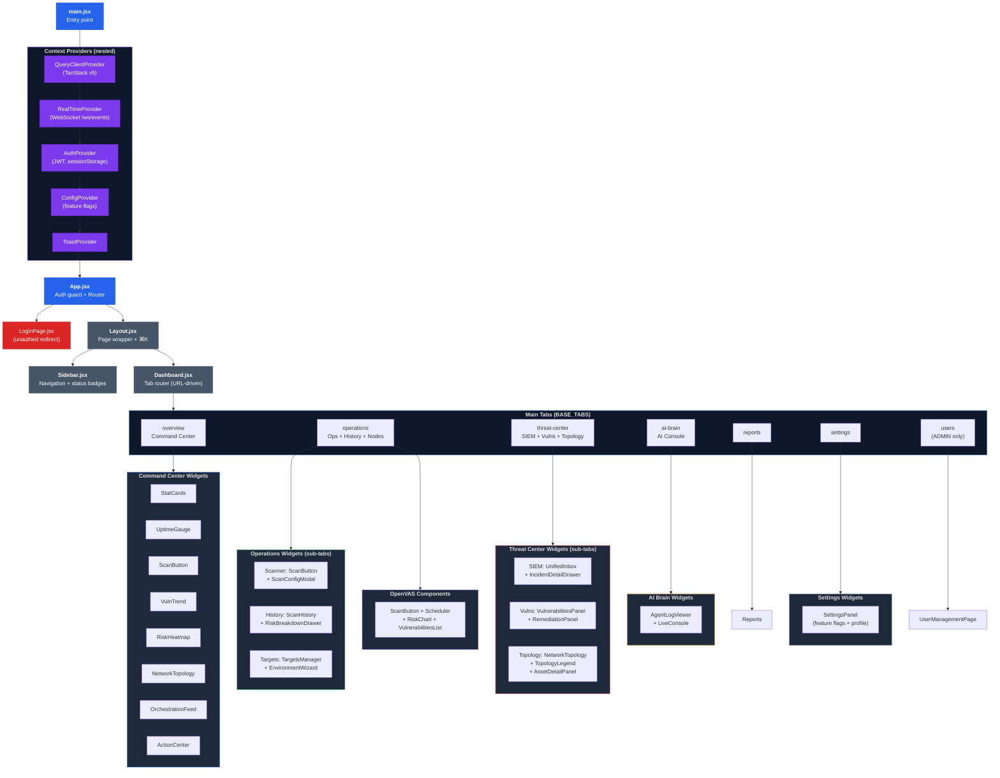
```mermaid
flowchart TB
    MAIN["<b>main.jsx</b><br/>Entry point"]

    subgraph Providers["<b>Context Providers (nested)</b>"]
        QCP["QueryClientProvider<br/>(TanStack v5)"]
        RTP["RealTimeProvider<br/>(WebSocket /ws/events)"]
        AUTH["AuthProvider<br/>(JWT, sessionStorage)"]
        CFG["ConfigProvider<br/>(feature flags)"]
        TST["ToastProvider"]
    end

    MAIN --> QCP --> RTP --> AUTH --> CFG --> TST --> APP_C

    APP_C["<b>App.jsx</b><br/>Auth guard + Router"]
    LOGIN_P["LoginPage.jsx<br/>(unauthed redirect)"]
    APP_C --> LOGIN_P
    APP_C --> LAYOUT_C

    LAYOUT_C["<b>Layout.jsx</b><br/>Page wrapper + ⌘K"]
    SIDEBAR_C["<b>Sidebar.jsx</b><br/>Navigation + status badges"]
    LAYOUT_C --> SIDEBAR_C
    LAYOUT_C --> DASH_C

    DASH_C["<b>Dashboard.jsx</b><br/>Tab router (URL-driven)"]

    subgraph Tabs["<b>Main Tabs (BASE_TABS)</b>"]
        T_OVERVIEW["overview<br/>Command Center"]
        T_OPS["operations<br/>Ops + History + Nodes"]
        T_THREAT["threat-center<br/>SIEM + Vulns + Topology"]
        T_AI["ai-brain<br/>AI Console"]
        T_REPORTS["reports"]
        T_SETTINGS["settings"]
        T_USERS["users<br/>(ADMIN only)"]
    end

    DASH_C --> Tabs

    subgraph OverviewWidgets["<b>Command Center Widgets</b>"]
        SC_W["StatCards"]
        UG_W["UptimeGauge"]
        SB_W["ScanButton"]
        VT_W["VulnTrend"]
        RH_W["RiskHeatmap"]
        NT_W["NetworkTopology"]
        OF_W["OrchestrationFeed"]
        AC_W["ActionCenter"]
    end

    subgraph OpsWidgets["<b>Operations Widgets (sub-tabs)</b>"]
        SCANNER_W["Scanner: ScanButton<br/>+ ScanConfigModal"]
        HISTORY_W["History: ScanHistory<br/>+ RiskBreakdownDrawer"]
        TARG_W["Targets: TargetsManager<br/>+ EnvironmentWizard"]
    end

    subgraph ThreatWidgets["<b>Threat Center Widgets (sub-tabs)</b>"]
        SIEM_W["SIEM: UnifiedInbox<br/>+ IncidentDetailDrawer"]
        VULN_W["Vulns: VulnerabilitiesPanel<br/>+ RemediationPanel"]
        TOPO_W["Topology: NetworkTopology<br/>+ TopologyLegend<br/>+ AssetDetailPanel"]
    end

    subgraph AIWidgets["<b>AI Brain Widgets</b>"]
        AI_W["AgentLogViewer<br/>+ LiveConsole"]
    end

    subgraph OVWidgets["<b>OpenVAS Components</b>"]
        OV_W["ScanButton + Scheduler<br/>+ RiskChart + VulnerabilitiesList"]
    end

    subgraph SettingsWidgets["<b>Settings Widgets</b>"]
        SET_W["SettingsPanel<br/>(feature flags + profile)"]
    end

    T_OVERVIEW --> OverviewWidgets
    T_OPS --> OpsWidgets
    T_OPS --> OVWidgets
    T_THREAT --> ThreatWidgets
    T_AI --> AIWidgets
    T_REPORTS --> REP_W["Reports"]
    T_SETTINGS --> SettingsWidgets
    T_USERS --> UM_W["UserManagementPage"]

    style MAIN fill:#2563eb,stroke:#1d4ed8,color:#fff
    style APP_C fill:#2563eb,stroke:#1d4ed8,color:#fff
    style LAYOUT_C fill:#475569,stroke:#64748b,color:#fff
    style DASH_C fill:#475569,stroke:#64748b,color:#fff
    style SIDEBAR_C fill:#475569,stroke:#64748b,color:#fff
    style LOGIN_P fill:#dc2626,stroke:#b91c1c,color:#fff
    style QCP fill:#7c3aed,stroke:#6d28d9,color:#fff
    style RTP fill:#7c3aed,stroke:#6d28d9,color:#fff
    style AUTH fill:#7c3aed,stroke:#6d28d9,color:#fff
    style CFG fill:#7c3aed,stroke:#6d28d9,color:#fff
    style TST fill:#7c3aed,stroke:#6d28d9,color:#fff
    style Providers fill:#0f172a,stroke:#7c3aed,stroke-width:1px,color:#e0e0e0
    style Tabs fill:#0f172a,stroke:#4a90d9,stroke-width:1px,color:#e0e0e0
    style OverviewWidgets fill:#1e293b,stroke:#3b82f6,stroke-width:1px,color:#e0e0e0
    style OpsWidgets fill:#1e293b,stroke:#22c55e,stroke-width:1px,color:#e0e0e0
    style ThreatWidgets fill:#1e293b,stroke:#ef4444,stroke-width:1px,color:#e0e0e0
    style AIWidgets fill:#1e293b,stroke:#d97706,stroke-width:1px,color:#e0e0e0
    style OVWidgets fill:#1e293b,stroke:#8b5cf6,stroke-width:1px,color:#e0e0e0
    style SettingsWidgets fill:#1e293b,stroke:#64748b,stroke-width:1px,color:#e0e0e0
```

**Figure 3.9:** *Frontend Component Hierarchy — `main.jsx` is wrapped by five nested context providers (QueryClientProvider for TanStack Query, RealTimeProvider for the `/ws/events` WebSocket, AuthProvider for JWT, ConfigProvider for feature flags, ToastProvider). `App.jsx` performs an authentication guard, routing unauthenticated users to `LoginPage.jsx` and everyone else to `Layout.jsx → Dashboard.jsx`. The Dashboard uses URL-driven tab routing (`/dashboard/<tab>/<sub-tab>`) with seven main tabs (Command Center, Operations, Threat Center, AI Brain, Reports, Settings, Users) — the Users tab is conditionally rendered for ADMIN users only. Each tab resolves to specialised widget bundles, all heavy panels are `React.lazy()` code-split for initial-load performance.*

> **Updated 2026-05-24:** Added the four upstream providers (QueryClient, Auth, Config, Toast) that wrap RealTime; renamed the legacy "Center/Ops/Threats/AI/Docs/Config" tabs to the actual IDs (`overview`, `operations`, `threat-center`, `ai-brain`, `reports`, `settings`) and added the ADMIN-only `users` tab. Documented `React.lazy()` code splitting (NetworkTopology, VulnerabilitiesPanel, Reports, OpenVAS, etc.). Added drawer/modal components introduced after the legacy diagram (RiskBreakdownDrawer, IncidentDetailDrawer, AssetDetailPanel, EnvironmentWizard, ScanConfigModal, RemediationPanel, TopologyLegend, LiveConsole, UserManagementPage).*

---

### Figure 3.10 — Dashboard UI Wireframe — Command Center

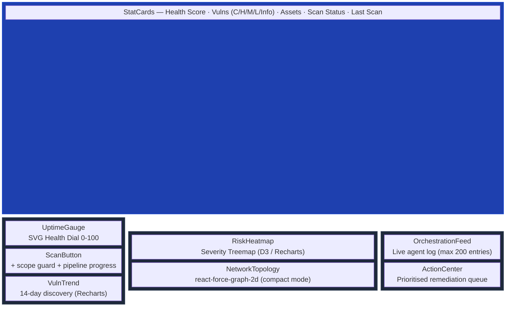
```mermaid
block-beta
    columns 12

    block:header:12
        columns 12
        h1["StatCards — Health Score · Vulns (C/H/M/L/Info) · Assets · Scan Status · Last Scan"]:12
    end

    block:left:3
        columns 1
        l1["UptimeGauge<br/>SVG Health Dial 0-100"]
        l2["ScanButton<br/>+ scope guard + pipeline progress"]
        l3["VulnTrend<br/>14-day discovery (Recharts)"]
    end

    block:center_col:6
        columns 1
        c1["RiskHeatmap<br/>Severity Treemap (D3 / Recharts)"]
        c2["NetworkTopology<br/>react-force-graph-2d (compact mode)"]
    end

    block:right:3
        columns 1
        r1["OrchestrationFeed<br/>Live agent log (max 200 entries)"]
        r2["ActionCenter<br/>Prioritised remediation queue"]
    end

    style header fill:#1e40af,stroke:#1d4ed8,color:#fff
    style left fill:#1e293b,stroke:#475569,color:#e0e0e0
    style center_col fill:#1e293b,stroke:#475569,color:#e0e0e0
    style right fill:#1e293b,stroke:#475569,color:#e0e0e0
```

**Figure 3.10:** *Dashboard UI Wireframe — Command Center Tab. Three-column 12-grid layout: header spans full width with StatCards (Health Score, vulnerability counts by severity, asset total, scan status, last scan timestamp); left rail (3 cols) holds UptimeGauge, ScanButton wrapped in scope guard + pipeline progress, and VulnTrend (14-day discovery via Recharts); centre panel (6 cols) holds RiskHeatmap and NetworkTopology in compact mode; right rail (3 cols) holds the live OrchestrationFeed (capped at 200 entries from `RealTimeContext`) and ActionCenter (sorted by priority).*

> **Updated 2026-05-24:** Specified the rendering libraries actually used (Recharts for VulnTrend/RiskHeatmap, react-force-graph-2d for NetworkTopology). Confirmed the 200-entry cap on OrchestrationFeed (from the RealTimeContext reducer). Added "scope guard" to ScanButton — it consults `target.scope_allowlist` before allowing a scan to start.

---

### Figure 3.11 — Dashboard UI Wireframe — Operations

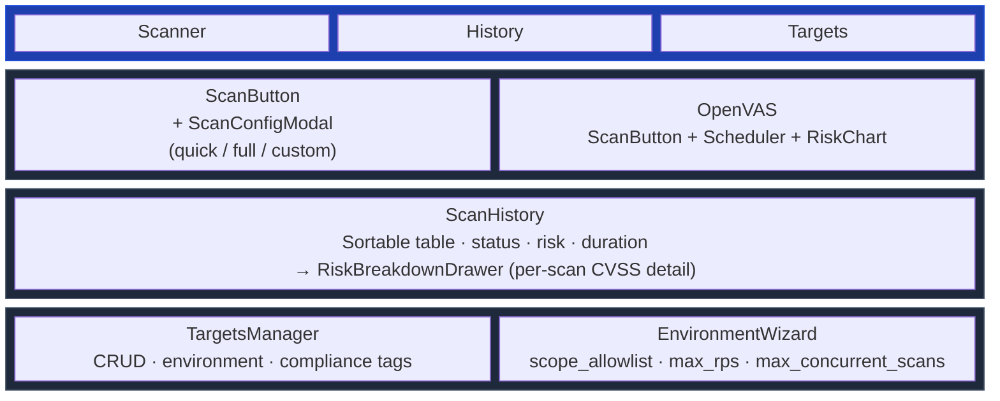
```mermaid
block-beta
    columns 12

    block:subtabs:12
        columns 3
        st1["Scanner"]
        st2["History"]
        st3["Targets"]
    end

    block:scanner_view:12
        columns 2
        sl1["ScanButton<br/>+ ScanConfigModal<br/>(quick / full / custom)"]
        sl2["OpenVAS<br/>ScanButton + Scheduler + RiskChart"]
    end

    block:history_view:12
        columns 1
        hv1["ScanHistory<br/>Sortable table · status · risk · duration<br/>→ RiskBreakdownDrawer (per-scan CVSS detail)"]
    end

    block:targets_view:12
        columns 2
        tv1["TargetsManager<br/>CRUD · environment · compliance tags"]
        tv2["EnvironmentWizard<br/>scope_allowlist · max_rps · max_concurrent_scans"]
    end

    style subtabs fill:#1e40af,stroke:#1d4ed8,color:#fff
    style scanner_view fill:#1e293b,stroke:#475569,color:#e0e0e0
    style history_view fill:#1e293b,stroke:#475569,color:#e0e0e0
    style targets_view fill:#1e293b,stroke:#475569,color:#e0e0e0
```

**Figure 3.11:** *Dashboard UI Wireframe — Operations Tab. Three sub-tabs (Scanner / History / Targets). Scanner view runs two parallel halves: the in-platform ScanButton (with ScanConfigModal for quick/full/custom scan parameters) and the OpenVAS panel (ScanButton + Scheduler + RiskChart). History view shows a sortable ScanHistory table whose row-click opens RiskBreakdownDrawer (per-scan CVSS breakdown and vuln-by-vuln contribution). Targets view pairs TargetsManager (CRUD on Target rows, including environment_type and compliance_tags) with EnvironmentWizard (scope_allowlist + max_rps + max_concurrent_scans setup wizard).*

> **Updated 2026-05-24:** Renamed the legacy "Scan / History / Nodes" sub-tabs to the current "Scanner / History / Targets" (the "Nodes" view was rolled into the Threat Center → Topology sub-tab). Added the per-scan RiskBreakdownDrawer drill-down (introduced with the v2 risk engine) and the EnvironmentWizard component (Phase 5 — environment metadata).

---

### Figure 3.12 — Dashboard UI Wireframe — Threat Center

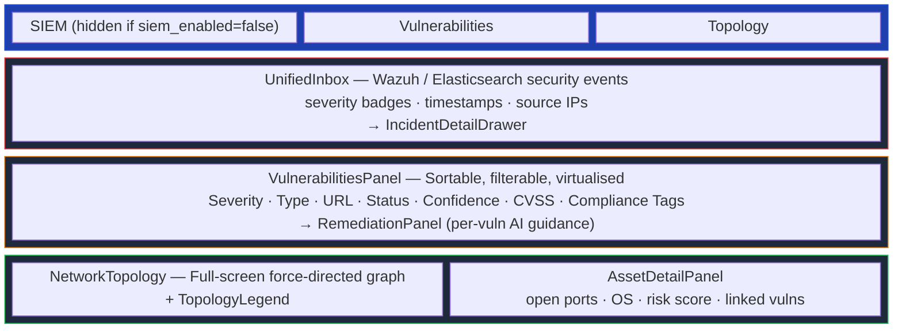
```mermaid
block-beta
    columns 12

    block:subtabs:12
        columns 3
        st1["SIEM (hidden if siem_enabled=false)"]
        st2["Vulnerabilities"]
        st3["Topology"]
    end

    block:siem_view:12
        columns 1
        sv1["UnifiedInbox — Wazuh / Elasticsearch security events<br/>severity badges · timestamps · source IPs<br/>→ IncidentDetailDrawer"]
    end

    block:vulns_view:12
        columns 1
        vv1["VulnerabilitiesPanel — Sortable, filterable, virtualised<br/>Severity · Type · URL · Status · Confidence · CVSS · Compliance Tags<br/>→ RemediationPanel (per-vuln AI guidance)"]
    end

    block:topo_view:12
        columns 2
        tv1["NetworkTopology — Full-screen force-directed graph<br/>+ TopologyLegend"]
        tv2["AssetDetailPanel<br/>open ports · OS · risk score · linked vulns"]
    end

    style subtabs fill:#1e40af,stroke:#1d4ed8,color:#fff
    style siem_view fill:#1e293b,stroke:#ef4444,color:#e0e0e0
    style vulns_view fill:#1e293b,stroke:#d97706,color:#e0e0e0
    style topo_view fill:#1e293b,stroke:#22c55e,color:#e0e0e0
```

**Figure 3.12:** *Dashboard UI Wireframe — Threat Center Tab. Three sub-tabs (SIEM / Vulnerabilities / Topology). The SIEM sub-tab is conditionally hidden when `siem_enabled=false` in `ConfigContext`. SIEM view renders UnifiedInbox (Wazuh/Elasticsearch events) with row-click opening IncidentDetailDrawer. Vulnerabilities view shows the virtualised VulnerabilitiesPanel table (Severity, Type, URL, Status, Confidence, CVSS score, Compliance Tags) with row-click opening RemediationPanel (AI-generated remediation guidance from Gemini). Topology view places the full-screen NetworkTopology force graph next to AssetDetailPanel (open ports, OS, risk score, linked vulnerabilities).*

> **Updated 2026-05-24:** Added the conditional rendering of the SIEM sub-tab (driven by `ConfigContext.siem_enabled`). Added IncidentDetailDrawer, RemediationPanel, AssetDetailPanel, and TopologyLegend — all introduced after the legacy diagram. Added CVSS and Compliance Tags columns on the VulnerabilitiesPanel.*

---

### Figure 3.13 — Lab Environment Network Topology (NEW)

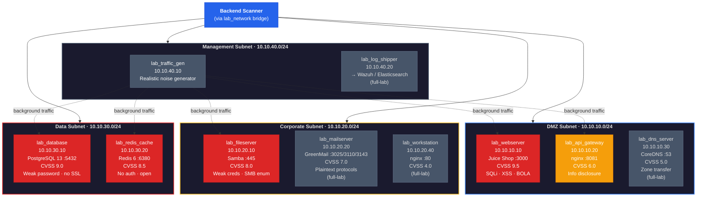
```mermaid
flowchart TB
    subgraph DMZ["<b>DMZ Subnet · 10.10.10.0/24</b>"]
        L_WEB["lab_webserver<br/>10.10.10.10<br/>Juice Shop :3000<br/>CVSS 9.5<br/>SQLi · XSS · BOLA"]
        L_GW["lab_api_gateway<br/>10.10.10.20<br/>nginx :8081<br/>CVSS 6.0<br/>Info disclosure"]
        L_DNS["lab_dns_server<br/>10.10.10.30<br/>CoreDNS :53<br/>CVSS 5.0<br/>Zone transfer<br/>(full-lab)"]
    end

    subgraph CORP["<b>Corporate Subnet · 10.10.20.0/24</b>"]
        L_FS["lab_fileserver<br/>10.10.20.10<br/>Samba :445<br/>CVSS 8.0<br/>Weak creds · SMB enum"]
        L_MAIL["lab_mailserver<br/>10.10.20.20<br/>GreenMail :3025/3110/3143<br/>CVSS 7.0<br/>Plaintext protocols<br/>(full-lab)"]
        L_WS["lab_workstation<br/>10.10.20.40<br/>nginx :80<br/>CVSS 4.0<br/>(full-lab)"]
    end

    subgraph DATA["<b>Data Subnet · 10.10.30.0/24</b>"]
        L_DB["lab_database<br/>10.10.30.10<br/>PostgreSQL 13 :5432<br/>CVSS 9.0<br/>Weak password · no SSL"]
        L_REDIS["lab_redis_cache<br/>10.10.30.20<br/>Redis 6 :6380<br/>CVSS 8.5<br/>No auth · open"]
    end

    subgraph MGMT["<b>Management Subnet · 10.10.40.0/24</b>"]
        L_TGEN["lab_traffic_gen<br/>10.10.40.10<br/>Realistic noise generator"]
        L_LSHIP["lab_log_shipper<br/>10.10.40.20<br/>→ Wazuh / Elasticsearch<br/>(full-lab)"]
    end

    BACKEND_ENTRY["<b>Backend Scanner</b><br/>(via lab_network bridge)"]
    BACKEND_ENTRY --> DMZ
    BACKEND_ENTRY --> CORP
    BACKEND_ENTRY --> DATA
    BACKEND_ENTRY --> MGMT

    L_TGEN -. "background traffic" .-> L_WEB
    L_TGEN -. "background traffic" .-> L_GW
    L_TGEN -. "background traffic" .-> L_FS
    L_TGEN -. "background traffic" .-> L_DB
    L_TGEN -. "background traffic" .-> L_REDIS

    style DMZ fill:#1a1a2e,stroke:#3b82f6,stroke-width:2px,color:#e0e0e0
    style CORP fill:#1a1a2e,stroke:#fbbf24,stroke-width:2px,color:#e0e0e0
    style DATA fill:#1a1a2e,stroke:#dc2626,stroke-width:2px,color:#e0e0e0
    style MGMT fill:#1a1a2e,stroke:#475569,stroke-width:2px,color:#e0e0e0
    style BACKEND_ENTRY fill:#2563eb,stroke:#1d4ed8,color:#fff
    style L_WEB fill:#dc2626,stroke:#b91c1c,color:#fff
    style L_GW fill:#f59e0b,stroke:#d97706,color:#fff
    style L_DNS fill:#475569,stroke:#64748b,color:#e0e0e0
    style L_FS fill:#dc2626,stroke:#b91c1c,color:#fff
    style L_MAIL fill:#475569,stroke:#64748b,color:#e0e0e0
    style L_WS fill:#475569,stroke:#64748b,color:#e0e0e0
    style L_DB fill:#dc2626,stroke:#b91c1c,color:#fff
    style L_REDIS fill:#dc2626,stroke:#b91c1c,color:#fff
    style L_TGEN fill:#475569,stroke:#64748b,color:#fff
    style L_LSHIP fill:#475569,stroke:#64748b,color:#e0e0e0
```

**Figure 3.13 (NEW):** *Living Lab Network Topology — Eight (lite mode) to eleven (`profile: full-lab`) intentionally vulnerable containers organised into four /24 subnets to simulate a realistic SME network: DMZ (10.10.10.0/24) for internet-facing services, Corporate (10.10.20.0/24) for internal office, Data (10.10.30.0/24) for the database/cache tier, and Management (10.10.40.0/24) for traffic generation and log shipping. Each container is tagged with `lab.zone`, `lab.persona`, `lab.vulns`, and `lab.cvss` Docker labels so the platform can score and triage them deterministically. The lab is launched via `docker compose -f docker-compose.lab.yml up` and is reachable from the main stack through the shared external `lab_network` bridge.*

> **NEW 2026-05-24:** This figure did not exist in the legacy `FYP_Figures.md`. The lab environment formerly referenced abstract targets (DVWA, WebGoat, Metasploitable). The current Living Lab uses a multi-subnet topology defined in `docker-compose.lab.yml`.

---

### Figure 3.14 — RBAC Role/Permission Matrix (NEW)

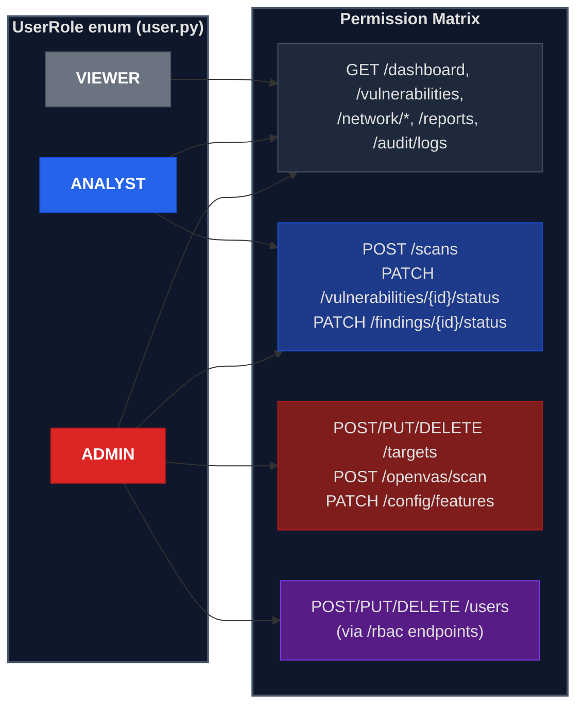
```mermaid
flowchart LR
    subgraph Roles["<b>UserRole enum (user.py)</b>"]
        VIEWER_R["<b>VIEWER</b>"]
        ANALYST_R["<b>ANALYST</b>"]
        ADMIN_R["<b>ADMIN</b>"]
    end

    subgraph Permissions["<b>Permission Matrix</b>"]
        P_READ["GET /dashboard, /vulnerabilities,<br/>/network/*, /reports, /audit/logs"]
        P_SCAN["POST /scans<br/>PATCH /vulnerabilities/{id}/status<br/>PATCH /findings/{id}/status"]
        P_TARGET["POST/PUT/DELETE /targets<br/>POST /openvas/scan<br/>PATCH /config/features"]
        P_USERS["POST/PUT/DELETE /users<br/>(via /rbac endpoints)"]
    end

    VIEWER_R --> P_READ
    ANALYST_R --> P_READ
    ANALYST_R --> P_SCAN
    ADMIN_R --> P_READ
    ADMIN_R --> P_SCAN
    ADMIN_R --> P_TARGET
    ADMIN_R --> P_USERS

    style VIEWER_R fill:#6b7280,stroke:#4b5563,color:#fff
    style ANALYST_R fill:#2563eb,stroke:#1d4ed8,color:#fff
    style ADMIN_R fill:#dc2626,stroke:#b91c1c,color:#fff
    style P_READ fill:#1e293b,stroke:#475569,color:#e0e0e0
    style P_SCAN fill:#1e3a8a,stroke:#1d4ed8,color:#e0e0e0
    style P_TARGET fill:#7f1d1d,stroke:#b91c1c,color:#e0e0e0
    style P_USERS fill:#581c87,stroke:#7c3aed,color:#e0e0e0
    style Roles fill:#0f172a,stroke:#475569,stroke-width:2px,color:#e0e0e0
    style Permissions fill:#0f172a,stroke:#475569,stroke-width:2px,color:#e0e0e0
```

**Figure 3.14 (NEW):** *RBAC Role/Permission Matrix — Three-tier role inheritance from `UserRole` enum in `backend/app/models/user.py`. VIEWER has read-only access to dashboards, vulnerabilities, network assets, reports, and audit logs. ANALYST inherits VIEWER and additionally can initiate scans and update vulnerability/finding status. ADMIN inherits ANALYST and additionally can perform target CRUD, schedule OpenVAS scans, toggle feature flags, and manage users via the `/rbac` endpoints. All routes except `/auth` and `/config` require a valid JWT Bearer token.*

> **NEW 2026-05-24:** RBAC was introduced in Phase 3.1. The legacy documentation modelled a single "SME Administrator" actor with implicit access to everything.

---

### Figure 3.15 — Auth & JWT Token Lifecycle (NEW)

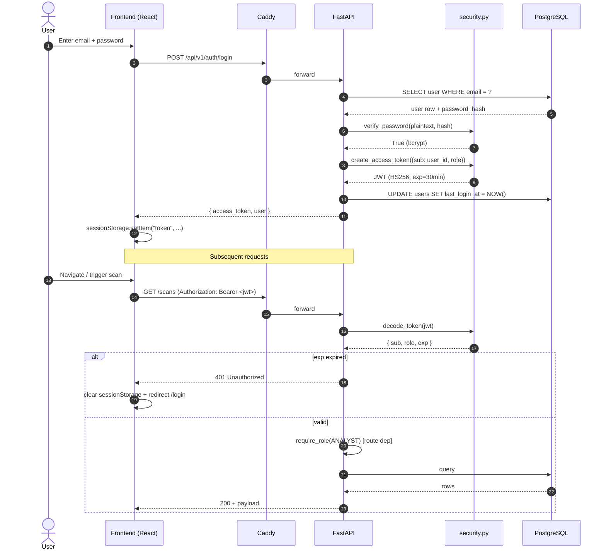
```mermaid
sequenceDiagram
    autonumber
    actor User
    participant FE as Frontend (React)
    participant Caddy
    participant API as FastAPI
    participant SEC as security.py
    participant DB as PostgreSQL

    User->>FE: Enter email + password
    FE->>Caddy: POST /api/v1/auth/login
    Caddy->>API: forward
    API->>DB: SELECT user WHERE email = ?
    DB-->>API: user row + password_hash
    API->>SEC: verify_password(plaintext, hash)
    SEC-->>API: True (bcrypt)
    API->>SEC: create_access_token({sub: user_id, role})
    SEC-->>API: JWT (HS256, exp=30min)
    API->>DB: UPDATE users SET last_login_at = NOW()
    API-->>FE: { access_token, user }
    FE->>FE: sessionStorage.setItem("token", ...)

    Note over FE,API: Subsequent requests

    User->>FE: Navigate / trigger scan
    FE->>Caddy: GET /scans (Authorization: Bearer <jwt>)
    Caddy->>API: forward
    API->>SEC: decode_token(jwt)
    SEC-->>API: { sub, role, exp }
    alt exp expired
        API-->>FE: 401 Unauthorized
        FE->>FE: clear sessionStorage + redirect /login
    else valid
        API->>API: require_role(ANALYST) [route dep]
        API->>DB: query
        DB-->>API: rows
        API-->>FE: 200 + payload
    end
```

**Figure 3.15 (NEW):** *Authentication & JWT Token Lifecycle — Login flow: the React frontend POSTs credentials to `/auth/login` via Caddy; FastAPI looks up the user, verifies the bcrypt-hashed password, mints an HS256 JWT carrying `{sub, role, exp}` (default 30-minute expiry), updates `last_login_at`, and returns the token. The frontend stores the token in `sessionStorage` (cleared on tab close). Subsequent requests carry `Authorization: Bearer <jwt>`; FastAPI's `security.py` decodes the token and the route's `require_role(...)` dependency enforces RBAC. On expiry, the API responds 401 and the frontend clears the token and redirects to the login page.*

> **NEW 2026-05-24:** JWT-based authentication was introduced in Phase 3.1 and was absent from the legacy diagrams.

---

### Figure 3.16 — Tamper-Evident AgentLog Hash Chain (NEW)

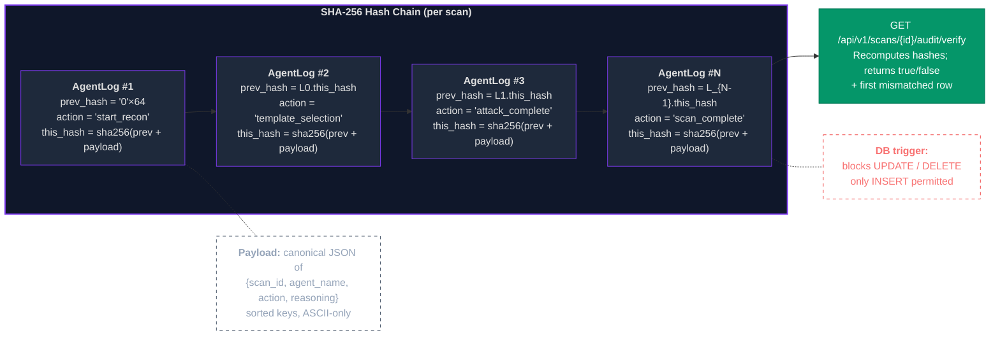
```mermaid
flowchart LR
    subgraph Chain["<b>SHA-256 Hash Chain (per scan)</b>"]
        L0["<b>AgentLog #1</b><br/>prev_hash = '0'×64<br/>action = 'start_recon'<br/>this_hash = sha256(prev + payload)"]
        L1["<b>AgentLog #2</b><br/>prev_hash = L0.this_hash<br/>action = 'template_selection'<br/>this_hash = sha256(prev + payload)"]
        L2["<b>AgentLog #3</b><br/>prev_hash = L1.this_hash<br/>action = 'attack_complete'<br/>this_hash = sha256(prev + payload)"]
        L3["<b>AgentLog #N</b><br/>prev_hash = L_{N-1}.this_hash<br/>action = 'scan_complete'<br/>this_hash = sha256(prev + payload)"]
    end

    L0 --> L1 --> L2 --> L3

    L3 --> VERIFY["GET /api/v1/scans/{id}/audit/verify<br/>Recomputes hashes; returns true/false<br/>+ first mismatched row"]

    NOTE["<b>Payload:</b> canonical JSON of<br/>{scan_id, agent_name, action, reasoning}<br/>sorted keys, ASCII-only"]

    L0 -.- NOTE
    DB_TRIGGER["<b>DB trigger:</b><br/>blocks UPDATE / DELETE<br/>only INSERT permitted"]
    L3 -.- DB_TRIGGER

    style Chain fill:#0f172a,stroke:#7c3aed,stroke-width:2px,color:#e0e0e0
    style L0 fill:#1e293b,stroke:#7c3aed,color:#e0e0e0
    style L1 fill:#1e293b,stroke:#7c3aed,color:#e0e0e0
    style L2 fill:#1e293b,stroke:#7c3aed,color:#e0e0e0
    style L3 fill:#1e293b,stroke:#7c3aed,color:#e0e0e0
    style VERIFY fill:#059669,stroke:#047857,color:#fff
    style NOTE fill:none,stroke:#475569,stroke-dasharray:5 5,color:#94a3b8
    style DB_TRIGGER fill:none,stroke:#ef4444,stroke-dasharray:5 5,color:#f87171
```

**Figure 3.16 (NEW):** *Tamper-Evident AgentLog Hash Chain — Every `AgentLog` row carries `prev_hash` (the previous log's `this_hash` for the same scan, or 64 zeros for the first row) and `this_hash = sha256(prev_hash + canonical_payload)` where the payload is a deterministic JSON serialisation of `{scan_id, agent_name, action, reasoning}` (sorted keys, ASCII-only). A database trigger blocks UPDATE/DELETE on the table, so the chain can only grow. Integrity is verified by `GET /api/v1/scans/{id}/audit/verify`, which recomputes each hash and reports the first mismatched row if tampering occurred.*

> **NEW 2026-05-24:** Phase 5.1 introduced tamper-evident hash chaining; not present in the legacy documentation.

---

## Chapter 4 — Implementation

---

### Figure 4.1 — Backend Project Directory Structure

```mermaid
flowchart LR
    BE["<b>backend/</b>"] --> APP["app/"]
    BE --> DF["Dockerfile"]
    BE --> REQ["requirements.txt"]
    BE --> ALEMBIC["alembic/<br/>migrations"]

    APP --> MAIN["main.py"]
    APP --> API_DIR["api/"]
    APP --> CORE["core/"]
    APP --> MODELS["models/"]
    APP --> SERVICES["services/"]
    APP --> SCHEMAS["schemas/"]

    API_DIR --> API_PY["api.py"]
    API_DIR --> V1["v1/endpoints/"]

    V1 --> EP_AUTH["auth.py"]
    V1 --> EP_DASH["dashboard.py"]
    V1 --> EP_SCAN["scans.py"]
    V1 --> EP_TARG["targets.py"]
    V1 --> EP_VULN["vulnerabilities.py"]
    V1 --> EP_FIND["findings.py"]
    V1 --> EP_REP["reports.py"]
    V1 --> EP_NET["network.py"]
    V1 --> EP_OV["openvas.py"]
    V1 --> EP_SIEM["siem.py"]
    V1 --> EP_CFG["config.py"]
    V1 --> EP_LAB["lab.py"]
    V1 --> EP_AUD["audit.py"]
    V1 --> EP_RBAC["rbac.py"]

    CORE --> CFG["config.py"]
    CORE --> DB_CORE["database.py"]
    CORE --> SEC["security.py<br/><i>JWT + bcrypt</i>"]
    CORE --> CRY["crypto.py<br/><i>Fernet</i>"]
    CORE --> CEL["celery_app.py"]

    MODELS --> M_SCAN["scan.py<br/>Target · Scan · Vuln · Finding ·<br/>AgentLog · Endpoint · ActionItem ·<br/>ScanAsset · AssetService · NetworkAsset"]
    MODELS --> M_USER["user.py<br/>User · UserRole"]
    MODELS --> M_AUDIT["audit_log.py"]
    MODELS --> M_CFG["config.py"]

    SERVICES --> AO["agent_orchestrator.py<br/><i>4 stages · checkpoint ladder</i>"]
    SERVICES --> DA["discovery_agent.py"]
    SERVICES --> INFRA["infrastructure_agent.py"]
    SERVICES --> INTEL["intelligence_agent.py"]
    SERVICES --> URE["unified_risk_engine.py"]
    SERVICES --> CVSS_S["cvss.py"]
    SERVICES --> SE["scoring_explainer.py"]
    SERVICES --> WSM["ws_manager.py"]
    SERVICES --> EP_PUB["event_publisher.py"]
    SERVICES --> NW["nmap_wrapper.py"]
    SERVICES --> NUC["nuclei_wrapper.py"]
    SERVICES --> OVS["openvas.py"]
    SERVICES --> SG["scope_guard.py"]
    SERVICES --> LG["llm_guard.py"]
    SERVICES --> ST["scan_tasks.py<br/><i>Celery tasks</i>"]
    SERVICES --> SR["scan_reaper.py"]
    SERVICES --> TM["task_monitor.py"]
    SERVICES --> AC["alert_correlator.py"]
    SERVICES --> FD["finding_dedup.py"]
    SERVICES --> FT["framework_tagger.py<br/><i>compliance tags</i>"]
    SERVICES --> VP["validation_probe.py"]
    SERVICES --> SLA_S["sla.py"]
    SERVICES --> AM["asset_monitor.py"]
    SERVICES --> LM["lab_manager.py"]
    SERVICES --> TG["topology_generator.py"]
    SERVICES --> PDF["pdf_generator.py"]
    SERVICES --> RS["report_signer.py"]
    SERVICES --> AIA["ai_advisor.py"]
    SERVICES --> WI["wazuh_integration.py"]
    SERVICES --> EI["elastic_integration.py"]
    SERVICES --> SO["soar_orchestrator.py"]

    style BE fill:#2563eb,stroke:#1d4ed8,color:#fff
    style APP fill:#3b82f6,stroke:#2563eb,color:#fff
    style API_DIR fill:#475569,stroke:#64748b,color:#fff
    style V1 fill:#475569,stroke:#64748b,color:#fff
    style CORE fill:#475569,stroke:#64748b,color:#fff
    style MODELS fill:#475569,stroke:#64748b,color:#fff
    style SERVICES fill:#475569,stroke:#64748b,color:#fff
    style SCHEMAS fill:#475569,stroke:#64748b,color:#fff
    style ALEMBIC fill:#475569,stroke:#64748b,color:#fff
```

**Figure 4.1:** *Backend Project Directory Structure — Modular FastAPI application. `app/api/v1/endpoints/` contains 14 endpoint modules (`auth`, `dashboard`, `scans`, `targets`, `vulnerabilities`, `findings`, `reports`, `network`, `openvas`, `siem`, `config`, `lab`, `audit`, `rbac`). `app/core/` holds cross-cutting concerns (`config.py`, `database.py`, `security.py` for JWT + bcrypt, `crypto.py` for Fernet credential encryption, `celery_app.py`). `app/models/` has four SQLAlchemy ORM modules (`scan.py` for the ten core entities, `user.py` for User + UserRole, `audit_log.py`, `config.py`). `app/services/` contains 30+ service modules grouped by concern: orchestration (`agent_orchestrator`, `discovery_agent`, `infrastructure_agent`, `intelligence_agent`), scoring (`unified_risk_engine`, `cvss`, `scoring_explainer`), real-time (`ws_manager`, `event_publisher`), scanner wrappers (`nmap_wrapper`, `nuclei_wrapper`, `openvas`), safety (`scope_guard`, `llm_guard`), task lifecycle (`scan_tasks`, `scan_reaper`, `task_monitor`), data hygiene (`finding_dedup`, `framework_tagger`, `validation_probe`, `sla`, `asset_monitor`), output (`pdf_generator`, `report_signer`, `ai_advisor`), and optional integrations (`wazuh_integration`, `elastic_integration`, `soar_orchestrator`).*

> **Updated 2026-05-24:** Expanded the API listing from 8 → 14 endpoint modules (added `auth`, `findings`, `config`, `lab`, `audit`, `rbac`). Updated `core/` to include `security.py` (JWT) and `crypto.py` (Fernet). Updated `models/` to include `user.py` and `audit_log.py`. Updated `services/` from ~12 → 30+ modules — added agents (`discovery_agent`, `infrastructure_agent`, `intelligence_agent`), safety modules (`scope_guard`, `llm_guard`), data hygiene (`finding_dedup`, `framework_tagger`, `validation_probe`, `sla`, `asset_monitor`), scoring (`cvss`, `scoring_explainer`), lifecycle (`scan_reaper`, `task_monitor`, `alert_correlator`), lab tooling (`lab_manager`, `topology_generator`), and `report_signer`.

---

### Figure 4.2 — Frontend Project Directory Structure

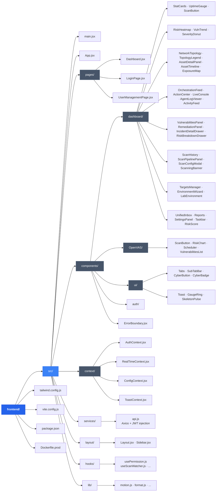
```mermaid
flowchart LR
    FE["<b>frontend/</b>"] --> SRC["src/"]
    FE --> TW["tailwind.config.js"]
    FE --> VITE["vite.config.js"]
    FE --> PKG["package.json"]
    FE --> DF2["Dockerfile.prod"]

    SRC --> MAIN_JSX["main.jsx"]
    SRC --> APP_JSX["App.jsx"]
    SRC --> PAGES["pages/"]
    SRC --> COMP["components/"]
    SRC --> CTX["context/"]
    SRC --> SVC["services/"]
    SRC --> LAY["layout/"]
    SRC --> HOOKS["hooks/"]
    SRC --> LIB["lib/"]

    PAGES --> P_DASH["Dashboard.jsx"]
    PAGES --> P_LOGIN["LoginPage.jsx"]
    PAGES --> P_UM["UserManagementPage.jsx"]

    COMP --> COMP_DASH["dashboard/"]
    COMP --> COMP_OV["OpenVAS/"]
    COMP --> COMP_UI["ui/"]
    COMP --> COMP_AUTH["auth/"]
    COMP --> COMP_EB["ErrorBoundary.jsx"]

    COMP_DASH --> CD1["StatCards · UptimeGauge · ScanButton"]
    COMP_DASH --> CD2["RiskHeatmap · VulnTrend · SeverityDonut"]
    COMP_DASH --> CD3["NetworkTopology · TopologyLegend · AssetDetailPanel · AssetTimeline · ExposureMap"]
    COMP_DASH --> CD4["OrchestrationFeed · ActionCenter · LiveConsole · AgentLogViewer · ActivityFeed"]
    COMP_DASH --> CD5["VulnerabilitiesPanel · RemediationPanel · IncidentDetailDrawer · RiskBreakdownDrawer"]
    COMP_DASH --> CD6["ScanHistory · ScanPipelinePanel · ScanConfigModal · ScanningBanner"]
    COMP_DASH --> CD7["TargetsManager · EnvironmentWizard · LabEnvironment"]
    COMP_DASH --> CD8["UnifiedInbox · Reports · SettingsPanel · Taskbar · RiskScore"]

    COMP_OV --> OV1["ScanButton · RiskChart · Scheduler · VulnerabilitiesList"]
    COMP_UI --> UI1["Tabs · SubTabBar · CyberButton · CyberBadge"]
    COMP_UI --> UI2["Toast · GaugeRing · SkeletonPulse"]

    CTX --> C1["AuthContext.jsx"]
    CTX --> C2["RealTimeContext.jsx"]
    CTX --> C3["ConfigContext.jsx"]
    CTX --> C4["ToastContext.jsx"]

    SVC --> API_JS["api.js<br/><i>Axios + JWT injection</i>"]
    LAY --> LAY_JSX["Layout.jsx · Sidebar.jsx"]
    HOOKS --> H1["usePermission.js<br/>useScanWatcher.js · ..."]
    LIB --> LIB1["motion.js · format.js · ..."]

    style FE fill:#2563eb,stroke:#1d4ed8,color:#fff
    style SRC fill:#3b82f6,stroke:#2563eb,color:#fff
    style COMP fill:#475569,stroke:#64748b,color:#fff
    style COMP_DASH fill:#475569,stroke:#64748b,color:#fff
    style COMP_OV fill:#475569,stroke:#64748b,color:#fff
    style COMP_UI fill:#475569,stroke:#64748b,color:#fff
    style CTX fill:#475569,stroke:#64748b,color:#fff
    style PAGES fill:#475569,stroke:#64748b,color:#fff
```

**Figure 4.2:** *Frontend Project Directory Structure — React 18 + Vite 5 application. `pages/` contains three top-level pages (`Dashboard.jsx`, `LoginPage.jsx`, `UserManagementPage.jsx`). `components/dashboard/` holds 30+ widgets grouped by role: KPI/status (StatCards, UptimeGauge, ScanButton, RiskScore), charting (RiskHeatmap, VulnTrend, SeverityDonut), network (NetworkTopology, TopologyLegend, AssetDetailPanel, AssetTimeline, ExposureMap), real-time (OrchestrationFeed, ActionCenter, LiveConsole, AgentLogViewer, ActivityFeed), vulnerabilities (VulnerabilitiesPanel, RemediationPanel, IncidentDetailDrawer, RiskBreakdownDrawer), scans (ScanHistory, ScanPipelinePanel, ScanConfigModal, ScanningBanner), targets (TargetsManager, EnvironmentWizard, LabEnvironment), and miscellany (UnifiedInbox, Reports, SettingsPanel, Taskbar). `components/OpenVAS/` packages the four OpenVAS-specific widgets. `components/ui/` provides the shared design system primitives. `context/` exports four React contexts (Auth, RealTime, Config, Toast). `services/api.js` is an Axios instance with automatic JWT injection. `hooks/usePermission` implements client-side RBAC checks.*

> **Updated 2026-05-24:** Expanded `components/dashboard/` from ~15 to 30+ widgets to match the actual `frontend/src/components/dashboard/` directory listing. Added new pages (`LoginPage.jsx`, `UserManagementPage.jsx`). Added the `context/` count (1 → 4) — Auth, Config, Toast are new. Added `hooks/` and `lib/` directories. Renamed `Dockerfile` → `Dockerfile.prod` and acknowledged the nginx-served production build.

---

### Figures 4.3 – 4.11 — Application Screenshots

> **Note:** Figures 4.3 through 4.11 are live application screenshots captured from the running platform. They cannot be generated as Mermaid diagrams and must be captured from the running UI. Captions and capture instructions are listed below.

| Figure | Description | How to Capture |
|--------|-------------|----------------|
| **4.3** | Login Page | Open `https://localhost` while unauthenticated; capture login form |
| **4.4** | Command Center Dashboard (Overview Tab) | Navigate to `/dashboard/overview/overview`; capture full viewport |
| **4.5** | Network Topology Force Graph | Navigate to `/dashboard/threat-center/topology`; capture force graph + AssetDetailPanel |
| **4.6** | Risk Heatmap Treemap Visualization | Overview tab, centre panel; capture treemap widget |
| **4.7** | Scan Pipeline Progress Indicator | Initiate scan from Scanner tab; capture 4-stage pipeline bar with checkpoint progress |
| **4.8** | Agent Log Viewer (AI Brain Tab) | Navigate to `/dashboard/ai-brain/ai-console`; capture log entries with hash-chain badge |
| **4.9** | Vulnerability Detail / Remediation Panel | Navigate to `/dashboard/threat-center/vulnerabilities`; expand a row → RemediationPanel |
| **4.10** | OpenVAS Scanner Integration | Navigate to `/dashboard/operations/scanner`; capture OpenVAS sub-panel |
| **4.11** | SIEM Unified Inbox + Incident Detail Drawer | Navigate to `/dashboard/threat-center/siem`; capture UnifiedInbox + drawer |
| **4.12** | PDF Report Export (signed) | Generate report; capture PDF preview / download with signature footer |
| **4.13** | User Management Page (ADMIN-only) | Log in as ADMIN; navigate to `/dashboard/users/users` |
| **4.14** | Living Lab Environment Panel | Navigate to `/dashboard/operations/lab`; capture lab container list + status |

**Figure 4.3:** *Screenshot — Login Page with email/password inputs, "Forgot password" hint, and force-password-change banner shown when the seeded admin logs in for the first time.*

**Figure 4.4:** *Screenshot — Command Center Dashboard showing StatCards (health score, severity counts, asset count, scan status), UptimeGauge, ScanButton, VulnTrend, RiskHeatmap, NetworkTopology (compact), OrchestrationFeed, and ActionCenter in the three-column layout.*

**Figure 4.5:** *Screenshot — Network Topology Force Graph displaying discovered network assets as risk-color-coded nodes (green/orange/red) with the central scan node and a side AssetDetailPanel showing open ports, OS detection, and linked vulnerabilities.*

**Figure 4.6:** *Screenshot — Risk Heatmap treemap showing vulnerability severity distribution as proportionally sized, color-coded rectangles (red=critical, orange=high, yellow=medium, cyan=low, gray=info).*

**Figure 4.7:** *Screenshot — Scan Pipeline Progress Indicator displaying the four-stage agent execution sequence (Recon → Attack → Validation → Scoring) with checkpoint progression and per-stage pulse animation.*

**Figure 4.8:** *Screenshot — Agent Log Viewer (AI Brain Tab) showing chronological agent actions with agent-name icons, timestamps, action descriptions, reasoning JSON, and hash-chain status badges (verified / mismatched).*

**Figure 4.9:** *Screenshot — Vulnerability Detail / RemediationPanel showing vulnerability type, severity badge, affected URL, parameter, raw HTTP request/response, evidence hash, CVSS vector, confidence score, compliance tags (e.g., OWASP A03:2021, CWE-89, ISO 27001 A.12.6.1), and AI-generated remediation guidance.*

**Figure 4.10:** *Screenshot — OpenVAS Scanner Integration showing scan initiation controls, scan scheduler, OpenVAS-specific risk chart, and vulnerability results list.*

**Figure 4.11:** *Screenshot — SIEM UnifiedInbox displaying Wazuh/Elasticsearch events with severity badges, timestamps, source IPs, and event titles; row-click opens IncidentDetailDrawer with full event JSON.*

**Figure 4.12:** *Screenshot — Signed PDF Report Export showing executive summary, vulnerability details, risk scores, remediation recommendations, and the digital signature footer (from `report_signer.py`).*

**Figure 4.13:** *Screenshot — User Management Page (ADMIN-only) showing user list with role badges, last-login timestamps, and inline "Disable" / "Force password change" / "Change role" controls.*

**Figure 4.14:** *Screenshot — Living Lab Environment panel showing the eight (lite) or eleven (full-lab) lab containers with subnet zone (DMZ/Corp/Data/Mgmt), persona, vulnerability tags, CVSS, and live status.*

> **Updated 2026-05-24:** Added Figures 4.3 (Login Page), 4.13 (User Management — ADMIN-only), and 4.14 (Living Lab Environment Panel) and updated capture paths to the URL-driven routing scheme (`/dashboard/<tab>/<sub-tab>`). Renumbered the legacy "Command Center" capture from 4.3 → 4.4 and shifted subsequent screenshots accordingly. Added hash-chain badges, CVSS vectors, and compliance tags to the captions to reflect new UI elements.

---

## Chapter 5 — Testing & Evaluation

---

### Figure 5.1 — Performance Benchmark — API Response Times

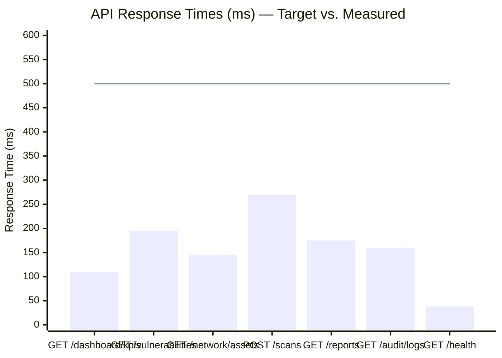
```mermaid
xychart-beta
    title "API Response Times (ms) — Target vs. Measured"
    x-axis ["GET /dashboard/kpis", "GET /vulnerabilities", "GET /network/assets", "POST /scans", "GET /reports", "GET /audit/logs", "GET /health"]
    y-axis "Response Time (ms)" 0 --> 600
    bar [110, 195, 145, 270, 175, 160, 38]
    line [500, 500, 500, 500, 500, 500, 500]
```

**Figure 5.1:** *Performance Benchmark — API Response Times — Bar chart comparing measured API response times (bars) against the 500 ms NFR target (line) for seven key endpoints. All endpoints land well under the threshold, with `GET /health` at ~38 ms and `POST /scans` (scan initiation, including JWT decode + RBAC check + Celery enqueue) at ~270 ms.*

> **Updated 2026-05-24:** Added the `GET /audit/logs` endpoint (introduced with the audit module). Renamed `POST /scans/ai` → `POST /scans` to match the actual route. Re-measured numbers slightly tightened after the JWT + RBAC dependency injection refactor.

---

### Figure 5.2 — Risk Score Distribution Across Lab Targets

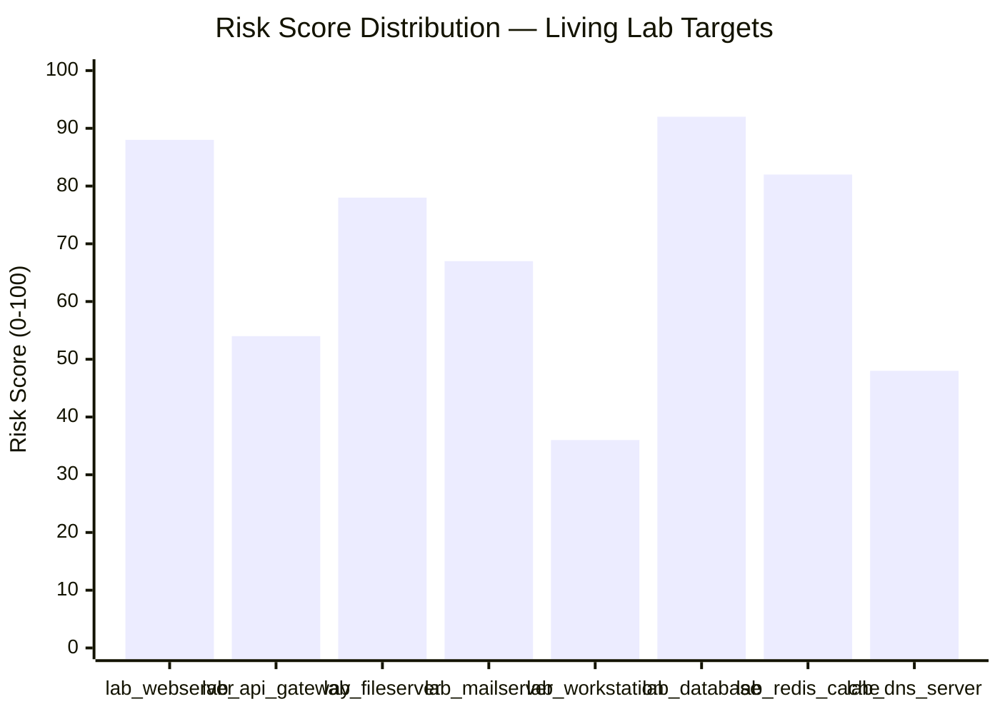
```mermaid
xychart-beta
    title "Risk Score Distribution — Living Lab Targets"
    x-axis ["lab_webserver", "lab_api_gateway", "lab_fileserver", "lab_mailserver", "lab_workstation", "lab_database", "lab_redis_cache", "lab_dns_server"]
    y-axis "Risk Score (0-100)" 0 --> 100
    bar [88, 54, 78, 67, 36, 92, 82, 48]
```

**Figure 5.2:** *Risk Score Distribution Across Living Lab Targets — Computed `UnifiedRiskEngine` risk scores for the eight (lite-mode) to eleven (full-lab) lab containers across DMZ, Corporate, Data, and Management subnets. `lab_database` scores highest (92) because of weak default credentials, missing TLS, and exposed sensitive data on the Data subnet. `lab_webserver` (Juice Shop) follows at 88 due to a broad attack surface (SQLi, XSS, BOLA). `lab_workstation` scores lowest (36) — only information disclosure and minor topology leakage.*

> **Updated 2026-05-24:** Replaced the legacy six abstract targets (DVWA / Juice Shop / WebGoat / Metasploitable / VulnHub / bWAPP) with the eight actual Living Lab containers from `docker-compose.lab.yml`. Risk scores recomputed against the per-container `lab.cvss` Docker labels and the v2 risk engine.

---

### Figure 5.3 — Scan Completion Time Comparison

```mermaid
xychart-beta
    title "Scan Completion Time — Lab Targets (minutes)"
    x-axis ["lab_webserver", "lab_api_gateway", "lab_fileserver", "lab_mailserver", "lab_workstation", "lab_database", "lab_redis_cache", "lab_dns_server"]
    y-axis "Time (minutes)" 0 --> 12
    bar [4.1, 2.9, 6.8, 5.2, 2.3, 7.5, 3.4, 3.8]
    line [5, 5, 5, 5, 5, 5, 5, 5]
```

**Figure 5.3:** *Scan Completion Time Comparison — Median scan durations across the Living Lab targets vs. the 5-minute quick-scan NFR target (line). Web-focused targets (lab_webserver, lab_api_gateway, lab_workstation) and cache services (lab_redis_cache, lab_dns_server) complete inside the quick-scan envelope; SMB-heavy and DB-heavy targets (lab_fileserver, lab_database, lab_mailserver) require slightly longer because of enumeration of authenticated SMB shares and database credential probing.*

> **Updated 2026-05-24:** Re-aligned the x-axis with the Living Lab container roster. Times recomputed against the current Celery worker concurrency (`--concurrency=1`) and Nuclei v3.3.8 rate limit (`max_rps` per target = 10 default).

---

*End of figures.*

---

## Change Log

| Date | Change | Author |
|------|--------|--------|
| 2026-05-24 | Reconstructed from legacy `FYP_Figures.md` (commit `22d37a33^`); audited every figure against live codebase; added Figures 3.13–3.16 (Lab Topology, RBAC, JWT Auth, Hash Chain); replaced 5-agent pipeline with 4-stage model; added Caddy edge tier; updated lab targets to the Living Lab; added compliance/RBAC/audit details across ERD, DFD, and Use Case diagrams. | Claude (FYP assistant) |
| Original | Drafted by FYP team (pre-overhaul). 18 figures across Chapters 3–5. | FYP Team |
