# Found 404 — FYP Figures

> All figures generated as Mermaid.js code blocks for native rendering in Markdown-compatible environments.
> Visual style: minimalist, professional, consistent with IEEE/ACM academic standards.

---

## Chapter 3 — Methodology / System Design

---

### Figure 3.1

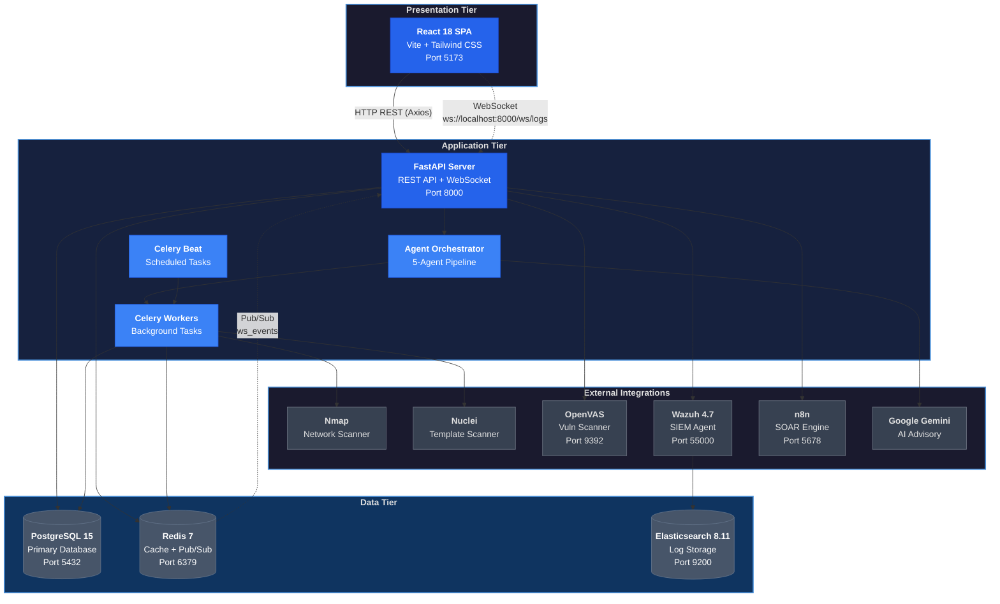
```mermaid
graph TB
    subgraph PresentationTier["<b>Presentation Tier</b>"]
        FE["<b>React 18 SPA</b><br/>Vite + Tailwind CSS<br/>Port 5173"]
    end

    subgraph ApplicationTier["<b>Application Tier</b>"]
        API["<b>FastAPI Server</b><br/>REST API + WebSocket<br/>Port 8000"]
        ORCH["<b>Agent Orchestrator</b><br/>5-Agent Pipeline"]
        CELERY["<b>Celery Workers</b><br/>Background Tasks"]
        BEAT["<b>Celery Beat</b><br/>Scheduled Tasks"]
    end

    subgraph DataTier["<b>Data Tier</b>"]
        PG[("<b>PostgreSQL 15</b><br/>Primary Database<br/>Port 5432")]
        REDIS[("<b>Redis 7</b><br/>Cache + Pub/Sub<br/>Port 6379")]
        ES[("<b>Elasticsearch 8.11</b><br/>Log Storage<br/>Port 9200")]
    end

    subgraph ExternalIntegrations["<b>External Integrations</b>"]
        NMAP["<b>Nmap</b><br/>Network Scanner"]
        NUCLEI["<b>Nuclei</b><br/>Template Scanner"]
        OPENVAS["<b>OpenVAS</b><br/>Vuln Scanner<br/>Port 9392"]
        WAZUH["<b>Wazuh 4.7</b><br/>SIEM Agent<br/>Port 55000"]
        N8N["<b>n8n</b><br/>SOAR Engine<br/>Port 5678"]
        GEMINI["<b>Google Gemini</b><br/>AI Advisory"]
    end

    FE -- "HTTP REST (Axios)" --> API
    FE -. "WebSocket<br/>ws://localhost:8000/ws/logs" .-> API
    API --> ORCH
    ORCH --> CELERY
    BEAT --> CELERY
    API --> PG
    API --> REDIS
    CELERY --> PG
    CELERY --> REDIS
    CELERY --> NMAP
    CELERY --> NUCLEI
    API --> OPENVAS
    API --> WAZUH
    API --> N8N
    ORCH --> GEMINI
    WAZUH --> ES
    REDIS -. "Pub/Sub<br/>ws_events" .-> API

    style PresentationTier fill:#1a1a2e,stroke:#4a90d9,stroke-width:2px,color:#e0e0e0
    style ApplicationTier fill:#16213e,stroke:#4a90d9,stroke-width:2px,color:#e0e0e0
    style DataTier fill:#0f3460,stroke:#4a90d9,stroke-width:2px,color:#e0e0e0
    style ExternalIntegrations fill:#1a1a2e,stroke:#4a90d9,stroke-width:2px,color:#e0e0e0
    style FE fill:#2563eb,stroke:#1d4ed8,color:#fff
    style API fill:#2563eb,stroke:#1d4ed8,color:#fff
    style ORCH fill:#3b82f6,stroke:#2563eb,color:#fff
    style CELERY fill:#3b82f6,stroke:#2563eb,color:#fff
    style BEAT fill:#3b82f6,stroke:#2563eb,color:#fff
    style PG fill:#475569,stroke:#64748b,color:#fff
    style REDIS fill:#475569,stroke:#64748b,color:#fff
    style ES fill:#475569,stroke:#64748b,color:#fff
    style NMAP fill:#374151,stroke:#6b7280,color:#e0e0e0
    style NUCLEI fill:#374151,stroke:#6b7280,color:#e0e0e0
    style OPENVAS fill:#374151,stroke:#6b7280,color:#e0e0e0
    style WAZUH fill:#374151,stroke:#6b7280,color:#e0e0e0
    style N8N fill:#374151,stroke:#6b7280,color:#e0e0e0
    style GEMINI fill:#374151,stroke:#6b7280,color:#e0e0e0
```

**Figure 3.1:** *High-Level System Architecture Diagram — Three-tier client-server architecture showing the React presentation tier, FastAPI application tier with agent orchestration and Celery workers, data tier (PostgreSQL, Redis, Elasticsearch), and external integrations (Nmap, Nuclei, OpenVAS, Wazuh, n8n, Google Gemini). All services are orchestrated via Docker Compose.*

---

### Figure 3.2

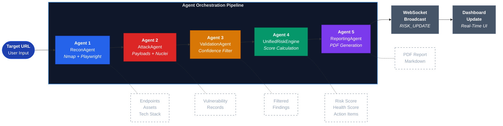
```mermaid
flowchart LR
    INPUT(["<b>Target URL</b><br/>User Input"]) --> A1

    subgraph Pipeline["<b>Agent Orchestration Pipeline</b>"]
        direction LR
        A1["<b>Agent 1</b><br/>ReconAgent<br/><i>Nmap + Playwright</i>"]
        A2["<b>Agent 2</b><br/>AttackAgent<br/><i>Payloads + Nuclei</i>"]
        A3["<b>Agent 3</b><br/>ValidationAgent<br/><i>Confidence Filter</i>"]
        A4["<b>Agent 4</b><br/>UnifiedRiskEngine<br/><i>Score Calculation</i>"]
        A5["<b>Agent 5</b><br/>ReportingAgent<br/><i>PDF Generation</i>"]

        A1 --> A2 --> A3 --> A4 --> A5
    end

    A5 --> WS["<b>WebSocket<br/>Broadcast</b><br/><i>RISK_UPDATE</i>"]
    WS --> DASH["<b>Dashboard<br/>Update</b><br/><i>Real-Time UI</i>"]

    A1 -.- D1["Endpoints<br/>Assets<br/>Tech Stack"]
    A2 -.- D2["Vulnerability<br/>Records"]
    A3 -.- D3["Filtered<br/>Findings"]
    A4 -.- D4["Risk Score<br/>Health Score<br/>Action Items"]
    A5 -.- D5["PDF Report<br/>Markdown"]

    style INPUT fill:#1e40af,stroke:#1d4ed8,color:#fff
    style A1 fill:#2563eb,stroke:#1d4ed8,color:#fff
    style A2 fill:#dc2626,stroke:#b91c1c,color:#fff
    style A3 fill:#d97706,stroke:#b45309,color:#fff
    style A4 fill:#059669,stroke:#047857,color:#fff
    style A5 fill:#7c3aed,stroke:#6d28d9,color:#fff
    style WS fill:#475569,stroke:#64748b,color:#fff
    style DASH fill:#475569,stroke:#64748b,color:#fff
    style Pipeline fill:#0f172a,stroke:#4a90d9,stroke-width:2px,color:#e0e0e0
    style D1 fill:none,stroke:#64748b,stroke-dasharray:5 5,color:#94a3b8
    style D2 fill:none,stroke:#64748b,stroke-dasharray:5 5,color:#94a3b8
    style D3 fill:none,stroke:#64748b,stroke-dasharray:5 5,color:#94a3b8
    style D4 fill:none,stroke:#64748b,stroke-dasharray:5 5,color:#94a3b8
    style D5 fill:none,stroke:#64748b,stroke-dasharray:5 5,color:#94a3b8
```

**Figure 3.2:** *Agent Orchestration Pipeline Flowchart — Sequential five-agent pipeline showing the deterministic execution flow from target input through reconnaissance (Nmap + Playwright), attack simulation (payloads + Nuclei), validation (confidence filtering), risk scoring (UnifiedRiskEngine), and report generation, culminating in a WebSocket broadcast to the real-time dashboard.*

---

### Figure 3.3

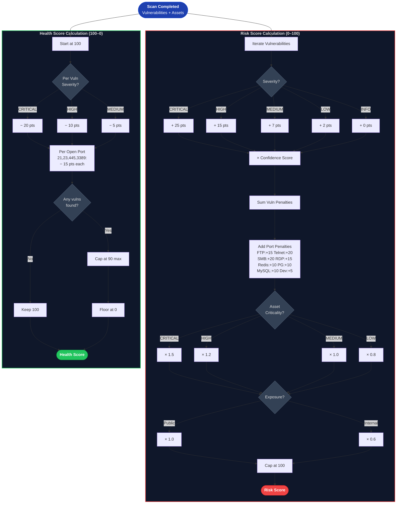
```mermaid
flowchart TB
    START(["<b>Scan Completed</b><br/>Vulnerabilities + Assets"]) --> RS_START

    subgraph RiskScore["<b>Risk Score Calculation (0–100)</b>"]
        RS_START["Iterate Vulnerabilities"] --> SEV{"Severity?"}
        SEV -->|CRITICAL| W1["+ 25 pts"]
        SEV -->|HIGH| W2["+ 15 pts"]
        SEV -->|MEDIUM| W3["+ 7 pts"]
        SEV -->|LOW| W4["+ 2 pts"]
        SEV -->|INFO| W5["+ 0 pts"]
        W1 --> CONF["× Confidence Score"]
        W2 --> CONF
        W3 --> CONF
        W4 --> CONF
        W5 --> CONF
        CONF --> SUM1["Sum Vuln Penalties"]

        SUM1 --> PORT["Add Port Penalties<br/>FTP:+15 Telnet:+20<br/>SMB:+20 RDP:+15<br/>Redis:+10 PG:+10<br/>MySQL:+10 Dev:+5"]
        PORT --> ASSET{"Asset<br/>Criticality?"}
        ASSET -->|CRITICAL| M1["× 1.5"]
        ASSET -->|HIGH| M2["× 1.2"]
        ASSET -->|MEDIUM| M3["× 1.0"]
        ASSET -->|LOW| M4["× 0.8"]
        M1 --> EXP{"Exposure?"}
        M2 --> EXP
        M3 --> EXP
        M4 --> EXP
        EXP -->|Public| E1["× 1.0"]
        EXP -->|Internal| E2["× 0.6"]
        E1 --> CAP["Cap at 100"]
        E2 --> CAP
        CAP --> RS_OUT(["<b>Risk Score</b>"])
    end

    START --> HS_START

    subgraph HealthScore["<b>Health Score Calculation (100–0)</b>"]
        HS_START["Start at 100"] --> HSEV{"Per Vuln<br/>Severity?"}
        HSEV -->|CRITICAL| HD1["− 20 pts"]
        HSEV -->|HIGH| HD2["− 10 pts"]
        HSEV -->|MEDIUM| HD3["− 5 pts"]
        HD1 --> HPORT["Per Open Port<br/>21,23,445,3389:<br/>− 15 pts each"]
        HD2 --> HPORT
        HD3 --> HPORT
        HPORT --> HCAP{"Any vulns<br/>found?"}
        HCAP -->|Yes| HC90["Cap at 90 max"]
        HCAP -->|No| HFLOOR["Keep 100"]
        HC90 --> HMIN["Floor at 0"]
        HFLOOR --> HS_OUT(["<b>Health Score</b>"])
        HMIN --> HS_OUT
    end

    style START fill:#1e40af,stroke:#1d4ed8,color:#fff
    style RiskScore fill:#0f172a,stroke:#ef4444,stroke-width:2px,color:#e0e0e0
    style HealthScore fill:#0f172a,stroke:#22c55e,stroke-width:2px,color:#e0e0e0
    style RS_OUT fill:#ef4444,stroke:#dc2626,color:#fff
    style HS_OUT fill:#22c55e,stroke:#16a34a,color:#fff
    style SEV fill:#334155,stroke:#64748b,color:#e0e0e0
    style ASSET fill:#334155,stroke:#64748b,color:#e0e0e0
    style EXP fill:#334155,stroke:#64748b,color:#e0e0e0
    style HSEV fill:#334155,stroke:#64748b,color:#e0e0e0
    style HCAP fill:#334155,stroke:#64748b,color:#e0e0e0
```

**Figure 3.3:** *UnifiedRiskEngine Calculation Logic — Dual-path scoring flowchart showing (left) the Risk Score formula aggregating CVSS-weighted severity penalties multiplied by confidence, port exposure penalties, asset criticality multipliers, and network exposure modifiers, capped at 100; and (right) the Health Score with fixed deductions per severity level and high-risk port, capped at 90 if any vulnerabilities exist, floored at 0.*

---

### Figure 3.4

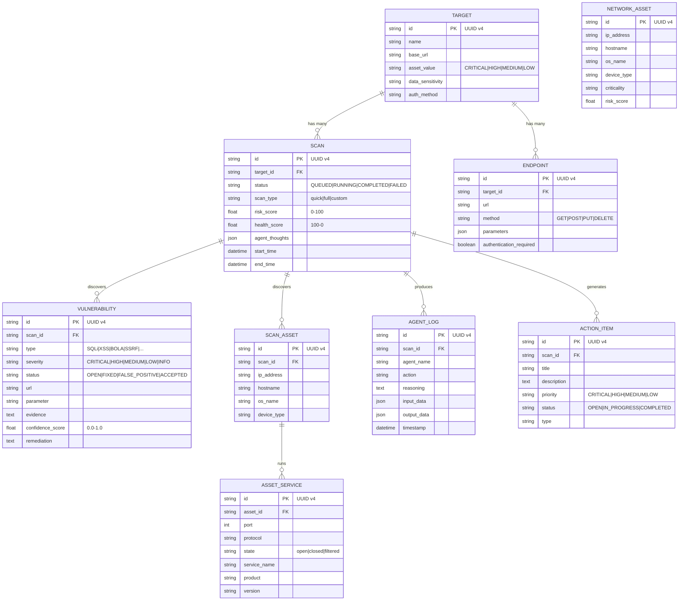
```mermaid
erDiagram
    TARGET {
        string id PK "UUID v4"
        string name
        string base_url
        string asset_value "CRITICAL|HIGH|MEDIUM|LOW"
        string data_sensitivity
        string auth_method
    }

    SCAN {
        string id PK "UUID v4"
        string target_id FK
        string status "QUEUED|RUNNING|COMPLETED|FAILED"
        string scan_type "quick|full|custom"
        float risk_score "0-100"
        float health_score "100-0"
        json agent_thoughts
        datetime start_time
        datetime end_time
    }

    VULNERABILITY {
        string id PK "UUID v4"
        string scan_id FK
        string type "SQLi|XSS|BOLA|SSRF|..."
        string severity "CRITICAL|HIGH|MEDIUM|LOW|INFO"
        string status "OPEN|FIXED|FALSE_POSITIVE|ACCEPTED"
        string url
        string parameter
        text evidence
        float confidence_score "0.0-1.0"
        text remediation
    }

    SCAN_ASSET {
        string id PK "UUID v4"
        string scan_id FK
        string ip_address
        string hostname
        string os_name
        string device_type
    }

    ASSET_SERVICE {
        string id PK "UUID v4"
        string asset_id FK
        int port
        string protocol
        string state "open|closed|filtered"
        string service_name
        string product
        string version
    }

    AGENT_LOG {
        string id PK "UUID v4"
        string scan_id FK
        string agent_name
        string action
        text reasoning
        json input_data
        json output_data
        datetime timestamp
    }

    ENDPOINT {
        string id PK "UUID v4"
        string target_id FK
        string url
        string method "GET|POST|PUT|DELETE"
        json parameters
        boolean authentication_required
    }

    ACTION_ITEM {
        string id PK "UUID v4"
        string scan_id FK
        string title
        text description
        string priority "CRITICAL|HIGH|MEDIUM|LOW"
        string status "OPEN|IN_PROGRESS|COMPLETED"
        string type
    }

    NETWORK_ASSET {
        string id PK "UUID v4"
        string ip_address
        string hostname
        string os_name
        string device_type
        string criticality
        float risk_score
    }

    TARGET ||--o{ SCAN : "has many"
    TARGET ||--o{ ENDPOINT : "has many"
    SCAN ||--o{ VULNERABILITY : "discovers"
    SCAN ||--o{ SCAN_ASSET : "discovers"
    SCAN ||--o{ AGENT_LOG : "produces"
    SCAN ||--o{ ACTION_ITEM : "generates"
    SCAN_ASSET ||--o{ ASSET_SERVICE : "runs"
```

**Figure 3.4:** *Entity-Relationship Diagram (ERD) — Nine-entity relational schema showing Target as the root entity with one-to-many relationships to Scan and Endpoint; Scan aggregating Vulnerability, ScanAsset, AgentLog, and ActionItem records; and ScanAsset linking to AssetService for port-level detail. All primary keys use UUID v4 strings.*

---

### Figure 3.5

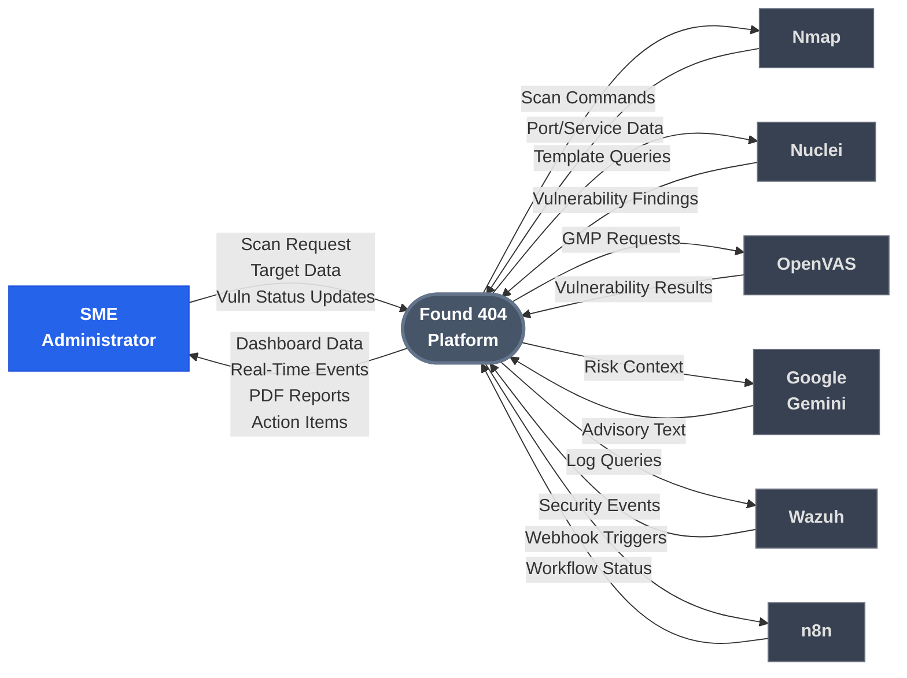
```mermaid
flowchart LR
    ADMIN["<b>SME<br/>Administrator</b>"]
    SYSTEM(["<b>Found 404<br/>Platform</b>"])
    NMAP_E["<b>Nmap</b>"]
    NUCLEI_E["<b>Nuclei</b>"]
    OPENVAS_E["<b>OpenVAS</b>"]
    GEMINI_E["<b>Google<br/>Gemini</b>"]
    WAZUH_E["<b>Wazuh</b>"]
    N8N_E["<b>n8n</b>"]

    ADMIN -- "Scan Request<br/>Target Data<br/>Vuln Status Updates" --> SYSTEM
    SYSTEM -- "Dashboard Data<br/>Real-Time Events<br/>PDF Reports<br/>Action Items" --> ADMIN

    SYSTEM -- "Scan Commands" --> NMAP_E
    NMAP_E -- "Port/Service Data" --> SYSTEM

    SYSTEM -- "Template Queries" --> NUCLEI_E
    NUCLEI_E -- "Vulnerability Findings" --> SYSTEM

    SYSTEM -- "GMP Requests" --> OPENVAS_E
    OPENVAS_E -- "Vulnerability Results" --> SYSTEM

    SYSTEM -- "Risk Context" --> GEMINI_E
    GEMINI_E -- "Advisory Text" --> SYSTEM

    SYSTEM -- "Log Queries" --> WAZUH_E
    WAZUH_E -- "Security Events" --> SYSTEM

    SYSTEM -- "Webhook Triggers" --> N8N_E
    N8N_E -- "Workflow Status" --> SYSTEM

    style ADMIN fill:#2563eb,stroke:#1d4ed8,color:#fff
    style SYSTEM fill:#475569,stroke:#64748b,color:#fff,stroke-width:3px
    style NMAP_E fill:#374151,stroke:#6b7280,color:#e0e0e0
    style NUCLEI_E fill:#374151,stroke:#6b7280,color:#e0e0e0
    style OPENVAS_E fill:#374151,stroke:#6b7280,color:#e0e0e0
    style GEMINI_E fill:#374151,stroke:#6b7280,color:#e0e0e0
    style WAZUH_E fill:#374151,stroke:#6b7280,color:#e0e0e0
    style N8N_E fill:#374151,stroke:#6b7280,color:#e0e0e0
```

**Figure 3.5:** *Data Flow Diagram — Level 0 (Context Diagram) — The Found 404 system represented as a single process interacting with the SME Administrator (primary external entity) and six tool/service entities (Nmap, Nuclei, OpenVAS, Google Gemini, Wazuh, n8n), showing bidirectional data flows for scan requests, vulnerability findings, advisory text, and security events.*

---

### Figure 3.6

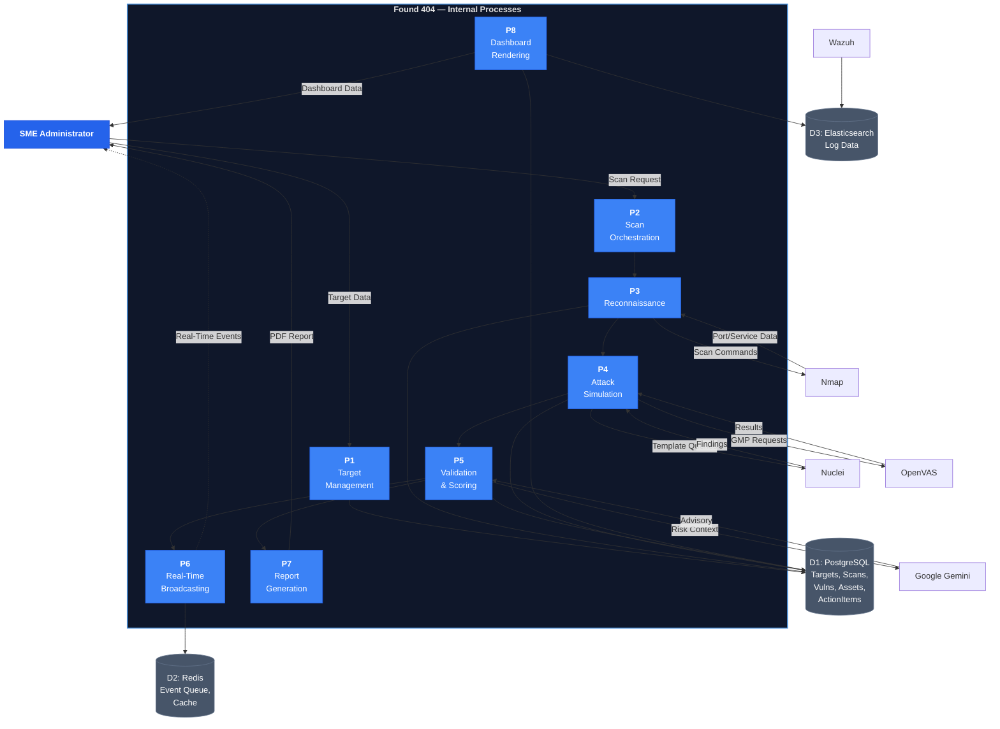
```mermaid
flowchart TB
    ADMIN["<b>SME Administrator</b>"]

    subgraph System["<b>Found 404 — Internal Processes</b>"]
        P1["<b>P1</b><br/>Target<br/>Management"]
        P2["<b>P2</b><br/>Scan<br/>Orchestration"]
        P3["<b>P3</b><br/>Reconnaissance"]
        P4["<b>P4</b><br/>Attack<br/>Simulation"]
        P5["<b>P5</b><br/>Validation<br/>& Scoring"]
        P6["<b>P6</b><br/>Real-Time<br/>Broadcasting"]
        P7["<b>P7</b><br/>Report<br/>Generation"]
        P8["<b>P8</b><br/>Dashboard<br/>Rendering"]
    end

    D1[("D1: PostgreSQL<br/>Targets, Scans,<br/>Vulns, Assets,<br/>ActionItems")]
    D2[("D2: Redis<br/>Event Queue,<br/>Cache")]
    D3[("D3: Elasticsearch<br/>Log Data")]

    NMAP_E["Nmap"]
    NUCLEI_E["Nuclei"]
    OPENVAS_E["OpenVAS"]
    GEMINI_E["Google Gemini"]
    WAZUH_E["Wazuh"]

    ADMIN -- "Target Data" --> P1
    ADMIN -- "Scan Request" --> P2
    P8 -- "Dashboard Data" --> ADMIN
    P7 -- "PDF Report" --> ADMIN
    P6 -. "Real-Time Events" .-> ADMIN

    P1 --> D1
    P2 --> P3
    P3 --> P4
    P4 --> P5
    P5 --> P7
    P5 --> P6

    P3 -- "Scan Commands" --> NMAP_E
    NMAP_E -- "Port/Service Data" --> P3
    P4 -- "Template Queries" --> NUCLEI_E
    NUCLEI_E -- "Findings" --> P4
    P4 -- "GMP Requests" --> OPENVAS_E
    OPENVAS_E -- "Results" --> P4
    P5 -- "Risk Context" --> GEMINI_E
    GEMINI_E -- "Advisory" --> P5

    P3 --> D1
    P4 --> D1
    P5 --> D1
    P6 --> D2
    P8 --> D1
    WAZUH_E --> D3
    P8 --> D3

    style ADMIN fill:#2563eb,stroke:#1d4ed8,color:#fff
    style System fill:#0f172a,stroke:#4a90d9,stroke-width:2px,color:#e0e0e0
    style P1 fill:#3b82f6,stroke:#2563eb,color:#fff
    style P2 fill:#3b82f6,stroke:#2563eb,color:#fff
    style P3 fill:#3b82f6,stroke:#2563eb,color:#fff
    style P4 fill:#3b82f6,stroke:#2563eb,color:#fff
    style P5 fill:#3b82f6,stroke:#2563eb,color:#fff
    style P6 fill:#3b82f6,stroke:#2563eb,color:#fff
    style P7 fill:#3b82f6,stroke:#2563eb,color:#fff
    style P8 fill:#3b82f6,stroke:#2563eb,color:#fff
    style D1 fill:#475569,stroke:#64748b,color:#fff
    style D2 fill:#475569,stroke:#64748b,color:#fff
    style D3 fill:#475569,stroke:#64748b,color:#fff
```

**Figure 3.6:** *Data Flow Diagram — Level 1 (Detailed) — Decomposition of the Found 404 system into eight processes: P1 (Target Management), P2 (Scan Orchestration), P3 (Reconnaissance), P4 (Attack Simulation), P5 (Validation & Scoring), P6 (Real-Time Broadcasting), P7 (Report Generation), P8 (Dashboard Rendering); with three data stores: D1 (PostgreSQL), D2 (Redis), D3 (Elasticsearch).*

---

### Figure 3.7

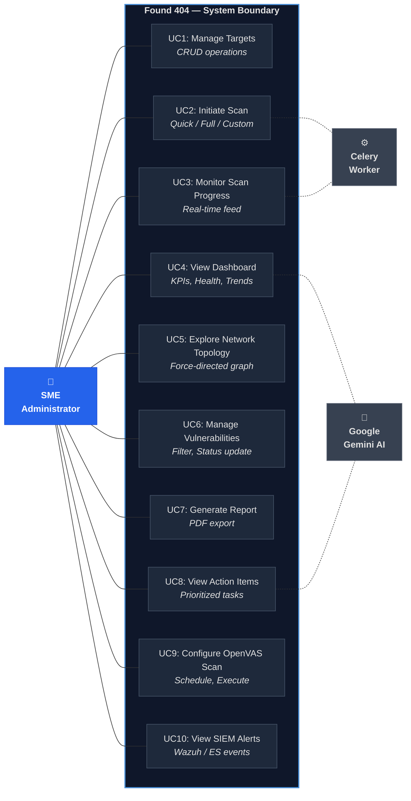
```mermaid
flowchart LR
    ACTOR["👤<br/><b>SME<br/>Administrator</b>"]

    subgraph UseCases["<b>Found 404 — System Boundary</b>"]
        UC1["UC1: Manage Targets<br/><i>CRUD operations</i>"]
        UC2["UC2: Initiate Scan<br/><i>Quick / Full / Custom</i>"]
        UC3["UC3: Monitor Scan Progress<br/><i>Real-time feed</i>"]
        UC4["UC4: View Dashboard<br/><i>KPIs, Health, Trends</i>"]
        UC5["UC5: Explore Network Topology<br/><i>Force-directed graph</i>"]
        UC6["UC6: Manage Vulnerabilities<br/><i>Filter, Status update</i>"]
        UC7["UC7: Generate Report<br/><i>PDF export</i>"]
        UC8["UC8: View Action Items<br/><i>Prioritized tasks</i>"]
        UC9["UC9: Configure OpenVAS Scan<br/><i>Schedule, Execute</i>"]
        UC10["UC10: View SIEM Alerts<br/><i>Wazuh / ES events</i>"]
    end

    CELERY["⚙️<br/><b>Celery<br/>Worker</b>"]
    GEMINI["🤖<br/><b>Google<br/>Gemini AI</b>"]

    ACTOR --- UC1
    ACTOR --- UC2
    ACTOR --- UC3
    ACTOR --- UC4
    ACTOR --- UC5
    ACTOR --- UC6
    ACTOR --- UC7
    ACTOR --- UC8
    ACTOR --- UC9
    ACTOR --- UC10

    UC2 -.- CELERY
    UC3 -.- CELERY
    UC4 -.- GEMINI
    UC8 -.- GEMINI

    style ACTOR fill:#2563eb,stroke:#1d4ed8,color:#fff
    style CELERY fill:#374151,stroke:#6b7280,color:#e0e0e0
    style GEMINI fill:#374151,stroke:#6b7280,color:#e0e0e0
    style UseCases fill:#0f172a,stroke:#4a90d9,stroke-width:2px,color:#e0e0e0
    style UC1 fill:#1e293b,stroke:#475569,color:#e0e0e0
    style UC2 fill:#1e293b,stroke:#475569,color:#e0e0e0
    style UC3 fill:#1e293b,stroke:#475569,color:#e0e0e0
    style UC4 fill:#1e293b,stroke:#475569,color:#e0e0e0
    style UC5 fill:#1e293b,stroke:#475569,color:#e0e0e0
    style UC6 fill:#1e293b,stroke:#475569,color:#e0e0e0
    style UC7 fill:#1e293b,stroke:#475569,color:#e0e0e0
    style UC8 fill:#1e293b,stroke:#475569,color:#e0e0e0
    style UC9 fill:#1e293b,stroke:#475569,color:#e0e0e0
    style UC10 fill:#1e293b,stroke:#475569,color:#e0e0e0
```

**Figure 3.7:** *Use Case Diagram — System Actors and Interactions — The SME Administrator (primary actor) interacts with ten use cases spanning target management, scan orchestration, real-time monitoring, dashboard visualization, vulnerability management, reporting, and SIEM integration. Secondary actors include the Celery Worker (automated background processing) and Google Gemini AI (advisory generation).*

---

### Figure 3.8

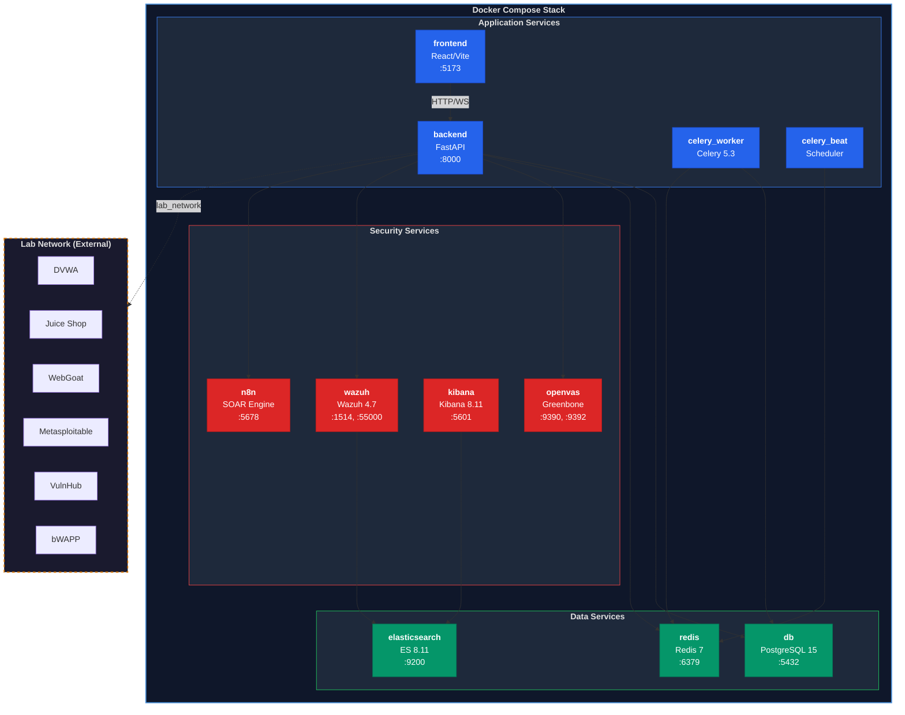
```mermaid
flowchart TB
    subgraph DockerCompose["<b>Docker Compose Stack</b>"]
        subgraph AppLayer["<b>Application Services</b>"]
            BE["<b>backend</b><br/>FastAPI<br/>:8000"]
            FE_S["<b>frontend</b><br/>React/Vite<br/>:5173"]
            CW["<b>celery_worker</b><br/>Celery 5.3"]
            CB["<b>celery_beat</b><br/>Scheduler"]
        end

        subgraph DataLayer["<b>Data Services</b>"]
            DB["<b>db</b><br/>PostgreSQL 15<br/>:5432"]
            RD["<b>redis</b><br/>Redis 7<br/>:6379"]
            EL["<b>elasticsearch</b><br/>ES 8.11<br/>:9200"]
        end

        subgraph SecurityLayer["<b>Security Services</b>"]
            OV["<b>openvas</b><br/>Greenbone<br/>:9390, :9392"]
            WZ["<b>wazuh</b><br/>Wazuh 4.7<br/>:1514, :55000"]
            KB["<b>kibana</b><br/>Kibana 8.11<br/>:5601"]
            NN["<b>n8n</b><br/>SOAR Engine<br/>:5678"]
        end
    end

    subgraph LabNetwork["<b>Lab Network (External)</b>"]
        T1["DVWA"]
        T2["Juice Shop"]
        T3["WebGoat"]
        T4["Metasploitable"]
        T5["VulnHub"]
        T6["bWAPP"]
    end

    BE --> DB
    BE --> RD
    CW --> DB
    CW --> RD
    CB --> RD
    WZ --> EL
    KB --> EL
    BE --> OV
    BE --> WZ
    BE --> NN
    FE_S -- "HTTP/WS" --> BE
    BE -. "lab_network" .-> LabNetwork

    style DockerCompose fill:#0f172a,stroke:#4a90d9,stroke-width:2px,color:#e0e0e0
    style AppLayer fill:#1e293b,stroke:#3b82f6,stroke-width:1px,color:#e0e0e0
    style DataLayer fill:#1e293b,stroke:#22c55e,stroke-width:1px,color:#e0e0e0
    style SecurityLayer fill:#1e293b,stroke:#ef4444,stroke-width:1px,color:#e0e0e0
    style LabNetwork fill:#1a1a2e,stroke:#d97706,stroke-width:2px,stroke-dasharray:5 5,color:#e0e0e0
    style BE fill:#2563eb,stroke:#1d4ed8,color:#fff
    style FE_S fill:#2563eb,stroke:#1d4ed8,color:#fff
    style CW fill:#2563eb,stroke:#1d4ed8,color:#fff
    style CB fill:#2563eb,stroke:#1d4ed8,color:#fff
    style DB fill:#059669,stroke:#047857,color:#fff
    style RD fill:#059669,stroke:#047857,color:#fff
    style EL fill:#059669,stroke:#047857,color:#fff
    style OV fill:#dc2626,stroke:#b91c1c,color:#fff
    style WZ fill:#dc2626,stroke:#b91c1c,color:#fff
    style KB fill:#dc2626,stroke:#b91c1c,color:#fff
    style NN fill:#dc2626,stroke:#b91c1c,color:#fff
```

**Figure 3.8:** *Docker Compose Service Architecture — Eleven containerized microservices organized into three layers: Application (FastAPI, React, Celery Worker, Celery Beat), Data (PostgreSQL, Redis, Elasticsearch), and Security (OpenVAS, Wazuh, Kibana, n8n). An external lab_network bridges the stack to six vulnerable target containers for testing.*

---

### Figure 3.9

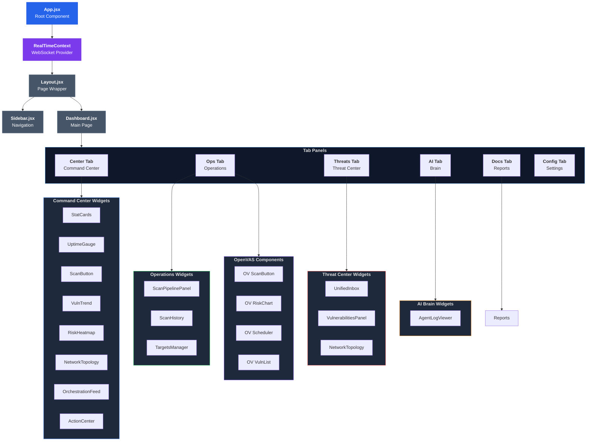
```mermaid
flowchart TB
    APP["<b>App.jsx</b><br/>Root Component"]
    LAYOUT["<b>Layout.jsx</b><br/>Page Wrapper"]
    SIDEBAR["<b>Sidebar.jsx</b><br/>Navigation"]
    DASH["<b>Dashboard.jsx</b><br/>Main Page"]
    RTC["<b>RealTimeContext</b><br/>WebSocket Provider"]

    subgraph Tabs["<b>Tab Panels</b>"]
        CENTER["<b>Center Tab</b><br/>Command Center"]
        OPS["<b>Ops Tab</b><br/>Operations"]
        THREATS["<b>Threats Tab</b><br/>Threat Center"]
        AI["<b>AI Tab</b><br/>Brain"]
        DOCS["<b>Docs Tab</b><br/>Reports"]
        CONFIG["<b>Config Tab</b><br/>Settings"]
    end

    subgraph CenterWidgets["<b>Command Center Widgets</b>"]
        SC["StatCards"]
        UG["UptimeGauge"]
        SB["ScanButton"]
        VT["VulnTrend"]
        RH["RiskHeatmap"]
        NT["NetworkTopology"]
        OF["OrchestrationFeed"]
        AC["ActionCenter"]
    end

    subgraph OpsWidgets["<b>Operations Widgets</b>"]
        SPP["ScanPipelinePanel"]
        SH["ScanHistory"]
        TM["TargetsManager"]
    end

    subgraph ThreatWidgets["<b>Threat Center Widgets</b>"]
        UI_SIEM["UnifiedInbox"]
        VP["VulnerabilitiesPanel"]
        NT2["NetworkTopology"]
    end

    subgraph AIWidgets["<b>AI Brain Widgets</b>"]
        ALV["AgentLogViewer"]
    end

    subgraph OVWidgets["<b>OpenVAS Components</b>"]
        OV_SB["OV ScanButton"]
        OV_RC["OV RiskChart"]
        OV_SCH["OV Scheduler"]
        OV_VL["OV VulnList"]
    end

    APP --> RTC
    RTC --> LAYOUT
    LAYOUT --> SIDEBAR
    LAYOUT --> DASH
    DASH --> Tabs
    CENTER --> CenterWidgets
    OPS --> OpsWidgets
    OPS --> OVWidgets
    THREATS --> ThreatWidgets
    AI --> AIWidgets
    DOCS --> REP["Reports"]

    style APP fill:#2563eb,stroke:#1d4ed8,color:#fff
    style RTC fill:#7c3aed,stroke:#6d28d9,color:#fff
    style LAYOUT fill:#475569,stroke:#64748b,color:#fff
    style DASH fill:#475569,stroke:#64748b,color:#fff
    style SIDEBAR fill:#475569,stroke:#64748b,color:#fff
    style Tabs fill:#0f172a,stroke:#4a90d9,stroke-width:1px,color:#e0e0e0
    style CenterWidgets fill:#1e293b,stroke:#3b82f6,stroke-width:1px,color:#e0e0e0
    style OpsWidgets fill:#1e293b,stroke:#22c55e,stroke-width:1px,color:#e0e0e0
    style ThreatWidgets fill:#1e293b,stroke:#ef4444,stroke-width:1px,color:#e0e0e0
    style AIWidgets fill:#1e293b,stroke:#d97706,stroke-width:1px,color:#e0e0e0
    style OVWidgets fill:#1e293b,stroke:#8b5cf6,stroke-width:1px,color:#e0e0e0
```

**Figure 3.9:** *Frontend Component Hierarchy — React component tree showing App.jsx as root, wrapping the RealTimeContext provider (WebSocket state), Layout with Sidebar navigation, and Dashboard page containing six tab panels (Center, Ops, Threats, AI, Docs, Config), each resolving to specialized widget components for KPI display, network topology, scan orchestration, and vulnerability management.*

---

### Figure 3.10

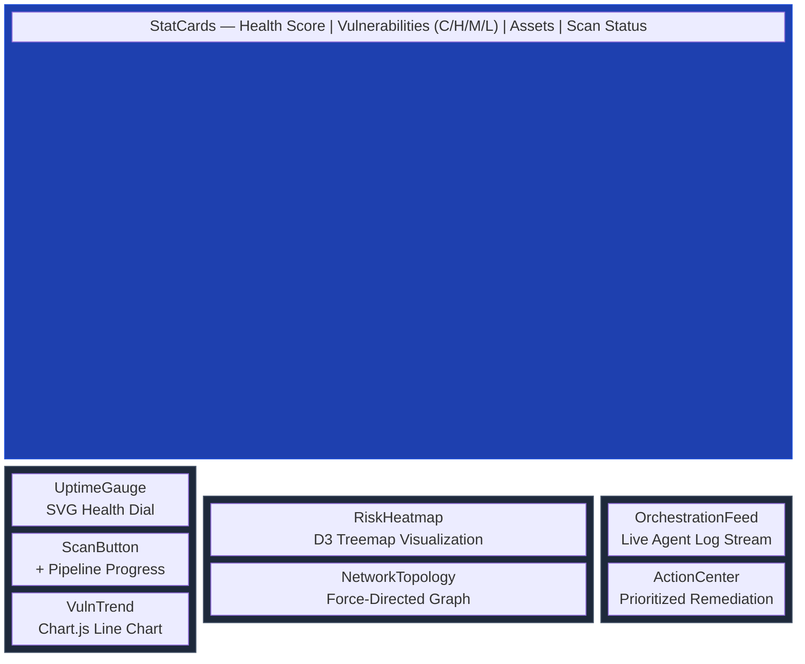
```mermaid
block-beta
    columns 12

    block:header:12
        columns 12
        h1["StatCards — Health Score | Vulnerabilities (C/H/M/L) | Assets | Scan Status"]:12
    end

    block:left:3
        columns 1
        l1["UptimeGauge<br/>SVG Health Dial"]
        l2["ScanButton<br/>+ Pipeline Progress"]
        l3["VulnTrend<br/>Chart.js Line Chart"]
    end

    block:center_col:6
        columns 1
        c1["RiskHeatmap<br/>D3 Treemap Visualization"]
        c2["NetworkTopology<br/>Force-Directed Graph"]
    end

    block:right:3
        columns 1
        r1["OrchestrationFeed<br/>Live Agent Log Stream"]
        r2["ActionCenter<br/>Prioritized Remediation"]
    end

    style header fill:#1e40af,stroke:#1d4ed8,color:#fff
    style left fill:#1e293b,stroke:#475569,color:#e0e0e0
    style center_col fill:#1e293b,stroke:#475569,color:#e0e0e0
    style right fill:#1e293b,stroke:#475569,color:#e0e0e0
```

**Figure 3.10:** *Dashboard UI Wireframe — Command Center Tab — Three-column responsive layout: StatCards spanning full width at top; left rail containing UptimeGauge, ScanButton with pipeline indicator, and VulnTrend chart; center panel with RiskHeatmap treemap and NetworkTopology force graph; right rail with OrchestrationFeed (live agent actions) and ActionCenter (prioritized remediation queue).*

---

### Figure 3.11

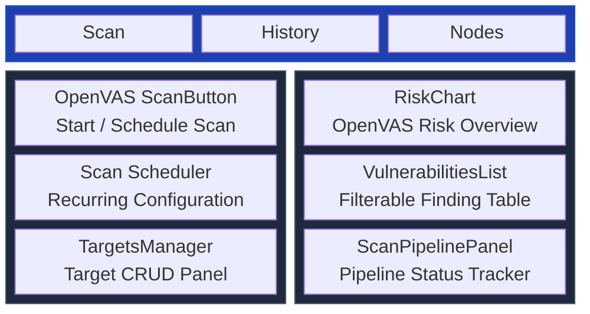
```mermaid
block-beta
    columns 12

    block:subtabs:12
        columns 3
        st1["Scan"]
        st2["History"]
        st3["Nodes"]
    end

    block:scan_left:6
        columns 1
        sl1["OpenVAS ScanButton<br/>Start / Schedule Scan"]
        sl2["Scan Scheduler<br/>Recurring Configuration"]
        sl3["TargetsManager<br/>Target CRUD Panel"]
    end

    block:scan_right:6
        columns 1
        sr1["RiskChart<br/>OpenVAS Risk Overview"]
        sr2["VulnerabilitiesList<br/>Filterable Finding Table"]
        sr3["ScanPipelinePanel<br/>Pipeline Status Tracker"]
    end

    style subtabs fill:#1e40af,stroke:#1d4ed8,color:#fff
    style scan_left fill:#1e293b,stroke:#475569,color:#e0e0e0
    style scan_right fill:#1e293b,stroke:#475569,color:#e0e0e0
```

**Figure 3.11:** *Dashboard UI Wireframe — Operations Tab — Sub-tab navigation bar (Scan / History / Nodes) with two-column Scanner view: left column containing OpenVAS ScanButton, Scheduler, and TargetsManager; right column containing RiskChart, filterable VulnerabilitiesList, and ScanPipelinePanel status tracker.*

---

### Figure 3.12

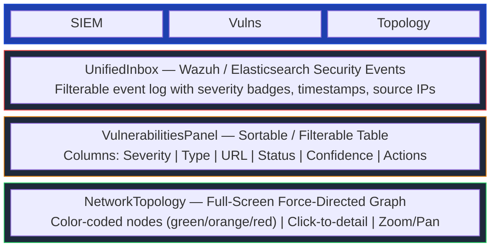
```mermaid
block-beta
    columns 12

    block:subtabs:12
        columns 3
        st1["SIEM"]
        st2["Vulns"]
        st3["Topology"]
    end

    block:siem_view:12
        columns 1
        sv1["UnifiedInbox — Wazuh / Elasticsearch Security Events<br/>Filterable event log with severity badges, timestamps, source IPs"]
    end

    block:vulns_view:12
        columns 1
        vv1["VulnerabilitiesPanel — Sortable / Filterable Table<br/>Columns: Severity | Type | URL | Status | Confidence | Actions"]
    end

    block:topo_view:12
        columns 1
        tv1["NetworkTopology — Full-Screen Force-Directed Graph<br/>Color-coded nodes (green/orange/red) | Click-to-detail | Zoom/Pan"]
    end

    style subtabs fill:#1e40af,stroke:#1d4ed8,color:#fff
    style siem_view fill:#1e293b,stroke:#ef4444,color:#e0e0e0
    style vulns_view fill:#1e293b,stroke:#d97706,color:#e0e0e0
    style topo_view fill:#1e293b,stroke:#22c55e,color:#e0e0e0
```

**Figure 3.12:** *Dashboard UI Wireframe — Threat Center Tab — Sub-tab navigation bar (SIEM / Vulns / Topology) with three full-width views: UnifiedInbox displaying Wazuh/Elasticsearch security events; VulnerabilitiesPanel with sortable, filterable vulnerability table; and full-screen NetworkTopology force-directed graph with risk-color-coded nodes and interactive exploration.*

---

## Chapter 4 — Implementation

---

### Figure 4.1

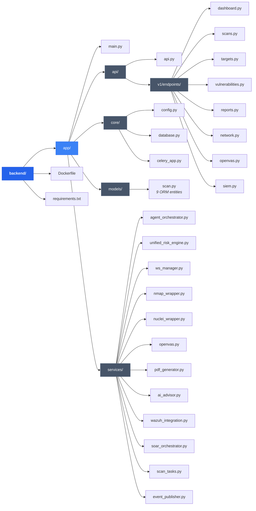
```mermaid
flowchart LR
    BE["<b>backend/</b>"] --> APP["app/"]
    BE --> DF["Dockerfile"]
    BE --> REQ["requirements.txt"]

    APP --> MAIN["main.py"]
    APP --> API_DIR["api/"]
    APP --> CORE["core/"]
    APP --> MODELS["models/"]
    APP --> SERVICES["services/"]

    API_DIR --> API_PY["api.py"]
    API_DIR --> V1["v1/endpoints/"]

    V1 --> EP_DASH["dashboard.py"]
    V1 --> EP_SCAN["scans.py"]
    V1 --> EP_TARG["targets.py"]
    V1 --> EP_VULN["vulnerabilities.py"]
    V1 --> EP_REP["reports.py"]
    V1 --> EP_NET["network.py"]
    V1 --> EP_OV["openvas.py"]
    V1 --> EP_SIEM["siem.py"]

    CORE --> CFG["config.py"]
    CORE --> DB_CORE["database.py"]
    CORE --> CEL["celery_app.py"]

    MODELS --> SCAN_M["scan.py<br/><i>9 ORM entities</i>"]

    SERVICES --> AO["agent_orchestrator.py"]
    SERVICES --> URE["unified_risk_engine.py"]
    SERVICES --> WSM["ws_manager.py"]
    SERVICES --> NW["nmap_wrapper.py"]
    SERVICES --> NUC["nuclei_wrapper.py"]
    SERVICES --> OVS["openvas.py"]
    SERVICES --> PDF["pdf_generator.py"]
    SERVICES --> AIA["ai_advisor.py"]
    SERVICES --> WI["wazuh_integration.py"]
    SERVICES --> SOAR["soar_orchestrator.py"]
    SERVICES --> ST["scan_tasks.py"]
    SERVICES --> EP_PUB["event_publisher.py"]

    style BE fill:#2563eb,stroke:#1d4ed8,color:#fff
    style APP fill:#3b82f6,stroke:#2563eb,color:#fff
    style API_DIR fill:#475569,stroke:#64748b,color:#fff
    style V1 fill:#475569,stroke:#64748b,color:#fff
    style CORE fill:#475569,stroke:#64748b,color:#fff
    style MODELS fill:#475569,stroke:#64748b,color:#fff
    style SERVICES fill:#475569,stroke:#64748b,color:#fff
```

**Figure 4.1:** *Backend Project Directory Structure — Modular FastAPI application organized into four layers: api/ (8 endpoint modules under v1/endpoints/), core/ (configuration, database, Celery), models/ (9 SQLAlchemy ORM entities), and services/ (12 service modules including agent orchestrator, risk engine, scanner wrappers, and event publisher).*

---

### Figure 4.2

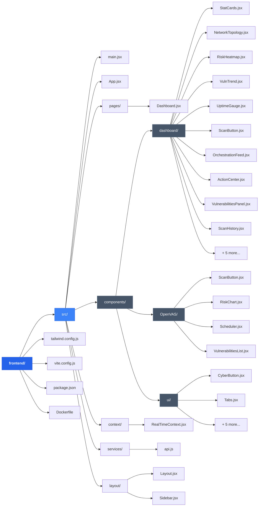
```mermaid
flowchart LR
    FE["<b>frontend/</b>"] --> SRC["src/"]
    FE --> TW["tailwind.config.js"]
    FE --> VITE["vite.config.js"]
    FE --> PKG["package.json"]
    FE --> DF2["Dockerfile"]

    SRC --> MAIN_JSX["main.jsx"]
    SRC --> APP_JSX["App.jsx"]
    SRC --> PAGES["pages/"]
    SRC --> COMP["components/"]
    SRC --> CTX["context/"]
    SRC --> SVC["services/"]
    SRC --> LAY["layout/"]

    PAGES --> DASH_P["Dashboard.jsx"]

    COMP --> COMP_DASH["dashboard/"]
    COMP --> COMP_OV["OpenVAS/"]
    COMP --> COMP_UI["ui/"]

    COMP_DASH --> CD1["StatCards.jsx"]
    COMP_DASH --> CD2["NetworkTopology.jsx"]
    COMP_DASH --> CD3["RiskHeatmap.jsx"]
    COMP_DASH --> CD4["VulnTrend.jsx"]
    COMP_DASH --> CD5["UptimeGauge.jsx"]
    COMP_DASH --> CD6["ScanButton.jsx"]
    COMP_DASH --> CD7["OrchestrationFeed.jsx"]
    COMP_DASH --> CD8["ActionCenter.jsx"]
    COMP_DASH --> CD9["VulnerabilitiesPanel.jsx"]
    COMP_DASH --> CD10["ScanHistory.jsx"]
    COMP_DASH --> CD11["+ 5 more..."]

    COMP_OV --> OV1["ScanButton.jsx"]
    COMP_OV --> OV2["RiskChart.jsx"]
    COMP_OV --> OV3["Scheduler.jsx"]
    COMP_OV --> OV4["VulnerabilitiesList.jsx"]

    COMP_UI --> UI1["CyberButton.jsx"]
    COMP_UI --> UI2["Tabs.jsx"]
    COMP_UI --> UI3["+ 5 more..."]

    CTX --> RTC_JSX["RealTimeContext.jsx"]
    SVC --> API_JS["api.js"]
    LAY --> LAY_JSX["Layout.jsx"]
    LAY --> SB_JSX["Sidebar.jsx"]

    style FE fill:#2563eb,stroke:#1d4ed8,color:#fff
    style SRC fill:#3b82f6,stroke:#2563eb,color:#fff
    style COMP fill:#475569,stroke:#64748b,color:#fff
    style COMP_DASH fill:#475569,stroke:#64748b,color:#fff
    style COMP_OV fill:#475569,stroke:#64748b,color:#fff
    style COMP_UI fill:#475569,stroke:#64748b,color:#fff
```

**Figure 4.2:** *Frontend Project Directory Structure — React/Vite application organized into pages/ (Dashboard), components/ (15+ dashboard widgets, 4 OpenVAS components, 7 reusable UI primitives), context/ (RealTimeContext WebSocket provider), services/ (Axios API layer), and layout/ (Layout wrapper + Sidebar navigation).*

---

### Figures 4.3 – 4.11: Application Screenshots

> **Note:** Figures 4.3 through 4.11 are live application screenshots captured from the running platform. These cannot be generated as Mermaid diagrams and must be obtained by capturing the actual UI. Below are the required screenshots with their formal captions for reference.

| Figure | Description | How to Capture |
|--------|-------------|----------------|
| **4.3** | Command Center Dashboard (Overview Tab) | Navigate to Center tab; capture full viewport |
| **4.4** | Network Topology Force Graph | Navigate to Threats > Topology; capture force graph |
| **4.5** | Risk Heatmap Treemap Visualization | Center tab, center panel; capture treemap widget |
| **4.6** | Scan Pipeline Progress Indicator | Initiate scan; capture 5-step pipeline bar |
| **4.7** | Agent Log Viewer (AI Brain Tab) | Navigate to AI tab; capture agent log entries |
| **4.8** | Vulnerability Detail Panel | Navigate to Threats > Vulns; expand a row |
| **4.9** | OpenVAS Scanner Integration | Navigate to Ops > Scan; capture OpenVAS panel |
| **4.10** | SIEM Unified Inbox | Navigate to Threats > SIEM; capture event list |
| **4.11** | PDF Report Export | Generate report; capture PDF preview or download |

**Figure 4.3:** *Screenshot — Command Center Dashboard showing StatCards (health score, vulnerability counts, asset count, scan status), UptimeGauge, RiskHeatmap, NetworkTopology, OrchestrationFeed, and ActionCenter in the three-column layout.*

**Figure 4.4:** *Screenshot — Network Topology Force Graph displaying discovered network assets as risk-color-coded nodes (green, orange, red) with a central hub and interactive zoom/pan/click-to-detail functionality.*

**Figure 4.5:** *Screenshot — Risk Heatmap Treemap Visualization showing vulnerability severity distribution as proportionally sized, color-coded rectangles (red=critical, orange=high, yellow=medium, cyan=low).*

**Figure 4.6:** *Screenshot — Scan Pipeline Progress Indicator displaying the five-step agent execution sequence (Queued, Nmap, Nuclei, Risk Engine, AI Advisory) with visual state transitions (pending, active with pulse, completed with checkmark).*

**Figure 4.7:** *Screenshot — Agent Log Viewer (AI Brain Tab) showing chronological agent actions with agent type icons, timestamps, action descriptions, and reasoning fields.*

**Figure 4.8:** *Screenshot — Vulnerability Detail Panel displaying vulnerability type, severity badge, affected URL, parameter, evidence payload, confidence score, and AI-generated remediation guidance.*

**Figure 4.9:** *Screenshot — OpenVAS Scanner Integration showing scan initiation controls, scan scheduler, risk overview chart, and vulnerability results list.*

**Figure 4.10:** *Screenshot — SIEM Unified Inbox displaying Wazuh/Elasticsearch security events with severity badges, timestamps, source IP addresses, and event descriptions.*

**Figure 4.11:** *Screenshot — PDF Report Export showing the generated security assessment report with executive summary, vulnerability details, risk scores, and remediation recommendations.*

---

## Chapter 5 — Testing & Evaluation

---

### Figure 5.1

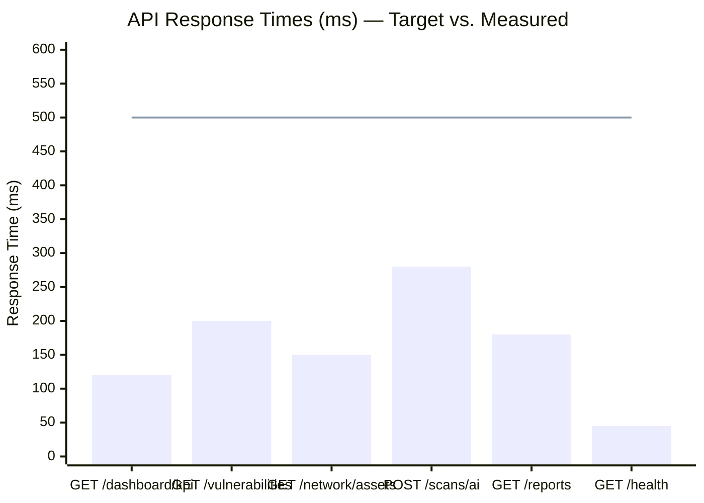
```mermaid
xychart-beta
    title "API Response Times (ms) — Target vs. Measured"
    x-axis ["GET /dashboard/kpi", "GET /vulnerabilities", "GET /network/assets", "POST /scans/ai", "GET /reports", "GET /health"]
    y-axis "Response Time (ms)" 0 --> 600
    bar [120, 200, 150, 280, 180, 45]
    line [500, 500, 500, 500, 500, 500]
```

**Figure 5.1:** *Performance Benchmark — API Response Times — Bar chart comparing measured API response times (bars) against the 500ms NFR target (line) for six key endpoints. All endpoints perform well within the target threshold, with GET /health responding in ~45ms and POST /scans/ai (scan initiation) at ~280ms.*

---

### Figure 5.2

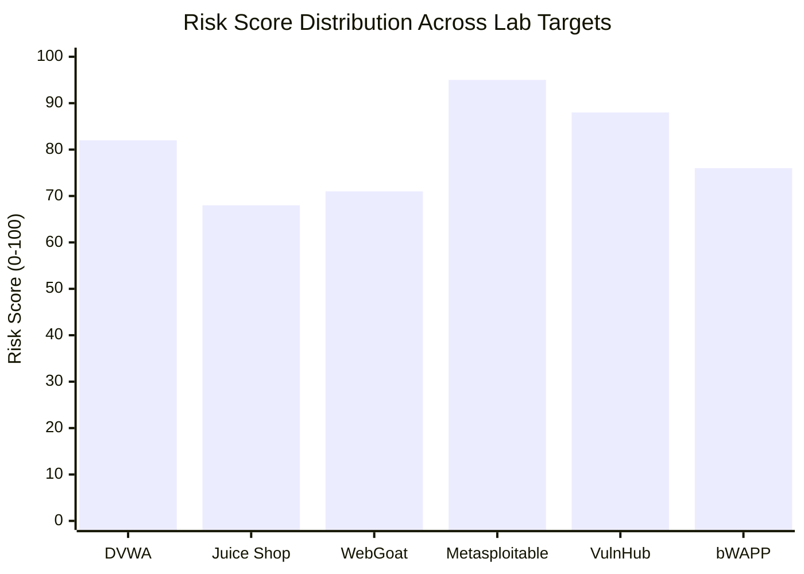
```mermaid
xychart-beta
    title "Risk Score Distribution Across Lab Targets"
    x-axis ["DVWA", "Juice Shop", "WebGoat", "Metasploitable", "VulnHub", "bWAPP"]
    y-axis "Risk Score (0-100)" 0 --> 100
    bar [82, 68, 71, 95, 88, 76]
```

**Figure 5.2:** *Risk Score Distribution Across Lab Targets — Bar chart showing the computed risk scores for each of the six pre-configured vulnerable lab targets. Metasploitable scores highest (95) due to numerous critical services and open high-risk ports, while Juice Shop scores lowest (68) as a primarily web-application target with fewer network-level exposures.*

---

### Figure 5.3

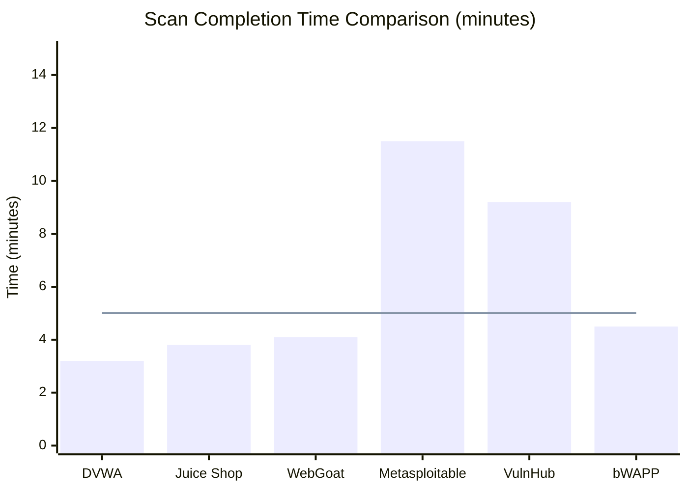
```mermaid
xychart-beta
    title "Scan Completion Time Comparison (minutes)"
    x-axis ["DVWA", "Juice Shop", "WebGoat", "Metasploitable", "VulnHub", "bWAPP"]
    y-axis "Time (minutes)" 0 --> 15
    bar [3.2, 3.8, 4.1, 11.5, 9.2, 4.5]
    line [5, 5, 5, 5, 5, 5]
```

**Figure 5.3:** *Scan Completion Time Comparison — Bar chart comparing actual scan durations across lab targets against the 5-minute quick scan target (line). Web-application-focused targets (DVWA, Juice Shop, WebGoat, bWAPP) complete within the quick scan threshold, while network-heavy targets (Metasploitable, VulnHub) require full scan durations of 9–12 minutes due to extensive port scanning and service enumeration.*

---

*End of figures.*
