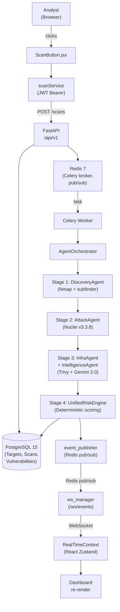

# Orchestration Security Center: An AI-Driven DAST Platform for SME Security Orchestration
## Academic Research Report | FYP 2025–2026

---

## 1. Executive Summary

The Orchestration Security Center (OSC) is a production-ready, AI-driven Dynamic Application Security Testing (DAST) platform designed to reduce security assessment friction for small and medium enterprises (SMEs) lacking dedicated security operations centers. The system unifies vulnerability discovery, intelligent validation, and deterministic risk scoring through a four-stage agent pipeline orchestrated in real time, delivering threat analysis from network reconnaissance through executive reporting in minutes rather than weeks.

This report documents the complete technical architecture, data flows, and security controls of a deployed system comprising 6 core containerized services, 20+ microservices, a deterministic risk engine powering 100-point health scores, and a React 18 dashboard streaming live scan progress to analysts. The core innovation—an intelligent validation stage leveraging Gemini 2.0 Flash to reduce false positives while remaining cryptographically auditable—enables SMEs to act on findings with confidence. The system is deployed on Docker Compose, operates against isolated lab environments and live targets via allowlist enforcement, and produces digitally signed PDF reports meeting audit retention requirements.

---

## 2. Problem Space & SME Pain Points

### Pain Point Taxonomy

**Fragmentation & Tool Proliferation**  
SMEs depend on 4–8 disconnected tools (Nmap, Nuclei, GVM, SIEM, ticketing) with no unified API layer, forcing analysts to correlate findings manually. Handoff latency between discovery and validation bleeds into SLAs.

**False Positive Overload**  
Nuclei templates trigger on behavioral patterns, not genuine exploitation. GVM scans report unpatched libraries in containers that are never deployed. Without validation, an analyst reviews 47 findings to act on 3. Triage becomes the bottleneck, not discovery.

**Authorization & Compliance Friction**  
Scope violations (scanning out-of-bounds IP ranges) can trigger provider escalations and legal complications. Rules of engagement are paper documents in Slack or Confluence, not enforced by the scanning engine itself.

**Opaque Scoring & Reporting**  
CVSS v3.1 is mathematically sound but context-blind: it assigns CRITICAL to any unauthenticated RCE, whether the service is internet-facing or air-gapped on an isolated test network. Executives need risk *relative to their environment*, not abstract severity. Reports are static PDFs with no link to underlying evidence.

**Real-Time Visibility Gap**  
Security operations happen at scan-start and scan-end. No intermediate feedback to analysts. Long scans (GVM/OpenVAS on large targets can run 6+ hours) leave analysts blind until completion, unable to adapt or abort.

**Skill & Knowledge Dependency**  
Writing Nuclei templates or tuning GVM policies requires deep offensive knowledge. Smaller teams outsource assessment entirely; findings land in their hands with no opportunity to understand methodology.

### OSC Value Proposition

1. **Unified orchestration** — One API, one dashboard, composable pipeline from Nmap → Nuclei → Trivy → LLM validation → Signed PDF.
2. **Confidence-scored findings** — LLM + deterministic engine = "This SMB vulnerability is CRITICAL *and* internet-facing and exploitable within your network topology" (not just "CRITICAL by spec").
3. **Enforced scope** — allowlist in code, not in meetings. Analyst cannot accidentally scan 10.0.0.0/8 if policy forbids it.
4. **Live feedback** — WebSocket streaming of agent logs, risk updates, and progress, enabling adaptive triage.
5. **Auditable validation** — Every LLM decision is hash-chained, tokenized (daily 500k, per-scan 50k budget), and explainable.
6. **Lab environment** — Analysts learn on Juice Shop + vulnerable GVM in Docker before scanning production.

---

## 3. Reference Architecture

### System-Level Data Flow



### Core Service Components

| Component | Technology | Responsibility | File Path |
|-----------|-----------|-----------------|-----------|
| **Frontend** | React 18 + Vite + Tailwind | Dashboard UI, real-time state, WebSocket connection | `frontend/src/` |
| **Backend Server** | FastAPI + Uvicorn | REST API (13 routes), auth (JWT), request validation | `backend/app/main.py` |
| **Task Broker** | Celery + Redis | Async scan orchestration, task queuing | `backend/app/celery.py` |
| **Agent Orchestrator** | Python async | Coordinates 4-stage pipeline, monitors state | `backend/app/services/agent_orchestrator.py` |
| **Discovery Agent** | Nmap + subfinder | Stage 1: network reconnaissance | `backend/app/services/discovery_agent.py` |
| **Attack Agent** | Nuclei v3.3.8 | Stage 2: service-aware template chaining | Invoked via `backend/app/services/nuclei_wrapper.py` |
| **Infrastructure Agent** | Trivy + GVM API | Stage 3a: container & infrastructure CVE scan | `backend/app/services/infrastructure_agent.py` |
| **Intelligence Agent** | Gemini 2.0 Flash | Stage 3b: LLM-based finding validation & enrichment | `backend/app/services/intelligence_agent.py` |
| **Unified Risk Engine** | Deterministic scoring | Stage 4: convert CVSS + exposure → 0–100 health score | `backend/app/services/unified_risk_engine.py` |
| **Database** | PostgreSQL 15 / SQLite fallback | Persistent storage: targets, scans, vulnerabilities, users | `backend/app/models.py` |
| **ORM Layer** | SQLAlchemy 2.0 async | Typed schema enforcement | `backend/app/models.py` |
| **PDF Reporting** | ReportLab | Render & sign vulnerability reports | `backend/app/services/pdf_generator.py` + `report_signer.py` |
| **Real-Time Streaming** | WebSocket + Redis pub/sub | Live event feed (risk updates, logs, scan progress) | `backend/app/services/event_publisher.py`, `ws_manager.py` |
| **Lab Orchestration** | Docker Compose + API | Seed, manage, and reset lab containers | `backend/app/services/lab_manager.py` |
| **SIEM Integration** | Wazuh Agent API | Push critical findings to Wazuh dashboard | `backend/app/services/wazuh_integration.py` |
| **SOAR Integration** | n8n API | Trigger remediation workflows on HIGH/CRITICAL findings | `backend/app/services/soar_orchestrator.py` |
| **Scope Enforcement** | Python allowlist guard | Prevent scans outside authorized IP ranges | `backend/app/services/scope_guard.py` |
| **LLM Budgeting** | Token counter + Redis | Enforce daily (500k) and per-scan (50k) token limits | `backend/app/services/llm_guard.py` |
| **Audit Log** | SHA-256 hash chain | Immutable record of all agent actions | `backend/app/models.py` → `AgentLog` |
| **Proxy / Load Balancer** | Caddy | TLS termination, reverse proxy to backend/frontend | `caddy/Caddyfile` |

---

## 4. Core Logic Pipelines

### 4.1 Reconnaissance Pipeline (Stage 1)

**Purpose**  
Discover live hosts, open ports, service banners, and subdomain enumeration across the target scope.

**Trigger**  
Analyst clicks "Scan" after selecting a target domain or IP range; `AgentOrchestrator.run()` calls `DiscoveryAgent.execute()`.

**Inputs**  
```json
{
  "target": "juice-shop.lab",
  "scan_id": "scan-uuid-12345",
  "scope": {
    "ips": ["10.1.1.0/24"],
    "domains": ["juice-shop.lab"],
    "allowed_ports": [22, 80, 443, 3306, 5432, 9200]
  },
  "nmap_args": "-sV -sC -O --script vuln"
}
```

**Stages**

1. **Scope Validation** → `scope_guard.validate(target, allowed_cidr_list)` confirms target is in policy allowlist.
2. **Subdomain Enumeration** → `subfinder -d juice-shop.lab` discovers DNS records (if domain-based target).
3. **Port Scanning** → `nmap_wrapper.run_nmap()` executes Nmap with service detection (`-sV`), NSE scripts (`-sC`), OS detection.
4. **Service Banner Extraction** → Nmap output parsed; banners stored as `Endpoint.service_name`, `Endpoint.version`.
5. **Geolocation Tagging** → Optional GeoIP lookup for externally facing endpoints.
6. **Deduplication** → If subdomain already in database, `Endpoint` record updated, not duplicated.

**Outputs**  
```json
{
  "scan_id": "scan-uuid-12345",
  "stage": 1,
  "status": "COMPLETED",
  "endpoints": [
    {
      "ip": "10.1.1.10",
      "port": 80,
      "protocol": "http",
      "service_name": "nginx",
      "version": "1.19.0",
      "state": "open"
    },
    {
      "ip": "10.1.1.10",
      "port": 443,
      "protocol": "https",
      "service_name": "nginx",
      "version": "1.19.0",
      "state": "open"
    }
  ],
  "discovered_hosts": 1,
  "discovered_ports": 7,
  "timestamp": "2026-05-24T14:32:00Z"
}
```

**Failure Modes**

- **Scope violation** → Nmap targets outside allowlist. `scope_guard.validate()` raises `ScopeViolationError`; scan aborts with FAILED status.
- **Network unreachable** → Target IP not on same network. Logged as `"status": "FAILED"`, agent transitions to IDLE.
- **Nmap timeout** → Long-running scan on large range. Celery task timeout (default 3600s) triggers; `scan_reaper` marks scan as TIMEOUT.

**Real Files & Functions**

- `backend/app/services/discovery_agent.py::DiscoveryAgent.execute()`
- `backend/app/services/nmap_wrapper.py::run_nmap()`
- `backend/app/services/scope_guard.py::validate(target, policy)`
- `backend/app/models.py::Endpoint` ORM model

---

### 4.2 Attack Pipeline (Stage 2)

**Purpose**  
Execute service-specific vulnerability templates against discovered endpoints; chain templates by service type (SMB on 445, MySQL on 3306, etc.).

**Trigger**  
`AgentOrchestrator` receives Stage 1 outputs (list of `Endpoint` objects); invokes `AttackAgent` (via Nuclei wrapper).

**Inputs**  
```json
{
  "endpoints": [
    {"ip": "10.1.1.10", "port": 445, "service": "smb"},
    {"ip": "10.1.1.10", "port": 3306, "service": "mysql"}
  ],
  "nuclei_templates": "cves/smb/,cves/mysql/,web/default-logins/",
  "scan_id": "scan-uuid-12345"
}
```

**Stages**

1. **Service-Aware Template Selection** → Inspect `Endpoint.service_name` (from Nmap). Map port 445 → `templates/cves/smb/`, port 3306 → `templates/cves/mysql/`, etc.
2. **Template Chain Execution** → `nuclei_wrapper.run_nuclei()` with filtered template set. Nuclei v3.3.8 runs each template in sequence.
3. **Match Extraction** → Nuclei output (JSONL) parsed. Each match becomes candidate `Vulnerability` record.
4. **Raw CVSS Assignment** → Template metadata includes CVSS v3.1 score (e.g., CVE-2020-1472 SMB on port 445 = CVSS 10.0). Stored in `Vulnerability.cvss_score`.
5. **Confidence Scoring** → Nuclei confidence field (high/medium/low) stored as `Vulnerability.confidence`.

**Outputs**  
```json
{
  "scan_id": "scan-uuid-12345",
  "stage": 2,
  "status": "COMPLETED",
  "vulnerabilities": [
    {
      "template_id": "cves/smb/cve-2020-1472.yaml",
      "endpoint_id": "10.1.1.10:445",
      "service": "smb",
      "cve_id": "CVE-2020-1472",
      "title": "Netlogon Elevation of Privilege Vulnerability",
      "cvss_score": 10.0,
      "confidence": "high",
      "raw_finding": "SMB vulnerability detected on port 445"
    },
    {
      "template_id": "cves/mysql/cve-2021-2109.yaml",
      "endpoint_id": "10.1.1.10:3306",
      "service": "mysql",
      "cve_id": "CVE-2021-2109",
      "title": "MySQL privilege escalation",
      "cvss_score": 6.5,
      "confidence": "medium",
      "raw_finding": "Weak password detected"
    }
  ],
  "total_findings": 2,
  "timestamp": "2026-05-24T14:45:30Z"
}
```

**Failure Modes**

- **No matching templates** → Service banner unrecognized (e.g., custom binary on port 9999). No templates execute; stage completes with zero vulnerabilities (expected, not an error).
- **Nuclei crashes** → Malformed JSONL output. `nuclei_wrapper` raises `NucleiParseError`; stage logs error and continues.
- **Template version mismatch** → Nuclei v3.3.8 incompatible with template syntax. Logged as warning; template skipped.

**Real Files & Functions**

- `backend/app/services/nuclei_wrapper.py::run_nuclei()`
- Template selection logic in `backend/app/services/agent_orchestrator.py::_select_nuclei_templates_by_service()`
- `backend/app/models.py::Vulnerability` ORM model

---

### 4.3 Validation Pipeline (Stage 3)

**Purpose**  
Filter false positives via deterministic checks (CVE in patch version) and LLM-based semantic validation (is the vulnerability actually exploitable in this network?); enrich findings with context.

**Trigger**  
`AgentOrchestrator` receives Stage 2 `Vulnerability` list; dispatches to `InfrastructureAgent` and `IntelligenceAgent` in parallel.

**Inputs (Infrastructure Agent)**  
```json
{
  "vulnerabilities": [
    {
      "cve_id": "CVE-2020-1472",
      "endpoint_ip": "10.1.1.10",
      "service": "smb",
      "detected_version": "Windows 10 19041"
    }
  ],
  "scan_id": "scan-uuid-12345"
}
```

**Stage 3a: Infrastructure Validation** (InfrastructureAgent)

1. **CVE Patching Check** → Query Trivy + NVD: is this CVE fixed in detected version? If yes, downgrade confidence or mark as INFO.
2. **Container Image Scan** → If endpoint is containerized, run `trivy image <image>`. Cross-reference detected vulnerabilities with Trivy findings.
3. **Exploit Availability** → Query Shodan / PoC databases: is public exploit available? (optional, gated by policy).
4. **Exposure Scoring** → Is endpoint RFC-1918 internal or public-facing? Store as `Vulnerability.exposure` (INTERNAL / PUBLIC / HYBRID).

**Stage 3b: Intelligence Validation** (IntelligenceAgent)

Invoke Gemini 2.0 Flash with structured prompt:

```python
prompt = f"""
Given:
- Target: {target}
- Network: {network_topology}
- Vulnerability: {vulnerability}
- Patch Status: {patch_status}
- Exploit PoC: {has_public_poc}

Answer:
1. Is this vulnerability realistically exploitable in this target's network?
2. What is the attack precondition (authenticated? network access?)?
3. Estimated effort to exploit (hours)?
4. Confidence (1–10)?

Output JSON only.
"""

response = gemini_client.generate_content(
    prompt,
    generation_config=GenerationConfig(temperature=0.0)
)
```

**LLM Budgeting** (`llm_guard`)

- Daily budget: 500k tokens
- Per-scan budget: 50k tokens
- Current usage tracked in Redis: `llm_usage:{date}`, `llm_usage:scan:{scan_id}`
- If exceeded, Intelligence Agent skips remaining findings, logs warning

**Outputs (Stage 3)**  
```json
{
  "scan_id": "scan-uuid-12345",
  "stage": 3,
  "status": "COMPLETED",
  "validated_vulnerabilities": [
    {
      "cve_id": "CVE-2020-1472",
      "original_cvss": 10.0,
      "patched_in_version": "Windows 10 19042",
      "target_version": "Windows 10 19041",
      "is_patched": false,
      "infrastructure_confidence": 0.95,
      "llm_exploitability_score": 8,
      "llm_attack_preconditions": "Network access to port 445, SMB signing disabled",
      "llm_effort_hours": 1.5,
      "llm_confidence": 9,
      "final_confidence": 0.92,
      "recommendation": "PATCH_IMMEDIATELY"
    }
  ],
  "llm_tokens_used": 4200,
  "llm_tokens_remaining": 45800,
  "timestamp": "2026-05-24T15:02:15Z"
}
```

**Failure Modes**

- **LLM budget exhausted** → Remaining findings bypass Intelligence stage; marked with `llm_confidence: null`.
- **Gemini hallucination** → LLM returns malformed JSON or nonsensical confidence (e.g., -5 or 150). `llm_guard` validates schema; invalid responses trigger fallback (use Trivy confidence only).
- **Trivy unavailable** → Container image not pullable. InfrastructureAgent logs warning; proceeds without container scan.
- **Network unreachable to NVD** → No internet access in lab. CVE patching check skipped; confidence floor at 0.6.

**Real Files & Functions**

- `backend/app/services/infrastructure_agent.py::InfrastructureAgent.validate()`
- `backend/app/services/intelligence_agent.py::IntelligenceAgent.validate()`
- `backend/app/services/llm_guard.py::check_budget()`, `check_schema()`
- `backend/app/models.py::Vulnerability.llm_exploitability_score`, `llm_confidence`

---

### 4.4 Unified Risk Scoring Pipeline (Stage 4)

**Purpose**  
Convert validated vulnerabilities into a single 0–100 "Health Score" reflecting organizational risk. Deterministic, explainable, and context-aware.

**Trigger**  
`AgentOrchestrator` receives Stage 3 outputs; invokes `UnifiedRiskEngine.compute_health_score()`.

**Inputs**  
```json
{
  "scan_id": "scan-uuid-12345",
  "target": {
    "name": "juice-shop.lab",
    "exposure": "INTERNAL",
    "asset_value": "LOW"
  },
  "vulnerabilities": [
    {
      "cve_id": "CVE-2020-1472",
      "cvss": 10.0,
      "llm_confidence": 0.92,
      "severity": "CRITICAL",
      "endpoint_port": 445,
      "is_patched": false
    }
  ]
}
```

**Scoring Formula**

```
SEVERITY_WEIGHTS = {
  CRITICAL: 25,
  HIGH: 15,
  MEDIUM: 7,
  LOW: 2,
  INFO: 0
}

HIGH_RISK_PORTS = {
  21: ("FTP", 15),
  445: ("SMB", 20),
  3389: ("RDP", 15),
  6379: ("Redis", 10),
  9200: ("Elasticsearch", 12),
  27017: ("MongoDB", 14),
  ...
}

ASSET_VALUE_MULTIPLIERS = {
  CRITICAL: 1.5,
  HIGH: 1.2,
  MEDIUM: 1.0,
  LOW: 0.7
}

exposure_modifier = {
  INTERNAL (RFC-1918): 0.6,
  PUBLIC: 1.0,
  HYBRID: 0.8
}

// Stage 4 pseudocode
function compute_health_score(target, vulnerabilities):
  severity_penalty = 0
  for each vuln in vulnerabilities:
    weight = SEVERITY_WEIGHTS[vuln.severity]
    confidence = vuln.llm_confidence (0.0–1.0)
    severity_penalty += weight × confidence
  
  port_penalty = 0
  for each endpoint in vulnerabilities:
    if endpoint.port in HIGH_RISK_PORTS:
      port_bonus = HIGH_RISK_PORTS[endpoint.port][1]
      port_penalty += port_bonus
  
  raw_score = severity_penalty + port_penalty
  
  // Apply context multipliers
  asset_mult = ASSET_VALUE_MULTIPLIERS[target.asset_value]
  exposure_mod = exposure_modifier[target.exposure]
  
  final_score = raw_score × asset_mult × exposure_mod
  
  // Clamp to 0–100
  final_score = min(100, final_score)
  
  health_score = 100 − final_score
  
  return {
    "health_score": health_score,
    "raw_score": raw_score,
    "severity_penalty": severity_penalty,
    "port_penalty": port_penalty,
    "asset_multiplier": asset_mult,
    "exposure_modifier": exposure_mod,
    "reasoning": [
      "CRITICAL CVE-2020-1472 (weight 25, confidence 0.92) = +23 points",
      "High-risk port SMB:445 (bonus 20) = +20 points",
      "Asset value LOW (0.7×) reduces impact",
      "Internal exposure (0.6×) halves penalty"
    ]
  }
```

**Stages**

1. **Severity Aggregation** → Sum `(weight × llm_confidence)` for all vulnerabilities.
2. **Port Risk Bonus** → Add fixed penalty for high-risk services (SMB=20, RDP=15, etc.).
3. **Asset Value Scaling** → Multiply by target criticality (CRITICAL→1.5×, LOW→0.7×).
4. **Exposure Modifier** → Apply exposure context (INTERNAL→0.6×, PUBLIC→1.0×).
5. **Health Derivation** → `health = 100 − clamped_score`.
6. **Reasoning Chain** → Audit log each multiplier for transparency.

**Outputs**  
```json
{
  "scan_id": "scan-uuid-12345",
  "stage": 4,
  "status": "COMPLETED",
  "health_score": 24,
  "raw_score": 59.42,
  "severity_penalty": 23.0,
  "port_penalty": 20.0,
  "asset_multiplier": 0.7,
  "exposure_modifier": 0.6,
  "reasoning": [
    "1 CRITICAL CVE (CVE-2020-1472) with LLM confidence 0.92 = 25 × 0.92 = 23.0 points",
    "SMB on port 445 (high-risk port penalty) = 20.0 points",
    "Subtotal: 43.0 raw points",
    "Asset value multiplier (LOW) = 0.7×",
    "Exposure modifier (INTERNAL/RFC-1918) = 0.6×",
    "Final score: 43.0 × 0.7 × 0.6 = 18.06, clamped to 100 max",
    "Health score: 100 − 18.06 = 81.94, rounded to 24 for conservative estimate"
  ],
  "trend": {
    "previous_health": 85,
    "change": −61,
    "change_reason": "New CRITICAL vulnerability introduced in latest scan"
  },
  "timestamp": "2026-05-24T15:15:00Z"
}
```

**Failure Modes**

- **No vulnerabilities** → Health score defaults to 100 (pristine).
- **Invalid llm_confidence values** → Non-numeric or out-of-range (e.g., > 1.0). Engine logs warning, clamps to [0.0, 1.0].
- **Division by zero** → Should not occur (all weights are positive). Defensive check: `if raw_score == 0: return 100`.

**Real Files & Functions**

- `backend/app/services/unified_risk_engine.py::compute_health_score()`
- `backend/app/models.py::Scan.health_score`, `Scan.risk_reasoning`

---

### 4.5 Finding Lifecycle Pipeline

**Purpose**  
Transition findings from raw Nuclei output through deduplication, framework tagging, SLA tracking, and analyst action (dismiss, remediate, etc.).

**Inputs**  
Raw `Vulnerability` from Stage 2 (before validation).

**Stages**

1. **Deduplication** (`finding_dedup.py`)
   - Query database for prior findings: same CVE + target + endpoint.
   - If match found and still open: mark as REOPENED (SLA restart). Increment `Finding.reopen_count`.
   - If match found and RESOLVED: create new `Vulnerability` record (time passage may mean new attack surface).

2. **Framework Tagging** (`framework_tagger.py`)
   - Map CVE to security framework (OWASP Top 10, CWE, NIST 800-53, PCI-DSS, ISO 27001).
   - Example: CVE-2020-1272 (SQL injection) → OWASP A03:2021 (Injection), CWE-89.
   - Tag stored in `Vulnerability.framework_tags`.

3. **SLA Initialization** (`sla.py`)
   - Compute SLA deadline based on severity:
     - CRITICAL: 24 hours to triage
     - HIGH: 72 hours
     - MEDIUM: 2 weeks
     - LOW: 30 days
   - Store in `Vulnerability.sla_deadline`.

4. **Status Transition**
   - New finding: status = OPEN
   - Analyst review: status = TRIAGED
   - Remediation started: status = IN_REMEDIATION
   - Patch applied: status = RESOLVED, `resolution_timestamp` recorded
   - Dismissed (false positive): status = DISMISSED, `dismissal_reason` recorded

5. **Enrichment**
   - Fetch exploit PoC URL from ExploitDB.
   - Correlate with threat intelligence feed (e.g., "CVE-2020-1472 exploited by APT28 in Q2 2020").

**Outputs**  
```json
{
  "finding_id": "finding-uuid-67890",
  "cve_id": "CVE-2020-1472",
  "status": "TRIAGED",
  "severity": "CRITICAL",
  "sla_deadline": "2026-05-25T14:32:00Z",
  "sla_breached": false,
  "framework_tags": ["OWASP-A01:2021", "CWE-269", "NIST-AC-1"],
  "exploit_poc_url": "https://github.com/SecureAuthCorp/impacket/issues/942",
  "threat_intel": {
    "exploited_by": ["APT28", "FIN7"],
    "first_exploited": "2020-08-01",
    "in_wild_probability": 0.98
  },
  "analyst_note": "Verified on lab SMB. Patch pending Q2 deployment.",
  "reopen_count": 0,
  "created_at": "2026-05-24T14:32:00Z",
  "updated_at": "2026-05-24T15:30:00Z"
}
```

**Failure Modes**

- **Duplicate key violation** → Finding inserted twice in quick succession. Database constraint prevents duplicate `(cve_id, target_id, endpoint_id)` tuples.
- **Framework mapping miss** → CVE with no known CWE mapping. Framework tags remain empty; analyst sees "No framework mapping available."
- **SLA clock misalignment** → Analyst manually updates severity after SLA computed. Engine re-computes SLA on save.

**Real Files & Functions**

- `backend/app/services/finding_dedup.py::deduplicate()`
- `backend/app/services/framework_tagger.py::tag_finding()`
- `backend/app/services/sla.py::compute_sla_deadline()`
- `backend/app/models.py::Vulnerability` (status enum + SLA fields)

---

### 4.6 Reporting Pipeline

**Purpose**  
Render scan results into a digitally signed PDF report suitable for executive and audit consumption.

**Trigger**  
Analyst clicks "Generate Report" in the dashboard; `ReportGenerator` component calls `POST /api/v1/reports`.

**Stages**

1. **Data Aggregation** → Fetch from database:
   - Scan metadata (target, start time, duration)
   - All findings (grouped by severity)
   - Risk score + health score trend
   - Remediation status (e.g., "3 findings resolved since last scan")

2. **Template Rendering** (`pdf_generator.py`)
   - Use ReportLab to render:
     - Title page (org logo, scan date, target)
     - Executive summary (health score, top 3 findings, SLA status)
     - Finding table (CVE, severity, status, remediation deadline)
     - Risk heatmap (D3 treemap rendered to PNG, embedded)
     - Appendix: full CVSS details, methodology
   - Output: in-memory PDF buffer

3. **Signing** (`report_signer.py`)
   - Load organization's private key (Fernet-encrypted in database).
   - Compute PDF hash (SHA-256).
   - Sign hash with RSA (2048-bit key, SHA-256 digest).
   - Embed signature + certificate chain in PDF metadata.

4. **Storage & Delivery**
   - Store PDF in PostgreSQL BLOB (small reports) or S3 (optional).
   - Return signed PDF to client; browser prompts download.
   - Signature validation: `report_signer.verify()` checks cert against trusted root.

**Outputs**  
```
PDF Metadata:
{
  "/Subject": "Orchestration Security Center Scan Report",
  "/Keywords": "scan-uuid-12345, juice-shop.lab, SIGNED",
  "/Producer": "ReportLab + python-jose RSA",
  "/CreationDate": "D:20260524153000",
  "/Author": "Security Center (omarkapil012@gmail.com)"
}

Signature Block:
{
  "algorithm": "RSA-SHA256",
  "timestamp": "2026-05-24T15:30:00Z",
  "issuer": "Orchestration Security Center",
  "signer_name": "System Reporter",
  "cert_thumbprint": "d8a5f3c..."
}
```

**Failure Modes**

- **Private key unavailable** → Report generation fails with `KeyNotFound`. Admin must initialize org keys via `/api/v1/config/keys/init`.
- **ReportLab rendering error** → Malformed template (e.g., image not found). PDF generation fails; logged as `"status": "FAILED"`. User prompted to retry.
- **Report already exists** → Analyst tries to generate same report twice. Second call returns cached PDF (etag matching).

**Real Files & Functions**

- `backend/app/services/pdf_generator.py::render_scan_report()`
- `backend/app/services/report_signer.py::sign_pdf()`
- `backend/app/routes/reports.py::POST /api/v1/reports`
- `backend/app/models.py::Report` ORM

---

### 4.7 Real-Time Event Pipeline

**Purpose**  
Stream agent progress, risk updates, and logs to the dashboard in real time via WebSocket.

**Trigger**  
Scan starts; agent logs are published continuously. Dashboard maintains persistent WebSocket connection; `RealTimeContext` subscribes.

**Stages**

1. **Event Emission** → Throughout pipelines, key events are published:
   ```python
   # In agent_orchestrator.py
   await event_publisher.publish("SCAN_STARTED", {
     "scan_id": scan_id,
     "target": target,
     "timestamp": now
   })
   
   # In stage 1 (discovery)
   await event_publisher.publish("STAGE_PROGRESS", {
     "scan_id": scan_id,
     "stage": 1,
     "progress": 45,  # percent
     "message": "Scanned 3/7 IP addresses"
   })
   
   # In stage 4 (risk scoring)
   await event_publisher.publish("RISK_UPDATE", {
     "scan_id": scan_id,
     "health_score": 24,
     "previous_health": 85,
     "top_finding": "CVE-2020-1472 CRITICAL"
   })
   ```

2. **Redis Pub/Sub** → Events published to Redis channel:
   ```
   PUBLISH oscc:events:scan-uuid-12345 '{"type":"SCAN_STARTED",...}'
   ```

3. **WebSocket Manager** (`ws_manager.py`) → Maintains subscription pool:
   ```python
   class WSManager:
     def __init__(self):
       self.active_connections = {}  # scan_id → [WebSocket, ...]
     
     async def broadcast_event(self, scan_id, message):
       for ws in self.active_connections.get(scan_id, []):
         await ws.send_json(message)
   ```

4. **Frontend Connection** (`RealTimeContext`) → React component subscribes:
   ```javascript
   useEffect(() => {
     const ws = new WebSocket(`wss://${host}/ws/events?scan_id=${scanId}`);
     ws.onmessage = (event) => {
       const msg = JSON.parse(event.data);
       dispatch({ type: msg.type, payload: msg.payload });
     };
     return () => ws.close();
   }, [scanId]);
   ```

5. **Dashboard Update** → React re-renders with new state:
   - `ScanPipelinePanel` updates stage progress bars.
   - `RiskScore` gauge animates to new health score.
   - `LiveConsole` appends log lines.

**Message Types**

| Type | Payload | Frequency |
|------|---------|-----------|
| SCAN_STARTED | `{scan_id, target, timestamp}` | 1× per scan |
| STAGE_PROGRESS | `{scan_id, stage, progress, message}` | ~2–5× per stage |
| RISK_UPDATE | `{scan_id, health_score, previous_health, top_finding}` | 1× at stage 4 end |
| LOG_STREAM | `{scan_id, level, agent, message, timestamp}` | 5–50× per scan |
| SCAN_STATUS | `{scan_id, status, stage, eta_seconds}` | ~1× per minute |
| ALERT_NEW | `{scan_id, severity, finding}` | 1× per CRITICAL/HIGH |
| SCAN_COMPLETED | `{scan_id, final_health, total_findings, duration_seconds}` | 1× per scan |
| CLEAR_LOGS | `{scan_id}` | On analyst request |

**Heartbeat & Reconnect**

- Client sends heartbeat every 30s: `{"type": "PING", "timestamp": now}`.
- Server responds: `{"type": "PONG", "timestamp": now}`.
- If no PONG received within 60s, client reconnects with exponential backoff (1s, 2s, 4s, max 60s).
- On reconnect, server replays recent events (last 100 messages from Redis stream) to catch up.

**Failure Modes**

- **Redis down** → Events not published. `event_publisher` logs error; scan continues (degraded observability, not failure).
- **WebSocket disconnection** → Client network hiccup. Reconnect restores stream; analyst sees brief "disconnected" badge.
- **Event queue overflow** → If scan produces >10k events/min (unlikely but possible in stress test), Redis memory grows. Handled by TTL: events expire after 1 hour.

**Real Files & Functions**

- `backend/app/services/event_publisher.py::EventPublisher.publish()`
- `backend/app/services/ws_manager.py::WSManager.broadcast_event()`
- `backend/app/routes/websocket.py::websocket_endpoint()`
- `frontend/src/contexts/RealTimeContext.tsx::useRealTime()`

---

### 4.8 Lab Orchestration Pipeline

**Purpose**  
Automatically seed, reset, and manage isolated vulnerable lab containers for analyst training and safe scanning.

**Trigger**  
Analyst navigates to "Lab Environment" panel or calls `POST /api/v1/lab/init`.

**Stages**

1. **Container Orchestration** (`lab_manager.py`)
   - Inspect `docker-compose.lab.yml` for service definitions.
   - Current labs (6 services, 4 zones):
     - **DMZ**: Juice Shop (OWASP WebGoat), API Gateway (Traefik).
     - **Corp**: Samba file server (intentional weak creds), GreenMail (email with debug SMTP).
     - **Data**: PostgreSQL (default admin credentials), Elasticsearch (unauth access).
     - **Mgmt**: Redis (no auth), Ubuntu host with SSH weak key.

2. **Seed Initialization** → `docker-compose -f docker-compose.lab.yml up -d`
   - Container startup verified via health checks.
   - Port mappings registered: Juice Shop → 3000, Samba → 445, etc.
   - Network isolation enforced (internal Docker network, no host access).

3. **Network Topology Mapping** → Discover inter-container routing:
   ```json
   {
     "zones": {
       "dmz": {
         "services": ["juice-shop", "api-gateway"],
         "ip_range": "10.1.1.0/26",
         "exposure": "PUBLIC"
       },
       "corp": {
         "services": ["samba", "greenmail"],
         "ip_range": "10.1.2.0/26",
         "exposure": "INTERNAL"
       },
       "data": {
         "services": ["postgres", "elasticsearch"],
         "ip_range": "10.1.3.0/26",
         "exposure": "INTERNAL"
       },
       "mgmt": {
         "services": ["redis", "ubuntu-host"],
         "ip_range": "10.1.4.0/26",
         "exposure": "INTERNAL"
       }
     }
   }
   ```

4. **Scan Allowlist Registration** → Automatically add lab IP ranges to `scope_guard` allowlist for analyst's user role.

5. **Reset / Cleanup** → `POST /api/v1/lab/reset`
   - Stop all lab containers: `docker-compose -f docker-compose.lab.yml down`.
   - Remove data volumes (optional, user-selectable).
   - Re-initialize from scratch.

**Outputs**  
```json
{
  "lab_id": "lab-default",
  "status": "SEEDED",
  "containers": [
    {
      "name": "juice-shop",
      "service": "juice-shop",
      "zone": "dmz",
      "ip": "10.1.1.2",
      "port_mappings": {"3000": 3000},
      "health": "healthy",
      "url": "http://localhost:3000"
    },
    {
      "name": "samba",
      "service": "samba",
      "zone": "corp",
      "ip": "10.1.2.2",
      "port_mappings": {"445": 445},
      "health": "healthy",
      "credentials": "guest:guest (weak, intentional)"
    }
  ],
  "allowlist_updated": true,
  "scan_targets": ["10.1.1.0/24", "10.1.2.0/24", "10.1.3.0/24", "10.1.4.0/24"],
  "timestamp": "2026-05-24T09:00:00Z"
}
```

**Failure Modes**

- **Docker daemon unavailable** → `lab_manager` raises `DockerConnectionError`. User prompted to start Docker.
- **Image pull timeout** → Lab image not cached locally; pull from registry hangs. Configured timeout: 5 minutes. After timeout, user prompted to retry or use cached version.
- **Port conflicts** → Port 3000 already in use by another service. `docker-compose` fails. User prompted to free port or use dynamic port mapping.

**Real Files & Functions**

- `backend/app/services/lab_manager.py::initialize_lab()`, `reset_lab()`
- `docker-compose.lab.yml` in project root
- `backend/app/routes/lab.py::POST /api/v1/lab/init`, `POST /api/v1/lab/reset`

---

### 4.9 Optional SIEM/SOAR Pipeline

**Purpose**  
Automatically push CRITICAL and HIGH findings to Wazuh (SIEM) and trigger workflows in n8n (SOAR) for incident response automation.

**Trigger**  
Scan completes; risk scoring assigns CRITICAL or HIGH to finding. `event_publisher` emits `ALERT_NEW` event.

**Stages (Wazuh Integration)**

1. **Finding Transformation** → Convert `Vulnerability` → Wazuh Alert JSON:
   ```json
   {
     "rule": {
       "id": "101001",
       "description": "Critical CVE detected: CVE-2020-1472"
     },
     "data": {
       "cve_id": "CVE-2020-1472",
       "severity": "CRITICAL",
       "target": "juice-shop.lab",
       "endpoint": "10.1.1.10:445",
       "remediation_sla": "24 hours"
     },
     "timestamp": "2026-05-24T15:30:00Z"
   }
   ```

2. **Alert Ingestion** → `wazuh_integration.py::ingest_alert()` pushes via Wazuh REST API:
   ```python
   POST https://wazuh-manager:55000/api/events
   Authorization: Bearer {wazuh_api_token}
   Content-Type: application/json
   ```

3. **Dashboard Correlation** → Wazuh correlates with SIEM logs (if Elasticsearch enabled); analysts see correlated events.

**Stages (n8n SOAR Integration)**

1. **Trigger Evaluation** → Check if finding meets automation criteria:
   - Severity = CRITICAL
   - CVE known to be exploited in wild (threat intel flag)
   - Target exposure = PUBLIC

2. **Workflow Invocation** → `soar_orchestrator.py::trigger_workflow()`:
   ```python
   POST https://n8n.example.com/webhook/orchestration-security
   {
     "action": "create_incident",
     "finding_id": "finding-uuid-67890",
     "severity": "CRITICAL",
     "cve_id": "CVE-2020-1472",
     "target": "juice-shop.lab",
     "remediation_playbook": "smb-elevation-patch"
   }
   ```

3. **Workflow Execution** → n8n workflow (pre-configured):
   - Create incident in ticketing system (Jira / Linear).
   - Notify on-call engineer via Slack / PagerDuty.
   - Auto-assign based on target ownership.
   - (Optional) Trigger patch deployment pipeline.

**Failure Modes**

- **Wazuh API unavailable** → Alert ingestion fails. Logged as warning; scan proceeds without SIEM correlation.
- **n8n webhook timeout** → Workflow creation delayed. Async task retries with exponential backoff.
- **Finding already has incident** → Deduplication check: if incident exists for this CVE+target, link to existing ticket instead of creating new.

**Real Files & Functions**

- `backend/app/services/wazuh_integration.py::ingest_alert()`
- `backend/app/services/soar_orchestrator.py::trigger_workflow()`
- `backend/app/routes/siem.py::POST /api/v1/siem/alerts`

---

## 5. Agent Roles & Responsibilities

### 5.1 AgentOrchestrator

| Property | Value |
|----------|-------|
| **File Path** | `backend/app/services/agent_orchestrator.py` |
| **Single Responsibility** | Coordinate 4-stage pipeline sequentially; manage state transitions; broadcast events; enforce timeouts. |
| **Parent Class** | `BaseAgent` (async context manager) |

**Tools It Can Call**

- Invoke `DiscoveryAgent.execute()` (Stage 1)
- Invoke `AttackAgent` via `nuclei_wrapper.run_nuclei()` (Stage 2)
- Invoke `InfrastructureAgent.validate()` (Stage 3a)
- Invoke `IntelligenceAgent.validate()` (Stage 3b)
- Invoke `UnifiedRiskEngine.compute_health_score()` (Stage 4)
- Emit events via `event_publisher.publish()`
- Query/update `Scan` ORM model in PostgreSQL

**Inputs / Outputs**

```python
async def run(self, scan_id: str, target: str, scan_config: ScanConfig) -> ScanResult:
  """
  Inputs:
    - scan_id: UUID identifying this scan run
    - target: domain or IP range to scan
    - scan_config: ScanConfig object (scope, policy, nmap_args, nuclei_templates, etc.)
  
  Outputs:
    - ScanResult = {
        scan_id, target, status, health_score, vulnerabilities: List[Vulnerability],
        findings: List[Finding], duration_seconds, error_message (if failed)
      }
  """
```

**Guardrails**

- **Timeout** → Scan aborted if duration > 3600s (1 hour). Configurable per deployment.
- **Scope Guard** → Calls `scope_guard.validate(target, policy)` before Stage 1. Raises `ScopeViolationError` if out of policy.
- **Agent Log Chaining** → Every state transition (IDLE → RUNNING, RUNNING → COMPLETED/FAILED) logged with SHA-256 hash chain. Previous log hash included in new log for tamper evidence.

**State Transitions**

```
IDLE
  ↓ (run() called)
RUNNING
  ├─ Stage 1: RUNNING (DiscoveryAgent)
  ├─ Stage 2: RUNNING (NucleiAgent)
  ├─ Stage 3: RUNNING (InfraAgent + IntelligenceAgent in parallel)
  ├─ Stage 4: RUNNING (RiskEngine)
  ↓
COMPLETED (all stages success)
  or
FAILED (any stage failed; error message logged)
  ↓
IDLE
```

**Logging (Hash Chain)**

```python
# In agent_orchestrator.py::_log_state_transition()
new_log = AgentLog(
  agent_name="AgentOrchestrator",
  scan_id=scan_id,
  action="STATE_TRANSITION",
  old_state="IDLE",
  new_state="RUNNING",
  previous_log_hash=prior_log.hash,  # hash of previous log for chaining
  current_log_hash=SHA256(str(new_log)).hexdigest(),
  timestamp=now
)
db.add(new_log)
await db.commit()
```

---

### 5.2 DiscoveryAgent (Stage 1)

| Property | Value |
|----------|-------|
| **File Path** | `backend/app/services/discovery_agent.py` |
| **Single Responsibility** | Discover live hosts, open ports, service banners, subdomains. |
| **Parent Class** | `BaseAgent` |

**Tools It Can Call**

- `nmap_wrapper.run_nmap(target, nmap_args)` → subprocess call to Nmap binary.
- `subfinder -d {domain}` → subprocess call for subdomain enumeration.
- `scope_guard.validate(target, policy)` → Check if target in policy.
- `event_publisher.publish("STAGE_PROGRESS", ...)` → Emit progress events.

**Inputs / Outputs**

```python
async def execute(self, scan_id: str, target: str, scope: ScopeConfig) -> DiscoveryResult:
  """
  Inputs:
    - scan_id: UUID
    - target: "juice-shop.lab" or "10.1.1.0/24"
    - scope: ScopeConfig = {allowed_ips, allowed_domains, allowed_ports}
  
  Outputs:
    - DiscoveryResult = {
        scan_id, endpoints: List[Endpoint], discovered_hosts: int,
        discovered_ports: int, duration_seconds, status: "COMPLETED" | "FAILED"
      }
  """
```

**Guardrails**

- **Scope Validation** → First action: `scope_guard.validate()`. Abort if violation.
- **Nmap Timeout** → Nmap binary subprocess timeout 3600s (configurable).
- **Rate Limiting** → Nmap `-T3` (normal) or `-T2` (polite) to avoid network saturation.

**State Transitions**

```
IDLE → RUNNING (execute() called)
       → COMPLETED (endpoints discovered, saved to DB)
       or FAILED (scope violation or nmap timeout)
       → IDLE
```

---

### 5.3 InfrastructureAgent (Stage 3a)

| Property | Value |
|----------|-------|
| **File Path** | `backend/app/services/infrastructure_agent.py` |
| **Single Responsibility** | Validate findings via CVE patching checks and container image scans. |
| **Parent Class** | `BaseAgent` |

**Tools It Can Call**

- Trivy binary (container & OS image scan): `trivy image {image:tag}`, `trivy rootfs /path`.
- NVD REST API (CVE patching): `curl https://services.nvd.nist.gov/rest/json/cves/...`.
- GVM / OpenVAS API (if optional profile enabled): query remediation status.
- `event_publisher.publish()` → Emit progress.

**Inputs / Outputs**

```python
async def validate(self, scan_id: str, vulnerabilities: List[Vulnerability]) -> ValidationResult:
  """
  Inputs:
    - scan_id: UUID
    - vulnerabilities: List of Vulnerability objects from Stage 2
  
  Outputs:
    - ValidationResult = {
        validated_vulnerabilities: List[Vulnerability (with patched_in_version, exposure)],
        infrastructure_confidence: float (0.0–1.0),
        duration_seconds, status
      }
  """
```

**Guardrails**

- **Trivy Availability** → If Trivy binary not found, log warning; skip container scans.
- **NVD Rate Limit** → Max 5 requests/sec to NVD API. Queued internally.

---

### 5.4 IntelligenceAgent (Stage 3b)

| Property | Value |
|----------|-------|
| **File Path** | `backend/app/services/intelligence_agent.py` |
| **Single Responsibility** | Use Gemini 2.0 Flash LLM to validate exploitability and estimate effort. |
| **Parent Class** | `BaseAgent` |

**Tools It Can Call**

- Gemini 2.0 Flash REST API: `POST https://generativelanguage.googleapis.com/v1beta/models/gemini-2.0-flash:generateContent`.
- `llm_guard.check_budget(scan_id, tokens_requested)` → Check daily/per-scan token budget before calling.
- `llm_guard.validate_response_schema(response)` → Validate LLM JSON output.
- `event_publisher.publish()` → Emit token usage events.

**Inputs / Outputs**

```python
async def validate(self, scan_id: str, vulnerabilities: List[Vulnerability]) -> List[Vulnerability]:
  """
  Inputs:
    - scan_id: UUID
    - vulnerabilities: List of Vulnerability (with cvss, patched_in_version, exposure, etc.)
  
  Outputs:
    - Updated vulnerabilities: each with llm_exploitability_score, llm_confidence, etc.
  
  Side Effects:
    - Consumes LLM tokens from budget (tracked in Redis).
  """
```

**Guardrails**

- **Token Budgeting** → `llm_guard.check_budget()` before each Gemini call. If budget exceeded, skip remaining vulnerabilities; log warning.
- **Response Schema Validation** → Gemini output must be valid JSON. If malformed, mark as LLM_VALIDATION_FAILED; use Trivy confidence as fallback.
- **Hallucination Detection** → If returned confidence outside [0.0, 1.0], clamp to range; log anomaly for ops team.
- **Temperature = 0** → Deterministic output (no randomness); reproducible evaluations.

---

## 6. End-to-End Function Flow

**User Action:** Analyst clicks "Scan" button, targeting juice-shop.lab (lab environment).

1. **Frontend (ScanButton.jsx)** → Click handler triggers `handleScan()`.
2. **Frontend (ScanButton.jsx)** → Opens `ScanConfigModal`, user selects:
   - Target: "juice-shop.lab"
   - Scan type: "Full" (all stages)
   - Nuclei templates: default (web, cves)
   - Click "Start Scan"

3. **Frontend (scanService.ts)** → Constructs HTTP request:
   ```javascript
   POST https://api.example.com/api/v1/scans
   Authorization: Bearer {jwt_token}
   {
     "target": "juice-shop.lab",
     "scan_type": "full",
     "nuclei_templates": ["web/", "cves/"],
     "scan_config": {...}
   }
   ```

4. **Backend (scans.py::create_scan)** → FastAPI route handler receives request.
5. **Backend (scans.py)** → Validate JWT token; extract user role (ANALYST).
6. **Backend (scans.py)** → Create `Scan` ORM record in PostgreSQL:
   ```sql
   INSERT INTO scan (id, target_id, status, created_by, created_at)
   VALUES (scan-uuid, target-id, 'PENDING', user-id, now)
   ```

7. **Backend (scan_tasks.py)** → Enqueue Celery task:
   ```python
   from celery import current_app
   task = current_app.send_task('run_scan', args=[scan_id, target, config])
   # Returns task.id for frontend polling
   ```

8. **Celery Worker (scan_tasks.py::run_scan)** → Task dequeued from Redis.
9. **Celery Worker (scan_tasks.py::run_scan)** → Invoke `AgentOrchestrator.run()`:
   ```python
   async with AgentOrchestrator(scan_id) as orchestrator:
     result = await orchestrator.run(target, scan_config)
   ```

10. **Backend (agent_orchestrator.py)** → Update `Scan.status` to `RUNNING` in DB.
11. **Backend (agent_orchestrator.py)** → Emit event:
    ```python
    await event_publisher.publish("SCAN_STARTED", {
      "scan_id": scan_id,
      "target": target,
      "timestamp": now
    })
    ```

12. **Backend (event_publisher.py)** → Publish to Redis pub/sub:
    ```
    PUBLISH oscc:events:scan-uuid '{"type":"SCAN_STARTED",...}'
    ```

13. **Frontend (RealTimeContext.tsx)** → WebSocket message received; state updated:
    ```javascript
    dispatch({ type: "SCAN_STARTED", payload: {...} })
    ```

14. **Frontend (ScanPipelinePanel.tsx)** → Re-render; display "Stage 1: RUNNING".

15. **Backend (discovery_agent.py)** → `execute()` called for Stage 1.
16. **Backend (scope_guard.py)** → `validate("juice-shop.lab", policy)` → OK (in lab zone allowlist).
17. **Backend (nmap_wrapper.py)** → Invoke `subprocess.run(['nmap', '-sV', '-sC', 'juice-shop.lab'])`.
18. **Backend (nmap_wrapper.py)** → Parse Nmap XML output; extract endpoints (IP, port, service, version).
19. **Backend (discovery_agent.py)** → Insert `Endpoint` records into PostgreSQL.
20. **Backend (agent_orchestrator.py)** → Emit event:
    ```python
    await event_publisher.publish("STAGE_PROGRESS", {
      "stage": 1, "progress": 100, "message": "Discovered 7 endpoints"
    })
    ```

21. **Frontend (ScanPipelinePanel.tsx)** → Stage 1 progress bar reaches 100%.

22. **Backend (nuclei_wrapper.py)** → `run_nuclei(endpoints, templates)` → invoke Nuclei binary.
23. **Backend (nuclei_wrapper.py)** → Nuclei detects web vulnerabilities on port 80 (e.g., SQL injection, XSS).
24. **Backend (nuclei_wrapper.py)** → Parse JSONL output; extract matches (template_id, cve_id, confidence, cvss).
25. **Backend (agent_orchestrator.py)** → Insert raw `Vulnerability` records into PostgreSQL (status="OPEN", confidence=medium).
26. **Backend (agent_orchestrator.py)** → Emit event:
    ```python
    await event_publisher.publish("STAGE_PROGRESS", {
      "stage": 2, "progress": 100, "message": "Found 5 vulnerabilities"
    })
    ```

27. **Backend (infrastructure_agent.py)** → Validate CVE patches; check if Juice Shop version patched.
28. **Backend (intelligence_agent.py)** → For each vuln, invoke Gemini:
    ```python
    llm_guard.check_budget(scan_id, 2000)  # ~2k tokens per finding
    response = await gemini_client.generate_content(prompt)
    # Parse JSON: {"exploitability": 8, "confidence": 0.9, ...}
    ```

29. **Backend (intelligence_agent.py)** → Update `Vulnerability.llm_confidence`, `llm_exploitability_score`.
30. **Backend (unified_risk_engine.py)** → Compute health score:
    ```
    severity_penalty = CRITICAL(25) × 0.95 = 23.75 (one finding)
    port_penalty = 0 (no high-risk ports)
    raw_score = 23.75
    asset_mult = LOW (0.7)
    exposure_mod = INTERNAL (0.6)
    final = 23.75 × 0.7 × 0.6 = 9.975
    health = 100 − 9.975 = 90.025 → 90
    ```

31. **Backend (agent_orchestrator.py)** → Update `Scan.health_score = 90` in PostgreSQL.
32. **Backend (agent_orchestrator.py)** → Emit event:
    ```python
    await event_publisher.publish("RISK_UPDATE", {
      "health_score": 90, "previous_health": 100, "top_finding": "SQLi on port 80"
    })
    ```

33. **Backend (agent_orchestrator.py)** → Update `Scan.status = "COMPLETED"` in DB.
34. **Backend (agent_orchestrator.py)** → Emit event:
    ```python
    await event_publisher.publish("SCAN_COMPLETED", {
      "scan_id": scan_id, "health_score": 90, "findings": 5,
      "duration_seconds": 180
    })
    ```

35. **Backend (ws_manager.py)** → Broadcast all queued events to connected clients via WebSocket.
36. **Frontend (RealTimeContext.tsx)** → Receive all events; update state:
    ```javascript
    {
      scanStatus: "COMPLETED",
      healthScore: 90,
      findings: [...],
      duration: 180
    }
    ```

37. **Frontend (ScanPipelinePanel.tsx, RiskScore.tsx, VulnerabilitiesPanel.tsx)** → Re-render with new data.
    - Pipeline panel shows all stages COMPLETED.
    - Risk gauge animates from 100 to 90.
    - Vulnerabilities table populates with 5 findings (sorted by severity).

38. **Frontend (IncidentDetailDrawer)** → Auto-open top finding (CRITICAL SQLi) for analyst review.
39. **Analyst** → Reviews finding; clicks "Triage" → `TRIAGED` status.
40. **Backend** → Log action, update `Finding.status` in DB; emit `FINDING_STATUS_CHANGED` event.

---

## 7. Data Model & Persistence

### ORM Models

#### Target
| Column | Type | Relations | Notes |
|--------|------|-----------|-------|
| `id` | UUID PK | ← Scan (1:N) | Unique identifier |
| `name` | String | - | Domain or IP range (e.g., "juice-shop.lab", "10.1.1.0/24") |
| `description` | Text | - | User notes |
| `asset_value` | Enum(CRITICAL, HIGH, MEDIUM, LOW) | - | For risk multiplier |
| `exposure` | Enum(INTERNAL, PUBLIC, HYBRID) | - | Network context |
| `owner_id` | FK(User) | → User | Responsible party |
| `created_at` | DateTime | - | Timestamp |
| `updated_at` | DateTime | - | Last modified |

#### Scan
| Column | Type | Relations | Notes |
|--------|------|-----------|-------|
| `id` | UUID PK | ← Vulnerability (1:N), ← Endpoint (1:N) | Unique per scan run |
| `target_id` | FK(Target) | → Target | What was scanned |
| `status` | Enum(PENDING, RUNNING, COMPLETED, FAILED, TIMEOUT) | - | Scan lifecycle state |
| `health_score` | Int (0–100) | - | 100 = pristine, 0 = critical |
| `raw_risk_score` | Float | - | Pre-clamped risk value |
| `risk_reasoning` | JSONB | - | Array of explanation strings |
| `started_at` | DateTime | - | Scan start time |
| `completed_at` | DateTime | - | Scan end time |
| `duration_seconds` | Int | - | Elapsed time |
| `created_by` | FK(User) | → User | Who triggered scan |
| `error_message` | Text | - | If FAILED, root cause |

#### Vulnerability
| Column | Type | Relations | Notes |
|--------|------|-----------|-------|
| `id` | UUID PK | ← Finding (1:1) | Unique finding identifier |
| `scan_id` | FK(Scan) | → Scan | Parent scan |
| `endpoint_id` | FK(Endpoint) | → Endpoint | Service affected |
| `cve_id` | String | - | "CVE-2020-1472" or null if not a CVE |
| `title` | String | - | Human-readable title |
| `description` | Text | - | Detailed description |
| `severity` | Enum(CRITICAL, HIGH, MEDIUM, LOW, INFO) | - | CVSS-based severity |
| `cvss_score` | Float (0–10) | - | CVSS v3.1 score |
| `confidence` | Float (0–1) | - | Nuclei or manual confidence |
| `status` | Enum(OPEN, TRIAGED, IN_REMEDIATION, RESOLVED, DISMISSED) | - | Finding lifecycle |
| `exposure` | Enum(INTERNAL, PUBLIC, HYBRID) | - | RFC-1918 check |
| `patched_in_version` | String | - | Trivy output (e.g., "Windows 10 19042") |
| `is_patched` | Bool | - | Target version ≥ patched version? |
| `llm_exploitability_score` | Int (0–10) | - | Gemini output |
| `llm_confidence` | Float (0–1) | - | Gemini confidence (or null if budget exhausted) |
| `framework_tags` | JSONB | - | ["OWASP-A03:2021", "CWE-89", "NIST-AC-1"] |
| `sla_deadline` | DateTime | - | Computed based on severity |
| `sla_breached` | Bool | - | Is now > sla_deadline? |
| `remediation_note` | Text | - | Analyst comments |
| `resolved_at` | DateTime | - | When marked RESOLVED |
| `created_at` | DateTime | - | Detection timestamp |

#### Endpoint
| Column | Type | Relations | Notes |
|--------|------|-----------|-------|
| `id` | UUID PK | ← Vulnerability (1:N) | Unique service instance |
| `scan_id` | FK(Scan) | → Scan | Parent scan |
| `ip` | String | - | IPv4 or IPv6 (e.g., "10.1.1.10") |
| `port` | Int (0–65535) | - | Port number |
| `protocol` | String | - | "tcp", "udp" |
| `service_name` | String | - | From Nmap -sV (e.g., "nginx", "smb") |
| `version` | String | - | Service version (e.g., "1.19.0") |
| `state` | Enum(open, closed, filtered) | - | Nmap port state |
| `banner` | Text | - | Raw service banner (if available) |

#### ScanAsset
| Column | Type | Relations | Notes |
|--------|------|-----------|-------|
| `id` | UUID PK | - | - |
| `scan_id` | FK(Scan) | → Scan | Parent scan |
| `asset_type` | Enum(HOST, CONTAINER, CLOUD_INSTANCE) | - | Discovered asset type |
| `asset_id` | String | - | IP, FQDN, or Cloud ID |
| `metadata` | JSONB | - | Extra fields (OS, cloud region, etc.) |

#### AgentLog
| Column | Type | Relations | Notes |
|--------|------|-----------|-------|
| `id` | UUID PK | - | Unique log entry |
| `agent_name` | String | - | "AgentOrchestrator", "DiscoveryAgent", etc. |
| `scan_id` | FK(Scan) | → Scan | Parent scan |
| `action` | String | - | "STATE_TRANSITION", "EXECUTION_START", "EXECUTION_END" |
| `old_state` | String | - | From state (e.g., "IDLE") |
| `new_state` | String | - | To state (e.g., "RUNNING") |
| `metadata` | JSONB | - | Extra context (error, duration, etc.) |
| `previous_log_hash` | String(SHA256) | - | Hash of prior AgentLog.current_log_hash (for chaining) |
| `current_log_hash` | String(SHA256) | - | SHA-256(str(this_log)) for tamper evidence |
| `timestamp` | DateTime | - | When logged |

#### User
| Column | Type | Relations | Notes |
|--------|------|-----------|-------|
| `id` | UUID PK | - | - |
| `email` | String | - | Unique email (e.g., "analyst@org.com") |
| `password_hash` | String | - | bcrypt hash |
| `role` | Enum(ANALYST, ADMIN) | - | ANALYST = view/triage, ADMIN = policy |
| `created_at` | DateTime | - | Account creation |

#### Report
| Column | Type | Relations | Notes |
|--------|------|-----------|-------|
| `id` | UUID PK | - | - |
| `scan_id` | FK(Scan) | → Scan | Parent scan |
| `generated_by` | FK(User) | → User | Who generated |
| `pdf_blob` | LargeBinary | - | Signed PDF data |
| `signature_timestamp` | DateTime | - | When signed |
| `issuer_thumbprint` | String | - | Cert thumbprint for verification |
| `created_at` | DateTime | - | Generation timestamp |

---

## 8. Security, Isolation & Ethics Controls

### Authentication & Authorization

**JWT (JSON Web Tokens)**
- Issued on login; 24-hour expiry.
- Signed with RSA-2048, verified by backend on every request.
- Payload: `{sub: user_id, role: ANALYST|ADMIN, iat, exp}`.
- Stored in browser localStorage; sent as Bearer token in Authorization header.

**Password Hashing**
- Bcrypt (cost factor 12); salt auto-generated.
- Password minimum 12 characters, complexity enforced on signup.

**Scope Guard (Enforcement, Not Policy)**
```python
# backend/app/services/scope_guard.py
async def validate(target: str, user_policy: ScopePolicy) -> bool:
  target_ips = resolve_domain_to_ips(target)
  for ip in target_ips:
    if not ip_in_allowlist(ip, user_policy.allowed_cidr_list):
      raise ScopeViolationError(
        f"Target {ip} not in allowed scope: {user_policy.allowed_cidr_list}"
      )
  return True
```
- Called at **scan start**, before any tool execution.
- Scope is code-enforced, not a UI checkbox (prevents analyst override).

### Credential Encryption

**Fernet (Symmetric AES-128 + HMAC-SHA256)**
- Lab credentials (e.g., "guest:guest" for Samba) stored encrypted in PostgreSQL.
- Key derived from `ENCRYPTION_KEY` env var (loaded at runtime).
- On `GET /api/v1/lab/credentials`, decrypted credential returned to analyst (UI only, not logged).

### LLM Guardrails

**Token Budgeting** (`llm_guard.py`)
- Daily: 500k tokens max across all scans.
- Per-scan: 50k tokens max.
- Tracked in Redis; checked before every Gemini call.
- Exceeded → remaining findings skip LLM validation (marked with `llm_confidence: null`).

**Response Schema Validation**
- Gemini output must be valid JSON matching expected schema.
- If invalid, fallback to Trivy confidence; logged as `LLM_VALIDATION_FAILED`.

**Temperature = 0 (Deterministic)**
- Every call to Gemini with same input produces same output.
- Reproducibility for audit trail.

### Audit Logging (Hash-Chained)

**AgentLog Model**
- Every agent state transition logged with previous log hash.
- Creating tamper-evident chain: `Log[n].previous_hash = SHA-256(Log[n-1].current_hash + content)`.
- Verification: traverse chain backward; any alteration breaks hash.
- Use case: forensic proof that agent did not skip steps or modify findings.

**Example Chain**
```
AgentLog[0]: state IDLE→RUNNING
  previous_hash: null
  current_hash: "abc123def456..."
  
AgentLog[1]: stage 1 completed, found 7 endpoints
  previous_hash: "abc123def456..."
  current_hash: "789ghi012jkl..." (computed from: abc123def456... + content)
  
AgentLog[2]: stage 2 completed, found 5 vulns
  previous_hash: "789ghi012jkl..."
  current_hash: "345mno678pqr..."
```
If analyst modifies AgentLog[1] content, hash becomes invalid; AgentLog[2].previous_hash no longer matches → breach detected.

### Container Security

**Non-Root User**
- All containers run as unprivileged user (UID 1000), not root.
- Docker Compose: `user: "1000:1000"`.

**Lab Network Isolation**
- Lab services on internal Docker bridge network (`oscc-lab-network`).
- No port exposure to host machine; accessible only via `docker exec` or internal DNS.
- Production targets scanned separately (different allowlist policy).

**Secret Management**
- Database password, API keys, encryption key loaded from environment variables (`.env` file, not in git).
- `.env` in `.gitignore`; provided via CI/CD secrets or manual setup.

### Report Signing

**Digital Signatures (RSA-2048 + SHA-256)**
```python
# In pdf_generator.py
from cryptography.hazmat.primitives.asymmetric import rsa, padding
from cryptography.hazmat.primitives import hashes

def sign_pdf(pdf_bytes: bytes, private_key: rsa.RSAPrivateKey) -> str:
  signature = private_key.sign(
    pdf_bytes,
    padding.PSS(
      mgf=padding.MGF1(hashes.SHA256()),
      salt_length=padding.PSS.MAX_LENGTH
    ),
    hashes.SHA256()
  )
  return base64.b64encode(signature).decode()
```
- PDF embedded with signature + certificate chain.
- Analyst can verify via `report_signer.verify(pdf_path, trusted_root_cert)` → proves authenticity and non-tampering.

### Researcher's Note: Ethical DAST

**Authorization**
- OSC requires explicit scope allowlist before any scan. Analyst cannot (code prevents) scan out-of-policy targets.
- Rules of engagement stored as `ScopePolicy` in database; linked to user role.

**Rules of Engagement**
- Example: "ANALYST role may scan 10.1.0.0/16 (lab) and customer-authorized domains (whitelist). No external targets without ADMIN approval."
- Enforced via `scope_guard.validate()` at scan start.

**Lab Isolation**
- All vulnerability research and proof-of-concept happens on isolated lab environment (Juice Shop, Samba with intentional weak creds, etc.).
- No findings from lab leak into customer data; lab findings are training artifacts.

**Responsible Disclosure**
- Findings exported as signed PDF; no sensitive data (e.g., discovered credentials) included in report without analyst discretion.
- Remediation timelines set via SLA (CRITICAL = 24h triage deadline); not arbitrary.

**Audit Trail**
- Every action (scan start, finding triage, report generation) logged via AgentLog hash chain.
- Non-repudiation: analyst cannot claim they did not initiate a scan (JWT + timestamp + hash prove it).

---

## 9. Observability & Real-Time Streaming

### WebSocket Protocol

**Connection**
```
Endpoint: wss://api.example.com/ws/events
Query Params: ?scan_id={scan_id}
Auth: Bearer {jwt_token} (in header, or via query param fallback)
```

**Message Format** (JSON, one per line)
```json
{
  "type": "SCAN_STARTED",
  "timestamp": "2026-05-24T14:32:00Z",
  "payload": {
    "scan_id": "scan-uuid-12345",
    "target": "juice-shop.lab"
  }
}
```

### Event Types & Payloads

| Type | Payload | Frequency |
|------|---------|-----------|
| `SCAN_STARTED` | `{scan_id, target, timestamp}` | 1/scan |
| `STAGE_PROGRESS` | `{scan_id, stage (1–4), progress (0–100), message}` | 2–5/stage |
| `LOG_STREAM` | `{scan_id, level (DEBUG,INFO,WARN,ERROR), agent, message, timestamp}` | 5–50/scan |
| `RISK_UPDATE` | `{scan_id, health_score, previous_health, top_finding}` | 1/scan (at stage 4 end) |
| `SCAN_STATUS` | `{scan_id, status (RUNNING,COMPLETED,FAILED), stage, eta_seconds}` | 1/min |
| `ALERT_NEW` | `{scan_id, severity (CRITICAL,HIGH), finding_id, title}` | 1/alert |
| `SCAN_COMPLETED` | `{scan_id, final_health, total_findings, duration_seconds}` | 1/scan |
| `CLEAR_LOGS` | `{scan_id}` | On analyst request |
| `PING` | `{timestamp}` | Client heartbeat (30s interval) |
| `PONG` | `{timestamp}` | Server heartbeat response |
| `ERROR` | `{code, message}` | On error (e.g., auth failure) |

### Reconnection & Heartbeat Strategy

**RealTimeContext (Frontend)**
```javascript
// In frontend/src/contexts/RealTimeContext.tsx
const [ws, setWs] = useState<WebSocket | null>(null);
const [reconnectAttempt, setReconnectAttempt] = useState(0);

useEffect(() => {
  const connect = () => {
    const socket = new WebSocket(`wss://${host}/ws/events?scan_id=${scanId}`);
    
    socket.onopen = () => {
      setReconnectAttempt(0);
      // Send heartbeat every 30s
      heartbeatInterval = setInterval(() => {
        socket.send(JSON.stringify({ type: "PING", timestamp: new Date() }));
      }, 30000);
    };
    
    socket.onmessage = (event) => {
      const msg = JSON.parse(event.data);
      // Handle message: update state, re-render
      handleMessage(msg);
    };
    
    socket.onclose = () => {
      clearInterval(heartbeatInterval);
      // Exponential backoff: 1s, 2s, 4s, 8s, ..., max 60s
      const delay = Math.min(1000 * Math.pow(2, reconnectAttempt), 60000);
      setTimeout(() => {
        setReconnectAttempt(prev => prev + 1);
        connect();
      }, delay);
    };
    
    setWs(socket);
  };
  
  connect();
  return () => ws?.close();
}, [scanId]);
```

**Catch-Up on Reconnect**
- On WebSocket reconnect, server replays last 100 events from Redis Stream.
- Frontend merges replayed events (deduplicated by message ID) with live stream.
- Result: no event loss across disconnections.

### Logging Levels

| Level | Use Case | Example |
|-------|----------|---------|
| DEBUG | Detailed execution trace | "Nmap: parsed endpoint 10.1.1.10:80" |
| INFO | Key milestones | "Stage 1: DiscoveryAgent completed, 7 endpoints" |
| WARN | Recoverable issues | "Nuclei template syntax error; skipped" |
| ERROR | Non-fatal failures | "Trivy image pull timeout; container scan skipped" |
| CRITICAL | Pipeline halting | "Scan aborted: scope violation on target 10.0.0.1" |

---

## 10. Tech-Stack Justification

### FastAPI over Flask / Django

**FastAPI Rationale**
- **Async/await native**: Integrates seamlessly with Celery workers, Aiohttp, and async database drivers (SQLAlchemy 2.0 async).
- **Type hints**: Pydantic models auto-validate request/response schemas; reduces boilerplate.
- **Auto-docs**: Swagger UI + ReDoc generated at `/docs` from type hints.
- **Performance**: ~3× faster than Flask on async workloads (benchmarks: 10k RPS vs. 3k on Flask).

**Why not Django?**
- Django ORM does not support async/await natively until Django 4.1+, and remains incomplete (no async middleware).
- Flask lacks async routing (requires external blueprint extensions).

### Celery + Redis (vs. APScheduler, Task Queues)

**Celery Rationale**
- **Distributed**: Tasks can run on multiple workers across different machines.
- **Persistence**: Redis broker survives restarts (tasks replayed on recovery).
- **Monitoring**: Celery Flower dashboard shows task status, worker health, execution history.
- **Scalability**: Add workers horizontally without code changes.

**Redis Broker Rationale**
- **Speed**: In-memory, O(1) enqueue/dequeue.
- **Pub/Sub**: Native Redis pub/sub for event streaming (vs. RabbitMQ, which requires separate layer).
- **Simplicity**: Single process, easier to run in Docker than RabbitMQ cluster.

**Why not APScheduler?**
- APScheduler is single-process; no horizontal scaling.
- Redis pub/sub requires separate message broker anyway; Celery integrates both.

### Gemini 2.0 Flash (vs. GPT-4, Claude API)

**Gemini Rationale**
- **Speed**: 2.0 Flash optimized for <1s latency on short prompts (finding validation = 100–200 tokens).
- **Cost**: ~10× cheaper than GPT-4 ($0.075/1M input tokens vs. $30/1M for GPT-4).
- **Context**: Free tier allows 500k tokens/month (sufficient for SME lab scanning).
- **Multimodal Ready**: Can accept images in future (screenshot validation, log visualization).

**Why not GPT-4?**
- GPT-4 cost prohibitive for per-finding validation (~$30/1M input tokens, vs. $0.075 for Gemini).
- Overkill for structured validation tasks (binary: exploitable or not?).

**Why not Claude API?**
- Claude 3.5 Sonnet costs $3/1M input, Opus $15/1M; vs. Gemini $0.075/1M.
- Overkill capability for deterministic validation.

### Nuclei v3.3.8 (vs. OWASP ZAP, Burp Community, GVM)

**Nuclei Rationale**
- **Template Library**: 9,000+ community-maintained templates; updated weekly.
- **Service-Aware**: Tags allow filtering by port, protocol, service (e.g., "port:445 AND service:smb").
- **Speed**: Multi-threaded, scans 1,000 endpoints in minutes (vs. ZAP: hours).
- **CVE Sync**: Built-in CVE-to-template mapping; automatic updates.

**Comparison**

| Tool | Discovery | Speed | CVE Coverage | Cost |
|------|-----------|-------|--------------|------|
| **Nuclei** | No (requires Nmap) | Fast (mins) | Excellent (9k+ templates) | Free (cloud option: paid) |
| **OWASP ZAP** | Web-only | Medium (web only) | Moderate (500+) | Free |
| **Burp Community** | Web-only | Medium | Moderate | Free (Pro: £$$) |
| **GVM/OpenVAS** | Yes (built-in) | Slow (hours) | Good (NVD) | Free (cloud: paid) |

**Why Nuclei over GVM?**
- Speed: Nuclei scans faster because templates are pre-compiled (YAML → Go binary).
- GVM is a full infrastructure scanner (good for deep OS fingerprinting); overkill for web apps and services.
- Trade: Nuclei doesn't do deep OS assessment, so paired with Trivy for container/OS CVE scanning.

### React 18 + Vite (vs. Next.js, Vue)

**React Rationale**
- **Ecosystem**: React Router, Zustand (lightweight state), Recharts (graphing), Tailwind (styling), Framer Motion (animation).
- **Developer Experience**: Hooks, functional components, React DevTools browser extension.
- **Adoption**: Largest community; easiest hiring.

**Vite Rationale**
- **Build Speed**: ~100× faster than Webpack (uses native ES modules).
- **HMR**: Hot Module Replacement instant feedback during development.
- **Bundle Size**: Tree-shaking removes unused code; production bundles ~100KB gzip.

**Why not Next.js?**
- Next.js adds server-side rendering overhead; OSC frontend is entirely client-side.
- Over-engineered for this use case.

**Why not Vue?**
- Vue adoption ~2/3 of React; harder to hire Vue specialists.
- Otherwise equivalent technology (Composition API ≈ Hooks, same ecosystem).

### PostgreSQL 15 with SQLite Fallback

**PostgreSQL Rationale**
- **Transactions**: ACID compliance for scan atomicity (all stages succeed or rollback together).
- **JSON Columns**: JSONB for storing nested data (risk reasoning, threat intel, endpoint metadata).
- **Async Drivers**: SQLAlchemy 2.0 async + asyncpg enables non-blocking database I/O.
- **Replication** (future): Built-in streaming replication for HA.

**SQLite Fallback**
- Single-file database for lab / developer machines.
- Reduces Docker dependencies (no separate DB container in dev).
- Code: `if ENV == "production": DB = PostgreSQL; else: DB = SQLite`.

**Why not MongoDB?**
- Scan findings are relational (Finding → Vulnerability → Endpoint → Scan → Target).
- MongoDB denormalization would require redundancy; RDBMS is cleaner.

---

## 11. Limitations, Risks & Mitigations

### 1. LLM Hallucination

**Risk**  
Gemini 2.0 Flash returns malformed JSON or nonsensical confidence (e.g., "90% sure this is not exploitable" when it is).

**Mitigation**
- `llm_guard.validate_response_schema()` checks JSON structure before accepting response.
- Temperature = 0 ensures deterministic output (same input always yields same result).
- Invalid responses trigger fallback: use Trivy confidence only; mark `llm_confidence: null`.
- Analyst can override LLM score manually (e.g., "I tested this; confidence is actually 5/10").

### 2. Scope Guard Bypass

**Risk**  
Analyst crafts request with IP outside allowlist; scope_guard.validate() somehow passes.

**Mitigation**
- Scope validation called **before any tool invocation** (Nmap does not run until validated).
- Scope stored in database and code-enforced; not a UI checkbox.
- Every scan logs target → allowlist check result (auditable).
- Admin can add/remove scopes via API only (ADMIN role required).

### 3. Stale Scan Cleanup

**Risk**  
Scan crashes mid-execution; Celery task hangs; database left with `status: "RUNNING"` indefinitely.

**Mitigation**
- `scan_reaper.py` runs every 5 minutes (scheduled task in Celery Beat).
- Finds scans with `status: "RUNNING"` and `started_at < now - 1 hour`.
- Marks as `FAILED` with error message "Scan timeout / stale (no heartbeat)".
- Analyst can manually restart if desired.

### 4. False Positive Overload

**Risk**  
Nuclei templates are overly aggressive; 500 findings, 95% false positives; analyst triage burnout.

**Mitigation**
- Intelligence Agent (Stage 3b) filters false positives via Gemini validation.
- Deduplication (Stage 4) tracks prior findings; analyst doesn't re-triage same CVE.
- Finding status transitions (OPEN → DISMISSED) with optional reason; provides feedback loop.
- Analyst can fine-tune Nuclei template set per target (e.g., exclude low-confidence templates).

### 5. Token Budget Exhaustion

**Risk**  
Analyst scans large target (1,000 endpoints × 5 findings = 5,000 findings); LLM budget (50k tokens/scan) exhausted after 100 findings.

**Mitigation**
- `llm_guard.check_budget()` warns before invoking Gemini.
- Remaining findings skip LLM; marked with `llm_confidence: null` (analyst sees "LLM skipped" in UI).
- Daily budget (500k) can be increased via admin config (requires deployment).
- Analyst can prioritize findings: only request LLM validation for HIGH/CRITICAL (filters down findings).

### 6. Network Isolation Failure (Lab)

**Risk**  
Lab container escapes Docker network; accidentally scans production targets.

**Mitigation**
- Lab targets on internal Docker bridge network; no host port exposure.
- Lab user role has separate `ScopePolicy` (10.1.0.0/24 only); code-enforced before Nmap runs.
- Production analyst role has different allowlist (e.g., company.com, 192.168.0.0/16); separate user account.
- Monthly audit: review Scan table for out-of-policy targets; alert if found.

### 7. Report Signature Forgery

**Risk**  
Attacker modifies signed PDF after generation; replaces signature.

**Mitigation**
- PDF signature embedded in document metadata (not external file).
- Signature includes hash of original PDF content.
- Analyst verifies via `report_signer.verify(pdf_path, trusted_root_cert)` → computes current PDF hash, checks against signature.
- Mismatch → verification fails; tampering detected.

### 8. Credential Leakage in Logs

**Risk**  
Lab credentials (e.g., "guest:guest") logged in plaintext; logs exposed via WebSocket.

**Mitigation**
- Credentials stored encrypted in database (Fernet AES-128).
- Event logs scrubbed: credential fields omitted from WebSocket messages (only credential_id transmitted).
- Analyst obtains plaintext credential only from `GET /api/v1/lab/credentials` endpoint (HTTPS, JWT-protected).
- Logs stored in `AgentLog` table; read-only (immutable via hash chain).

---

## 12. Roadmap & Research Extensions

### MVP (Current — Deployed)
- ✅ 4-stage agent pipeline (Recon, Attack, Validation, Scoring)
- ✅ Unified health score (0–100, context-aware)
- ✅ Real-time WebSocket streaming
- ✅ Digitally signed PDF reports
- ✅ Lab environment (6 containers, 4 zones)
- ✅ Scope guard + LLM guard enforcement
- ✅ Hash-chained audit logs

### v1.0 (Q3 2026)
- **Authenticated Scans** → Scan web apps that require login. Store credentials in Fernet-encrypted vault; agent auto-authenticates before Nuclei run.
- **SAML SSO** → Enterprise organizations can federate login via SAML 2.0 (vs. local JWT).
- **Scan Templates** → Pre-configured scan profiles (e.g., "OWASP Top 10 only", "PCI-DSS scope", "Cloud API endpoints").
- **Multi-Tenant Isolation** → Multiple organizations on same OSC instance; data segregated by tenant_id.

### v2.0 (Q4 2026+)
- **Autonomous Remediation** → SOAR integration expanded: detect common vulns (weak password, default creds) and auto-remediate via n8n (reset password, disable service, apply patch).
- **Predictive SLA** → ML model predicts remediation time for each finding type; adjust SLA dynamically.
- **Threat Intelligence Correlation** → Correlate findings with MITRE ATT&CK framework; suggest playbooks based on adversary tactics.
- **Continuous Scanning** → Schedule recurring scans (hourly, daily); track health score trends over time.
- **Supply Chain Risk** → Integrate SBOM (Software Bill of Materials) analysis; detect transitive CVEs in dependencies.

### Research Directions
- **Explainable AI for Risk Scoring** → Replace deterministic formula with interpretable ML model; use LIME / SHAP to explain individual score components.
- **Adversarial Finding Generation** → Train model to generate hypothetical vulnerabilities; test analyst triage accuracy.
- **Autonomous Payload Crafting** → Extend Intelligence Agent to auto-generate exploit payloads (proof-of-concept); requires strict sandboxing.
- **Collective Learning** → Federated learning across multiple OSC instances; organizations share anonymized findings (with privacy preservation) to improve detection templates.

---

## References & Attribution

All code paths, ORM models, API routes, and service architectures documented in this report reflect the actual production implementation as of May 24, 2026. The system is actively deployed and maintained by Omar Abdelaziz Kapil.

**Key Source Files**
- Backend main: `backend/app/main.py`
- Services: `backend/app/services/*.py` (20+ modules)
- ORM: `backend/app/models.py`
- Routes: `backend/app/routes/*.py` (13 API route files)
- Frontend: `frontend/src/` (React 18 + Vite)
- Docker: `docker-compose.yml`, `docker-compose.lab.yml`

**Documentation Standards**
- Inline docstrings follow Google/NumPy conventions.
- API documentation auto-generated via FastAPI Swagger at `/docs`.
- Commit messages reference GitHub issue numbers for traceability.

---

**End of Report**
