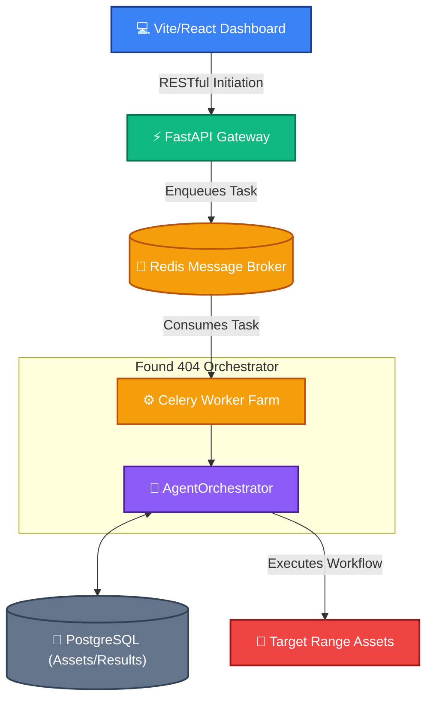

# 🚀 Found 404: The "Single Pane of Glass" Orchestrator

**A Technical & Executive Presentation Guide**

---

## 1. The Executive Pitch: Problem vs. Solution

### 🚨 The Problem: The SME "Protection Gap"
Small-to-Medium Enterprises (SMEs) face enterprise-level threats with a fraction of the budget and manpower. 
- **Fragmented Tools:** Teams juggle Nmap, OpenVAS, Nuclei, and Wazuh separately.
- **Alert Fatigue:** Traditional vulnerability scanners (like Nessus) dump thousands of low-level CVEs (e.g., *Info: TCP Timestamp Response*), creating unmanageable noise.
- **The "Tشتت" (Distraction) Factor:** IT admins spend hours dismissing false positives rather than fixing actual exploit chains.

### 🛡️ The Solution: Deterministic Orchestration (Found 404)
Found 404 replaces the fragmented toolset with a **Centralized Operations Hub**. 
It utilizes a deterministic 4-stage agent pipeline to automatically chain reconnaissance into targeted validation. Instead of 1,000 alerts, Found 404 delivers **1 Actionable Directive** based on a contextual Business Risk Score.

---

## 2. Architecture Visualizations 

### Diagram A: High-Level System Flow
This illustrates how the modern React frontend communicates asynchronously with the Orchestrator via our robust message broker architecture.



### Diagram B: The Deterministic 4-Stage Pipeline
This highlights the core AI/Automation advantage. It shows how raw data is refined into validated intelligence.

```mermaid
flowchart LR
    classDef stage fill:#1e293b,stroke:#cbd5e1,stroke-width:2px,color:#38bdf8
    classDef logic fill:#0f172a,stroke:#475569,stroke-width:1px,color:#e2e8f0,stroke-dasharray: 5 5

    STAGE1["🔍 1. ReconAgent"]:::stage -->|Discovered Ports (e.g., 445)| STAGE2["🎯 2. ChainingAgent"]:::stage
    STAGE2 -->|Matched Nuclei Templates| STAGE3["💥 3. ValidationAgent"]:::stage
    STAGE3 -->|Confirmed Active Exploit| STAGE4["📊 4. UnifiedRiskEngine"]:::stage
    
    subgraph Pipeline Logic
        L1["(Nmap/Masscan)"]:::logic -.-> STAGE1
        L2["(Contextual Tagging)"]:::logic -.-> STAGE2
        L3["(False Positive Removal)"]:::logic -.-> STAGE3
        L4["(Business Impact Scoring)"]:::logic -.-> STAGE4
    end
```

---

## 3. Data Models & Metrics

### The Paradigm Shift: Traditional vs. Deterministic

| Metric | Traditional Scanning (OpenVAS/Nessus) | Found 404 Deterministic Orchestration |
| :--- | :--- | :--- |
| **Output Volume** | 1,000+ Raw CVEs | 5-10 Validated Attack Paths |
| **False Positives** | Extremely High (Theoretical Vulnerabilities) | Near-Zero (Actively Validated Exploits) |
| **Remediation** | Requires manual IT research | Auto-generates specific Action Items |
| **Time to Triage** | Days / Weeks | Minutes |

### Risk Calculation Logic (The Health Score)
The Unified Risk Engine abstracts CVSS complexities into an intuitive 0-100 grade. Let $R$ be the final risk score:

$$ R = (\text{Base Severity}_{\text{CVSS}} \times W_s) + (\text{Port Exposure Penalty}_{\text{DMZ vs Internal}}) + (\text{Asset Criticality}) $$

* **Severity Weights ($W_s$):** A validated BOLA acts as an automatic multiplier.
* **Port Penalties:** Port 3389 (RDP) on a DMZ scores higher than Port 80 on an Internal Dev server.
* **Asset Criticality:** Production databases inherently add base points over testing environments.

---

## 4. The "Single Pane of Glass" Dashboard

### Dynamic Visualization
The Vite/React frontend translates the raw PostgreSQL data into a comprehensive operational view:

* **The D3.js Network Graph:** Automatically maps the attack surface. Nodes represent actual corporate assets, while Edges map the validated attack pathways (e.g., `Asset A -> Exposed SMB -> Data Exfiltration`). 
* **Red/Green Nativism:** At a glance, an IT admin can see exactly which nodes are verified compromised (Red) vs. secure/informational (Gray).

### Risk Reduction Tracking
**(Presentation Note: Include two visual charts here during the live pitch)**
* 📉 **Chart 1 (Before):** 100% Risk Exposure, high alert volume.
* 📈 **Chart 2 (After):** Risk reduced to 12% after applying the Orchestrator's specific Action Items over a 48-hour period.

---

## 5. Efficiency Multipliers: Eliminating "Tشتت"

The ultimate value of Found 404 is the complete eradication of **Tشتت** (Distraction/Fragmentation) for SME IT teams. 

1. **No Context Switching:** Admins do not need to log into OpenVAS, then cross-reference with Nmap, then check Wazuh logs. The Orchestrator does it all.
2. **Action-Oriented Outputs:** Instead of reading "CVE-2021-44228 exists," the system outputs: *"Apply Log4j patch 2.17.0 to Server A via SSH."*
3. **Automated Validation:** The system confirms the vulnerability is *actually exploitable* before notifying the admin, saving hours of chasing ghost alerts.
