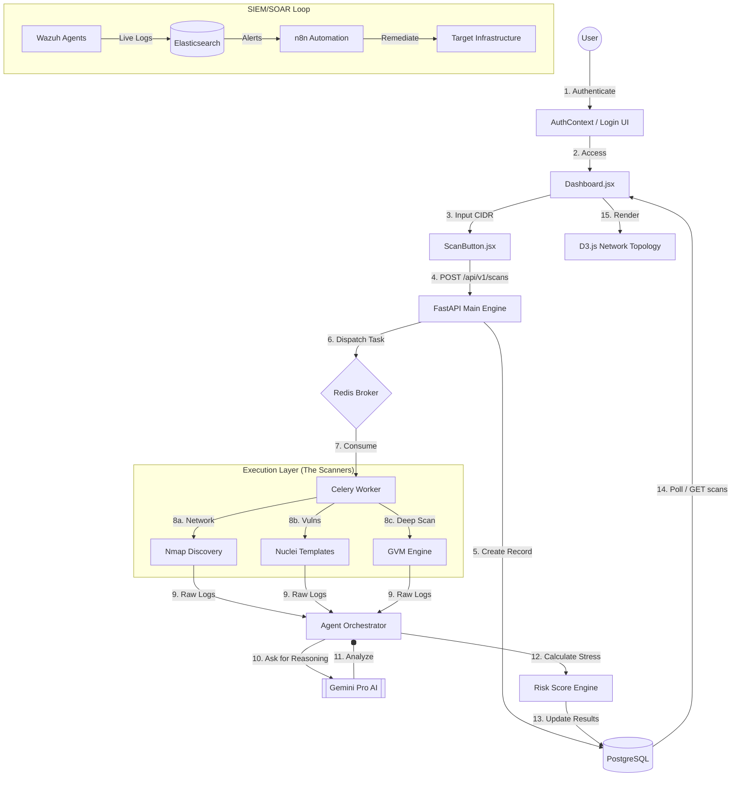

# found 404: Granular Operational Workflow

## 1. Master System Flowchart
This diagram represents the entire lifecycle of the **found 404** intelligence platform, from the moment a user signs in to the final SIEM/SOAR automated response.

---

## 2. Step-by-Step Technical Logic

### Step 1: Authentication & Entry
The user authenticates via the **AuthContext** in the frontend. Once verified, the **React Router** loads the `Dashboard.jsx`, which serves as the "Command Center".

### Step 2: Scan Initialization
When the user enters a target (e.g., `172.18.0.0/24`) and clicks **Scan**:
- The frontend sends an asynchronous `POST` request to the FastAPI backend.
- The backend immediately creates a **Scan Object** in PostgreSQL with a `QUEUED` status.
- This ensures the UI remains responsive and doesn't "freeze" while waiting.

### Step 3: Background Orchestration
FastAPI sends a message to **Redis**. The **Celery Worker** (a background process) picks up the message and begins the heavy lifting:
- **Nmap**: Maps the network topology, identifies OS (Windows vs Linux), and finds open ports.
- **Nuclei/OpenVAS**: Performs deep vulnerability analysis against discovered services.

### Step 4: AI Intelligence & Reasoning
This is where **found 404** differs from standard scanners. Raw scan logs are sent to the **Agent Orchestrator**:
- It sends the data to **Google Gemini**.
- Gemini performs "Post-Scan Reasoning" to filter out false positives.
- It translates technical strings (e.g., `CVE-2017-0144`) into human-readable advice.

### Step 5: Risk Calculation
The **Risk Engine** takes the AI insights and calculates a score (0-100) based on:
- **Asset Criticality**: Is this a core server or a guest laptop?
- **Vulnerability Density**: How many critical vs. low findings were found?

### Step 6: UI Update & Topology Rendering
The frontend polls the backend every 3 seconds. Once the status hits `COMPLETED`:
- The **D3-powered Network Topology** graph is updated.
- Each node is color-coded by its risk level (Red for Critical, Blue for Safe).
- The user can click any node to see the **AI-generated remediation steps**.

### Step 7: Continuous SIEM Monitoring
While scans are periodic, **Wazuh** and **n8n** run continuously:
- If a live intrusion is detected on a node, it appears in the **Live Activity Feed**.
- **n8n** can trigger "Playbooks" to block the attacker's IP address automatically.
