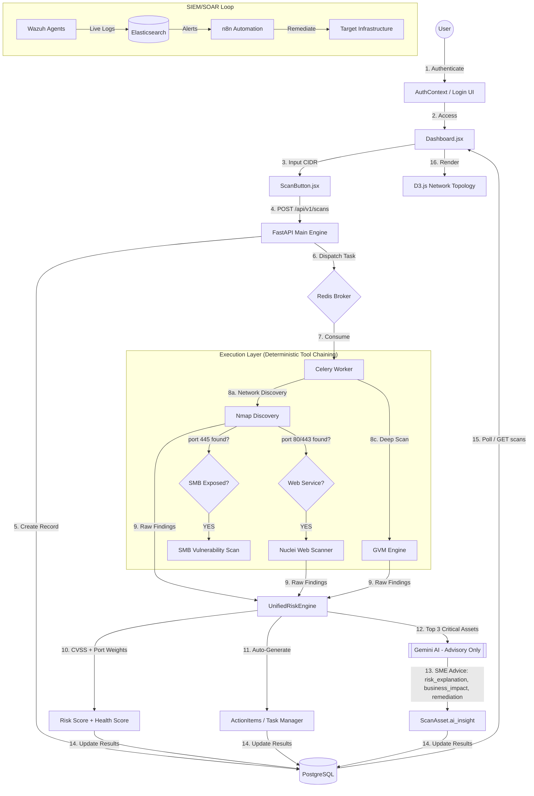

# found 404: Granular Operational Workflow

## 1. Master System Flowchart
This diagram represents the entire lifecycle of the **found 404** intelligence platform, from the moment a user signs in to the final SIEM/SOAR automated response.

---

## 2. Step-by-Step Technical Logic

### Step 1: Authentication & Entry
The user authenticates via the **AuthContext** in the frontend. Once verified, the **React Router** loads the `Dashboard.jsx`, which serves as the "Command Center".

### Step 2: Scan Initialization
When the user enters a target (e.g., `172.18.0.0/24`) and clicks **Scan**:
- The frontend sends an asynchronous `POST` request to the FastAPI backend.
- The backend immediately creates a **Scan Object** in PostgreSQL with a `QUEUED` status.
- This ensures the UI remains responsive and doesn't "freeze" while waiting.

### Step 3: Deterministic Tool Orchestration
FastAPI sends a message to **Redis**. The **Celery Worker** runs the `AgentOrchestrator`:
- **Nmap**: Maps the network, identifies OS, and finds open ports.
- **Deterministic Chaining**: If port 80/443 is found → triggers **Nuclei** web scans. If port 445 is found → triggers **SMB vulnerability checks**. No AI needed to decide this.
- **OpenVAS/GVM**: Performs deep vulnerability analysis against discovered services.

### Step 4: Deterministic Validation
The `ValidationAgent` filters findings using **tool confidence scores** (≥ 0.6 = validated). No LLM is used for this phase—false positive filtering is rule-based for reliability and speed.

### Step 5: Risk Calculation (UnifiedRiskEngine)
The `UnifiedRiskEngine` calculates two complementary scores deterministically:
- **Risk Score (0-100)**: Sum of CVSS-weighted penalties from vulnerabilities and exposed high-risk ports, multiplied by asset criticality.
- **Health Score (100-0)**: A simplified "safe vs. danger" metric for non-technical business owners.

### Step 6: Automated Task Generation
The `UnifiedRiskEngine` automatically creates `ActionItem` records from findings:
- **CRITICAL/HIGH vulnerabilities** → `REMEDIATION` tasks with HIGH priority.
- **MEDIUM vulnerabilities** → `REVIEW` tasks.
- **Exposed dangerous ports** (FTP/Telnet/SMB/RDP) → `CONFIGURATION` tasks.

### Step 7: AI Advisory (Limited Role)
For the top 3 critical assets only, the **IntelligenceAgent** is called to generate SME-friendly advice:
- `risk_explanation` → Simple 1-sentence danger summary.
- `business_impact` → What this means for the business.
- `remediation_advice` → Non-technical steps to fix it.
>  Note: If the `GEMINI_API_KEY` is not set, the system uses pre-defined fallback advice and continues normally.

### Step 8: UI Update & Topology Rendering
The frontend polls the backend every 3 seconds. Once scan status hits `COMPLETED`:
- The **D3-powered Network Topology** graph updates, health/risk color-coded by node.
- Hover tooltips show the **Health Score** and **AI Expert Advice**.
- Clicking a node opens the **AssetDetailPanel** with the full "SME Security Advisor" section.

### Step 9: Continuous SIEM Monitoring
While scans are periodic, **Wazuh** and **n8n** run continuously:
- If a live intrusion is detected on a node, it appears in the **Live Activity Feed**.
- **n8n** can trigger "Playbooks" to block the attacker's IP address automatically.
