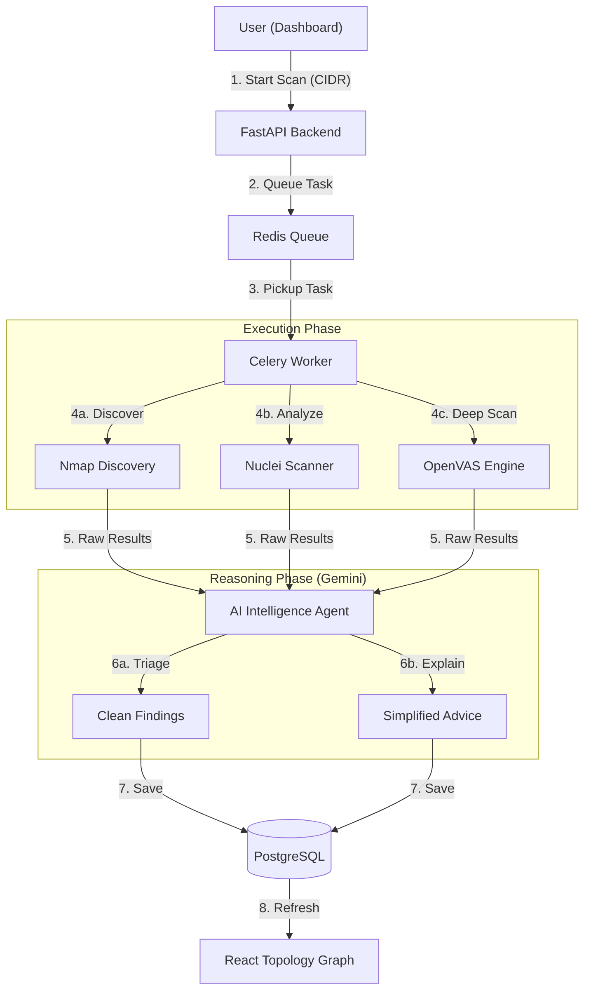

# found 404: Operational Workflow Presentation

## 1. High-Level Data Flow
This flowchart illustrates the lifecycle of a security scan, from user initiation to AI-driven insights.

---

## 2. The Intelligence Cycle
found 404 operates on a continuous feedback loop of security intelligence.

### Phase 1: Neural Discovery
The system doesn't just scan; it **maps**. It identifies the operating system, open ports, and service versions of every device in the network segment.

### Phase 2: Autonomous Reasoning
The **Gemini AI Agent** acts as a senior security researcher. It reads raw logs (e.g., an SMB vulnerability log) and translates it into:
- **What it is**: "Your Windows PC has an open door for WannaCry ransomware."
- **Why it matters**: "This is a critical threat to your financial data."
- **How to fix**: "Apply the MS17-010 security patch immediately."

### Phase 3: Risk Visualization
Findings are synthesized into a **Risk Score (0-100)** and a **Network Topology Graph**. This allows security teams to see exactly where the "hot spots" are in their infrastructure at a glance.

---

## 3. SIEM & SOAR Integration (The Modern Stack)
For real-time protection, the platform integrates with:
- **Wazuh**: Endpoint detection and response.
- **Elasticsearch**: Centralized logging.
- **n8n**: Automated response playbooks (e.g., automatically blocking a detected malicious IP).

---

## 4. Visualizing the Lab
When running the Virtual Lab, the workflow expands to include:
1. **Lab Gateway**: Simulating a corporate perimeter.
2. **Internal Nodes**: Diverse OS environments (Ubuntu, Windows) with "planted" vulnerabilities for training.
3. **Attacker Perspective**: The dashboard provides the same view an attacker would have, but for defensive purposes.
