# Orchestration Security Center

A cybersecurity orchestration platform for Small and Medium Enterprises (SMEs). The system combines asset discovery, vulnerability scanning, risk scoring, SIEM/SOAR integration, and audit-ready reporting in one dashboard.

Final Year Project, Helwan International Technological University.

[](https://github.com/MazenAlaa305/ORCHESTRATION-SECURITY-CENTER/actions/workflows/ci.yml)
[]()
[]()
[]()

## Contents

- [Project Summary](#project-summary)
- [Screenshots](#screenshots)
- [How It Works](#how-it-works)
- [Main Features](#main-features)
- [Technology Stack](#technology-stack)
- [Quick Start](#quick-start)
- [Configuration](#configuration)
- [Default Access](#default-access)
- [Useful Commands](#useful-commands)
- [Testing](#testing)
- [Project Structure](#project-structure)
- [Documentation](#documentation)

## Project Summary

Orchestration Security Center helps SME teams run a practical security workflow without buying a full enterprise SIEM/SOAR product. It discovers assets, launches open-source scanners, validates findings, ranks risk, and presents the results through a web dashboard that managers and analysts can understand.

The project focuses on deterministic orchestration: scanner decisions are based on discovered services and configured scope, so the platform produces repeatable results instead of noisy, random alert floods.

## Screenshots

Screenshots below are captured from the final project presentation.

| Title | Login | Topology |
|---|---|---|
| 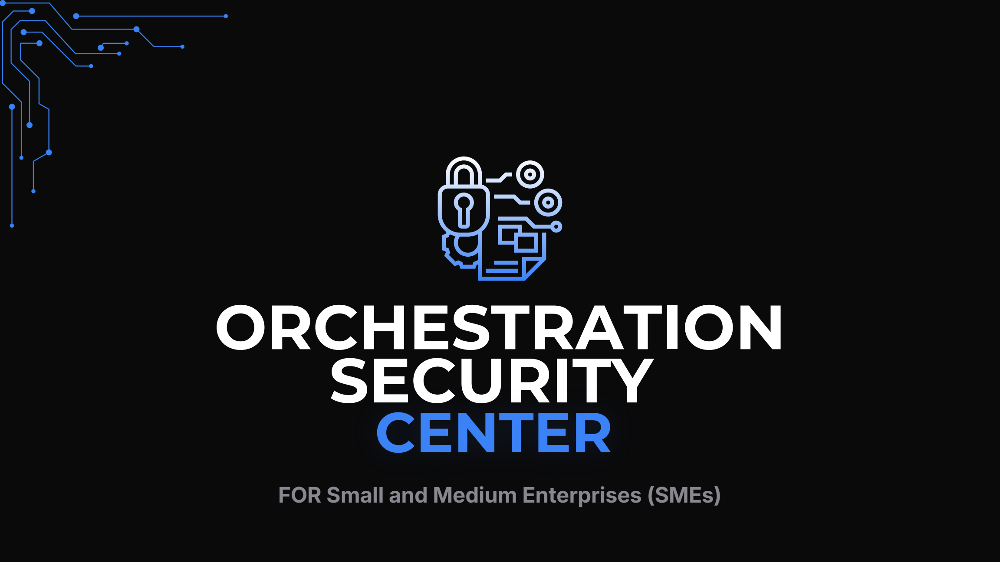 | 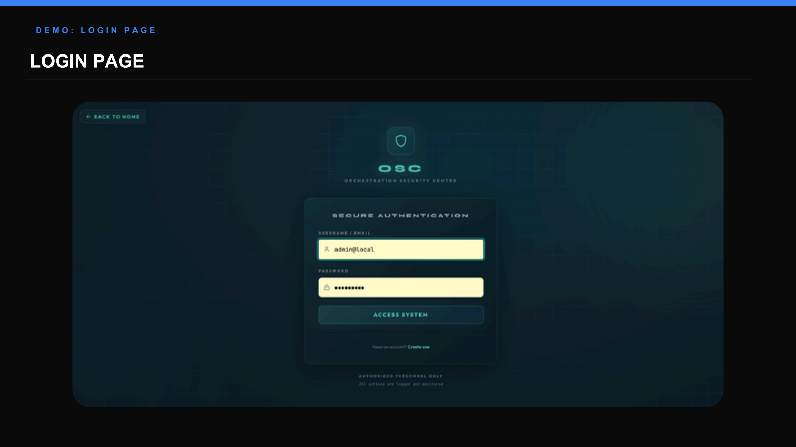 | 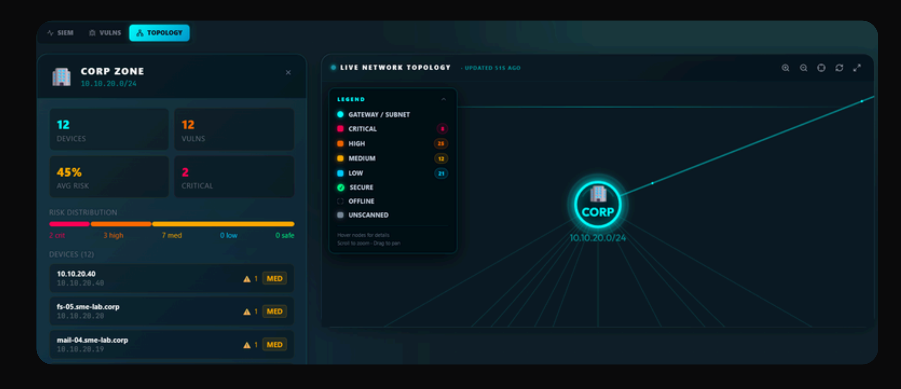 |

| Full report | Analyst profile |
|---|---|
| 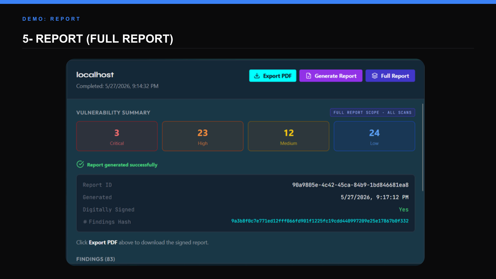 | 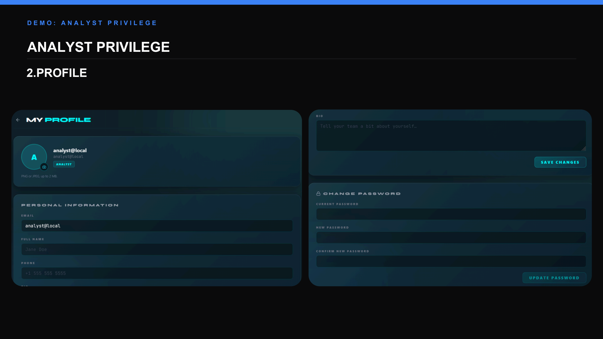 |

| Command center | SIEM | Vulnerabilities |
|---|---|---|
| 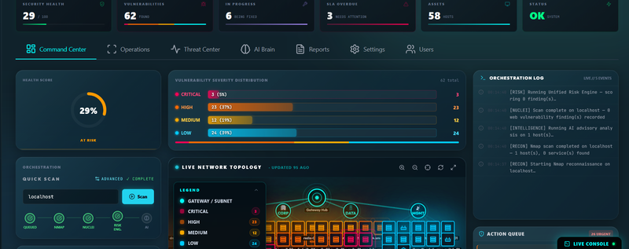 | 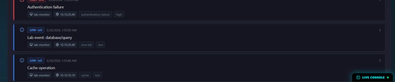 | 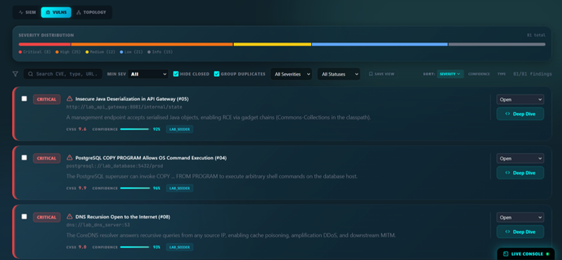 |

| Command center navbar | SIEM alerts | Vulnerabilities deep dive |
|---|---|---|
| 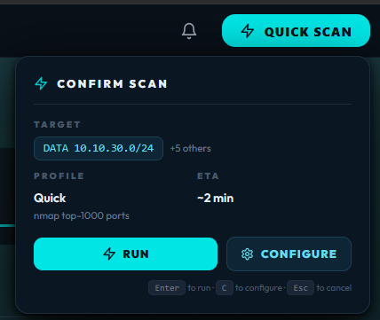 | 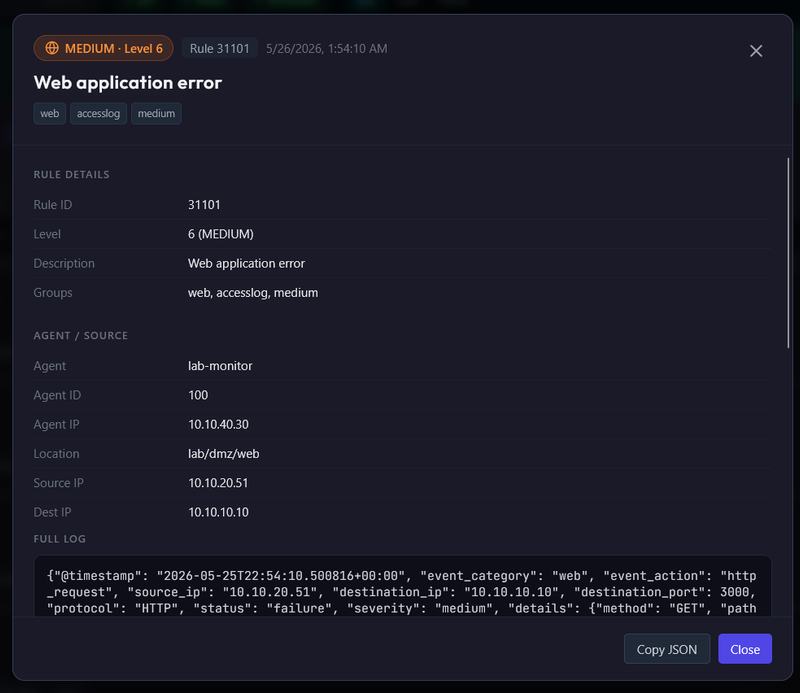 | 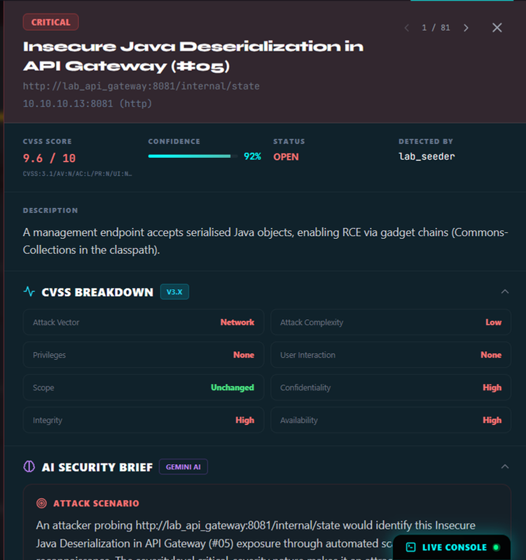 |

## How It Works

```text
Target / Lab Network
        |
        v
Asset discovery and service fingerprinting
        |
        v
Scanner orchestration: Nmap, Nuclei, OpenVAS
        |
        v
Validation, deduplication, and framework tagging
        |
        v
Risk scoring, remediation workflow, and reporting
        |
        v
Dashboard, SIEM events, SOAR actions, PDF/JSON exports
```

## Main Features

| Area | What it provides |
|---|---|
| Authentication | JWT login, role-based access control, profile management, audit logging |
| Asset discovery | Target inventory, subnet discovery, topology generation, asset deduplication |
| Scanning | Nmap, Nuclei, OpenVAS, validation probes, and async Celery workers |
| Risk management | Business-facing risk score, severity breakdowns, SLA tracking, explanations |
| Vulnerability workflow | Status changes, remediation notes, false-positive handling, and revalidation |
| Reporting | Signed PDF reports, JSON exports, report verification, audit evidence |
| SIEM/SOAR | Optional Wazuh, Elasticsearch, Kibana, and n8n integrations |
| Lab environment | Vulnerable Docker lab for demos, testing, and repeatable evaluation |
| AI advisory | Optional Gemini-based remediation guidance with guardrails and fallback |

## Technology Stack

| Layer | Technologies |
|---|---|
| Frontend | React 18, Vite, Tailwind CSS, Framer Motion, D3.js, Recharts, React Router, React Query, Zustand |
| Backend | FastAPI, SQLAlchemy, Alembic, Pydantic, Celery, Redis, PostgreSQL, JWT |
| Security tools | Nmap, Nuclei, OpenVAS/GVM, validation probes, scope guard |
| SIEM/SOAR | Wazuh, Elasticsearch, Kibana, n8n |
| Infrastructure | Docker Compose, Caddy, CoreDNS, isolated Docker lab networks |
| Testing | pytest, Vitest, Playwright-style E2E tests, Postman collection |

## Quick Start

### 1. Prerequisites

Install these before running the project:

- Docker Desktop with Docker Compose v2
- PowerShell 5.1+ on Windows, or Bash on Linux/macOS
- Git
- 16 GB RAM minimum for Lite mode
- 32 GB RAM recommended for Full mode
- 20 GB free disk space

### 2. Clone the repository

```bash
git clone https://github.com/MazenAlaa305/ORCHESTRATION-SECURITY-CENTER.git
cd ORCHESTRATION-SECURITY-CENTER
```

### 3. Create environment configuration

Copy the example file and fill in secrets:

```powershell
Copy-Item .env.example .env
```

```bash
cp .env.example .env
```

Generate required secrets:

```bash
python -c "import secrets; print(secrets.token_hex(32))"
python -c "import base64, os; print(base64.urlsafe_b64encode(os.urandom(32)).decode())"
```

Put the first value in `JWT_SECRET` and the second value in `CREDENTIAL_ENCRYPTION_KEY` inside `.env`.

### 4. Start Lite mode

Lite mode is the recommended first run. It starts the dashboard, backend, database, Redis, Celery worker, and the smaller vulnerable lab.

```powershell
powershell -ExecutionPolicy Bypass -File .\start-lite.ps1
```

```bash
bash start-lite.sh
```

Open:

- Dashboard: `https://localhost`
- Backend API docs: `http://localhost:8000/docs`
- Juice Shop lab target: `http://localhost:3000`
- Lab API gateway: `http://localhost:8081`

Accept the local self-signed certificate warning in the browser.

### 5. Start Full mode

Full mode adds heavier integrations: OpenVAS, Elasticsearch, Kibana, Wazuh, n8n, Celery Beat, and the full lab profile.

```powershell
powershell -ExecutionPolicy Bypass -File .\start-full.ps1
```

```bash
bash start-full.sh
```

Use Full mode only when Docker Desktop has enough memory assigned. If containers restart or become unhealthy, increase Docker resources and run the command again.

## Configuration

Configuration is loaded from the project-root `.env` file. Do not commit real secrets.

| Variable | Required | Purpose |
|---|---|---|
| `JWT_SECRET` | Yes | Signs authentication tokens |
| `CREDENTIAL_ENCRYPTION_KEY` | Yes | Encrypts stored target credentials |
| `DATABASE_URL` | Docker default provided | Backend database connection |
| `REDIS_URL` | Docker default provided | Celery broker and runtime cache |
| `GEMINI_API_KEY` | Optional | Enables Gemini remediation guidance |
| `LLM_PROVIDER` | Optional | Use `gemini` or `none` |
| `SIEM_ENABLED` | Optional | Enables SIEM integration when backing services are ready |
| `SOAR_ENABLED` | Optional | Enables n8n SOAR webhooks |
| `OPENVAS_ENABLED` | Optional | Enables OpenVAS integration |
| `LAB_ENABLED` | Optional | Enables lab-related backend features |
| `REPORT_SIGNING_KEY` | Recommended | Signs report metadata and verification data |

Optional integrations are disabled by default and fail gracefully when not configured.

## Default Access

On first backend startup, the app seeds a local administrator account for development/demo use:

| Role | Email | Password | Notes |
|---|---|---|---|
| Admin | `admin@local` | `Admin#159` | Seeded on first boot; change after login |

Additional demo users can be created with:

```bash
docker compose exec backend python seed_demo_users.py
```

## Useful Commands

| Task | Windows | Linux/macOS |
|---|---|---|
| Start Lite stack | `powershell -ExecutionPolicy Bypass -File .\start-lite.ps1` | `bash start-lite.sh` |
| Start Lite without rebuild | `powershell -ExecutionPolicy Bypass -File .\start-lite.ps1 -NoBuild` | `bash start-lite.sh --no-build` |
| Start Full stack | `powershell -ExecutionPolicy Bypass -File .\start-full.ps1` | `bash start-full.sh` |
| Stop all containers | `powershell -ExecutionPolicy Bypass -File .\stop-all.ps1` | `bash stop-all.sh` |
| View backend logs | `docker compose logs -f backend` | `docker compose logs -f backend` |
| View all containers | `docker compose ps` | `docker compose ps` |
| Rebuild main stack | `docker compose up -d --build` | `docker compose up -d --build` |

## Troubleshooting

| Problem | Fix |
|---|---|
| Docker command fails | Start Docker Desktop and wait until it is fully running |
| Backend fails on startup | Make sure `JWT_SECRET` and `CREDENTIAL_ENCRYPTION_KEY` are set in `.env` |
| Browser warns about certificate | Accept the local self-signed certificate for `https://localhost` |
| Full mode containers restart | Increase Docker Desktop RAM allocation or use Lite mode |
| Seed request fails | Wait for the lab to finish booting, then run the seed action from the dashboard or retry the start script |
| Port already in use | Stop the conflicting service or update the compose port mapping |

## Testing

Run backend tests:

```bash
pytest backend/tests/ -v --cov=backend/app
```

Run frontend tests:

```bash
npm --prefix frontend test
```

Run the project test helper:

```bash
python run_tests.py
```

API collection:

```text
postman/OrchestrationSecurityCenter_API.postman_collection.json
```

## Project Structure

```text
.
|-- backend/                 FastAPI app, services, models, migrations, tests
|-- frontend/                React and Vite dashboard
|-- infra/                   Caddy, isolation, and OpenVAS infrastructure files
|-- lab/                     Vulnerable lab containers and sample data
|-- lab_config/              Lab bootstrap configuration
|-- postman/                 API collection
|-- tests/                   End-to-end test suite
|-- all_tests/               Extended backend and frontend tests
|-- docs/screenshots/        README screenshots
|-- docker-compose.yml       Main application stack
|-- docker-compose.lab.yml   Vulnerable lab stack
|-- start-lite.ps1/.sh       Lite stack launcher
|-- start-full.ps1/.sh       Full stack launcher
|-- stop-all.ps1/.sh         Shutdown scripts
|-- TEAM_PLAN.md             Team roles and responsibilities
|-- TECHNICAL_NOTES.md       Architecture and implementation notes
|-- FYP_Documentation.md     Full academic documentation
|-- FYP_Figures.md           Figure catalogue
`-- Orchestration_Security_Center_Presentation.pptx.pdf
```

## Documentation

| File | Purpose |
|---|---|
| [TEAM_PLAN.md](TEAM_PLAN.md) | Team ownership, roles, responsibilities, and onboarding notes |
| [TECHNICAL_NOTES.md](TECHNICAL_NOTES.md) | Architecture, API, data model, and operational notes |
| [FYP_Documentation.md](FYP_Documentation.md) | Academic project documentation |
| [FYP_Figures.md](FYP_Figures.md) | Figure list and capture guidance |
| [Orchestration_Security_Center_Presentation.pptx.pdf](Orchestration_Security_Center_Presentation.pptx.pdf) | Final presentation PDF |

## Security Notes

- Use this project only on systems and networks you own or are authorized to test.
- The lab intentionally contains vulnerable services and weak credentials for demonstration.
- Keep lab networks isolated from real production networks.
- Do not commit `.env`, real API keys, exported reports containing sensitive data, or production credentials.

## Team

Eleven members across leadership, backend, AI, frontend, visualization, scanning, QA, and documentation tracks. Full ownership details are maintained in [TEAM_PLAN.md](TEAM_PLAN.md).

## License

Academic project, Helwan International Technological University. All rights reserved by the project team. External reuse requires written permission from the team lead.