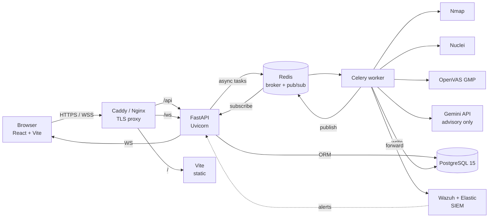
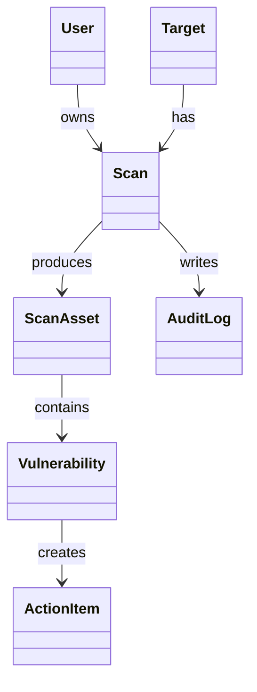
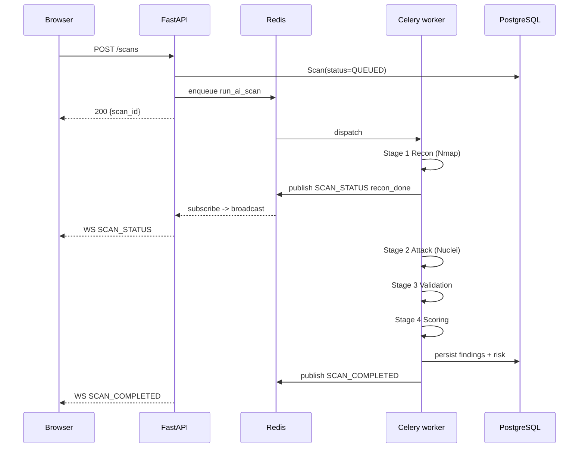
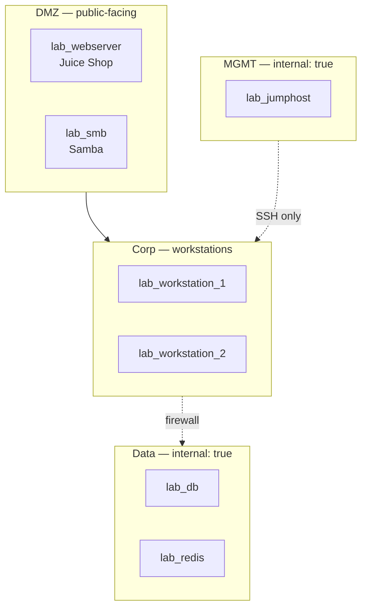
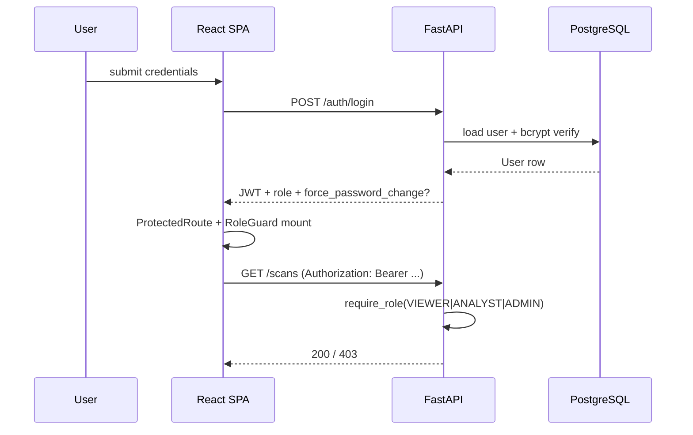

# Architecture Diagram — Orchestration Security Center

> A reviewer-friendly architectural reference. The root-level [ARCHITECTURE_DIAGRAM.md](../ARCHITECTURE_DIAGRAM.md) carries the full Found 404 design narrative; this file is the trimmed Mermaid-only version for quick reading.

## High-level flow

## Data model snapshot

## Sequence: a single scan

## Network zones (lab)

## Auth & RBAC

## See also
- [API_GUIDE.md](API_GUIDE.md) — endpoints & WebSocket envelope
- [../SECURITY_AUDIT.md](../SECURITY_AUDIT.md) — OWASP Top 10 mapping
