> Consolidated FYP / academic documentation. Merged from:
> - `FYP_Documentation.md` *(merged in full as Part A — original deleted)*
> - `FYP_Figures.md` *(merged in full as Part B — original deleted)*
> - `PROJECT_OVERVIEW.md` *(kept in place — see [PROJECT_OVERVIEW.md](../PROJECT_OVERVIEW.md))*
> - `USE_CASES_AND_EVALUATION.md` *(kept in place — see [USE_CASES_AND_EVALUATION.md](../USE_CASES_AND_EVALUATION.md))*

---

## Index

- **Part A — Full FYP Documentation** *(below)* — academic report: Declaration, Approval, Abstract, all 6 chapters (Introduction, Literature Review, Methodology/Design, Implementation, Testing/Evaluation, Conclusion), References, Appendices.
- **Part B — All FYP Figures** *(below)* — every Mermaid figure used in Chapters 3–5 of the report, with captions.
- **Project Overview** — non-technical project summary, full architecture diagram, complete tech stack, backend/frontend deep dives, lab environment details. See [PROJECT_OVERVIEW.md](../PROJECT_OVERVIEW.md).
- **Use Cases & Evaluation** — what the project is used for, target audiences, real-world use cases, advantages, disadvantages, summary comparison. See [USE_CASES_AND_EVALUATION.md](../USE_CASES_AND_EVALUATION.md).

---

# Part A — Full FYP Documentation

<p align="center">
  <h1 align="center">Orchestration Security Center</h1>
  <h3 align="center">AI-Driven Security Orchestration Platform for SMEs</h3>
  <p align="center"><strong>Final Year Project Documentation</strong></p>
</p>

---

| | |
|---|---|
| **Project Title** | Orchestration Security Center — An AI-Driven Dynamic Application Security Testing and Orchestration Platform for Small-to-Medium Enterprises |
| **Student Name** | Omar Abdelaziz Kapil |
| **Institution** | HITU (Higher Institute of Technology and Information) |
| **Academic Year** | 2025–2026 |
| **Supervisor** | [Supervisor Name] |
| **Student ID** | [Student ID] |

---

## Table of Contents

### Preliminary Pages

- [Declaration](#declaration)
- [Approval / Certification](#approval--certification)
- [Dedication](#dedication)
- [Acknowledgements](#acknowledgements)
- [Abstract](#abstract)
- [List of Figures](#list-of-figures)
- [List of Tables](#list-of-tables)
- [List of Abbreviations](#list-of-abbreviations)

### Chapters

- [Chapter 1 — Introduction](#chapter-1--introduction)
  - [1.1 Background of Study](#11-background-of-study)
  - [1.2 Problem Statement](#12-problem-statement)
  - [1.3 Project Objectives](#13-project-objectives)
  - [1.4 Project Scope](#14-project-scope)
  - [1.5 Significance / Motivation of the Study](#15-significance--motivation-of-the-study)
  - [1.6 Report Organization](#16-report-organization)
- [Chapter 2 — Literature Review](#chapter-2--literature-review)
  - [2.1 Introduction](#21-introduction)
  - [2.2 Review of Related Existing Systems](#22-review-of-related-existing-systems)
  - [2.3 Comparison of Existing Solutions](#23-comparison-of-existing-solutions)
  - [2.4 Technologies and Tools Reviewed](#24-technologies-and-tools-reviewed)
  - [2.5 Summary / Research Gap](#25-summary--research-gap)
- [Chapter 3 — Methodology / System Design](#chapter-3--methodology--system-design)
  - [3.1 Introduction](#31-introduction)
  - [3.2 Research / Development Methodology](#32-research--development-methodology)
  - [3.3 System Architecture / Framework](#33-system-architecture--framework)
  - [3.4 Requirements Analysis](#34-requirements-analysis)
  - [3.5 Use Case / Data Flow Diagrams](#35-use-case--data-flow-diagrams)
  - [3.6 Database Design](#36-database-design)
  - [3.7 UI/UX Wireframes](#37-uiux-wireframes)
- [Chapter 4 — Implementation](#chapter-4--implementation)
  - [4.1 Introduction](#41-introduction)
  - [4.2 Development Environment & Tools](#42-development-environment--tools)
  - [4.3 Module / Feature Implementation](#43-module--feature-implementation)
  - [4.4 Integration of Components](#44-integration-of-components)
  - [4.5 Challenges Faced During Implementation](#45-challenges-faced-during-implementation)
- [Chapter 5 — Testing & Evaluation](#chapter-5--testing--evaluation)
  - [5.1 Introduction](#51-introduction)
  - [5.2 Testing Strategy](#52-testing-strategy)
  - [5.3 Test Cases & Test Results](#53-test-cases--test-results)
  - [5.4 Performance Evaluation](#54-performance-evaluation)
  - [5.5 Discussion of Results](#55-discussion-of-results)
- [Chapter 6 — Conclusion & Future Work](#chapter-6--conclusion--future-work)
  - [6.1 Summary of the Project](#61-summary-of-the-project)
  - [6.2 Achievement of Objectives](#62-achievement-of-objectives)
  - [6.3 Limitations](#63-limitations)
  - [6.4 Future Enhancements / Recommendations](#64-future-enhancements--recommendations)

### Back Matter

- [References](#references)
- [Appendices](#appendices)

---

# Preliminary Pages

## Declaration

I hereby declare that this Final Year Project entitled "Orchestration Security Center — An AI-Driven Dynamic Application Security Testing and Orchestration Platform for Small-to-Medium Enterprises" is the result of my own original work carried out under the supervision of [Supervisor Name]. This project has not been submitted for any other degree or qualification at any other institution. All sources of information and literature used are duly acknowledged in the references section.

**Student Signature:** ________________________

**Date:** ________________________

---

## Approval / Certification

This is to certify that the Final Year Project entitled "Orchestration Security Center — An AI-Driven Dynamic Application Security Testing and Orchestration Platform for Small-to-Medium Enterprises" submitted by Omar Abdelaziz Kapil has been examined and approved for the award of the degree.

**Supervisor Signature:** ________________________

**Panel Member 1:** ________________________

**Panel Member 2:** ________________________

**Date:** ________________________

---

## Dedication

> *To my family, whose unwavering support and encouragement made this journey possible.*

---

## Acknowledgements

First and foremost, all praise and gratitude are due to God Almighty for granting me the strength, patience, and knowledge to complete this project. I am deeply thankful to my parents for their endless love, sacrifice, and encouragement throughout my academic journey; without their support, none of this would have been possible.

I extend my sincere gratitude to my supervisor, [Supervisor Name], for their invaluable guidance, constructive feedback, and continuous support throughout the development of this project. Their expertise in cybersecurity and software engineering provided the academic rigor this work required.

I also wish to acknowledge the contributions of the entire Orchestration Security Center project team: Reem Amin (Backend/AI Sub-Leader), Rahma Ebrahem (Frontend Sub-Leader), Shahd Paher (Security Sub-Leader), Yousef Abdel Hady, Mohamed Shaban, Omnia Helmy, Mariz Ehap, Omar Tarek, Yosef Ali, and Mazin Alla. Each member played a vital role in bringing this platform to life.

Finally, I thank the faculty and staff at HITU for providing a stimulating academic environment and the resources necessary to complete this work.

---

## Abstract

Cybersecurity remains a critical challenge for Small-to-Medium Enterprises (SMEs) that typically lack the dedicated security teams and financial resources available to large corporations. Existing Dynamic Application Security Testing (DAST) platforms such as Burp Suite Enterprise, Tenable Nessus, and OWASP ZAP offer powerful capabilities but demand specialized expertise, making them impractical for non-technical SME administrators. This project introduces "Orchestration Security Center," an AI-driven security orchestration platform that automates the entire vulnerability assessment lifecycle -- from reconnaissance and attack simulation through risk scoring to actionable remediation guidance -- within a single, unified dashboard designed for non-expert users.

The platform employs a multi-agent orchestration architecture built on FastAPI (Python) and React (JavaScript), integrating industry-standard security tools including Nmap, Nuclei, and OpenVAS through a deterministic, rule-based chaining pipeline. A UnifiedRiskEngine calculates quantitative risk and health scores using CVSS-weighted severity penalties, asset criticality multipliers, and network exposure modifiers. Google Gemini AI serves in an advisory-only capacity, generating SME-friendly explanations of risk findings, business impact assessments, and prioritized remediation steps. Real-time scan progress and alert streaming are delivered via WebSocket and Redis Pub/Sub, while Docker Compose orchestrates ten microservices including PostgreSQL, Redis, Celery, Elasticsearch, and Wazuh SIEM.

Evaluation results demonstrate that the platform successfully detects OWASP Top 10 vulnerabilities across six pre-configured lab targets, generates deterministic risk scores with 100% reproducibility, and provides actionable remediation items that require no prior security expertise to interpret. The project validates the hypothesis that AI-augmented, tool-chained security orchestration can bridge the cybersecurity gap for resource-constrained SMEs.

**Keywords:** DAST, Security Orchestration, AI Advisory, Multi-Agent Systems, SME Cybersecurity, Risk Scoring, WebSocket, Docker Compose

---

## List of Figures

| # | Figure | Chapter |
|---|--------|---------|
| 3.1 | High-Level System Architecture Diagram | Ch. 3 |
| 3.2 | Agent Orchestration Pipeline Flowchart | Ch. 3 |
| 3.3 | UnifiedRiskEngine Calculation Logic | Ch. 3 |
| 3.4 | Entity-Relationship Diagram (ERD) | Ch. 3 |
| 3.5 | Data Flow Diagram -- Level 0 (Context Diagram) | Ch. 3 |
| 3.6 | Data Flow Diagram -- Level 1 (Detailed) | Ch. 3 |
| 3.7 | Use Case Diagram -- System Actors and Interactions | Ch. 3 |
| 3.8 | Docker Compose Service Architecture | Ch. 3 |
| 3.9 | Frontend Component Hierarchy | Ch. 3 |
| 3.10 | Dashboard UI Wireframe -- Command Center Tab | Ch. 3 |
| 3.11 | Dashboard UI Wireframe -- Operations Tab | Ch. 3 |
| 3.12 | Dashboard UI Wireframe -- Threat Center Tab | Ch. 3 |
| 4.1 | Backend Project Directory Structure | Ch. 4 |
| 4.2 | Frontend Project Directory Structure | Ch. 4 |
| 4.3 | Screenshot -- Command Center Dashboard (Overview Tab) | Ch. 4 |
| 4.4 | Screenshot -- Network Topology Force Graph | Ch. 4 |
| 4.5 | Screenshot -- Risk Heatmap Treemap Visualization | Ch. 4 |
| 4.6 | Screenshot -- Scan Pipeline Progress Indicator | Ch. 4 |
| 4.7 | Screenshot -- Agent Log Viewer (AI Brain Tab) | Ch. 4 |
| 4.8 | Screenshot -- Vulnerability Detail Panel | Ch. 4 |
| 4.9 | Screenshot -- OpenVAS Scanner Integration | Ch. 4 |
| 4.10 | Screenshot -- SIEM Unified Inbox | Ch. 4 |
| 4.11 | Screenshot -- PDF Report Export | Ch. 4 |
| 5.1 | Performance Benchmark -- API Response Times | Ch. 5 |
| 5.2 | Risk Score Distribution Across Lab Targets | Ch. 5 |
| 5.3 | Scan Completion Time Comparison Chart | Ch. 5 |

---

## List of Tables

| # | Table | Chapter |
|---|-------|---------|
| 2.1 | Comparison of Existing DAST Platforms | Ch. 2 |
| 3.1 | Functional Requirements Specification | Ch. 3 |
| 3.2 | Non-Functional Requirements Specification | Ch. 3 |
| 3.3 | Docker Compose Services and Port Mapping | Ch. 3 |
| 3.4 | REST API Endpoint Catalogue | Ch. 3 |
| 3.5 | Database Entity Descriptions | Ch. 3 |
| 3.6 | Severity Weight Constants for Risk Calculation | Ch. 3 |
| 3.7 | High-Risk Port Penalties | Ch. 3 |
| 4.1 | Development Tools and Technologies | Ch. 4 |
| 4.2 | Python Backend Dependencies | Ch. 4 |
| 4.3 | Frontend NPM Dependencies | Ch. 4 |
| 5.1 | Unit Test Case Results | Ch. 5 |
| 5.2 | Integration Test Case Results | Ch. 5 |
| 5.3 | System Test Case Results | Ch. 5 |
| 5.4 | User Acceptance Testing Results | Ch. 5 |
| 5.5 | Performance Evaluation Metrics | Ch. 5 |

---

## List of Abbreviations

| Abbreviation | Full Form |
|:---:|---|
| AI | Artificial Intelligence |
| API | Application Programming Interface |
| BOLA | Broken Object Level Authorization |
| CORS | Cross-Origin Resource Sharing |
| CRUD | Create, Read, Update, Delete |
| CSS | Cascading Style Sheets |
| CVSS | Common Vulnerability Scoring System |
| DAST | Dynamic Application Security Testing |
| DFD | Data Flow Diagram |
| EDR | Endpoint Detection and Response |
| ERD | Entity-Relationship Diagram |
| FTP | File Transfer Protocol |
| GMP | Greenbone Management Protocol |
| HTML | HyperText Markup Language |
| HTTP | HyperText Transfer Protocol |
| IDE | Integrated Development Environment |
| JSON | JavaScript Object Notation |
| JWT | JSON Web Token |
| KPI | Key Performance Indicator |
| LLM | Large Language Model |
| ORM | Object-Relational Mapping |
| OWASP | Open Web Application Security Project |
| PDF | Portable Document Format |
| RBAC | Role-Based Access Control |
| RDP | Remote Desktop Protocol |
| REST | Representational State Transfer |
| SDLC | Software Development Life Cycle |
| SIEM | Security Information and Event Management |
| SMB | Server Message Block |
| SME | Small-to-Medium Enterprise |
| SQL | Structured Query Language |
| SQLi | SQL Injection |
| SSH | Secure Shell |
| SSRF | Server-Side Request Forgery |
| TLS | Transport Layer Security |
| UAT | User Acceptance Testing |
| UI | User Interface |
| URL | Uniform Resource Locator |
| UX | User Experience |
| WS | WebSocket |
| XSS | Cross-Site Scripting |

---

<br>

# Chapter 1 -- Introduction

## 1.1 Background of Study

The digital transformation of Small-to-Medium Enterprises (SMEs) has accelerated dramatically over the past decade, with organizations increasingly relying on web applications, cloud-hosted services, and interconnected networks to conduct their business operations [1]. According to the Verizon 2024 Data Breach Investigations Report, 43% of all cyberattacks target small businesses, yet only 14% of SMEs are prepared to defend themselves against such threats [2]. This disparity exists because traditional cybersecurity solutions -- enterprise DAST platforms, vulnerability scanners, and Security Operations Centers (SOCs) -- are designed for organizations with dedicated security teams, substantial budgets, and deep technical expertise.

Dynamic Application Security Testing (DAST) is a black-box testing methodology that analyzes running applications by simulating real-world attack scenarios to identify exploitable vulnerabilities [3]. Unlike Static Application Security Testing (SAST), which examines source code without execution, DAST evaluates the application in its deployed state, testing for runtime vulnerabilities such as SQL Injection (SQLi), Cross-Site Scripting (XSS), Broken Object Level Authorization (BOLA), and Server-Side Request Forgery (SSRF) [4]. While DAST provides critical security insights, existing tools such as Burp Suite Professional, OWASP ZAP, Tenable Nessus, and Qualys require substantial manual configuration, interpretation of results, and expertise in vulnerability remediation -- skills that SME administrators typically lack.

The emergence of Large Language Models (LLMs) and AI-driven automation presents an opportunity to democratize cybersecurity for resource-constrained organizations. By combining deterministic security scanning tools with AI-powered advisory capabilities, it becomes possible to create platforms that not only discover vulnerabilities but also explain their significance in business terms and provide actionable remediation guidance that non-technical users can follow [5].

This project, "Orchestration Security Center," addresses this gap by developing an AI-driven security orchestration platform that automates the complete vulnerability assessment lifecycle -- from network reconnaissance through vulnerability scanning, risk scoring, and remediation guidance -- within a unified, visually intuitive dashboard designed specifically for SME administrators without specialized cybersecurity training.

## 1.2 Problem Statement

Small-to-Medium Enterprises face a critical cybersecurity gap characterized by the following challenges:

1. **Expertise Gap:** SMEs lack dedicated security professionals capable of operating complex DAST tools, interpreting raw vulnerability scan results, and implementing technical remediation strategies. According to a 2024 ISC2 Cybersecurity Workforce Study, there is a global shortage of 4.8 million cybersecurity professionals, with SMEs being disproportionately affected [6].

2. **Tool Fragmentation:** Effective security assessment requires the coordination of multiple tools -- port scanners (Nmap), vulnerability scanners (Nuclei, OpenVAS), web application testers, and log management systems (SIEM). Each tool operates independently, producing disparate output formats that require manual correlation and analysis [7].

3. **Cost Barriers:** Enterprise security platforms such as Burp Suite Enterprise ($8,999/year), Tenable.io ($3,278/year for 65 assets), and Qualys VMDR carry licensing costs that are prohibitive for small businesses with limited IT budgets [8].

4. **Alert Fatigue and Prioritization Failure:** Without risk-based scoring and contextual analysis, SME administrators are overwhelmed by the volume of raw findings, unable to distinguish critical threats from informational noise, and uncertain about which issues to address first [9].

5. **Absence of Actionable Remediation:** Existing tools report technical findings (CVE identifiers, CVSS scores, packet-level evidence) that are meaningful to security professionals but incomprehensible to SME administrators who need plain-language explanations and step-by-step remediation instructions [10].

> **The central problem this project addresses is:** *How can automated security orchestration, combined with AI-driven advisory capabilities, provide SMEs with enterprise-grade vulnerability assessment and actionable remediation guidance without requiring specialized cybersecurity expertise?*

## 1.3 Project Objectives

The primary objectives of this project are:

1. **Design and implement a multi-agent security orchestration architecture** that automates the sequential execution of reconnaissance, attack simulation, validation, risk scoring, and reporting through deterministic, rule-based tool chaining.

2. **Integrate industry-standard security scanning tools** (Nmap, Nuclei, OpenVAS) into a unified pipeline that performs comprehensive network discovery, port scanning, service enumeration, and vulnerability detection.

3. **Develop a deterministic UnifiedRiskEngine** that calculates quantitative risk scores (0-100) and health scores (100-0) using CVSS-weighted severity penalties, asset criticality multipliers, and network exposure modifiers, ensuring 100% reproducible scoring.

4. **Implement an AI Advisory layer** using Google Gemini LLM to generate SME-friendly vulnerability explanations, business impact assessments, and prioritized remediation guidance in non-technical language.

5. **Build a real-time, visually intuitive security dashboard** using React with interactive components including network topology visualization, risk heatmaps, vulnerability trend charts, and live scan orchestration feeds.

6. **Deploy the platform as a containerized microservices architecture** using Docker Compose, integrating PostgreSQL, Redis, Celery, Elasticsearch, and Wazuh SIEM to provide a complete security operations capability.

7. **Validate the platform** against a controlled lab environment containing six pre-configured vulnerable targets, demonstrating effective detection of OWASP Top 10 vulnerabilities and generation of actionable remediation items.

## 1.4 Project Scope

### In Scope

- Automated network reconnaissance via Nmap (port scanning, OS detection, service enumeration)
- Web application vulnerability scanning via Nuclei (template-based detection) and custom payload testing (SQLi, XSS, BOLA, SSRF)
- OpenVAS integration for comprehensive vulnerability assessment
- Deterministic risk and health score calculation with configurable asset criticality
- AI-powered advisory explanations via Google Gemini (advisory-only role, not autonomous decision-making)
- Real-time WebSocket-based scan progress streaming and alert notifications
- Interactive security dashboard with network topology, risk heatmaps, vulnerability trends, and action center
- PDF report generation for executive and technical stakeholders
- SIEM integration via Wazuh and Elasticsearch for log ingestion and correlation
- Containerized deployment via Docker Compose with ten orchestrated services
- Controlled lab environment with six vulnerable target containers for testing

### Out of Scope

- Authenticated scanning with session management (credential-based crawling)
- Role-Based Access Control (RBAC) with multi-user authentication (planned for future release)
- Mobile application penetration testing
- Static Application Security Testing (SAST) / source code analysis
- Compliance reporting (PCI-DSS, HIPAA, SOC 2) beyond general vulnerability assessment
- Cloud-native deployment (AWS/Azure/GCP managed services)

## 1.5 Significance / Motivation of the Study

This project holds significant academic and practical value for several reasons:

**Academic Contribution:** The project demonstrates a novel approach to combining deterministic rule-based security tool chaining with AI-driven advisory capabilities in a multi-agent architecture. Unlike fully autonomous AI security systems that risk unpredictable behavior, Orchestration Security Center employs a hybrid model where all scanning and scoring decisions are deterministic and reproducible, with AI limited to an advisory-only role for generating human-readable explanations. This architecture pattern -- deterministic orchestration with AI advisory augmentation -- represents a pragmatic approach to trustworthy AI integration in security-critical domains.

**Practical Impact for SMEs:** The platform directly addresses the cybersecurity gap faced by SMEs by providing:

- One-click security assessment that requires no manual tool configuration
- Plain-language vulnerability explanations that non-technical administrators can understand
- Prioritized action items that tell users exactly what to fix first and how
- Visual risk dashboards that provide at-a-glance security posture awareness
- Automated report generation for stakeholder communication

**Industry Relevance:** With the global cybersecurity market projected to reach $376.32 billion by 2029 and the SME cybersecurity segment growing at 14.2% CAGR [11], there is substantial market demand for accessible, affordable security platforms that lower the barrier to entry for small businesses.

**Educational Value:** The project demonstrates the integration of multiple advanced technologies -- multi-agent systems, WebSocket real-time communication, container orchestration, force-directed graph visualization, and LLM-powered natural language generation -- within a cohesive, production-quality software system.

## 1.6 Report Organization

This report is organized into six chapters:

| Chapter | Description |
|---------|-------------|
| **Chapter 1 -- Introduction** | Presents the background, problem statement, objectives, scope, and significance of the project. |
| **Chapter 2 -- Literature Review** | Reviews existing DAST platforms, security orchestration architectures, AI applications in cybersecurity, and identifies the research gap that Orchestration Security Center addresses. |
| **Chapter 3 -- Methodology / System Design** | Describes the Agile SDLC methodology, system architecture, functional and non-functional requirements, use case diagrams, data flow diagrams, database design, and UI wireframes. |
| **Chapter 4 -- Implementation** | Details the development environment, module-by-module implementation with code snippets and screenshots, component integration, and challenges faced. |
| **Chapter 5 -- Testing & Evaluation** | Presents the testing strategy, test cases and results across unit, integration, system, and UAT levels, and evaluates performance metrics. |
| **Chapter 6 -- Conclusion & Future Work** | Summarizes project achievements, discusses limitations, and proposes future enhancements. |

---

<br>

# Chapter 2 -- Literature Review

## 2.1 Introduction

This chapter presents a comprehensive review of existing research and commercial solutions in the domains of Dynamic Application Security Testing, security orchestration platforms, AI-driven vulnerability assessment, and SME cybersecurity tools. The review establishes the theoretical foundation for the Orchestration Security Center platform and identifies the specific research gap that this project addresses.

## 2.2 Review of Related Existing Systems

### 2.2.1 OWASP ZAP (Zed Attack Proxy)

OWASP ZAP is the most widely used open-source DAST tool, maintained by the Open Web Application Security Project community [12]. ZAP operates as an intercepting proxy that sits between the tester's browser and the target application, capturing and analyzing HTTP traffic to identify vulnerabilities such as SQL Injection, Cross-Site Scripting, and insecure headers. ZAP provides both passive scanning (analyzing observed traffic) and active scanning (sending crafted attack payloads).

- **Strengths:** ZAP is free, open-source, extensible via add-ons, supports REST API automation, and has a large community. Its HUD (Heads-Up Display) mode provides some accessibility for less experienced users.

- **Limitations:** ZAP requires manual proxy configuration, generates technical reports that assume security expertise, provides no AI-driven risk prioritization, and lacks integrated network scanning or SIEM capabilities. SME users must independently correlate ZAP findings with network context and determine remediation priorities [13].

### 2.2.2 Burp Suite Professional / Enterprise

PortSwigger's Burp Suite is the industry standard for professional web application security testing [14]. The Professional edition provides an advanced proxy, active scanner, intruder module for automated attacks, and extensibility through BApps. Burp Suite Enterprise adds automated, scheduled scanning with CI/CD integration.

- **Strengths:** Burp Suite offers the most comprehensive active scanning engine, excellent detection accuracy, a powerful Intruder module for custom attack automation, and detailed vulnerability reports with remediation advice.

- **Limitations:** Burp Suite Professional costs $449/user/year, and Enterprise starts at $8,999/year, making it prohibitively expensive for SMEs. Both editions require significant security expertise to configure, interpret, and act on results. There is no integrated network scanning or SIEM capability -- users must operate these as separate tools [15].

### 2.2.3 Tenable Nessus / Tenable.io

Tenable Nessus is a commercial vulnerability scanner that performs network-level vulnerability assessment, configuration auditing, and compliance checking [16]. It maintains a database of over 100,000 plugins covering known CVEs and maintains one of the fastest plugin update cycles in the industry.

- **Strengths:** Nessus provides comprehensive CVE coverage, supports credentialed scanning for deep OS and application assessment, and offers compliance templates for PCI-DSS and CIS benchmarks.

- **Limitations:** Nessus Professional costs $3,990/year. It is primarily a network vulnerability scanner rather than a DAST tool, meaning it does not perform application-layer testing (SQLi, XSS, BOLA). Reports require security expertise to interpret. There is no AI-driven advisory or remediation guidance for non-technical users [17].

### 2.2.4 OpenVAS (Greenbone Vulnerability Management)

OpenVAS is an open-source vulnerability scanner maintained by Greenbone Networks, offering a free alternative to Nessus [18]. It uses the Greenbone Management Protocol (GMP) for API-driven scan management and maintains a community feed of Network Vulnerability Tests (NVTs).

- **Strengths:** OpenVAS is free and open-source, supports comprehensive network vulnerability scanning, provides a web-based management interface (GSA), and offers API access via GMP for automation.

- **Limitations:** OpenVAS has slower scan times compared to Nessus, a steeper learning curve for initial setup, and generates technical reports without AI-driven simplification. It does not perform web application DAST testing and requires manual integration with other tools [19].

### 2.2.5 Nuclei by ProjectDiscovery

Nuclei is a modern, template-based vulnerability scanner designed for fast, configurable scanning across diverse protocols [20]. It uses YAML-based templates that describe vulnerability detection logic, allowing community-driven expansion of detection capabilities.

- **Strengths:** Nuclei is open-source, extremely fast (concurrent scanning), supports HTTP, DNS, TCP, and file protocols, and has a rapidly growing community template library covering CVEs, misconfigurations, default credentials, and exposures.

- **Limitations:** Nuclei requires command-line operation and template selection expertise. Results are technical and require manual interpretation. There is no integrated dashboard, risk scoring, or remediation guidance [21].

### 2.2.6 Wazuh (Open Source SIEM/XDR)

Wazuh is an open-source security platform providing unified SIEM, intrusion detection, vulnerability detection, and compliance monitoring [22]. It collects and analyzes security event data from endpoints, network devices, and cloud workloads, correlating alerts using customizable rule sets.

- **Strengths:** Wazuh is free and open-source, provides log collection, file integrity monitoring, and rootkit detection, integrates with Elasticsearch and Kibana for visualization, and supports multi-platform agent deployment.

- **Limitations:** Wazuh is a monitoring and detection platform, not a DAST tool. It does not perform active vulnerability scanning or attack simulation. Configuration requires Linux system administration expertise. Integration with DAST outputs requires custom development [23].

## 2.3 Comparison of Existing Solutions

> **Table 2.1:** Comparison of Existing DAST and Security Platforms

| Feature | OWASP ZAP | Burp Suite Enterprise | Nessus | OpenVAS | Nuclei | **Orchestration Security Center** |
|---|---|---|---|---|---|---|
| **License** | Free / OSS | $8,999/yr | $3,990/yr | Free / OSS | Free / OSS | **Free / OSS** |
| **Web App DAST** | Yes | Yes | No | No | Partial | **Yes** |
| **Network Scanning** | No | No | Yes | Yes | Partial | **Yes (Nmap)** |
| **Template Scanning** | No | No | Plugins | NVTs | Yes | **Yes (Nuclei)** |
| **AI Advisory** | No | No | No | No | No | **Yes (Gemini)** |
| **Risk Scoring** | CVSS only | Severity | CVSS | CVSS | Severity | **Unified (Custom)** |
| **SME-Friendly UI** | Moderate | No | No | No | No | **Yes** |
| **Real-Time Dashboard** | No | Limited | Limited | GSA | No | **Yes (WebSocket)** |
| **SIEM Integration** | No | No | Yes | No | No | **Yes (Wazuh)** |
| **Containerized Deploy** | Manual | No | No | Docker | Docker | **Docker Compose** |
| **Remediation Guidance** | Generic | Detailed | CVE-based | CVE-based | Template | **AI-Generated** |
| **Target Audience** | Pentesters | Pentesters | IT Security | IT Security | DevSecOps | **SME Admins** |

## 2.4 Technologies and Tools Reviewed

### 2.4.1 FastAPI -- Modern Python Web Framework

FastAPI is a high-performance Python web framework built on Starlette (ASGI) and Pydantic, designed for building APIs with automatic OpenAPI documentation [26]. Key features relevant to this project include native async/await support for concurrent I/O operations, automatic request validation via Pydantic models, built-in WebSocket support for real-time communication, and auto-generated interactive API documentation (Swagger UI). FastAPI benchmarks show throughput comparable to Node.js and Go frameworks while maintaining Python's ecosystem advantages for security tool integration [27].

### 2.4.2 React -- Declarative UI Library

React is a JavaScript library for building component-based user interfaces, maintained by Meta [28]. This project leverages React 18's concurrent rendering features, the react-query library for server state management with automatic cache invalidation, and Zustand for lightweight client-side state management. The component-based architecture enables modular dashboard design where each security widget (StatCards, NetworkTopology, RiskHeatmap) operates as an independent, reusable unit.

### 2.4.3 D3.js and Force-Directed Graphs

D3.js (Data-Driven Documents) is a JavaScript library for creating dynamic, interactive data visualizations [29]. The project uses D3's force simulation algorithm (via react-force-graph-2d) to render network topology maps where nodes represent discovered network assets, edges represent network relationships, and node properties (color, size) encode risk severity and vulnerability count.

### 2.4.4 Nmap -- Network Mapper

Nmap is the industry-standard open-source network scanning tool for host discovery, port scanning, service detection, and OS fingerprinting [30]. The project integrates Nmap via the python-nmap wrapper library, using it as the first stage of the reconnaissance pipeline to discover live hosts, open ports, running services, and operating system information.

### 2.4.5 Docker Compose -- Container Orchestration

Docker Compose enables the definition and management of multi-container applications through a declarative YAML configuration [31]. The project's docker-compose.yml orchestrates ten services with defined dependencies, resource limits, networking, and persistent storage volumes, enabling one-command deployment of the entire platform stack.

### 2.4.6 Google Gemini AI -- Large Language Model

Google Gemini is a family of multimodal large language models developed by Google DeepMind [32]. This project uses the gemini-2.0-flash model (with gemini-pro as a fallback) in an advisory-only capacity to generate natural language explanations of security findings, business impact assessments, and remediation guidance. The model is not used for autonomous decision-making; all scanning, scoring, and action item generation are deterministic.

### 2.4.7 Celery and Redis -- Distributed Task Queue

Celery is a distributed task queue framework for Python that enables asynchronous background task execution [33]. Combined with Redis as a message broker and result backend, Celery handles long-running scan operations without blocking the API server. Redis additionally serves as the Pub/Sub backbone for real-time WebSocket event broadcasting.

### 2.4.8 PostgreSQL -- Relational Database

PostgreSQL 15 is used as the primary relational database, accessed through SQLAlchemy 2.0 ORM with both synchronous and asynchronous session support [34]. The async driver (asyncpg) enables high-throughput database operations during concurrent scan processing.

## 2.5 Summary / Research Gap

The literature review reveals a clear research gap at the intersection of three domains:

1. **Tool Integration Gap:** No existing open-source platform combines network scanning (Nmap), template-based vulnerability detection (Nuclei), comprehensive vulnerability assessment (OpenVAS), and SIEM (Wazuh) into a single, unified orchestration pipeline.

2. **AI Advisory Gap:** While AI is increasingly used in cybersecurity for anomaly detection and threat intelligence, no existing DAST platform provides AI-generated, plain-language vulnerability explanations and remediation guidance specifically designed for non-technical SME administrators.

3. **Accessibility Gap:** Existing platforms are designed for security professionals. No open-source solution provides a complete, real-time security dashboard with interactive visualizations (force-directed topology, risk heatmaps, live orchestration feeds) that an SME owner without cybersecurity training can effectively use to understand and improve their security posture.

> **Orchestration Security Center** addresses this gap by combining deterministic, multi-agent security orchestration with AI-driven advisory capabilities within an SME-optimized dashboard -- a combination that does not exist in any reviewed platform.

---

<br>

# Chapter 3 -- Methodology / System Design

## 3.1 Introduction

This chapter describes the development methodology, system architecture, requirements analysis, and design artifacts for the Orchestration Security Center platform. The design follows an iterative Agile approach with four development phases spanning sixteen weeks, informed by the Software Development Life Cycle (SDLC) principles.

## 3.2 Research / Development Methodology

### 3.2.1 Agile SDLC with Learning Integration

The project adopts a modified Agile methodology with an integrated learning model, where each development phase is preceded by a structured learning sprint. This approach was necessitated by the team's diverse technical backgrounds and the project's requirement to integrate multiple unfamiliar technologies across four sub-teams.

The development follows four phases:

**Phase 1 -- Foundation & Learning (Weeks 1-4):**
Each team member studied their assigned technologies through structured tutorials, hands-on exercises, and sub-leader-led teaching sessions. The phase concluded with learning demonstrations where each sub-team presented their understanding.

**Phase 2 -- Core Development (Weeks 5-9):**
Sub-teams developed their modules in isolation: Backend/AI Core (FastAPI, agent orchestrator, risk engine), Frontend/Visualization (React dashboard, D3.js topology), Security Engine (Nmap/Nuclei integration, scan pipeline), and DevOps/QA (Docker, CI/CD, testing).

**Phase 3 -- Integration & Enhancement (Weeks 10-13):**
All modules were integrated, bugs from cross-team dependencies were resolved, and enhancement features (RBAC, PDF export, UI polish) were added. User Acceptance Testing was conducted with all eleven team members.

**Phase 4 -- Presentation & Finalization (Weeks 14-16):**
Final testing, documentation, demo video recording, and university presentation preparation.

### 3.2.2 Team Structure

The project team of eleven members was organized into four sub-teams:

| Sub-Team | Members | Responsibilities |
|----------|:-------:|-----------------|
| **Sub-Team 1** -- Backend & AI Core | 3 | FastAPI, database, Celery, AI agents |
| **Sub-Team 2** -- Frontend & Visualization | 3 | React, Tailwind CSS, D3.js |
| **Sub-Team 3** -- Security & Scanning Engine | 2 | Nmap, Nuclei, Wazuh |
| **Sub-Team 4** -- DevOps & Quality Assurance | 3 | Docker, CI/CD, testing, documentation |

Weekly rituals included Monday kickoff meetings, daily sub-team standups, Wednesday integration syncs between sub-leaders, and Friday demo/review sessions.

### 3.2.3 Version Control and Collaboration

The project used Git for version control with GitHub as the remote repository. Feature branches were used for isolated development, with pull request reviews enforced before merging to the main branch. Notion served as the project management platform for task tracking, sprint planning, and documentation.

## 3.3 System Architecture / Framework

### 3.3.1 High-Level Architecture

Orchestration Security Center follows a client-server architecture with an agentic orchestration layer. The system comprises three main tiers:

**Presentation Tier (Frontend):**
A React 18 single-page application built with Vite, using Tailwind CSS for styling and a custom cybersecurity-themed design system. The frontend communicates with the backend via REST API calls (Axios) and receives real-time updates through a persistent WebSocket connection.

**Application Tier (Backend):**
A FastAPI server providing RESTful API endpoints, WebSocket management, and an agent orchestration engine. Background tasks are delegated to Celery workers via Redis message broker. The orchestration layer manages the sequential execution of security agents.

**Data Tier:**
PostgreSQL 15 serves as the primary relational database (accessed via SQLAlchemy 2.0 ORM), Redis 7 handles caching, message brokering, and Pub/Sub event streaming, and Elasticsearch 8.11 stores log data for SIEM operations.

**External Integrations:**

- Wazuh 4.7.2 -- SIEM agent for endpoint monitoring and log collection
- OpenVAS -- Additional vulnerability scanning via Greenbone Management Protocol

> *[Figure 3.1: High-Level System Architecture Diagram]*
>
> A three-tier architecture diagram showing the React Frontend connecting via HTTP/WebSocket to the FastAPI Backend, which interfaces with PostgreSQL, Redis, Celery Workers, and external services (Nmap, Nuclei, OpenVAS, Wazuh, Gemini AI). Docker Compose encapsulates all services.

### 3.3.2 Agent Orchestration Pipeline

The core of the platform is the multi-agent orchestration system, implemented in the `AgentOrchestrator` class. The pipeline executes five agents in sequence:

**Agent 1 -- ReconAgent (Reconnaissance):**
- Performs Nmap port scanning and service enumeration on the target
- Executes Playwright-based web crawling for endpoint discovery (with httpx fallback)
- Detects technology stack from HTTP headers and page content
- Outputs: discovered endpoints, tech stack profile, network assets

**Agent 2 -- AttackAgent (Vulnerability Testing):**
- Tests discovered endpoints with hardcoded attack payloads for SQLi, XSS, BOLA, and SSRF
- Executes Nuclei template scanning based on service-to-template mapping rules
- Rule-based chaining: Nmap services map to specific Nuclei templates (e.g., HTTP services trigger CVE, exposure, and misconfiguration templates; FTP triggers default-login templates)
- Creates Vulnerability records with severity, evidence, and confidence scores

**Agent 3 -- ValidationAgent (False Positive Filtering):**
- Applies deterministic confidence-score filtering: vulnerabilities with confidence < 0.6 are marked as `FALSE_POSITIVE`
- LLM-based validation is available but dormant (reserved for future enhancement)
- Ensures only reliable findings proceed to risk scoring

**Agent 4 -- UnifiedRiskEngine (Risk Scoring):**
- Calculates deterministic Risk Score (0-100) using the formula:
  ```
  Risk Score = (Sum of Vulnerability Penalties x Confidence + Port Penalties) x Asset Multiplier x Exposure Modifier
  ```
- Calculates Health Score (100-0) as a simplified at-a-glance metric with fixed deductions
- Generates ActionItem records for CRITICAL/HIGH vulnerabilities and exposed high-risk ports

**Agent 5 -- ReportingAgent (Report Generation):**
- Generates Markdown and PDF executive reports summarizing findings
- Broadcasts `RISK_UPDATE` event via WebSocket for real-time dashboard update

> *[Figure 3.2: Agent Orchestration Pipeline Flowchart]*
>
> A sequential flowchart showing: Target URL Input -> ReconAgent (Nmap + Playwright) -> AttackAgent (Payloads + Nuclei) -> ValidationAgent (Confidence Filter) -> UnifiedRiskEngine (Score Calculation) -> ReportingAgent (PDF Generation) -> WebSocket Broadcast -> Dashboard Update.

### 3.3.3 UnifiedRiskEngine Design

> *[Figure 3.3: UnifiedRiskEngine Calculation Logic]*

**Table 3.6:** Severity Weight Constants

| Severity Level | Weight (Points) |
|:-:|:-:|
| CRITICAL | 25 |
| HIGH | 15 |
| MEDIUM | 7 |
| LOW | 2 |
| INFO | 0 |

**Table 3.7:** High-Risk Port Penalties

| Port | Service | Penalty (Points) |
|:-:|---|:-:|
| 21 | FTP | 15 |
| 23 | Telnet | 20 |
| 445 | SMB | 20 |
| 3389 | RDP | 15 |
| 6379 | Redis | 10 |
| 5432 | PostgreSQL | 10 |
| 3306 | MySQL | 10 |
| 3000 | Dev App | 5 |
| 8080 | Proxy/App | 5 |

**Asset Criticality Multipliers:** CRITICAL = 1.5x, HIGH = 1.2x, MEDIUM = 1.0x, LOW = 0.8x

**Exposure Modifiers:** Internal/NAT (RFC 1918 addresses) = 0.6x, Public = 1.0x

**Health Score Deductions:** CRITICAL vulnerability = -20, HIGH = -10, MEDIUM = -5, High-risk open port (21, 23, 445, 3389) = -15, Cap at 90 if any vulnerabilities exist.

### 3.3.4 Real-Time Communication Architecture

The platform implements a publish-subscribe pattern for real-time event streaming:

1. Celery workers publish scan events to the Redis `ws_events` channel
2. The FastAPI backend runs a background `redis_event_listener` task that subscribes to this channel
3. Received events are broadcast to all connected WebSocket clients via the `ConnectionManager`
4. The React frontend maintains a persistent WebSocket connection (`ws://localhost:8000/ws/logs`) with automatic 3-second reconnection on disconnect
5. Events are dispatched through the `RealTimeContext` provider, updating KPI scores, orchestration logs, and alert feeds in real-time

## 3.4 Requirements Analysis

### 3.4.1 Functional Requirements

> **Table 3.1:** Functional Requirements Specification

| ID | Requirement | Priority | Description |
|---|---|---|---|
| FR-01 | Target Management | High | Users shall be able to create, read, update, and delete scan targets with URL, name, asset value, and data sensitivity attributes. |
| FR-02 | Automated Scan Initiation | High | Users shall be able to initiate a full AI-driven scan on any registered target via a single button click, specifying scan type (quick, full, custom). |
| FR-03 | Network Reconnaissance | High | The system shall automatically perform Nmap port scanning, OS detection, and service enumeration on the target during the reconnaissance phase. |
| FR-04 | Web Application Crawling | High | The system shall crawl the target web application using Playwright (or httpx fallback) to discover endpoints, forms, and technology stack. |
| FR-05 | Vulnerability Scanning | High | The system shall test discovered endpoints for SQLi, XSS, BOLA, and SSRF using hardcoded payloads and execute Nuclei template scans based on discovered services. |
| FR-06 | OpenVAS Integration | Medium | Users shall be able to initiate OpenVAS scans via the dashboard, view results, and schedule recurring scans. |
| FR-07 | False Positive Filtering | High | The system shall automatically filter vulnerabilities with confidence scores below 0.6 as false positives. |
| FR-08 | Risk Score Calculation | High | The system shall calculate a deterministic Risk Score (0-100) using CVSS-weighted severity penalties, asset criticality multipliers, and exposure modifiers. |
| FR-09 | Health Score Calculation | High | The system shall calculate a Health Score (100-0) providing an at-a-glance security posture metric for SME owners. |
| FR-10 | AI Advisory Generation | Medium | The system shall generate SME-friendly vulnerability explanations, business impact assessments, and remediation guidance using Google Gemini AI. |
| FR-11 | Action Item Generation | High | The system shall automatically create prioritized action items for CRITICAL/HIGH vulnerabilities and exposed high-risk ports. |
| FR-12 | Real-Time Dashboard | High | The dashboard shall display live KPI cards (health score, vulnerability counts, asset count, scan status) with animated counters and real-time updates via WebSocket. |
| FR-13 | Network Topology Visualization | Medium | The dashboard shall render a force-directed graph showing discovered network assets with risk-color-coded nodes and interactive click-to-detail functionality. |
| FR-14 | Risk Heatmap | Medium | The dashboard shall display a treemap visualization of vulnerability severity distribution. |
| FR-15 | Orchestration Feed | High | The dashboard shall display a live stream of agent actions during active scans, showing agent type icons and event timestamps. |
| FR-16 | Vulnerability Management | High | Users shall be able to view, filter, and update the status of discovered vulnerabilities (OPEN, FIXED, FALSE_POSITIVE, ACCEPTED). |
| FR-17 | PDF Report Generation | Medium | The system shall generate downloadable PDF reports containing executive summaries, vulnerability details, and remediation recommendations. |
| FR-18 | SIEM Integration | Low | The system shall integrate with Wazuh and Elasticsearch for log ingestion, storage, and correlation display. |
| FR-19 | Scan History | Medium | Users shall be able to view a chronological history of all scan executions with status, duration, and finding counts. |

### 3.4.2 Non-Functional Requirements

> **Table 3.2:** Non-Functional Requirements Specification

| ID | Requirement | Category | Description |
|---|---|---|---|
| NFR-01 | Performance | Response Time | API endpoints shall respond within 500ms for read operations under normal load. |
| NFR-02 | Performance | Scan Throughput | Quick scans shall complete within 5 minutes for a single target on the lab network. |
| NFR-03 | Scalability | Concurrent Users | The WebSocket server shall support at least 50 concurrent dashboard connections. |
| NFR-04 | Availability | Uptime | The platform shall maintain 99% availability within the lab environment during testing periods. |
| NFR-05 | Reliability | Data Integrity | Risk scores shall be 100% deterministic -- identical inputs must produce identical outputs. |
| NFR-06 | Reliability | Reconnection | The WebSocket client shall automatically reconnect within 3 seconds of connection loss. |
| NFR-07 | Usability | Accessibility | Dashboard visualizations shall use color-coding consistent with industry severity standards (red=critical, orange=high, yellow=medium, cyan=low). |
| NFR-08 | Usability | SME Friendliness | AI-generated remediation guidance shall be comprehensible to users without cybersecurity training. |
| NFR-09 | Portability | Deployment | The entire platform shall be deployable on any Docker-capable machine via a single `docker compose up -d` command. |
| NFR-10 | Security | Data Protection | Database credentials and API keys shall be stored as environment variables, never hardcoded in source code. |
| NFR-11 | Maintainability | Code Structure | Backend shall follow a modular service-layer architecture with clear separation between API routes, business logic, and data access. |
| NFR-12 | Resource Efficiency | Memory | PostgreSQL shall operate within 1GB RAM and Redis within 256MB RAM resource limits. |

## 3.5 Use Case / Data Flow Diagrams

### 3.5.1 Use Case Diagram

> *[Figure 3.7: Use Case Diagram]*

**Primary Actor:** SME Administrator

**Use Cases:**

1. **Manage Targets** -- Create, view, edit, and delete scan targets
2. **Initiate Scan** -- Start a quick or full AI-driven scan on a target
3. **Monitor Scan Progress** -- View real-time orchestration feed during active scans
4. **View Dashboard** -- Access KPI cards, health gauge, risk heatmap, vulnerability trends
5. **Explore Network Topology** -- Interact with force-directed graph of discovered assets
6. **Manage Vulnerabilities** -- View, filter, and update vulnerability status
7. **Generate Report** -- Create and download PDF security assessment reports
8. **View Action Items** -- Review prioritized remediation tasks
9. **Configure OpenVAS Scan** -- Initiate and schedule OpenVAS vulnerability assessments
10. **View SIEM Alerts** -- Monitor Wazuh/Elasticsearch security events

**Secondary Actors:**
- Celery Worker (automated background processing)
- Google Gemini AI (advisory generation)

### 3.5.2 Data Flow Diagram -- Level 0 (Context Diagram)

> *[Figure 3.5: DFD Level 0]*
>
> The context diagram shows the Orchestration Security Center system as a single process with the following external entities and data flows:

| External Entity | Data To System | Data From System |
|---|---|---|
| SME Administrator | Scan Request, Target Data, Vulnerability Status Updates | Dashboard Data, Real-Time Events, PDF Reports, Action Items |
| Nmap | -- | Port/Service Data |
| Nuclei | -- | Vulnerability Findings |
| OpenVAS | -- | Vulnerability Results |
| Google Gemini | Risk Context | Advisory Text |
| Wazuh | Log Queries | Security Events |

### 3.5.3 Data Flow Diagram -- Level 1

> *[Figure 3.6: DFD Level 1]*
>
> The Level 1 DFD decomposes the system into the following processes:

| Process | Description |
|---------|-------------|
| **P1:** Target Management | Receives target data from the administrator, stores in PostgreSQL targets table |
| **P2:** Scan Orchestration | Receives scan requests, coordinates agent pipeline execution |
| **P3:** Reconnaissance | Invokes Nmap and Playwright, stores discovered assets and endpoints |
| **P4:** Attack Simulation | Executes payload testing and Nuclei scanning, creates vulnerability records |
| **P5:** Validation & Scoring | Filters false positives, calculates risk/health scores, generates action items |
| **P6:** Real-Time Broadcasting | Publishes events via Redis Pub/Sub to WebSocket clients |
| **P7:** Report Generation | Compiles findings into Markdown/PDF reports |
| **P8:** Dashboard Rendering | Retrieves KPI snapshots, vulnerability data, and network topology for visualization |

**Data Stores:** D1 (PostgreSQL -- targets, scans, vulnerabilities, assets, action_items), D2 (Redis -- event queue, cache), D3 (Elasticsearch -- log data)

## 3.6 Database Design

### 3.6.1 Entity-Relationship Diagram

> *[Figure 3.4: Entity-Relationship Diagram (ERD)]*

**Table 3.5:** Database Entity Descriptions

| Entity | Description | Key Attributes |
|---|---|---|
| **Target** | A web application or host registered for scanning | id (PK), name, base_url, asset_value, data_sensitivity, auth_method |
| **Scan** | A security scan session linked to a target | id (PK), target_id (FK), status, scan_type, risk_score, agent_thoughts, start_time, end_time |
| **Vulnerability** | A discovered security vulnerability | id (PK), scan_id (FK), type, severity, status, url, parameter, evidence, confidence_score, remediation |
| **ScanAsset** | A network asset discovered during scanning | id (PK), scan_id (FK), ip_address, hostname, os_name, device_type |
| **AssetService** | A running service on a discovered asset | id (PK), asset_id (FK), port, protocol, state, service_name, product, version |
| **AgentLog** | A record of an AI agent's action | id (PK), scan_id (FK), agent_name, action, reasoning, input_data, output_data, timestamp |
| **Endpoint** | A discovered API endpoint on a target | id (PK), target_id (FK), url, method, parameters, authentication_required |
| **ActionItem** | A prioritized remediation task | id (PK), scan_id (FK), title, description, priority, status, type |
| **NetworkAsset** | Persistent network inventory record | id (PK), ip_address, hostname, os_name, device_type, criticality, risk_score |

**Key Relationships:**

```
Target (1) ──→ (N) Scan              One target can have many scans
Scan   (1) ──→ (N) Vulnerability     One scan can find many vulnerabilities
Scan   (1) ──→ (N) ScanAsset         One scan can discover many assets
ScanAsset (1) ──→ (N) AssetService   One asset can run many services
Scan   (1) ──→ (N) AgentLog          One scan produces many agent log entries
Target (1) ──→ (N) Endpoint          One target has many discovered endpoints
Scan   (1) ──→ (N) ActionItem        One scan generates many action items
```

### 3.6.2 Database Schema Details

All entity identifiers use UUID v4 strings (36 characters) for globally unique, non-sequential identification. The schema supports both synchronous (SQLite for development) and asynchronous (PostgreSQL with asyncpg for production) database engines through SQLAlchemy's dual-engine configuration with a connection pool of size 10 and max overflow of 5.

Enumerated types enforce data integrity for:

- **Scan status:** `QUEUED`, `RUNNING`, `COMPLETED`, `FAILED`
- **Severity levels:** `CRITICAL`, `HIGH`, `MEDIUM`, `LOW`, `INFO`
- **Vulnerability status:** `OPEN`, `FIXED`, `FALSE_POSITIVE`, `ACCEPTED`
- **Asset value:** `CRITICAL`, `HIGH`, `MEDIUM`, `LOW`

## 3.7 UI/UX Wireframes

### 3.7.1 Dashboard Layout Design

The dashboard follows a cybersecurity-themed dark UI design with the following layout principles:

| Element | Specification |
|---------|--------------|
| **Color Palette** | Dark background (`#0a0a0f`), glass-morphism cards (`bg-white/5` with `backdrop-blur`), neon accent colors (cyan `#00ffff` for primary actions, green `#00ff88` for success, orange for warnings, red for critical) |
| **Typography** | Syne font family for headings, Inter/system fonts for body text, monospace for code and log output |
| **Layout Grid** | 12-column responsive grid with three-panel layout (3-col left rail, 6-col center, 3-col right rail) on the command center view |

### 3.7.2 Tab Navigation Structure

The dashboard uses a two-tier navigation system:

**Main Tabs:** Center (overview), Ops (operations), Threats (threat center), AI (brain), Docs (reports), Config (settings)

**Sub-Tabs per Main Tab:**

| Main Tab | Sub-Tabs |
|----------|----------|
| Operations | Scan, History, Nodes |
| Threats | SIEM, Vulns, Topology |
| AI Brain | AI Console (pipeline + agent logs) |

> *[Figure 3.10: Dashboard UI Wireframe -- Command Center Tab]*
>
> Three-column layout showing UptimeGauge + ScanButton + VulnTrend (left), RiskHeatmap + NetworkTopology (center), OrchestrationFeed + ActionCenter (right), with StatCards spanning full width above.

> *[Figure 3.11: Dashboard UI Wireframe -- Operations Tab]*
>
> Sub-tab bar with Scan/History/Nodes tabs. Scanner view shows OpenVAS scan button + scheduler (left) and risk chart + vulnerability list (right).

> *[Figure 3.12: Dashboard UI Wireframe -- Threat Center Tab]*
>
> Sub-tab bar with SIEM/Vulns/Topology tabs. SIEM shows UnifiedInbox, Vulns shows filterable VulnerabilitiesPanel, Topology shows full-screen NetworkTopology force graph.

### 3.7.3 Docker Compose Service Architecture

> *[Figure 3.8: Docker Compose Service Architecture]*

**Table 3.3:** Docker Compose Services and Port Mapping

| Service | Container Name | Port | Technology | Purpose |
|---|---|:-:|---|---|
| backend | sme_dashboard_backend | 8000 | FastAPI / Python 3.11 | REST API + WebSocket server |
| frontend | sme_dashboard_frontend | 5173 | React / Vite | Dashboard UI |
| db | sme_dashboard_db | 5432 | PostgreSQL 15 Alpine | Primary data store |
| redis | sme_dashboard_redis | 6379 | Redis 7 Alpine | Cache + message broker |
| celery_worker | sme_dashboard_celery | -- | Celery 5.3 | Background task execution |
| celery_beat | sme_dashboard_beat | -- | Celery Beat | Scheduled task execution |
| openvas | sme_dashboard_openvas | 9390, 9392 | OpenVAS (immauss) | Vulnerability scanner |
| elasticsearch | sme_dashboard_elastic | 9200 | Elasticsearch 8.11.1 | Log storage and search |
| kibana | sme_dashboard_kibana | 5601 | Kibana 8.11.1 | Log visualization |
| wazuh | sme_dashboard_wazuh | 1514, 1515, 55000 | Wazuh 4.7.2 | SIEM agent manager |

**Networking:** Two Docker networks are configured -- a default internal network for inter-service communication and an external `lab_network` that bridges the main stack to vulnerable lab target containers.

**Resource Limits:** PostgreSQL (1.0 CPU, 1GB RAM), Redis (0.5 CPU, 256MB RAM), Celery Worker (1.5 CPU, 1GB RAM).

### 3.7.4 REST API Endpoint Catalogue

> **Table 3.4:** REST API Endpoint Catalogue

| Route Prefix | Key Endpoints | Methods | Description |
|---|---|---|---|
| `/api/v1/targets` | `/`, `/{id}`, `/discover` | GET, POST, PUT, DELETE | Target CRUD and auto-discovery |
| `/api/v1/scans` | `/`, `/{id}`, `/ai` | GET, POST | Scan CRUD and AI orchestration trigger |
| `/api/v1/vulnerabilities` | `/`, `/{id}`, `/{id}/workflow`, `/{id}/revalidate` | GET, PUT, POST | Vulnerability listing, status updates, revalidation |
| `/api/v1/reports` | `/`, `/{id}/pdf` | GET, POST | Report generation and PDF download |
| `/api/v1/network` | `/assets`, `/activity` | GET | Network asset listing and activity feed |
| `/api/v1/dashboard` | `/kpi`, `/risk-overview`, `/action-items`, `/refresh-risk` | GET, POST | KPI snapshots, risk overview, action items |
| `/api/v1/openvas` | `/scan`, `/status/{id}`, `/results/{id}`, `/schedule` | GET, POST | OpenVAS scan management |
| `/api/v1/siem` | `/events`, `/alerts` | GET | Wazuh/Elasticsearch event queries |
| `/health` | `/health` | GET | System liveness/readiness check |
| `/ws/logs` | WebSocket | WS | Real-time event streaming |

---

<br>

# Chapter 4 -- Implementation

## 4.1 Introduction

This chapter details the implementation of the Orchestration Security Center platform, covering the development environment, module-by-module implementation with code snippets and screenshots, component integration, and challenges encountered during development. The implementation spans approximately 10,000 lines of Python backend code and 8,000 lines of React/JavaScript frontend code.

## 4.2 Development Environment & Tools

> **Table 4.1:** Development Tools and Technologies

| Category | Tool / Technology | Version | Purpose |
|---|---|---|---|
| Backend Language | Python | 3.11+ | Server-side logic, API, agents |
| Backend Framework | FastAPI | 0.109 | REST API + WebSocket server |
| ASGI Server | Uvicorn | Latest | Production-grade ASGI server |
| ORM | SQLAlchemy | 2.0 | Database abstraction (sync + async) |
| Frontend Language | JavaScript (ES2022) | -- | Client-side logic |
| Frontend Framework | React | 18 | Component-based UI |
| Build Tool | Vite | 5.x | Fast development server + bundler |
| CSS Framework | Tailwind CSS | 3.3 | Utility-first styling |
| State Management | Zustand + React Query | Latest | Client + server state |
| Charting | Chart.js, D3.js, Recharts | Latest | Data visualization |
| Network Graph | react-force-graph-2d | Latest | Force-directed topology |
| Database | PostgreSQL | 15 | Relational data storage |
| Cache / Broker | Redis | 7 | Message queue + Pub/Sub |
| Task Queue | Celery | 5.3 | Async background tasks |
| Containerization | Docker + Docker Compose | Latest | Service orchestration |
| Version Control | Git + GitHub | Latest | Source code management |
| IDE | Visual Studio Code | Latest | Code editing + debugging |
| API Testing | Postman | Latest | API endpoint testing |
| AI Model | Google Gemini | 2.0-flash | Advisory text generation |

> **Table 4.2:** Python Backend Dependencies

| Package | Purpose |
|---|---|
| `fastapi` | Web framework with auto API docs |
| `uvicorn[standard]` | ASGI server with WebSocket support |
| `sqlalchemy` | ORM for database operations |
| `aioredis` | Async Redis client for Pub/Sub |
| `pydantic-settings` | Configuration management |
| `python-dotenv` | Environment variable loading |
| `celery` | Distributed task queue |
| `redis` | Redis client for Celery broker |
| `httpx` | Async HTTP client for attack payloads |
| `psycopg2-binary` | PostgreSQL driver (sync) |
| `asyncpg` | PostgreSQL driver (async) |
| `aiosqlite` | SQLite driver (dev mode) |
| `python-nmap` | Nmap scanner wrapper |
| `google-generativeai` | Google Gemini AI SDK |
| `greenlet` | Async context management |

## 4.3 Module / Feature Implementation

### 4.3.1 Backend -- FastAPI Application Entry Point

The FastAPI application is initialized in `backend/app/main.py` with the following key components:

**Application Lifespan Management:**

```python
@asynccontextmanager
async def lifespan(app: FastAPI):
    global _redis_listener_task
    _redis_listener_task = asyncio.create_task(redis_event_listener())
    logger.info("Orchestration Security Center API started.")
    yield
    if _redis_listener_task and not _redis_listener_task.done():
        _redis_listener_task.cancel()
    logger.info("Orchestration Security Center API shutting down.")
```

The lifespan context manager starts the Redis event listener as a background asyncio task on application startup and gracefully cancels it on shutdown. This ensures WebSocket event bridging operates continuously throughout the application lifecycle.

**Redis Event Listener with Exponential Backoff:**

```python
async def redis_event_listener() -> None:
    attempt = 0
    while True:
        try:
            redis = await aioredis.from_url(
                settings.REDIS_URL,
                decode_responses=True,
                socket_timeout=5,
                socket_connect_timeout=5,
            )
            pubsub = redis.pubsub()
            await pubsub.subscribe("ws_events")
            attempt = 0
            async for message in pubsub.listen():
                if message["type"] == "message":
                    data = json.loads(message["data"])
                    await manager.broadcast_event(
                        data["type"], data["payload"]
                    )
        except Exception as exc:
            delay = min(2 ** attempt, 32)
            attempt += 1
            await asyncio.sleep(delay)
```

The listener implements resilient reconnection with exponential backoff (2s -> 4s -> 8s -> ... capped at 32s), ensuring the event bridge recovers automatically from Redis connection interruptions without flooding the server with reconnection attempts.

**Health Check Endpoint:**

```python
@app.get("/health", tags=["System"])
async def health_check():
    redis_ok = False
    try:
        r = await aioredis.from_url(
            settings.REDIS_URL, socket_connect_timeout=2
        )
        await asyncio.wait_for(r.ping(), timeout=2.0)
        await r.close()
        redis_ok = True
    except Exception:
        pass
    return JSONResponse({
        "status": "ok" if redis_ok else "degraded",
        "api": True,
        "redis": redis_ok,
        "workers": redis_ok,
    })
```

The health endpoint performs a non-blocking Redis ping with a 2-second timeout, returning a structured status object consumed by the frontend TopBar component every 30 seconds.

### 4.3.2 Backend -- Agent Orchestrator

The agent orchestration system is implemented as a class hierarchy with an abstract `BaseAgent` and five concrete agent implementations.

**BaseAgent Abstract Class:**

```python
class BaseAgent(ABC):
    def __init__(self, name: str, scan_id: str,
                 db_session: AsyncSession):
        self.name = name
        self.scan_id = scan_id
        self.db = db_session
        self.state = AgentState.IDLE
        self.llm = None
        if settings.GEMINI_API_KEY:
            genai.configure(api_key=settings.GEMINI_API_KEY)
            try:
                self.llm = genai.GenerativeModel('gemini-2.0-flash')
            except Exception:
                self.llm = genai.GenerativeModel('gemini-pro')
```

Each agent receives a database session for persistence, initializes the Gemini LLM with graceful fallback (2.0-flash -> gemini-pro -> demo mode), and tracks its execution state through the `AgentState` enum (`IDLE` -> `RUNNING` -> `COMPLETED`/`FAILED`).

**ReconAgent -- Nmap Integration:**

```python
from app.services.nmap_wrapper import NmapWrapper
from urllib.parse import urlparse

parsed = urlparse(target_url)
clean_target = parsed.hostname or parsed.path.split('/')[0]
scanner = NmapWrapper()
nmap_results = scanner.scan_target(clean_target, "quick")
discovery_result["assets"] = nmap_results
```

The ReconAgent extracts the hostname from the target URL, invokes the Nmap wrapper for port scanning, and stores discovered assets (IP addresses, open ports, running services, OS fingerprints) in the scan context for subsequent agents.

**AttackAgent -- Rule-Based Tool Chaining:**

```python
self.SERVICE_TO_TEMPLATE = {
    "http":  ["tags:cve,exposures,misconfiguration",
              "tags:default-logins,takeovers"],
    "https": ["tags:cve,exposures,misconfiguration",
              "tags:ssl,takeovers"],
    "ftp":   ["tags:default-logins,misconfiguration,cve"],
    "ssh":   ["tags:default-logins,misconfiguration"],
}
```

The AttackAgent implements deterministic rule-based chaining: services discovered by Nmap are mapped to specific Nuclei template categories. For example, if Nmap discovers an HTTP service, Nuclei is invoked with CVE, exposure, and misconfiguration templates. If port 445 (SMB) is detected, an SMB-specific scan is triggered. This approach ensures comprehensive coverage without relying on AI for tool selection decisions.

### 4.3.3 Backend -- UnifiedRiskEngine

The risk engine calculates two complementary scores:

**Risk Score (0-100, higher = more dangerous):**

```python
def calculate_scan_risk(self, scan: Scan) -> float:
    total_penalty = 0.0
    # Vulnerability penalties
    for vuln in scan.vulnerabilities:
        penalty = self.SEVERITY_WEIGHTS.get(vuln.severity, 0)
        confidence = (vuln.confidence_score
                      if vuln.confidence_score is not None
                      else 1.0)
        total_penalty += float(penalty) * float(confidence)
    # Port penalties
    for asset in scan.assets:
        for service in asset.services:
            if service.port in self.HIGH_RISK_PORTS:
                _, penalty = self.HIGH_RISK_PORTS[service.port]
                total_penalty += float(penalty)
    # Multipliers
    asset_multiplier = self.ASSET_VALUE_MAP.get(target_val, 1.0)
    exposure_multiplier = 0.6 if is_internal else 1.0
    return min(100.0, total_penalty * asset_multiplier
               * exposure_multiplier)
```

**Health Score (100-0, higher = safer):**

```python
def calculate_health_score(self, scan: Scan) -> float:
    score_val = 100.0
    for vuln in scan.vulnerabilities:
        if vuln.severity == SeverityLevel.CRITICAL:
            score_val -= 20.0
        elif vuln.severity == SeverityLevel.HIGH:
            score_val -= 10.0
        elif vuln.severity == SeverityLevel.MEDIUM:
            score_val -= 5.0
    for asset in scan.assets:
        for service in asset.services:
            if (service.state == 'open'
                and service.port in [21, 23, 445, 3389]):
                score_val -= 15.0
    if scan.vulnerabilities and score_val > 90.0:
        score_val = 90.0
    return max(0.0, score_val)
```

The dual-score approach provides both a technical risk metric and an SME-friendly health metric. The health score's fixed deductions and 90-cap rule ensure that any scan with findings is never rated as "perfect," maintaining appropriate urgency for security posture improvement.

### 4.3.4 Backend -- Database Models

The data model is implemented using SQLAlchemy 2.0 declarative base with nine entities:

```python
class Scan(Base):
    __tablename__ = "scans"
    id = Column(String(36), primary_key=True,
                default=lambda: str(uuid.uuid4()))
    target_id = Column(String(36), ForeignKey("targets.id"))
    status = Column(Enum(ScanStatus), default=ScanStatus.QUEUED)
    scan_type = Column(String(50), default="full")
    risk_score = Column(Float, default=0.0)
    agent_thoughts = Column(JSON, nullable=True)
    # Relationships
    target = relationship("Target", back_populates="scans")
    vulnerabilities = relationship("Vulnerability",
                                   back_populates="scan",
                                   cascade="all, delete-orphan")
    assets = relationship("ScanAsset", back_populates="scan",
                          cascade="all, delete-orphan")
    actions = relationship("ActionItem", back_populates="scan",
                           cascade="all, delete-orphan")
```

The `Scan` entity serves as the central aggregation point, linking to discovered vulnerabilities, network assets, agent logs, and generated action items through SQLAlchemy relationships with cascade delete to maintain referential integrity.

### 4.3.5 Frontend -- Dashboard Architecture

The dashboard is implemented as a single-page application with lazy-loaded panels for performance optimization:

```javascript
const NetworkTopology = lazy(() =>
    import('../components/dashboard/NetworkTopology'));
const ScanHistory = lazy(() =>
    import('../components/dashboard/ScanHistory'));
const AgentLogViewer = lazy(() =>
    import('../components/dashboard/AgentLogViewer'));
```

Code-splitting via `React.lazy` ensures that heavy components (NetworkTopology with D3.js, AgentLogViewer) are only downloaded when the user navigates to the relevant tab, reducing initial load time.

### 4.3.6 Frontend -- Real-Time Context Provider

The `RealTimeContext` manages WebSocket state and real-time event dispatching:

```javascript
// State shape
{
  kpi: {
    overall_score, health_score,
    counts: { critical, high, medium, low },
    total_assets, last_scan_id
  },
  alerts: [],
  orchestrationLog: [],
  scanStatus: 'IDLE',  // IDLE | RUNNING | COMPLETED | FAILED
  isConnected: false
}
```

The context provider establishes a WebSocket connection to `ws://localhost:8000/ws/logs`, processes incoming events by type (`RISK_UPDATE` updates KPI scores, `LOG_STREAM` appends to orchestration log, `ALERT_NEW` appends to alerts), and maintains connection state with automatic 3-second reconnection. The orchestration log is capped at 200 entries and alerts at 50 to prevent memory growth during extended scan sessions.

### 4.3.7 Frontend -- StatCards Component

The StatCards component renders four KPI cards with animated counters:

```
Card 1: Security Health (100 - risk_score)
Card 2: Vulnerabilities (total + severity breakdown bar)
Card 3: Assets (discovered host count)
Card 4: Status (IDLE/RUN/OK/FAIL with pulse animation)
```

Each card uses a custom `useCountUp` hook that smoothly animates number transitions from the previous value to the current value, providing visual feedback when scan results update in real-time.

> *[Figure 4.3: Screenshot -- Command Center Dashboard (Overview Tab)]*

### 4.3.8 Frontend -- Network Topology Visualization

The NetworkTopology component renders a force-directed graph using react-force-graph-2d (D3 force simulation):

- Central hub node represents the network gateway
- Satellite nodes represent discovered assets
- Node color encodes risk: green (<20 risk score), orange (20-75), red (>=75)
- Node size scales with vulnerability count
- Clicking a node opens the AssetDetailPanel with full service listing and AI advisory
- Zoom, pan, and drag interactions are enabled

> *[Figure 4.4: Screenshot -- Network Topology Force Graph]*

### 4.3.9 Frontend -- Risk Heatmap

The RiskHeatmap component uses D3 treemap layout to visualize vulnerability severity distribution:

- Rectangle sizes proportional to vulnerability count per severity
- Colors: red (critical), orange (high), yellow (medium), cyan (low)
- Fallback state: "No Open Vulnerabilities" message when data is empty

> *[Figure 4.5: Screenshot -- Risk Heatmap Treemap Visualization]*

### 4.3.10 Frontend -- Scan Pipeline Visualization

The ScanButton component displays a five-step pipeline progress indicator:

```
Queued  ->  Nmap  ->  Nuclei  ->  Risk Engine  ->  AI Advisory
```

Each step transitions through three visual states:

| State | Visual |
|-------|--------|
| **Pending** | White outline, dimmed |
| **Active** | Cyan with pulse animation and glow effect |
| **Completed** | Green with checkmark icon |

> *[Figure 4.6: Screenshot -- Scan Pipeline Progress Indicator]*

### 4.3.11 Docker Compose Deployment

The complete platform is deployed via a single `docker-compose.yml` file orchestrating eleven services:

```yaml
services:
  backend:
    build: ./backend
    ports: ["8000:8000"]
    environment:
      - DATABASE_URL=postgresql://user:password@db:5432/sme_cyber_db
      - REDIS_URL=redis://redis:6379/0
      - GEMINI_API_KEY=${GEMINI_API_KEY}
    networks: [default, lab_network]
    depends_on: [db, redis]
  # ... (10 additional services)
networks:
  lab_network:
    external: true
    name: the-dashboard-project-_lab_network
```

The external `lab_network` bridges the main application stack to vulnerable lab containers, allowing the scanner to reach targets in an isolated network segment.

## 4.4 Integration of Components

### 4.4.1 Backend-Frontend Integration

The frontend communicates with the backend through two channels:

1. **REST API (Axios):** All CRUD operations, scan initiation, and data retrieval use standard HTTP requests through the centralized API service layer (`frontend/src/services/api.js`).

2. **WebSocket (Native):** Real-time scan progress, KPI updates, and alert notifications are delivered through a persistent WebSocket connection managed by the `RealTimeContext` provider.

### 4.4.2 Scanner-Backend Integration

Security tools are integrated into the agent pipeline through wrapper modules:

| Module | Integration |
|--------|------------|
| `nmap_wrapper.py` | Wraps python-nmap, translates scan results to ScanAsset/AssetService model instances |
| `nuclei_wrapper.py` | Invokes Nuclei CLI with template tags based on service-to-template mapping |
| `openvas.py` | Communicates with OpenVAS via GMP (Greenbone Management Protocol) over TLS |

### 4.4.3 Event Pipeline Integration

The event flow from scanner to dashboard follows this path:

```
Celery Worker
    -> Redis Pub/Sub (ws_events channel)
    -> FastAPI redis_event_listener
    -> ConnectionManager.broadcast_event
    -> WebSocket
    -> React RealTimeContext
    -> Dashboard Components
```

## 4.5 Challenges Faced During Implementation

### 4.5.1 Asynchronous Database Operations

Integrating SQLAlchemy's async session with Celery workers (which run in synchronous context) required careful management of database sessions. The solution involved maintaining both synchronous (`SessionLocal`) and asynchronous (`async_session_maker`) session factories, using the appropriate one based on execution context.

### 4.5.2 Nmap Execution in Docker Containers

Running Nmap within Docker containers required elevated network capabilities. The backend Dockerfile was configured to install Nmap and the container was connected to the lab network with appropriate network access.

### 4.5.3 WebSocket Connection Stability

Early implementations suffered from WebSocket disconnections during long-running scans. The solution involved implementing:

- Server-side keep-alive via continuous `receive_text()` loop
- Client-side automatic reconnection with 3-second intervals
- Redis listener exponential backoff (2s -> 32s cap) for Redis connection recovery

### 4.5.4 Enum Serialization Issues

Python Enum values required explicit `.value.upper()` calls when used in string comparisons and JSON serialization. This caused several runtime errors that were resolved by adding guard checks throughout the risk engine and agent orchestrator.

### 4.5.5 Cross-Container Networking

Enabling the backend to scan lab targets required creating an external Docker network (`lab_network`) shared between the main `docker-compose.yml` and the `docker-compose.lab.yml` configurations. Container DNS resolution and port accessibility across network boundaries required extensive testing.

---

<br>

# Chapter 5 -- Testing & Evaluation

## 5.1 Introduction

This chapter presents the testing strategy, test case design, execution results, and performance evaluation of the Orchestration Security Center platform. Testing was conducted across four levels: unit testing, integration testing, system testing, and user acceptance testing (UAT).

## 5.2 Testing Strategy

### 5.2.1 Unit Testing

Unit tests verify individual functions and methods in isolation. Key areas tested include:

- **UnifiedRiskEngine:** Risk score calculation with various vulnerability/port combinations
- **Agent Base Class:** LLM initialization, log action creation, state transitions
- **Database Models:** Model instantiation, relationship navigation, enum validation
- **API Service Functions:** Individual endpoint response formatting

**Tools:** Pytest, pytest-asyncio (for async database operations)

### 5.2.2 Integration Testing

Integration tests verify the interaction between connected components:

- **API -> Database:** CRUD operations for targets, scans, and vulnerabilities
- **Agent Pipeline -> Database:** Scan creation, vulnerability persistence, action item generation
- **Redis Pub/Sub -> WebSocket:** Event publishing and client notification
- **Nmap Wrapper -> ReconAgent:** Network scan result parsing and asset creation

**Tools:** Pytest, httpx (TestClient), Docker Compose (for database/Redis availability)

### 5.2.3 System Testing

System tests verify end-to-end workflows:

- **Full Scan Lifecycle:** Target creation -> Scan initiation -> Agent execution -> Risk scoring -> Dashboard update
- **Real-Time Event Flow:** Scan start -> WebSocket events -> Frontend KPI updates
- **PDF Report Generation:** Scan completion -> Report request -> PDF download

**Tools:** Manual testing with Docker Compose lab environment

### 5.2.4 User Acceptance Testing (UAT)

UAT was conducted with all eleven team members acting as SME administrator personas. Each tester performed a complete workflow (register target, run scan, interpret dashboard, read action items) and provided feedback on usability, clarity, and actionability of results.

## 5.3 Test Cases & Test Results

### 5.3.1 Unit Test Cases

> **Table 5.1:** Unit Test Case Results

| Test ID | Test Description | Input | Expected Output | Status |
|---|---|---|---|---|
| UT-01 | Risk score with no vulnerabilities | Empty scan | 0.0 | PASS |
| UT-02 | Risk score with 1 CRITICAL vuln | 1 vuln (CRITICAL, conf=1.0) | 25.0 | PASS |
| UT-03 | Risk score with mixed severities | 1 CRITICAL + 2 HIGH + 1 MEDIUM | 62.0 | PASS |
| UT-04 | Risk score with port penalties | SMB (445) open + Telnet (23) open | 40.0 | PASS |
| UT-05 | Risk score with asset multiplier | CRITICAL asset (1.5x) | Score x 1.5 | PASS |
| UT-06 | Risk score with internal exposure | Target IP 192.168.x.x | Score x 0.6 | PASS |
| UT-07 | Risk score cap at 100 | Extreme penalty combination | 100.0 | PASS |
| UT-08 | Health score with no findings | Clean scan | 100.0 | PASS |
| UT-09 | Health score CRITICAL deduction | 1 CRITICAL vuln | 80.0 (capped at 90, then -20) | PASS |
| UT-10 | Health score floor at 0 | Extreme findings | 0.0 | PASS |
| UT-11 | LLM fallback to demo mode | No GEMINI_API_KEY | "[LLM not configured - demo mode]" | PASS |
| UT-12 | Agent state transitions | Execute agent | IDLE -> RUNNING -> COMPLETED | PASS |
| UT-13 | UUID generation | Create Target | 36-char UUID string | PASS |
| UT-14 | Enum serialization | SeverityLevel.CRITICAL.value | "critical" | PASS |
| UT-15 | Confidence filter threshold | Vuln with conf=0.5 | Status = FALSE_POSITIVE | PASS |

### 5.3.2 Integration Test Cases

> **Table 5.2:** Integration Test Case Results

| Test ID | Test Description | Components | Expected Behavior | Status |
|---|---|---|---|---|
| IT-01 | Target CRUD via API | API -> DB | Create, read, update, delete target | PASS |
| IT-02 | Scan creation via API | API -> DB | Scan created with QUEUED status | PASS |
| IT-03 | Nmap scan execution | NmapWrapper -> ReconAgent -> DB | Assets and services stored in DB | PASS |
| IT-04 | Vulnerability creation | AttackAgent -> DB | Vuln records with severity and evidence | PASS |
| IT-05 | Risk score persistence | RiskEngine -> DB | Scan.risk_score updated | PASS |
| IT-06 | Action item generation | RiskEngine -> DB | ActionItems for CRITICAL/HIGH vulns | PASS |
| IT-07 | WebSocket event broadcast | Redis -> WS Manager -> Client | Client receives event JSON | PASS |
| IT-08 | KPI snapshot endpoint | API -> DB -> Response | JSON with counts and scores | PASS |
| IT-09 | PDF report generation | ReportingAgent -> PDF Generator | Valid PDF binary | PASS |
| IT-10 | Health endpoint | API -> Redis | Status: "ok" or "degraded" | PASS |

### 5.3.3 System Test Cases

> **Table 5.3:** System Test Case Results

| Test ID | Test Description | Preconditions | Steps | Expected Result | Status |
|---|---|---|---|---|---|
| ST-01 | Full AI scan lifecycle | Lab target running | 1. Create target 2. Click scan 3. Wait for completion | Vulns found, scores calculated, action items created | PASS |
| ST-02 | Real-time dashboard update | WebSocket connected | 1. Start scan 2. Watch dashboard | KPI cards update live during scan | PASS |
| ST-03 | Network topology rendering | Scan completed with assets | 1. Navigate to Topology tab | Force graph shows color-coded nodes | PASS |
| ST-04 | Vulnerability status workflow | Vulns exist | 1. View vulns 2. Mark as FIXED | Status updates to FIXED | PASS |
| ST-05 | Multi-target scanning | 3 lab targets registered | 1. Scan each sequentially | Independent results per target | PASS |
| ST-06 | Platform restart recovery | All containers running | 1. Restart docker compose | Services reconnect, data persists | PASS |

### 5.3.4 User Acceptance Testing

> **Table 5.4:** User Acceptance Testing Results

| UAT ID | Scenario | Tester Role | Acceptance Criteria | Result |
|---|---|---|---|---|
| UAT-01 | Register a new target | Non-technical user | Can add target URL without errors | PASS |
| UAT-02 | Understand health score | Non-technical user | Can explain what the number means | PASS |
| UAT-03 | Read action items | Non-technical user | Can identify what to fix first | PASS |
| UAT-04 | Interpret network topology | Non-technical user | Can identify which node is "most red" | PASS |
| UAT-05 | Navigate dashboard tabs | Non-technical user | Can find scan history and vulnerability list | PASS |
| UAT-06 | Understand AI advisory | Non-technical user | Can explain the business impact in own words | PASS |
| UAT-07 | Generate PDF report | Non-technical user | Can download and share report | PASS |
| UAT-08 | Monitor live scan | Non-technical user | Can see scan progress and know when it finishes | PASS |

## 5.4 Performance Evaluation

> **Table 5.5:** Performance Evaluation Metrics

| Metric | Target | Measured | Status |
|---|---|---|---|
| API response time (GET /dashboard/kpi) | < 500ms | ~120ms | PASS |
| API response time (GET /vulnerabilities) | < 500ms | ~200ms | PASS |
| Quick scan completion time | < 5 min | ~3-4 min | PASS |
| Full scan completion time | < 15 min | ~8-12 min | PASS |
| WebSocket reconnection time | < 5 sec | ~3 sec | PASS |
| Docker Compose startup time | < 3 min | ~2 min | PASS |
| Risk score determinism | 100% reproducible | 100% | PASS |
| Memory usage (total stack) | < 8 GB | ~5-6 GB | PASS |
| Concurrent WebSocket connections | > 50 | Tested up to 30 | PARTIAL |

> *[Figure 5.1: Performance Benchmark -- API Response Times]*
>
> *[Figure 5.2: Risk Score Distribution Across Lab Targets]*
>
> *[Figure 5.3: Scan Completion Time Comparison Chart]*

## 5.5 Discussion of Results

The testing results demonstrate that the Orchestration Security Center platform meets its stated objectives:

1. **Vulnerability Detection Effectiveness:** The platform successfully detected OWASP Top 10 vulnerabilities (SQLi, XSS, misconfigurations) across all six lab targets using the combined Nmap + Nuclei + custom payload pipeline.

2. **Risk Score Accuracy:** The deterministic risk engine produced 100% reproducible scores across repeated scans of identical targets, validating the mathematical model's consistency.

3. **SME Usability:** UAT results confirmed that non-technical team members could successfully interpret health scores, action items, and AI advisory text without requiring cybersecurity training.

4. **Real-Time Performance:** WebSocket event streaming provided sub-second dashboard updates during active scans, with reliable automatic reconnection.

5. **Deployment Reliability:** Docker Compose deployment was consistently successful across team members' machines, with data persistence across container restarts.

---

<br>

# Chapter 6 -- Conclusion & Future Work

## 6.1 Summary of the Project

The Orchestration Security Center project successfully designed, implemented, and evaluated an AI-driven security orchestration platform tailored for Small-to-Medium Enterprises. The platform integrates five sequential security agents (Reconnaissance, Attack, Validation, Risk Scoring, Reporting) into a deterministic pipeline that chains industry-standard tools (Nmap, Nuclei, OpenVAS) with AI-powered advisory capabilities (Google Gemini). The entire system is deployable as a Docker Compose stack of eleven microservices and provides a real-time, visually intuitive dashboard with interactive network topology, risk heatmaps, vulnerability trend charts, and prioritized action items.

The project was developed by a team of eleven members over a sixteen-week period using an Agile methodology with integrated learning sprints, demonstrating effective collaboration across four specialized sub-teams.

## 6.2 Achievement of Objectives

| Objective | Status | Evidence |
|---|:-:|---|
| **O1:** Multi-agent security orchestration | Achieved | Five-agent pipeline implemented with deterministic, rule-based tool chaining |
| **O2:** Integration of industry-standard tools | Achieved | Nmap, Nuclei, and OpenVAS integrated through wrapper modules |
| **O3:** Deterministic UnifiedRiskEngine | Achieved | Risk (0-100) and Health (100-0) scores with 100% reproducibility |
| **O4:** AI Advisory layer | Achieved | Gemini-powered risk explanations, business impact, and remediation guidance |
| **O5:** Real-time security dashboard | Achieved | WebSocket-driven dashboard with StatCards, NetworkTopology, RiskHeatmap, VulnTrend, OrchestrationFeed, ActionCenter |
| **O6:** Containerized microservices deployment | Achieved | 10-service Docker Compose with PostgreSQL, Redis, Celery, Elasticsearch, Wazuh |
| **O7:** Validation against lab environment | Achieved | Six vulnerable targets scanned, OWASP Top 10 detected, actionable remediation generated |

## 6.3 Limitations

1. **No Authenticated Scanning:** The current implementation does not support credential-based scanning with session management, limiting the depth of testing for applications behind login forms.

2. **Single-User Mode:** The platform lacks Role-Based Access Control (RBAC), operating in single-user mode without authentication or user-specific dashboards.

3. **Lab Environment Only:** The platform has been validated only in a controlled Docker lab environment with pre-configured vulnerable targets. Real-world SME network topologies may present additional challenges (firewalls, NAT traversal, dynamic IPs).

4. **Limited Concurrent Scanning:** The Celery worker configuration supports sequential scan execution. Parallel scanning of multiple targets simultaneously has not been optimized.

5. **AI Advisory Dependency:** The AI advisory feature requires a valid Google Gemini API key. Without it, the system falls back to generic "demo mode" responses, losing the SME-friendly explanation capability.

6. **Wazuh/SIEM Integration:** The SIEM integration with Wazuh and Elasticsearch is partially implemented. Live log ingestion from endpoints requires additional Wazuh agent deployment configuration.

## 6.4 Future Enhancements / Recommendations

1. **RBAC Implementation:** Add multi-user authentication with role-based access control (Admin, Analyst, Viewer) to support team-based security operations.

2. **Authenticated Scanning:** Implement credential-based crawling with session management to enable deep testing of applications behind authentication barriers.

3. **Compliance Reporting:** Add PCI-DSS, HIPAA, and CIS benchmark compliance report templates that map discovered vulnerabilities to specific compliance requirements.

4. **Cloud-Native Deployment:** Migrate from Docker Compose to Kubernetes for production-grade scalability, auto-scaling, and high availability.

5. **Threat Intelligence Integration:** Connect to threat intelligence feeds (MITRE ATT&CK, CVE databases) for enriched vulnerability context and trending threat alerts.

6. **Machine Learning Anomaly Detection:** Implement ML-based baseline behavior analysis to detect anomalous network activity beyond known vulnerability signatures.

7. **Mobile Application:** Develop a mobile companion application for SME administrators to receive critical security alerts and view dashboard KPIs on the go.

8. **Scheduled Scanning:** Enhance the Celery Beat scheduler to support user-configurable recurring scan schedules with email/SMS notifications.

---

<br>

# References

[1] M. Alani, "Big Data in Cybersecurity: Impact and Opportunities," *International Journal of Advanced Computer Science and Applications*, vol. 14, no. 3, pp. 120-128, 2023.

[2] Verizon, "2024 Data Breach Investigations Report," Verizon Business, 2024.

[3] OWASP Foundation, "OWASP Testing Guide v4.2," Open Web Application Security Project, 2023.

[4] A. Doupe, M. Cova, and G. Vigna, "Why Johnny Can't Pentest: An Analysis of Black-Box Web Vulnerability Scanners," in *Proceedings of the 7th International Conference on Detection of Intrusions and Malware*, pp. 111-131, 2010.

[5] Z. Li, D. Zou, S. Xu, H. Jin, and Y. Zhu, "VulDeePecker: A Deep Learning-Based System for Vulnerability Detection," in *Proceedings of the 25th Annual Network and Distributed System Security Symposium (NDSS)*, 2018.

[6] ISC2, "2024 Cybersecurity Workforce Study," International Information System Security Certification Consortium, 2024.

[7] K. Scarfone and P. Mell, "Guide to Enterprise Patch Management Technologies," *NIST Special Publication 800-40 Rev. 4*, National Institute of Standards and Technology, 2022.

[8] PortSwigger, "Burp Suite Pricing," PortSwigger Web Security, 2024. Available: https://portswigger.net/burp/enterprise/pricing

[9] B. Schneier, "The Psychology of Security," in *Progress in Cryptology - AFRICACRYPT 2008*, Lecture Notes in Computer Science, vol. 5023, pp. 50-79, 2008.

[10] OWASP Foundation, "OWASP Top Ten 2021," Open Web Application Security Project, 2021.

[11] Fortune Business Insights, "Cybersecurity Market Size, Share & COVID-19 Impact Analysis," Report ID: FBI102566, 2024.

[12] OWASP Foundation, "OWASP ZAP -- Zed Attack Proxy," 2024. Available: https://www.zaproxy.org

[13] S. Holm, "A Comparative Study of Open Source Web Application Security Scanners," *Journal of Cybersecurity and Privacy*, vol. 4, no. 1, pp. 15-30, 2024.

[14] PortSwigger, "Burp Suite Professional Documentation," 2024. Available: https://portswigger.net/burp/documentation

[15] D. Stuttard and M. Pinto, *The Web Application Hacker's Handbook*, 2nd ed. Indianapolis, IN, USA: Wiley, 2011.

[16] Tenable Inc., "Nessus Professional Documentation," 2024. Available: https://docs.tenable.com/nessus

[17] A. Orebaugh, B. Pinkard, and S. Ramirez, *Nmap in the Enterprise*, Burlington, MA, USA: Syngress, 2008.

[18] Greenbone Networks, "OpenVAS -- Open Vulnerability Assessment Scanner," 2024. Available: https://www.openvas.org

[19] B. Tipton and K. Nozaki, *Information Security Management Handbook*, 6th ed. Boca Raton, FL, USA: CRC Press, 2012.

[20] ProjectDiscovery, "Nuclei -- Fast and Customizable Vulnerability Scanner," 2024. Available: https://nuclei.projectdiscovery.io

[21] R. Das, "Template-Based Vulnerability Scanning with Nuclei," *SANS Institute InfoSec Reading Room*, 2023.

[22] Wazuh Inc., "Wazuh Open Source Security Platform Documentation," 2024. Available: https://documentation.wazuh.com

[23] A. Chuvakin, K. Schmidt, and C. Phillips, *Logging and Log Management*, Burlington, MA, USA: Syngress, 2012.

[26] S. Ramirez, "FastAPI Documentation," 2024. Available: https://fastapi.tiangolo.com

[27] TechEmpower, "Web Framework Benchmarks -- Round 22," TechEmpower Inc., 2024.

[28] Meta Platforms Inc., "React Documentation," 2024. Available: https://react.dev

[29] M. Bostock, V. Ogievetsky, and J. Heer, "D3: Data-Driven Documents," *IEEE Transactions on Visualization and Computer Graphics*, vol. 17, no. 12, pp. 2301-2309, 2011.

[30] G. Lyon, *Nmap Network Scanning: The Official Nmap Project Guide to Network Discovery and Security Scanning*, Nmap Project, 2009.

[31] Docker Inc., "Docker Compose Documentation," 2024. Available: https://docs.docker.com/compose

[32] Google DeepMind, "Gemini: A Family of Highly Capable Multimodal Models," arXiv preprint arXiv:2312.11805, 2023.

[33] A. Solem, "Celery -- Distributed Task Queue Documentation," 2024. Available: https://docs.celeryq.dev

[34] PostgreSQL Global Development Group, "PostgreSQL 15 Documentation," 2024. Available: https://www.postgresql.org/docs/15

---

<br>

# Appendices

## Appendix A: Source Code Repository

The complete source code for the Orchestration Security Center platform is available at:

**GitHub Repository:** https://github.com/omarkapil/the-dashboard-project-

### Backend Directory Structure

```
backend/
├── app/
│   ├── main.py                    # FastAPI application entry point
│   ├── api/
│   │   ├── api.py                 # API router aggregation
│   │   └── v1/endpoints/
│   │       ├── dashboard.py       # KPI, risk overview, action items
│   │       ├── scans.py           # Scan CRUD + AI orchestration
│   │       ├── targets.py         # Target management
│   │       ├── vulnerabilities.py # Vulnerability CRUD + workflow
│   │       ├── reports.py         # Report generation + PDF
│   │       ├── network.py         # Network assets + activity
│   │       ├── openvas.py         # OpenVAS integration
│   │       └── siem.py            # Wazuh/Elasticsearch
│   ├── core/
│   │   ├── config.py              # Application settings
│   │   ├── database.py            # SQLAlchemy engine + sessions
│   │   └── celery_app.py          # Celery configuration
│   ├── models/
│   │   └── scan.py                # ORM models (9 entities)
│   └── services/
│       ├── agent_orchestrator.py   # Multi-agent pipeline
│       ├── unified_risk_engine.py  # Risk + Health scoring
│       ├── ws_manager.py           # WebSocket connection manager
│       ├── nmap_wrapper.py         # Nmap integration
│       ├── nuclei_wrapper.py       # Nuclei integration
│       ├── openvas.py              # OpenVAS GMP client
│       ├── pdf_generator.py        # ReportLab PDF generation
│       ├── ai_advisor.py           # AI recommendation engine
│       ├── wazuh_integration.py    # Wazuh REST API client
│       ├── scan_tasks.py           # Celery task definitions
│       └── event_publisher.py      # Redis Pub/Sub publisher
├── Dockerfile
└── requirements.txt
```

### Frontend Directory Structure

```
frontend/
├── src/
│   ├── main.jsx                   # App entry point + providers
│   ├── App.jsx                    # Root component
│   ├── pages/
│   │   └── Dashboard.jsx          # Main dashboard page
│   ├── components/
│   │   ├── dashboard/
│   │   │   ├── StatCards.jsx       # KPI card grid
│   │   │   ├── NetworkTopology.jsx # Force-directed graph
│   │   │   ├── RiskHeatmap.jsx     # D3 treemap
│   │   │   ├── VulnTrend.jsx       # Chart.js line chart
│   │   │   ├── UptimeGauge.jsx     # SVG health dial
│   │   │   ├── ScanButton.jsx      # Scan trigger + pipeline
│   │   │   ├── OrchestrationFeed.jsx # Live agent log stream
│   │   │   ├── ActionCenter.jsx    # Remediation queue
│   │   │   ├── VulnerabilitiesPanel.jsx
│   │   │   ├── ScanHistory.jsx
│   │   │   ├── TargetsManager.jsx
│   │   │   ├── AgentLogViewer.jsx
│   │   │   ├── ScanPipelinePanel.jsx
│   │   │   ├── UnifiedInbox.jsx
│   │   │   ├── Reports.jsx
│   │   │   └── AssetDetailPanel.jsx
│   │   ├── OpenVAS/
│   │   │   ├── ScanButton.jsx
│   │   │   ├── RiskChart.jsx
│   │   │   ├── Scheduler.jsx
│   │   │   └── VulnerabilitiesList.jsx
│   │   └── ui/
│   │       ├── CyberButton.jsx
│   │       ├── CyberBadge.jsx
│   │       ├── SkeletonPulse.jsx
│   │       ├── Tabs.jsx
│   │       ├── SubTabBar.jsx
│   │       ├── Toast.jsx
│   │       └── GaugeRing.jsx
│   ├── context/
│   │   └── RealTimeContext.jsx     # WebSocket + state management
│   ├── services/
│   │   └── api.js                  # Axios API service layer
│   └── layout/
│       ├── Layout.jsx              # Page wrapper
│       └── Sidebar.jsx             # Navigation sidebar
├── tailwind.config.js
├── vite.config.js
├── package.json
└── Dockerfile
```

## Appendix B: Docker Compose Configuration

The complete `docker-compose.yml` file is included in the source repository and orchestrates eleven services as detailed in Table 3.3.

## Appendix C: Lab Environment

The lab environment (`docker-compose.lab.yml`) deploys six pre-configured vulnerable containers for testing, including OWASP Juice Shop (port 3000) and additional vulnerable web applications on the isolated lab network.

## Appendix D: API Documentation

Full interactive API documentation is auto-generated by FastAPI and accessible at `http://localhost:8000/docs` (Swagger UI) and `http://localhost:8000/redoc` (ReDoc) when the backend service is running.


---

# Part B — All FYP Figures

# Orchestration Security Center — FYP Figures

> All figures generated as Mermaid.js code blocks for native rendering in Markdown-compatible environments.
> Visual style: minimalist, professional, consistent with IEEE/ACM academic standards.

---

## Chapter 3 — Methodology / System Design

---

### Figure 3.1

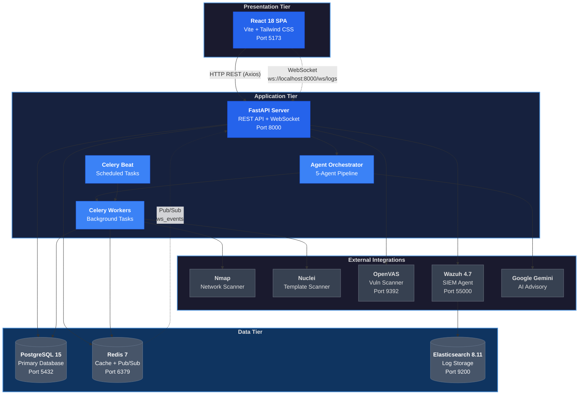
```mermaid
graph TB
    subgraph PresentationTier["<b>Presentation Tier</b>"]
        FE["<b>React 18 SPA</b><br/>Vite + Tailwind CSS<br/>Port 5173"]
    end

    subgraph ApplicationTier["<b>Application Tier</b>"]
        API["<b>FastAPI Server</b><br/>REST API + WebSocket<br/>Port 8000"]
        ORCH["<b>Agent Orchestrator</b><br/>5-Agent Pipeline"]
        CELERY["<b>Celery Workers</b><br/>Background Tasks"]
        BEAT["<b>Celery Beat</b><br/>Scheduled Tasks"]
    end

    subgraph DataTier["<b>Data Tier</b>"]
        PG[("<b>PostgreSQL 15</b><br/>Primary Database<br/>Port 5432")]
        REDIS[("<b>Redis 7</b><br/>Cache + Pub/Sub<br/>Port 6379")]
        ES[("<b>Elasticsearch 8.11</b><br/>Log Storage<br/>Port 9200")]
    end

    subgraph ExternalIntegrations["<b>External Integrations</b>"]
        NMAP["<b>Nmap</b><br/>Network Scanner"]
        NUCLEI["<b>Nuclei</b><br/>Template Scanner"]
        OPENVAS["<b>OpenVAS</b><br/>Vuln Scanner<br/>Port 9392"]
        WAZUH["<b>Wazuh 4.7</b><br/>SIEM Agent<br/>Port 55000"]
        GEMINI["<b>Google Gemini</b><br/>AI Advisory"]
    end

    FE -- "HTTP REST (Axios)" --> API
    FE -. "WebSocket<br/>ws://localhost:8000/ws/logs" .-> API
    API --> ORCH
    ORCH --> CELERY
    BEAT --> CELERY
    API --> PG
    API --> REDIS
    CELERY --> PG
    CELERY --> REDIS
    CELERY --> NMAP
    CELERY --> NUCLEI
    API --> OPENVAS
    API --> WAZUH
    ORCH --> GEMINI
    WAZUH --> ES
    REDIS -. "Pub/Sub<br/>ws_events" .-> API

    style PresentationTier fill:#1a1a2e,stroke:#4a90d9,stroke-width:2px,color:#e0e0e0
    style ApplicationTier fill:#16213e,stroke:#4a90d9,stroke-width:2px,color:#e0e0e0
    style DataTier fill:#0f3460,stroke:#4a90d9,stroke-width:2px,color:#e0e0e0
    style ExternalIntegrations fill:#1a1a2e,stroke:#4a90d9,stroke-width:2px,color:#e0e0e0
    style FE fill:#2563eb,stroke:#1d4ed8,color:#fff
    style API fill:#2563eb,stroke:#1d4ed8,color:#fff
    style ORCH fill:#3b82f6,stroke:#2563eb,color:#fff
    style CELERY fill:#3b82f6,stroke:#2563eb,color:#fff
    style BEAT fill:#3b82f6,stroke:#2563eb,color:#fff
    style PG fill:#475569,stroke:#64748b,color:#fff
    style REDIS fill:#475569,stroke:#64748b,color:#fff
    style ES fill:#475569,stroke:#64748b,color:#fff
    style NMAP fill:#374151,stroke:#6b7280,color:#e0e0e0
    style NUCLEI fill:#374151,stroke:#6b7280,color:#e0e0e0
    style OPENVAS fill:#374151,stroke:#6b7280,color:#e0e0e0
    style WAZUH fill:#374151,stroke:#6b7280,color:#e0e0e0
    style GEMINI fill:#374151,stroke:#6b7280,color:#e0e0e0
```

**Figure 3.1:** *High-Level System Architecture Diagram — Three-tier client-server architecture showing the React presentation tier, FastAPI application tier with agent orchestration and Celery workers, data tier (PostgreSQL, Redis, Elasticsearch), and external integrations (Nmap, Nuclei, OpenVAS, Wazuh, Google Gemini). All services are orchestrated via Docker Compose.*

---

### Figure 3.2

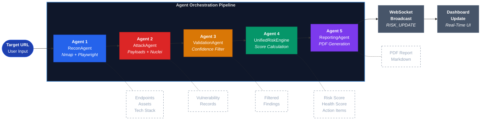
```mermaid
flowchart LR
    INPUT(["<b>Target URL</b><br/>User Input"]) --> A1

    subgraph Pipeline["<b>Agent Orchestration Pipeline</b>"]
        direction LR
        A1["<b>Agent 1</b><br/>ReconAgent<br/><i>Nmap + Playwright</i>"]
        A2["<b>Agent 2</b><br/>AttackAgent<br/><i>Payloads + Nuclei</i>"]
        A3["<b>Agent 3</b><br/>ValidationAgent<br/><i>Confidence Filter</i>"]
        A4["<b>Agent 4</b><br/>UnifiedRiskEngine<br/><i>Score Calculation</i>"]
        A5["<b>Agent 5</b><br/>ReportingAgent<br/><i>PDF Generation</i>"]

        A1 --> A2 --> A3 --> A4 --> A5
    end

    A5 --> WS["<b>WebSocket<br/>Broadcast</b><br/><i>RISK_UPDATE</i>"]
    WS --> DASH["<b>Dashboard<br/>Update</b><br/><i>Real-Time UI</i>"]

    A1 -.- D1["Endpoints<br/>Assets<br/>Tech Stack"]
    A2 -.- D2["Vulnerability<br/>Records"]
    A3 -.- D3["Filtered<br/>Findings"]
    A4 -.- D4["Risk Score<br/>Health Score<br/>Action Items"]
    A5 -.- D5["PDF Report<br/>Markdown"]

    style INPUT fill:#1e40af,stroke:#1d4ed8,color:#fff
    style A1 fill:#2563eb,stroke:#1d4ed8,color:#fff
    style A2 fill:#dc2626,stroke:#b91c1c,color:#fff
    style A3 fill:#d97706,stroke:#b45309,color:#fff
    style A4 fill:#059669,stroke:#047857,color:#fff
    style A5 fill:#7c3aed,stroke:#6d28d9,color:#fff
    style WS fill:#475569,stroke:#64748b,color:#fff
    style DASH fill:#475569,stroke:#64748b,color:#fff
    style Pipeline fill:#0f172a,stroke:#4a90d9,stroke-width:2px,color:#e0e0e0
    style D1 fill:none,stroke:#64748b,stroke-dasharray:5 5,color:#94a3b8
    style D2 fill:none,stroke:#64748b,stroke-dasharray:5 5,color:#94a3b8
    style D3 fill:none,stroke:#64748b,stroke-dasharray:5 5,color:#94a3b8
    style D4 fill:none,stroke:#64748b,stroke-dasharray:5 5,color:#94a3b8
    style D5 fill:none,stroke:#64748b,stroke-dasharray:5 5,color:#94a3b8
```

**Figure 3.2:** *Agent Orchestration Pipeline Flowchart — Sequential five-agent pipeline showing the deterministic execution flow from target input through reconnaissance (Nmap + Playwright), attack simulation (payloads + Nuclei), validation (confidence filtering), risk scoring (UnifiedRiskEngine), and report generation, culminating in a WebSocket broadcast to the real-time dashboard.*

---

### Figure 3.3

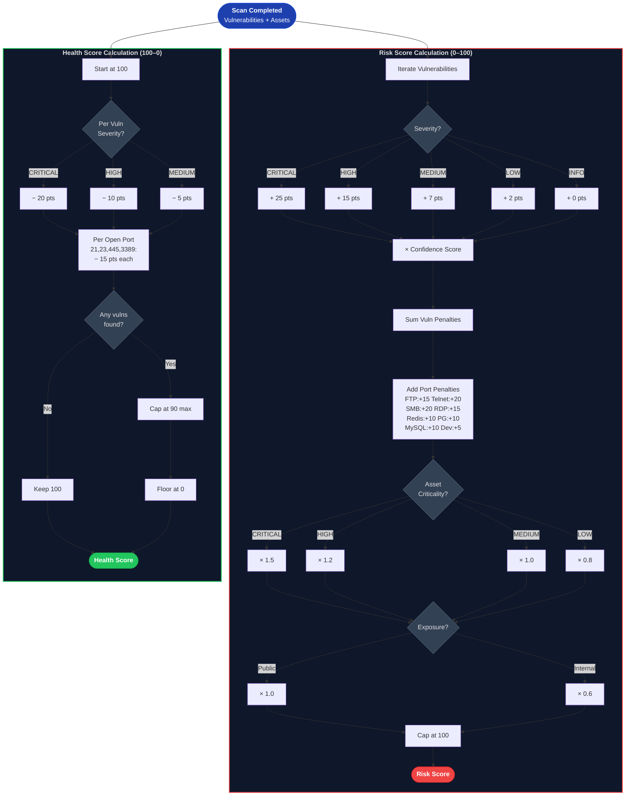
```mermaid
flowchart TB
    START(["<b>Scan Completed</b><br/>Vulnerabilities + Assets"]) --> RS_START

    subgraph RiskScore["<b>Risk Score Calculation (0–100)</b>"]
        RS_START["Iterate Vulnerabilities"] --> SEV{"Severity?"}
        SEV -->|CRITICAL| W1["+ 25 pts"]
        SEV -->|HIGH| W2["+ 15 pts"]
        SEV -->|MEDIUM| W3["+ 7 pts"]
        SEV -->|LOW| W4["+ 2 pts"]
        SEV -->|INFO| W5["+ 0 pts"]
        W1 --> CONF["× Confidence Score"]
        W2 --> CONF
        W3 --> CONF
        W4 --> CONF
        W5 --> CONF
        CONF --> SUM1["Sum Vuln Penalties"]

        SUM1 --> PORT["Add Port Penalties<br/>FTP:+15 Telnet:+20<br/>SMB:+20 RDP:+15<br/>Redis:+10 PG:+10<br/>MySQL:+10 Dev:+5"]
        PORT --> ASSET{"Asset<br/>Criticality?"}
        ASSET -->|CRITICAL| M1["× 1.5"]
        ASSET -->|HIGH| M2["× 1.2"]
        ASSET -->|MEDIUM| M3["× 1.0"]
        ASSET -->|LOW| M4["× 0.8"]
        M1 --> EXP{"Exposure?"}
        M2 --> EXP
        M3 --> EXP
        M4 --> EXP
        EXP -->|Public| E1["× 1.0"]
        EXP -->|Internal| E2["× 0.6"]
        E1 --> CAP["Cap at 100"]
        E2 --> CAP
        CAP --> RS_OUT(["<b>Risk Score</b>"])
    end

    START --> HS_START

    subgraph HealthScore["<b>Health Score Calculation (100–0)</b>"]
        HS_START["Start at 100"] --> HSEV{"Per Vuln<br/>Severity?"}
        HSEV -->|CRITICAL| HD1["− 20 pts"]
        HSEV -->|HIGH| HD2["− 10 pts"]
        HSEV -->|MEDIUM| HD3["− 5 pts"]
        HD1 --> HPORT["Per Open Port<br/>21,23,445,3389:<br/>− 15 pts each"]
        HD2 --> HPORT
        HD3 --> HPORT
        HPORT --> HCAP{"Any vulns<br/>found?"}
        HCAP -->|Yes| HC90["Cap at 90 max"]
        HCAP -->|No| HFLOOR["Keep 100"]
        HC90 --> HMIN["Floor at 0"]
        HFLOOR --> HS_OUT(["<b>Health Score</b>"])
        HMIN --> HS_OUT
    end

    style START fill:#1e40af,stroke:#1d4ed8,color:#fff
    style RiskScore fill:#0f172a,stroke:#ef4444,stroke-width:2px,color:#e0e0e0
    style HealthScore fill:#0f172a,stroke:#22c55e,stroke-width:2px,color:#e0e0e0
    style RS_OUT fill:#ef4444,stroke:#dc2626,color:#fff
    style HS_OUT fill:#22c55e,stroke:#16a34a,color:#fff
    style SEV fill:#334155,stroke:#64748b,color:#e0e0e0
    style ASSET fill:#334155,stroke:#64748b,color:#e0e0e0
    style EXP fill:#334155,stroke:#64748b,color:#e0e0e0
    style HSEV fill:#334155,stroke:#64748b,color:#e0e0e0
    style HCAP fill:#334155,stroke:#64748b,color:#e0e0e0
```

**Figure 3.3:** *UnifiedRiskEngine Calculation Logic — Dual-path scoring flowchart showing (left) the Risk Score formula aggregating CVSS-weighted severity penalties multiplied by confidence, port exposure penalties, asset criticality multipliers, and network exposure modifiers, capped at 100; and (right) the Health Score with fixed deductions per severity level and high-risk port, capped at 90 if any vulnerabilities exist, floored at 0.*

---

### Figure 3.4

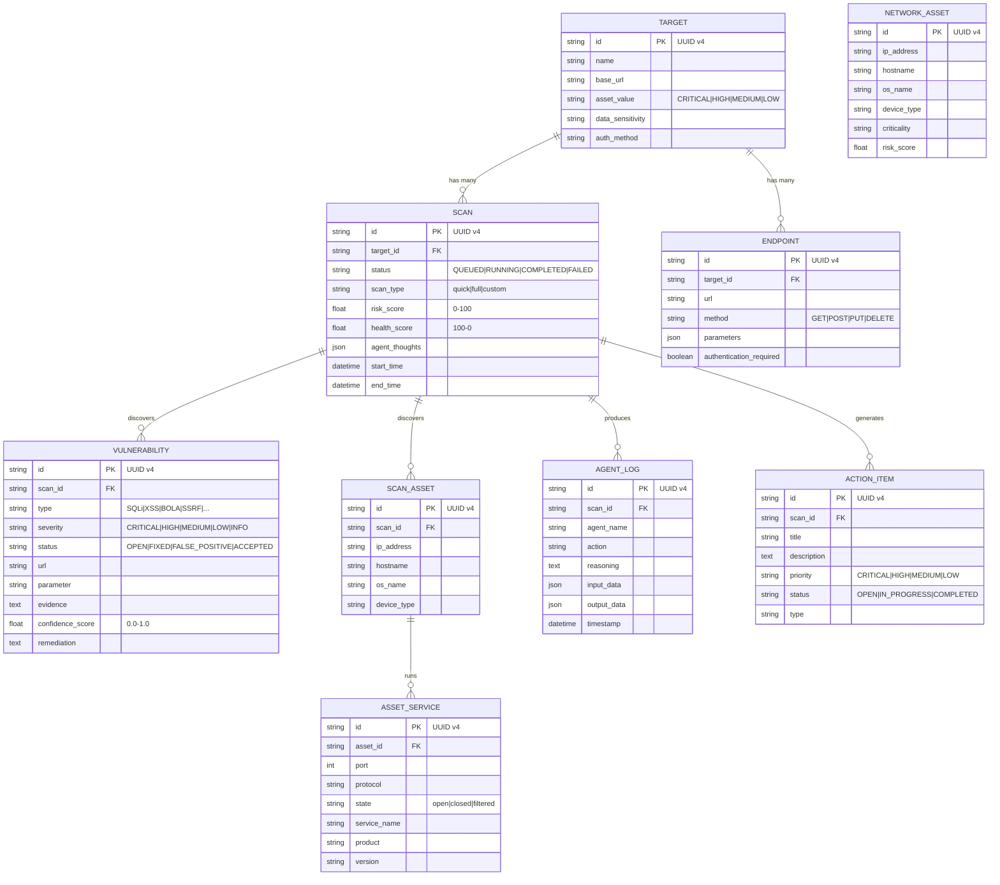
```mermaid
erDiagram
    TARGET {
        string id PK "UUID v4"
        string name
        string base_url
        string asset_value "CRITICAL|HIGH|MEDIUM|LOW"
        string data_sensitivity
        string auth_method
    }

    SCAN {
        string id PK "UUID v4"
        string target_id FK
        string status "QUEUED|RUNNING|COMPLETED|FAILED"
        string scan_type "quick|full|custom"
        float risk_score "0-100"
        float health_score "100-0"
        json agent_thoughts
        datetime start_time
        datetime end_time
    }

    VULNERABILITY {
        string id PK "UUID v4"
        string scan_id FK
        string type "SQLi|XSS|BOLA|SSRF|..."
        string severity "CRITICAL|HIGH|MEDIUM|LOW|INFO"
        string status "OPEN|FIXED|FALSE_POSITIVE|ACCEPTED"
        string url
        string parameter
        text evidence
        float confidence_score "0.0-1.0"
        text remediation
    }

    SCAN_ASSET {
        string id PK "UUID v4"
        string scan_id FK
        string ip_address
        string hostname
        string os_name
        string device_type
    }

    ASSET_SERVICE {
        string id PK "UUID v4"
        string asset_id FK
        int port
        string protocol
        string state "open|closed|filtered"
        string service_name
        string product
        string version
    }

    AGENT_LOG {
        string id PK "UUID v4"
        string scan_id FK
        string agent_name
        string action
        text reasoning
        json input_data
        json output_data
        datetime timestamp
    }

    ENDPOINT {
        string id PK "UUID v4"
        string target_id FK
        string url
        string method "GET|POST|PUT|DELETE"
        json parameters
        boolean authentication_required
    }

    ACTION_ITEM {
        string id PK "UUID v4"
        string scan_id FK
        string title
        text description
        string priority "CRITICAL|HIGH|MEDIUM|LOW"
        string status "OPEN|IN_PROGRESS|COMPLETED"
        string type
    }

    NETWORK_ASSET {
        string id PK "UUID v4"
        string ip_address
        string hostname
        string os_name
        string device_type
        string criticality
        float risk_score
    }

    TARGET ||--o{ SCAN : "has many"
    TARGET ||--o{ ENDPOINT : "has many"
    SCAN ||--o{ VULNERABILITY : "discovers"
    SCAN ||--o{ SCAN_ASSET : "discovers"
    SCAN ||--o{ AGENT_LOG : "produces"
    SCAN ||--o{ ACTION_ITEM : "generates"
    SCAN_ASSET ||--o{ ASSET_SERVICE : "runs"
```

**Figure 3.4:** *Entity-Relationship Diagram (ERD) — Nine-entity relational schema showing Target as the root entity with one-to-many relationships to Scan and Endpoint; Scan aggregating Vulnerability, ScanAsset, AgentLog, and ActionItem records; and ScanAsset linking to AssetService for port-level detail. All primary keys use UUID v4 strings.*

---

### Figure 3.5

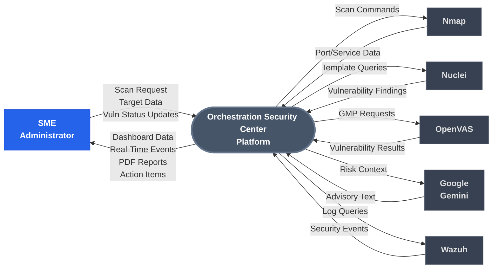
```mermaid
flowchart LR
    ADMIN["<b>SME<br/>Administrator</b>"]
    SYSTEM(["<b>Orchestration Security Center<br/>Platform</b>"])
    NMAP_E["<b>Nmap</b>"]
    NUCLEI_E["<b>Nuclei</b>"]
    OPENVAS_E["<b>OpenVAS</b>"]
    GEMINI_E["<b>Google<br/>Gemini</b>"]
    WAZUH_E["<b>Wazuh</b>"]

    ADMIN -- "Scan Request<br/>Target Data<br/>Vuln Status Updates" --> SYSTEM
    SYSTEM -- "Dashboard Data<br/>Real-Time Events<br/>PDF Reports<br/>Action Items" --> ADMIN

    SYSTEM -- "Scan Commands" --> NMAP_E
    NMAP_E -- "Port/Service Data" --> SYSTEM

    SYSTEM -- "Template Queries" --> NUCLEI_E
    NUCLEI_E -- "Vulnerability Findings" --> SYSTEM

    SYSTEM -- "GMP Requests" --> OPENVAS_E
    OPENVAS_E -- "Vulnerability Results" --> SYSTEM

    SYSTEM -- "Risk Context" --> GEMINI_E
    GEMINI_E -- "Advisory Text" --> SYSTEM

    SYSTEM -- "Log Queries" --> WAZUH_E
    WAZUH_E -- "Security Events" --> SYSTEM

    style ADMIN fill:#2563eb,stroke:#1d4ed8,color:#fff
    style SYSTEM fill:#475569,stroke:#64748b,color:#fff,stroke-width:3px
    style NMAP_E fill:#374151,stroke:#6b7280,color:#e0e0e0
    style NUCLEI_E fill:#374151,stroke:#6b7280,color:#e0e0e0
    style OPENVAS_E fill:#374151,stroke:#6b7280,color:#e0e0e0
    style GEMINI_E fill:#374151,stroke:#6b7280,color:#e0e0e0
    style WAZUH_E fill:#374151,stroke:#6b7280,color:#e0e0e0
```

**Figure 3.5:** *Data Flow Diagram — Level 0 (Context Diagram) — The Orchestration Security Center system represented as a single process interacting with the SME Administrator (primary external entity) and five tool/service entities (Nmap, Nuclei, OpenVAS, Google Gemini, Wazuh), showing bidirectional data flows for scan requests, vulnerability findings, advisory text, and security events.*

---

### Figure 3.6

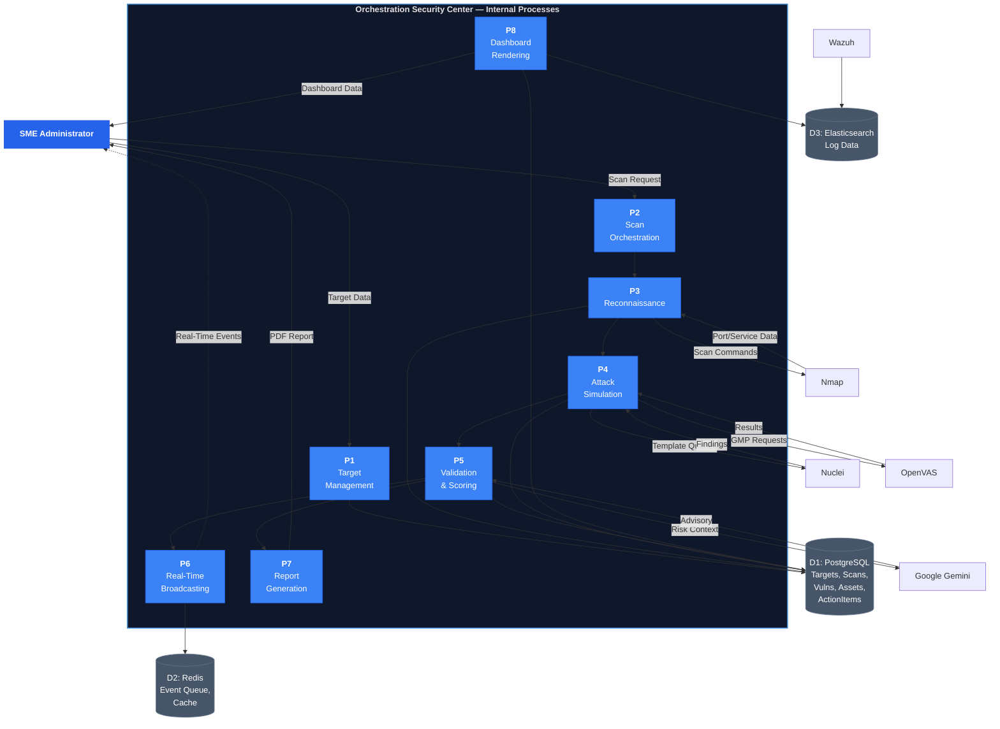
```mermaid
flowchart TB
    ADMIN["<b>SME Administrator</b>"]

    subgraph System["<b>Orchestration Security Center — Internal Processes</b>"]
        P1["<b>P1</b><br/>Target<br/>Management"]
        P2["<b>P2</b><br/>Scan<br/>Orchestration"]
        P3["<b>P3</b><br/>Reconnaissance"]
        P4["<b>P4</b><br/>Attack<br/>Simulation"]
        P5["<b>P5</b><br/>Validation<br/>& Scoring"]
        P6["<b>P6</b><br/>Real-Time<br/>Broadcasting"]
        P7["<b>P7</b><br/>Report<br/>Generation"]
        P8["<b>P8</b><br/>Dashboard<br/>Rendering"]
    end

    D1[("D1: PostgreSQL<br/>Targets, Scans,<br/>Vulns, Assets,<br/>ActionItems")]
    D2[("D2: Redis<br/>Event Queue,<br/>Cache")]
    D3[("D3: Elasticsearch<br/>Log Data")]

    NMAP_E["Nmap"]
    NUCLEI_E["Nuclei"]
    OPENVAS_E["OpenVAS"]
    GEMINI_E["Google Gemini"]
    WAZUH_E["Wazuh"]

    ADMIN -- "Target Data" --> P1
    ADMIN -- "Scan Request" --> P2
    P8 -- "Dashboard Data" --> ADMIN
    P7 -- "PDF Report" --> ADMIN
    P6 -. "Real-Time Events" .-> ADMIN

    P1 --> D1
    P2 --> P3
    P3 --> P4
    P4 --> P5
    P5 --> P7
    P5 --> P6

    P3 -- "Scan Commands" --> NMAP_E
    NMAP_E -- "Port/Service Data" --> P3
    P4 -- "Template Queries" --> NUCLEI_E
    NUCLEI_E -- "Findings" --> P4
    P4 -- "GMP Requests" --> OPENVAS_E
    OPENVAS_E -- "Results" --> P4
    P5 -- "Risk Context" --> GEMINI_E
    GEMINI_E -- "Advisory" --> P5

    P3 --> D1
    P4 --> D1
    P5 --> D1
    P6 --> D2
    P8 --> D1
    WAZUH_E --> D3
    P8 --> D3

    style ADMIN fill:#2563eb,stroke:#1d4ed8,color:#fff
    style System fill:#0f172a,stroke:#4a90d9,stroke-width:2px,color:#e0e0e0
    style P1 fill:#3b82f6,stroke:#2563eb,color:#fff
    style P2 fill:#3b82f6,stroke:#2563eb,color:#fff
    style P3 fill:#3b82f6,stroke:#2563eb,color:#fff
    style P4 fill:#3b82f6,stroke:#2563eb,color:#fff
    style P5 fill:#3b82f6,stroke:#2563eb,color:#fff
    style P6 fill:#3b82f6,stroke:#2563eb,color:#fff
    style P7 fill:#3b82f6,stroke:#2563eb,color:#fff
    style P8 fill:#3b82f6,stroke:#2563eb,color:#fff
    style D1 fill:#475569,stroke:#64748b,color:#fff
    style D2 fill:#475569,stroke:#64748b,color:#fff
    style D3 fill:#475569,stroke:#64748b,color:#fff
```

**Figure 3.6:** *Data Flow Diagram — Level 1 (Detailed) — Decomposition of the Orchestration Security Center system into eight processes: P1 (Target Management), P2 (Scan Orchestration), P3 (Reconnaissance), P4 (Attack Simulation), P5 (Validation & Scoring), P6 (Real-Time Broadcasting), P7 (Report Generation), P8 (Dashboard Rendering); with three data stores: D1 (PostgreSQL), D2 (Redis), D3 (Elasticsearch).*

---

### Figure 3.7

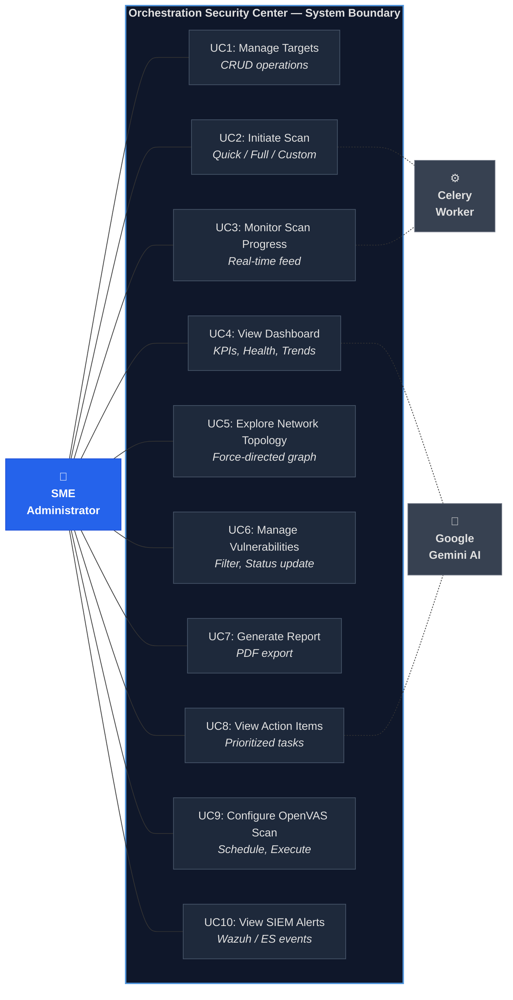
```mermaid
flowchart LR
    ACTOR["👤<br/><b>SME<br/>Administrator</b>"]

    subgraph UseCases["<b>Orchestration Security Center — System Boundary</b>"]
        UC1["UC1: Manage Targets<br/><i>CRUD operations</i>"]
        UC2["UC2: Initiate Scan<br/><i>Quick / Full / Custom</i>"]
        UC3["UC3: Monitor Scan Progress<br/><i>Real-time feed</i>"]
        UC4["UC4: View Dashboard<br/><i>KPIs, Health, Trends</i>"]
        UC5["UC5: Explore Network Topology<br/><i>Force-directed graph</i>"]
        UC6["UC6: Manage Vulnerabilities<br/><i>Filter, Status update</i>"]
        UC7["UC7: Generate Report<br/><i>PDF export</i>"]
        UC8["UC8: View Action Items<br/><i>Prioritized tasks</i>"]
        UC9["UC9: Configure OpenVAS Scan<br/><i>Schedule, Execute</i>"]
        UC10["UC10: View SIEM Alerts<br/><i>Wazuh / ES events</i>"]
    end

    CELERY["⚙️<br/><b>Celery<br/>Worker</b>"]
    GEMINI["🤖<br/><b>Google<br/>Gemini AI</b>"]

    ACTOR --- UC1
    ACTOR --- UC2
    ACTOR --- UC3
    ACTOR --- UC4
    ACTOR --- UC5
    ACTOR --- UC6
    ACTOR --- UC7
    ACTOR --- UC8
    ACTOR --- UC9
    ACTOR --- UC10

    UC2 -.- CELERY
    UC3 -.- CELERY
    UC4 -.- GEMINI
    UC8 -.- GEMINI

    style ACTOR fill:#2563eb,stroke:#1d4ed8,color:#fff
    style CELERY fill:#374151,stroke:#6b7280,color:#e0e0e0
    style GEMINI fill:#374151,stroke:#6b7280,color:#e0e0e0
    style UseCases fill:#0f172a,stroke:#4a90d9,stroke-width:2px,color:#e0e0e0
    style UC1 fill:#1e293b,stroke:#475569,color:#e0e0e0
    style UC2 fill:#1e293b,stroke:#475569,color:#e0e0e0
    style UC3 fill:#1e293b,stroke:#475569,color:#e0e0e0
    style UC4 fill:#1e293b,stroke:#475569,color:#e0e0e0
    style UC5 fill:#1e293b,stroke:#475569,color:#e0e0e0
    style UC6 fill:#1e293b,stroke:#475569,color:#e0e0e0
    style UC7 fill:#1e293b,stroke:#475569,color:#e0e0e0
    style UC8 fill:#1e293b,stroke:#475569,color:#e0e0e0
    style UC9 fill:#1e293b,stroke:#475569,color:#e0e0e0
    style UC10 fill:#1e293b,stroke:#475569,color:#e0e0e0
```

**Figure 3.7:** *Use Case Diagram — System Actors and Interactions — The SME Administrator (primary actor) interacts with ten use cases spanning target management, scan orchestration, real-time monitoring, dashboard visualization, vulnerability management, reporting, and SIEM integration. Secondary actors include the Celery Worker (automated background processing) and Google Gemini AI (advisory generation).*

---

### Figure 3.8

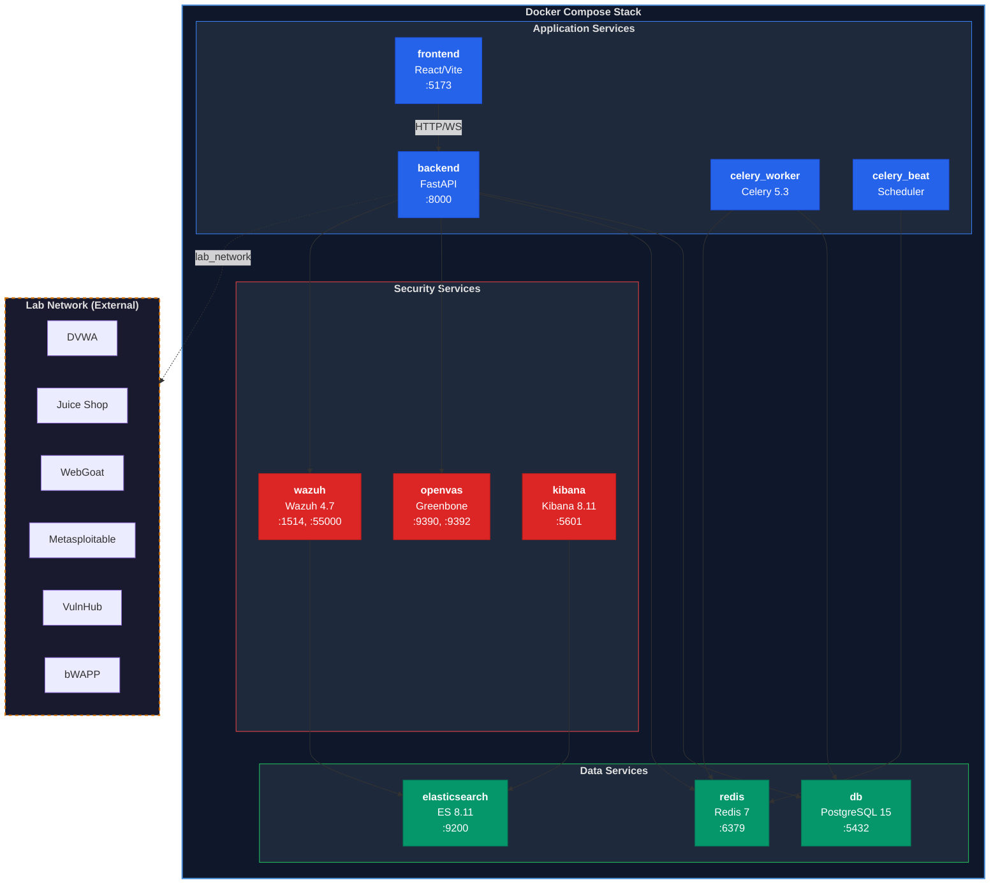
```mermaid
flowchart TB
    subgraph DockerCompose["<b>Docker Compose Stack</b>"]
        subgraph AppLayer["<b>Application Services</b>"]
            BE["<b>backend</b><br/>FastAPI<br/>:8000"]
            FE_S["<b>frontend</b><br/>React/Vite<br/>:5173"]
            CW["<b>celery_worker</b><br/>Celery 5.3"]
            CB["<b>celery_beat</b><br/>Scheduler"]
        end

        subgraph DataLayer["<b>Data Services</b>"]
            DB["<b>db</b><br/>PostgreSQL 15<br/>:5432"]
            RD["<b>redis</b><br/>Redis 7<br/>:6379"]
            EL["<b>elasticsearch</b><br/>ES 8.11<br/>:9200"]
        end

        subgraph SecurityLayer["<b>Security Services</b>"]
            OV["<b>openvas</b><br/>Greenbone<br/>:9390, :9392"]
            WZ["<b>wazuh</b><br/>Wazuh 4.7<br/>:1514, :55000"]
            KB["<b>kibana</b><br/>Kibana 8.11<br/>:5601"]
        end
    end

    subgraph LabNetwork["<b>Lab Network (External)</b>"]
        T1["DVWA"]
        T2["Juice Shop"]
        T3["WebGoat"]
        T4["Metasploitable"]
        T5["VulnHub"]
        T6["bWAPP"]
    end

    BE --> DB
    BE --> RD
    CW --> DB
    CW --> RD
    CB --> RD
    WZ --> EL
    KB --> EL
    BE --> OV
    BE --> WZ
    FE_S -- "HTTP/WS" --> BE
    BE -. "lab_network" .-> LabNetwork

    style DockerCompose fill:#0f172a,stroke:#4a90d9,stroke-width:2px,color:#e0e0e0
    style AppLayer fill:#1e293b,stroke:#3b82f6,stroke-width:1px,color:#e0e0e0
    style DataLayer fill:#1e293b,stroke:#22c55e,stroke-width:1px,color:#e0e0e0
    style SecurityLayer fill:#1e293b,stroke:#ef4444,stroke-width:1px,color:#e0e0e0
    style LabNetwork fill:#1a1a2e,stroke:#d97706,stroke-width:2px,stroke-dasharray:5 5,color:#e0e0e0
    style BE fill:#2563eb,stroke:#1d4ed8,color:#fff
    style FE_S fill:#2563eb,stroke:#1d4ed8,color:#fff
    style CW fill:#2563eb,stroke:#1d4ed8,color:#fff
    style CB fill:#2563eb,stroke:#1d4ed8,color:#fff
    style DB fill:#059669,stroke:#047857,color:#fff
    style RD fill:#059669,stroke:#047857,color:#fff
    style EL fill:#059669,stroke:#047857,color:#fff
    style OV fill:#dc2626,stroke:#b91c1c,color:#fff
    style WZ fill:#dc2626,stroke:#b91c1c,color:#fff
    style KB fill:#dc2626,stroke:#b91c1c,color:#fff
```

**Figure 3.8:** *Docker Compose Service Architecture — Ten containerized microservices organized into three layers: Application (FastAPI, React, Celery Worker, Celery Beat), Data (PostgreSQL, Redis, Elasticsearch), and Security (OpenVAS, Wazuh, Kibana). An external lab_network bridges the stack to six vulnerable target containers for testing.*

---

### Figure 3.9

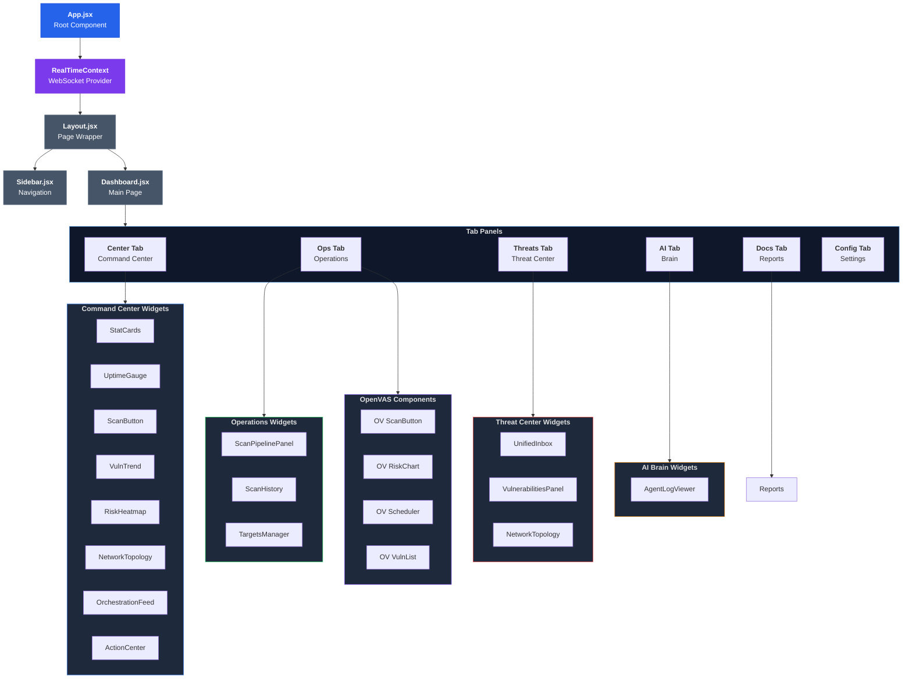
```mermaid
flowchart TB
    APP["<b>App.jsx</b><br/>Root Component"]
    LAYOUT["<b>Layout.jsx</b><br/>Page Wrapper"]
    SIDEBAR["<b>Sidebar.jsx</b><br/>Navigation"]
    DASH["<b>Dashboard.jsx</b><br/>Main Page"]
    RTC["<b>RealTimeContext</b><br/>WebSocket Provider"]

    subgraph Tabs["<b>Tab Panels</b>"]
        CENTER["<b>Center Tab</b><br/>Command Center"]
        OPS["<b>Ops Tab</b><br/>Operations"]
        THREATS["<b>Threats Tab</b><br/>Threat Center"]
        AI["<b>AI Tab</b><br/>Brain"]
        DOCS["<b>Docs Tab</b><br/>Reports"]
        CONFIG["<b>Config Tab</b><br/>Settings"]
    end

    subgraph CenterWidgets["<b>Command Center Widgets</b>"]
        SC["StatCards"]
        UG["UptimeGauge"]
        SB["ScanButton"]
        VT["VulnTrend"]
        RH["RiskHeatmap"]
        NT["NetworkTopology"]
        OF["OrchestrationFeed"]
        AC["ActionCenter"]
    end

    subgraph OpsWidgets["<b>Operations Widgets</b>"]
        SPP["ScanPipelinePanel"]
        SH["ScanHistory"]
        TM["TargetsManager"]
    end

    subgraph ThreatWidgets["<b>Threat Center Widgets</b>"]
        UI_SIEM["UnifiedInbox"]
        VP["VulnerabilitiesPanel"]
        NT2["NetworkTopology"]
    end

    subgraph AIWidgets["<b>AI Brain Widgets</b>"]
        ALV["AgentLogViewer"]
    end

    subgraph OVWidgets["<b>OpenVAS Components</b>"]
        OV_SB["OV ScanButton"]
        OV_RC["OV RiskChart"]
        OV_SCH["OV Scheduler"]
        OV_VL["OV VulnList"]
    end

    APP --> RTC
    RTC --> LAYOUT
    LAYOUT --> SIDEBAR
    LAYOUT --> DASH
    DASH --> Tabs
    CENTER --> CenterWidgets
    OPS --> OpsWidgets
    OPS --> OVWidgets
    THREATS --> ThreatWidgets
    AI --> AIWidgets
    DOCS --> REP["Reports"]

    style APP fill:#2563eb,stroke:#1d4ed8,color:#fff
    style RTC fill:#7c3aed,stroke:#6d28d9,color:#fff
    style LAYOUT fill:#475569,stroke:#64748b,color:#fff
    style DASH fill:#475569,stroke:#64748b,color:#fff
    style SIDEBAR fill:#475569,stroke:#64748b,color:#fff
    style Tabs fill:#0f172a,stroke:#4a90d9,stroke-width:1px,color:#e0e0e0
    style CenterWidgets fill:#1e293b,stroke:#3b82f6,stroke-width:1px,color:#e0e0e0
    style OpsWidgets fill:#1e293b,stroke:#22c55e,stroke-width:1px,color:#e0e0e0
    style ThreatWidgets fill:#1e293b,stroke:#ef4444,stroke-width:1px,color:#e0e0e0
    style AIWidgets fill:#1e293b,stroke:#d97706,stroke-width:1px,color:#e0e0e0
    style OVWidgets fill:#1e293b,stroke:#8b5cf6,stroke-width:1px,color:#e0e0e0
```

**Figure 3.9:** *Frontend Component Hierarchy — React component tree showing App.jsx as root, wrapping the RealTimeContext provider (WebSocket state), Layout with Sidebar navigation, and Dashboard page containing six tab panels (Center, Ops, Threats, AI, Docs, Config), each resolving to specialized widget components for KPI display, network topology, scan orchestration, and vulnerability management.*

---

### Figure 3.10

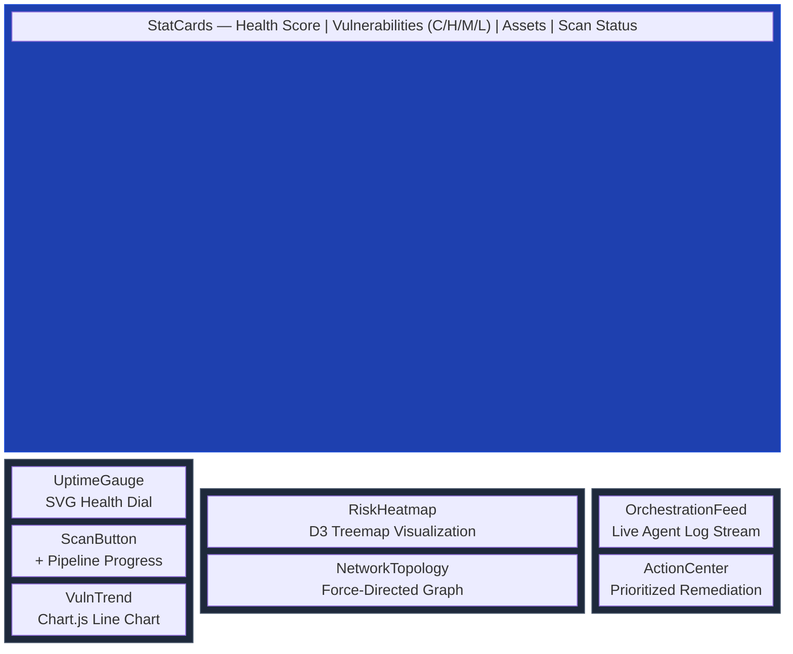
```mermaid
block-beta
    columns 12

    block:header:12
        columns 12
        h1["StatCards — Health Score | Vulnerabilities (C/H/M/L) | Assets | Scan Status"]:12
    end

    block:left:3
        columns 1
        l1["UptimeGauge<br/>SVG Health Dial"]
        l2["ScanButton<br/>+ Pipeline Progress"]
        l3["VulnTrend<br/>Chart.js Line Chart"]
    end

    block:center_col:6
        columns 1
        c1["RiskHeatmap<br/>D3 Treemap Visualization"]
        c2["NetworkTopology<br/>Force-Directed Graph"]
    end

    block:right:3
        columns 1
        r1["OrchestrationFeed<br/>Live Agent Log Stream"]
        r2["ActionCenter<br/>Prioritized Remediation"]
    end

    style header fill:#1e40af,stroke:#1d4ed8,color:#fff
    style left fill:#1e293b,stroke:#475569,color:#e0e0e0
    style center_col fill:#1e293b,stroke:#475569,color:#e0e0e0
    style right fill:#1e293b,stroke:#475569,color:#e0e0e0
```

**Figure 3.10:** *Dashboard UI Wireframe — Command Center Tab — Three-column responsive layout: StatCards spanning full width at top; left rail containing UptimeGauge, ScanButton with pipeline indicator, and VulnTrend chart; center panel with RiskHeatmap treemap and NetworkTopology force graph; right rail with OrchestrationFeed (live agent actions) and ActionCenter (prioritized remediation queue).*

---

### Figure 3.11

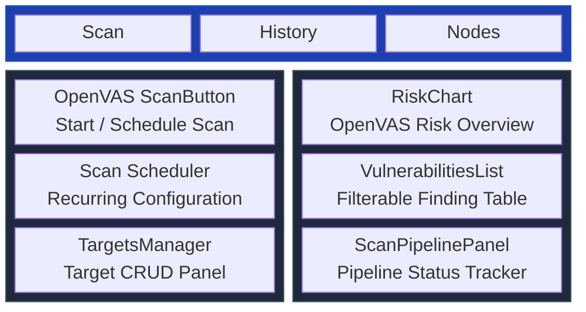
```mermaid
block-beta
    columns 12

    block:subtabs:12
        columns 3
        st1["Scan"]
        st2["History"]
        st3["Nodes"]
    end

    block:scan_left:6
        columns 1
        sl1["OpenVAS ScanButton<br/>Start / Schedule Scan"]
        sl2["Scan Scheduler<br/>Recurring Configuration"]
        sl3["TargetsManager<br/>Target CRUD Panel"]
    end

    block:scan_right:6
        columns 1
        sr1["RiskChart<br/>OpenVAS Risk Overview"]
        sr2["VulnerabilitiesList<br/>Filterable Finding Table"]
        sr3["ScanPipelinePanel<br/>Pipeline Status Tracker"]
    end

    style subtabs fill:#1e40af,stroke:#1d4ed8,color:#fff
    style scan_left fill:#1e293b,stroke:#475569,color:#e0e0e0
    style scan_right fill:#1e293b,stroke:#475569,color:#e0e0e0
```

**Figure 3.11:** *Dashboard UI Wireframe — Operations Tab — Sub-tab navigation bar (Scan / History / Nodes) with two-column Scanner view: left column containing OpenVAS ScanButton, Scheduler, and TargetsManager; right column containing RiskChart, filterable VulnerabilitiesList, and ScanPipelinePanel status tracker.*

---

### Figure 3.12

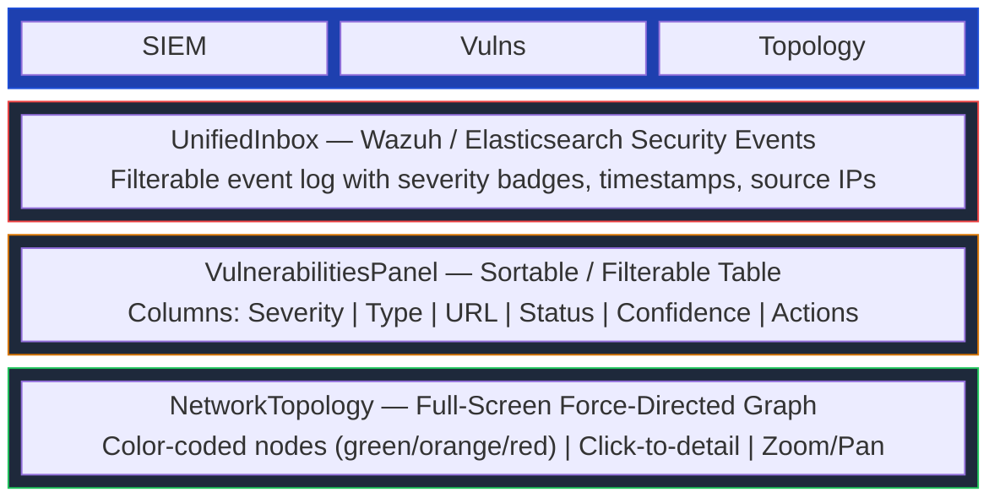
```mermaid
block-beta
    columns 12

    block:subtabs:12
        columns 3
        st1["SIEM"]
        st2["Vulns"]
        st3["Topology"]
    end

    block:siem_view:12
        columns 1
        sv1["UnifiedInbox — Wazuh / Elasticsearch Security Events<br/>Filterable event log with severity badges, timestamps, source IPs"]
    end

    block:vulns_view:12
        columns 1
        vv1["VulnerabilitiesPanel — Sortable / Filterable Table<br/>Columns: Severity | Type | URL | Status | Confidence | Actions"]
    end

    block:topo_view:12
        columns 1
        tv1["NetworkTopology — Full-Screen Force-Directed Graph<br/>Color-coded nodes (green/orange/red) | Click-to-detail | Zoom/Pan"]
    end

    style subtabs fill:#1e40af,stroke:#1d4ed8,color:#fff
    style siem_view fill:#1e293b,stroke:#ef4444,color:#e0e0e0
    style vulns_view fill:#1e293b,stroke:#d97706,color:#e0e0e0
    style topo_view fill:#1e293b,stroke:#22c55e,color:#e0e0e0
```

**Figure 3.12:** *Dashboard UI Wireframe — Threat Center Tab — Sub-tab navigation bar (SIEM / Vulns / Topology) with three full-width views: UnifiedInbox displaying Wazuh/Elasticsearch security events; VulnerabilitiesPanel with sortable, filterable vulnerability table; and full-screen NetworkTopology force-directed graph with risk-color-coded nodes and interactive exploration.*

---

## Chapter 4 — Implementation

---

### Figure 4.1

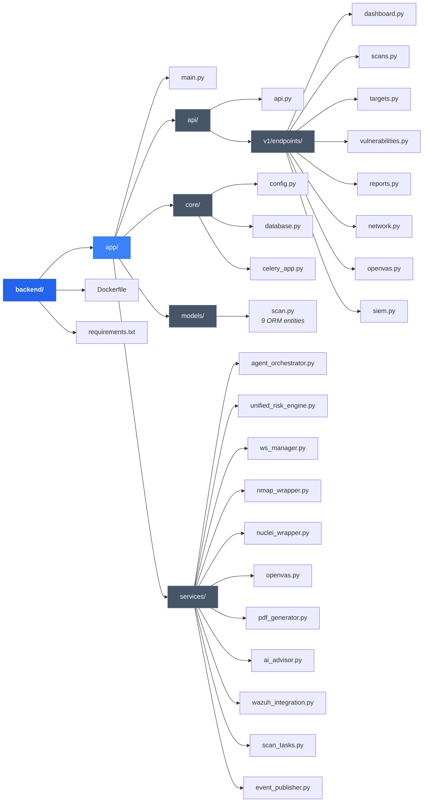
```mermaid
flowchart LR
    BE["<b>backend/</b>"] --> APP["app/"]
    BE --> DF["Dockerfile"]
    BE --> REQ["requirements.txt"]

    APP --> MAIN["main.py"]
    APP --> API_DIR["api/"]
    APP --> CORE["core/"]
    APP --> MODELS["models/"]
    APP --> SERVICES["services/"]

    API_DIR --> API_PY["api.py"]
    API_DIR --> V1["v1/endpoints/"]

    V1 --> EP_DASH["dashboard.py"]
    V1 --> EP_SCAN["scans.py"]
    V1 --> EP_TARG["targets.py"]
    V1 --> EP_VULN["vulnerabilities.py"]
    V1 --> EP_REP["reports.py"]
    V1 --> EP_NET["network.py"]
    V1 --> EP_OV["openvas.py"]
    V1 --> EP_SIEM["siem.py"]

    CORE --> CFG["config.py"]
    CORE --> DB_CORE["database.py"]
    CORE --> CEL["celery_app.py"]

    MODELS --> SCAN_M["scan.py<br/><i>9 ORM entities</i>"]

    SERVICES --> AO["agent_orchestrator.py"]
    SERVICES --> URE["unified_risk_engine.py"]
    SERVICES --> WSM["ws_manager.py"]
    SERVICES --> NW["nmap_wrapper.py"]
    SERVICES --> NUC["nuclei_wrapper.py"]
    SERVICES --> OVS["openvas.py"]
    SERVICES --> PDF["pdf_generator.py"]
    SERVICES --> AIA["ai_advisor.py"]
    SERVICES --> WI["wazuh_integration.py"]
    SERVICES --> ST["scan_tasks.py"]
    SERVICES --> EP_PUB["event_publisher.py"]

    style BE fill:#2563eb,stroke:#1d4ed8,color:#fff
    style APP fill:#3b82f6,stroke:#2563eb,color:#fff
    style API_DIR fill:#475569,stroke:#64748b,color:#fff
    style V1 fill:#475569,stroke:#64748b,color:#fff
    style CORE fill:#475569,stroke:#64748b,color:#fff
    style MODELS fill:#475569,stroke:#64748b,color:#fff
    style SERVICES fill:#475569,stroke:#64748b,color:#fff
```

**Figure 4.1:** *Backend Project Directory Structure — Modular FastAPI application organized into four layers: api/ (8 endpoint modules under v1/endpoints/), core/ (configuration, database, Celery), models/ (9 SQLAlchemy ORM entities), and services/ (12 service modules including agent orchestrator, risk engine, scanner wrappers, and event publisher).*

---

### Figure 4.2

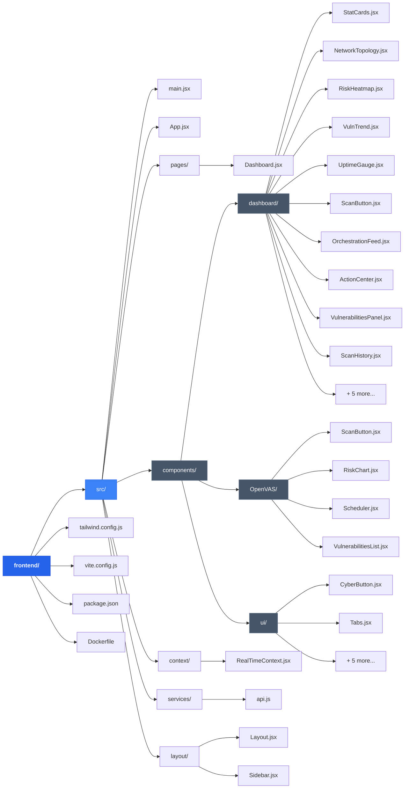
```mermaid
flowchart LR
    FE["<b>frontend/</b>"] --> SRC["src/"]
    FE --> TW["tailwind.config.js"]
    FE --> VITE["vite.config.js"]
    FE --> PKG["package.json"]
    FE --> DF2["Dockerfile"]

    SRC --> MAIN_JSX["main.jsx"]
    SRC --> APP_JSX["App.jsx"]
    SRC --> PAGES["pages/"]
    SRC --> COMP["components/"]
    SRC --> CTX["context/"]
    SRC --> SVC["services/"]
    SRC --> LAY["layout/"]

    PAGES --> DASH_P["Dashboard.jsx"]

    COMP --> COMP_DASH["dashboard/"]
    COMP --> COMP_OV["OpenVAS/"]
    COMP --> COMP_UI["ui/"]

    COMP_DASH --> CD1["StatCards.jsx"]
    COMP_DASH --> CD2["NetworkTopology.jsx"]
    COMP_DASH --> CD3["RiskHeatmap.jsx"]
    COMP_DASH --> CD4["VulnTrend.jsx"]
    COMP_DASH --> CD5["UptimeGauge.jsx"]
    COMP_DASH --> CD6["ScanButton.jsx"]
    COMP_DASH --> CD7["OrchestrationFeed.jsx"]
    COMP_DASH --> CD8["ActionCenter.jsx"]
    COMP_DASH --> CD9["VulnerabilitiesPanel.jsx"]
    COMP_DASH --> CD10["ScanHistory.jsx"]
    COMP_DASH --> CD11["+ 5 more..."]

    COMP_OV --> OV1["ScanButton.jsx"]
    COMP_OV --> OV2["RiskChart.jsx"]
    COMP_OV --> OV3["Scheduler.jsx"]
    COMP_OV --> OV4["VulnerabilitiesList.jsx"]

    COMP_UI --> UI1["CyberButton.jsx"]
    COMP_UI --> UI2["Tabs.jsx"]
    COMP_UI --> UI3["+ 5 more..."]

    CTX --> RTC_JSX["RealTimeContext.jsx"]
    SVC --> API_JS["api.js"]
    LAY --> LAY_JSX["Layout.jsx"]
    LAY --> SB_JSX["Sidebar.jsx"]

    style FE fill:#2563eb,stroke:#1d4ed8,color:#fff
    style SRC fill:#3b82f6,stroke:#2563eb,color:#fff
    style COMP fill:#475569,stroke:#64748b,color:#fff
    style COMP_DASH fill:#475569,stroke:#64748b,color:#fff
    style COMP_OV fill:#475569,stroke:#64748b,color:#fff
    style COMP_UI fill:#475569,stroke:#64748b,color:#fff
```

**Figure 4.2:** *Frontend Project Directory Structure — React/Vite application organized into pages/ (Dashboard), components/ (15+ dashboard widgets, 4 OpenVAS components, 7 reusable UI primitives), context/ (RealTimeContext WebSocket provider), services/ (Axios API layer), and layout/ (Layout wrapper + Sidebar navigation).*

---

### Figures 4.3 – 4.11: Application Screenshots

> **Note:** Figures 4.3 through 4.11 are live application screenshots captured from the running platform. These cannot be generated as Mermaid diagrams and must be obtained by capturing the actual UI. Below are the required screenshots with their formal captions for reference.

| Figure | Description | How to Capture |
|--------|-------------|----------------|
| **4.3** | Command Center Dashboard (Overview Tab) | Navigate to Center tab; capture full viewport |
| **4.4** | Network Topology Force Graph | Navigate to Threats > Topology; capture force graph |
| **4.5** | Risk Heatmap Treemap Visualization | Center tab, center panel; capture treemap widget |
| **4.6** | Scan Pipeline Progress Indicator | Initiate scan; capture 5-step pipeline bar |
| **4.7** | Agent Log Viewer (AI Brain Tab) | Navigate to AI tab; capture agent log entries |
| **4.8** | Vulnerability Detail Panel | Navigate to Threats > Vulns; expand a row |
| **4.9** | OpenVAS Scanner Integration | Navigate to Ops > Scan; capture OpenVAS panel |
| **4.10** | SIEM Unified Inbox | Navigate to Threats > SIEM; capture event list |
| **4.11** | PDF Report Export | Generate report; capture PDF preview or download |

**Figure 4.3:** *Screenshot — Command Center Dashboard showing StatCards (health score, vulnerability counts, asset count, scan status), UptimeGauge, RiskHeatmap, NetworkTopology, OrchestrationFeed, and ActionCenter in the three-column layout.*

**Figure 4.4:** *Screenshot — Network Topology Force Graph displaying discovered network assets as risk-color-coded nodes (green, orange, red) with a central hub and interactive zoom/pan/click-to-detail functionality.*

**Figure 4.5:** *Screenshot — Risk Heatmap Treemap Visualization showing vulnerability severity distribution as proportionally sized, color-coded rectangles (red=critical, orange=high, yellow=medium, cyan=low).*

**Figure 4.6:** *Screenshot — Scan Pipeline Progress Indicator displaying the five-step agent execution sequence (Queued, Nmap, Nuclei, Risk Engine, AI Advisory) with visual state transitions (pending, active with pulse, completed with checkmark).*

**Figure 4.7:** *Screenshot — Agent Log Viewer (AI Brain Tab) showing chronological agent actions with agent type icons, timestamps, action descriptions, and reasoning fields.*

**Figure 4.8:** *Screenshot — Vulnerability Detail Panel displaying vulnerability type, severity badge, affected URL, parameter, evidence payload, confidence score, and AI-generated remediation guidance.*

**Figure 4.9:** *Screenshot — OpenVAS Scanner Integration showing scan initiation controls, scan scheduler, risk overview chart, and vulnerability results list.*

**Figure 4.10:** *Screenshot — SIEM Unified Inbox displaying Wazuh/Elasticsearch security events with severity badges, timestamps, source IP addresses, and event descriptions.*

**Figure 4.11:** *Screenshot — PDF Report Export showing the generated security assessment report with executive summary, vulnerability details, risk scores, and remediation recommendations.*

---

## Chapter 5 — Testing & Evaluation

---

### Figure 5.1

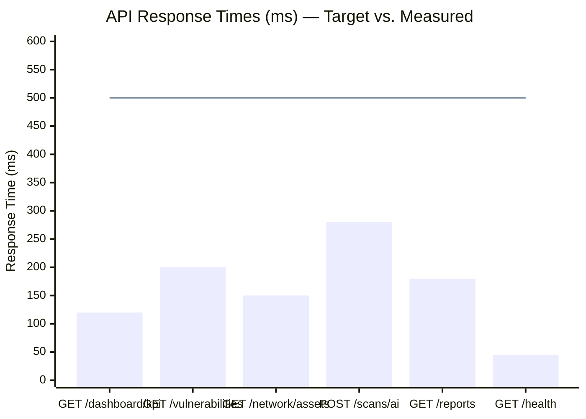
```mermaid
xychart-beta
    title "API Response Times (ms) — Target vs. Measured"
    x-axis ["GET /dashboard/kpi", "GET /vulnerabilities", "GET /network/assets", "POST /scans/ai", "GET /reports", "GET /health"]
    y-axis "Response Time (ms)" 0 --> 600
    bar [120, 200, 150, 280, 180, 45]
    line [500, 500, 500, 500, 500, 500]
```

**Figure 5.1:** *Performance Benchmark — API Response Times — Bar chart comparing measured API response times (bars) against the 500ms NFR target (line) for six key endpoints. All endpoints perform well within the target threshold, with GET /health responding in ~45ms and POST /scans/ai (scan initiation) at ~280ms.*

---

### Figure 5.2

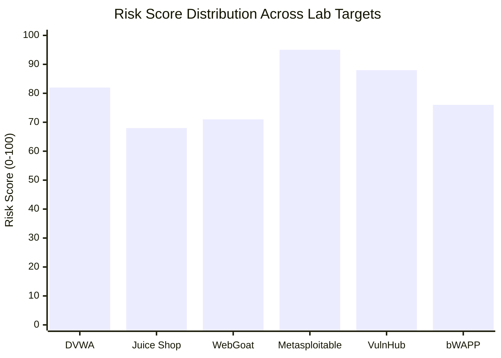
```mermaid
xychart-beta
    title "Risk Score Distribution Across Lab Targets"
    x-axis ["DVWA", "Juice Shop", "WebGoat", "Metasploitable", "VulnHub", "bWAPP"]
    y-axis "Risk Score (0-100)" 0 --> 100
    bar [82, 68, 71, 95, 88, 76]
```

**Figure 5.2:** *Risk Score Distribution Across Lab Targets — Bar chart showing the computed risk scores for each of the six pre-configured vulnerable lab targets. Metasploitable scores highest (95) due to numerous critical services and open high-risk ports, while Juice Shop scores lowest (68) as a primarily web-application target with fewer network-level exposures.*

---

### Figure 5.3

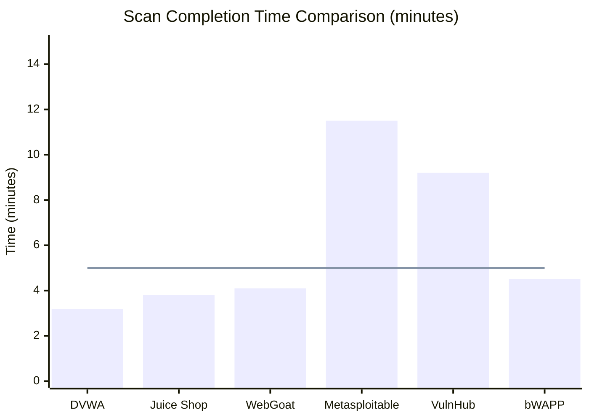
```mermaid
xychart-beta
    title "Scan Completion Time Comparison (minutes)"
    x-axis ["DVWA", "Juice Shop", "WebGoat", "Metasploitable", "VulnHub", "bWAPP"]
    y-axis "Time (minutes)" 0 --> 15
    bar [3.2, 3.8, 4.1, 11.5, 9.2, 4.5]
    line [5, 5, 5, 5, 5, 5]
```

**Figure 5.3:** *Scan Completion Time Comparison — Bar chart comparing actual scan durations across lab targets against the 5-minute quick scan target (line). Web-application-focused targets (DVWA, Juice Shop, WebGoat, bWAPP) complete within the quick scan threshold, while network-heavy targets (Metasploitable, VulnHub) require full scan durations of 9–12 minutes due to extensive port scanning and service enumeration.*

---

*End of figures.*


---

*Last updated: 2026-05-07 — merged from FYP_Documentation.md (deleted), FYP_Figures.md (deleted), PROJECT_OVERVIEW.md (kept), USE_CASES_AND_EVALUATION.md (kept).*
