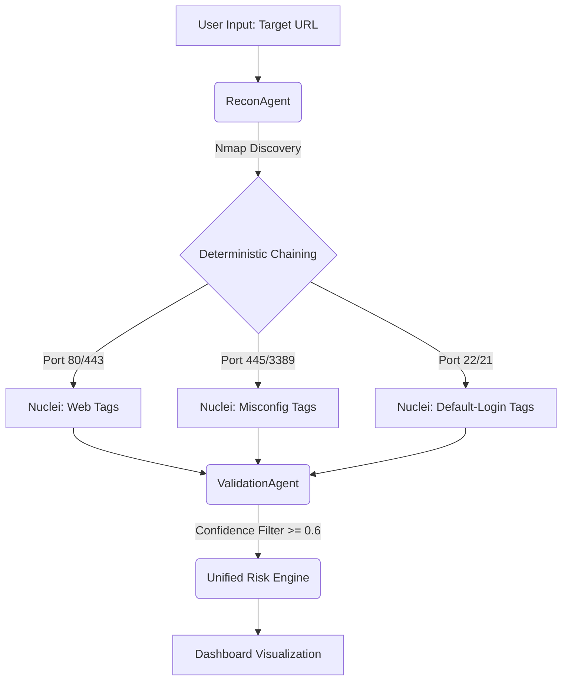
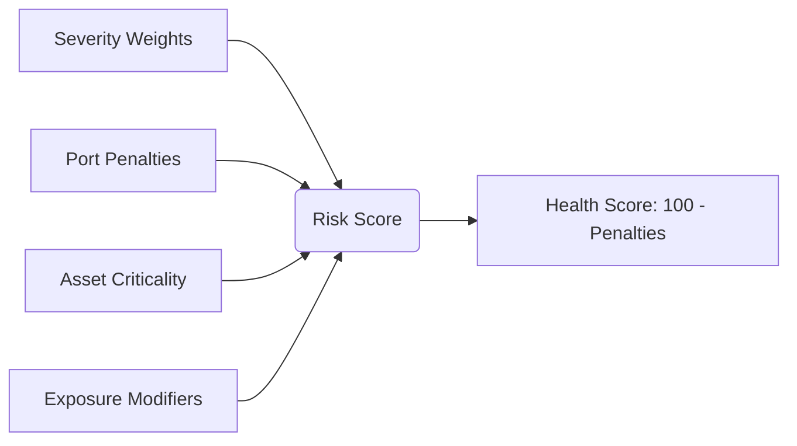
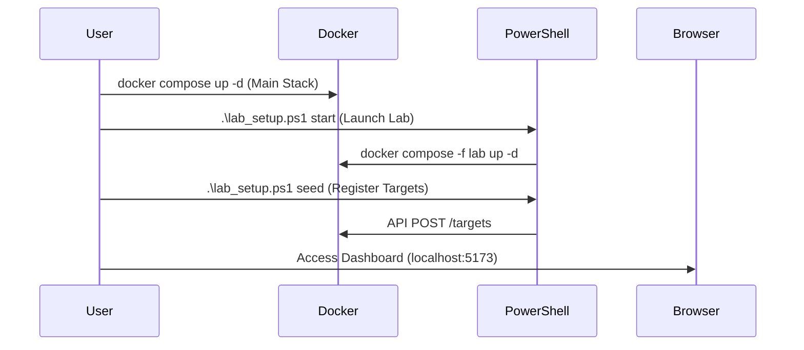

# Found 404: Zero-to-One Project Analysis
**Deterministic Security Orchestration for SMEs**

*فاوند 404: تحليل مشروع من الصفر إلى الواحد*
*التنسيق الأمني الحتمي للشركات الصغيرة والمتوسطة*

---

## 1. Executive Summary & Core Philosophy
**The "Why" Behind Found 404**

In the current cybersecurity landscape, Small and Medium Enterprises (SMEs) are frequently caught in a "protection gap." They lack the budget for a dedicated Security Operations Center (SOC) but face the same sophisticated threats as large enterprises. Most tools provide too many alerts with too little context, leading to **Alert Fatigue**.

**Core Philosophy:** 
Found 404 is built on the principle of **Deterministic Orchestration**. Unlike traditional scanners that indiscriminately fire tests at a target, Found 404 uses a structured, rule-based approach to "chain" tools. It prioritizes discovery and validation over raw volume, moving from *Information Discovery* to *Actionable Intelligence*.

---

### 1. الملخص التنفيذي والفلسفة الأساسية
**"السبب" وراء فاوند 404**

في المشهد الحالي للأمن السيبراني، غالبًا ما تقع الشركات الصغيرة والمتوسطة (SMEs) في "فجوة حماية". فهي تفتقر إلى الميزانية المخصصة لمركز عمليات أمنية (SOC) ولكنها تواجه نفس التهديدات المعقدة التي تواجهها المؤسسات الكبيرة. توفر معظم الأدوات عددًا كبيرًا جدًا من التنبيهات مع سياق قليل جدًا، مما يؤدي إلى **إرهاق التنبيهات (Alert Fatigue)**.

**الفلسفة الأساسية:**
تم بناء فاوند 404 على مبدأ **التنسيق الحتمي (Deterministic Orchestration)**. على عكس الماسحات الضوئية التقليدية التي تطلق اختبارات عشوائية على الهدف، يستخدم فاوند 404 نهجًا منظمًا قائمًا على القواعد لـ "تسلسل" الأدوات. فهو يعطي الأولوية للاكتشاف والتحقق على الحجم الخام، وينتقل من *اكتشاف المعلومات* إلى *الذكاء القابل للتنفيذ*.

---

## 2. Functional Mechanics
**Under the Hood: The Four-Stage Pipeline**

The system operates via the `AgentOrchestrator`, which manages a sequence of specialized agents to solve the problem of fragmented security data.

### 2. الآليات الوظيفية
**ما تحت الغطاء: خط الأنابيب المكون من أربع مراحل**

يعمل النظام عبر المنسق `AgentOrchestrator`، والذي يدير تسلسلاً من الوكلاء المتخصصين لحل مشكلة البيانات الأمنية المجزأة.

### The 4-Stage Agent Pipeline
*(خط أنابيب الوكلاء المكون من 4 مراحل)*



*   **Discovery (ReconAgent):** Uses `Nmap` for infrastructure mapping and `Playwright` for web application crawling. It identifies the "attack surface" (ports, services, and URL endpoints).
*   **Targeted Chaining (AttackAgent):** This is the brain of the system. It maps discovered services (e.g., `ssh`, `http`, `smb`) to specific vulnerability templates in `Nuclei`.
    *   *Example:* If Port 445 (SMB) is found, it triggers SMB-specific configuration checks rather than wasting traffic on web-based SQLi tests.
*   **Validation (ValidationAgent):** Instead of reporting every potential hit, it applies a deterministic confidence filter (≥ 0.6) and uses AI to assist in weeding out false positives for complex cases (e.g., BOLA).
*   **Scoring (UnifiedRiskEngine):** Translates technical CVE data into business risk using a 0-100 scale.

---
*   **الاكتشاف (ReconAgent):** يستخدم `Nmap` لرسم خريطة البنية التحتية و `Playwright` لزحف تطبيقات الويب. يحدد "سطح الهجوم" (المنافذ والخدمات ونقاط نهاية عناوين URL).
*   **التسلسل الموجه (AttackAgent):** هذا هو عقل النظام. يقوم بتعيين الخدمات المكتشفة (مثل `ssh`، `http`، `smb`) لقوالب ثغرات محددة في `Nuclei`.
    *   *مثال:* إذا تم العثور على المنفذ 445 (SMB)، فإنه يطلق فحوصات تكوين خاصة بـ SMB بدلاً من إضاعة حركة المرور على اختبارات SQLi المستندة إلى الويب.
*   **التحقق (ValidationAgent):** بدلاً من الإبلاغ عن كل إصابة محتملة، فإنه يطبق مرشح ثقة حتمي (≥ 0.6) ويستخدم الذكاء الاصطناعي للمساعدة في التخلص من الإيجابيات الكاذبة للحالات المعقدة (مثل BOLA).
*   **تسجيل المخاطر (UnifiedRiskEngine):** يترجم البيانات الفنية لـ CVE إلى مخاطر تجارية باستخدام مقياس من 0 إلى 100.

### Risk Calculation Logic
*(منطق حساب المخاطر)*



---

## 3. Deployment & User Guide
**The Lab Environment: From Ground Zero to First Scan**

Found 404 is designed for containerized deployment, making it portable and easy to reset.

### 3. دليل النشر والمستخدم
**بيئة المختبر: من الصفر إلى الفحص الأول**

تم تصميم فاوند 404 للنشر في حاويات (Containers)، مما يجعله محمولاً وسهل إعادة الضبط.

### First-Time Setup
*(الإعداد لأول مرة)*

### Deployment Workflow
*(سير عمل النشر)*



1.  **Environment Preparation:** Ensure Docker and PowerShell are installed.
2.  **Launch the System:** 
    ```powershell
    docker compose up -d
    ```
    This starts the FastAPI backend, Postgres DB, Redis, and the Vite/React frontend.
3.  **Setup the Lab:**
    ```powershell
    .\lab_setup.ps1 start
    ```
    This launches the "Test Triples" (Juice Shop, Corporate Net, Exposed API).
4.  **Seed Targets:**
    ```powershell
    .\lab_setup.ps1 seed
    ```
    Registers the lab assets into the dashboard database via the API.
5.  **Access the Command Center:** Open `http://localhost:5173` in your browser.

---
1.  **تجهيز البيئة:** تأكد من تثبيت Docker و PowerShell.
2.  **تشغيل النظام:**
    ```powershell
    docker compose up -d
    ```
    هذا يبدأ تشغيل الواجهة الخلفية FastAPI، وقاعدة بيانات Postgres، و Redis، والواجهة الأمامية Vite/React.
3.  **إعداد المختبر:**
    ```powershell
    .\lab_setup.ps1 start
    ```
    يطلق هذا "الثلاثيات الاختبارية" (Juice Shop، وشبكة الشركة، وواجهة API المكشوفة).
4.  **تغذية الأهداف:**
    ```powershell
    .\lab_setup.ps1 seed
    ```
    يسجل أصول المختبر في قاعدة بيانات لوحة القيادة عبر واجهة برمجة التطبيقات (API).
5.  **الوصول إلى مركز القيادة:** افتح `http://localhost:5173` في متصفحك.

---

## 4. Operational Workflow
**Lifecycle of a Security Scan**

1.  **Trigger:** User initiates a scan via the Dashboard UI (Vite/React).
2.  **Queueing:** The request hits the FastAPI endpoint and is pushed to `Celery` (running on `Redis`).
3.  **Execution:** The `AgentOrchestrator` instantiates the pipeline:
    *   `Nmap` scans the target IP range.
    *   Assets found (e.g., `172.30.0.50`) are stored in `ScanAsset`.
    *   `Nuclei` runs targeted tags against discovered services.
4.  **Processing:** Findings are ingested into the `Vulnerability` table.
5.  **Scoring:** The `UnifiedRiskEngine` runs `update_scan_risk()`, calculating the `risk_score`.
6.  **Action:** The engine generates `ActionItems` (REMEDIATION or CONFIGURATION) for the IT admin.
7.  **Closure:** The user views the pulsing nodes in the D3.js Network Graph and follows the AI-suggested remediation.

---

### 4. سير العمل التشغيلي
**دورة حياة الفحص الأمني**

1.  **التشغيل:** يبدأ المستخدم عملية فحص عبر واجهة مستخدم لوحة القيادة (Vite/React).
2.  **الاصطفاف في قائمة الانتظار:** يصل الطلب إلى نقطة نهاية FastAPI ويتم دفعه إلى `Celery` (الذي يعمل على `Redis`).
3.  **التنفيذ:** يقوم `AgentOrchestrator` بإنشاء خط الأنابيب:
    *   يقوم `Nmap` بمسح نطاق IP المستهدف.
    *   يتم تخزين الأصول التي تم العثور عليها (مثل `172.30.0.50`) في `ScanAsset`.
    *   يقوم `Nuclei` بتشغيل علامات مستهدفة ضد الخدمات المكتشفة.
4.  **المعالجة:** يتم إدخال النتائج في جدول `Vulnerability` (الثغرات).
5.  **التسجيل:** يقوم محرك `UnifiedRiskEngine` بتشغيل `update_scan_risk()`، مع حساب `risk_score` (درجة المخاطر).
6.  **الإجراء:** يقوم المحرك بإنشاء `ActionItems` (عناصر الإجراء: معالجة أو تكوين) لمسؤول تقنية المعلومات.
7.  **الإغلاق:** يعرض المستخدم العقد النابضة في الرسم البياني للشبكة D3.js ويتبع المعالجة المقترحة بالذكاء الاصطناعي.

---

## 5. Orchestration & Automation
**Managing Complex technical Orchestration**

Automation resides primarily in the `AgentOrchestrator` and `Celery` task queue.

*   **Task Management:** Celery handles the asynchronous nature of scans, ensuring the UI remains responsive even when thousands of Nmap probes are in flight.
*   **Component Communication:**
    *   **Backend & Tools:** Python wrappers for `Nmap` and `Nuclei` parse stdout/JSON into structured SQLAlchemy models.
    *   **AI Integration:** The `IntelligenceAgent` (Gemini 1.5 Flash) acts as a **Technical Educator**, not a decision-maker. It explains *why* a risk matters and *how* to fix it, reducing the need for the human admin to be a security expert.
*   **Deterministic Logic:** The orchestration logic is "hard-coded" for reliability. The system follows strict maps like `SERVICE_TO_TEMPLATE` to ensure predictable behavior and minimized network noise.

---

### 5. التنسيق والأتمتة
**إدارة التنسيق التقني المعقد**

تكمن الأتمتة بشكل أساسي في `AgentOrchestrator` وقائمة مهام `Celery`.

*   **إدارة المهام:** يتعامل Celery مع الطبيعة غير المتزامنة لعمليات الفحص، مما يضمن بقاء واجهة المستخدم سريعة الاستجابة حتى عندما يكون هناك الآلاف من مجسات Nmap قيد التنفيذ.
*   **تواصل المكونات:**
    *   **الخلفية والأدوات:** تقوم أغلفة بايثون لـ `Nmap` و `Nuclei` بتحليل المخرجات/JSON إلى نماذج SQLAlchemy منظمة.
    *   **تكامل الذكاء الاصطناعي:** يعمل `IntelligenceAgent` (Gemini 1.5 Flash) كـ **معلم تقني**، وليس صانع قرار. فهو يشرح *سبب* أهمية الخطر و*كيفية* إصلاحه، مما يقلل من حاجة المسؤول البشري ليكون خبيرًا أمنيًا.
*   **المنطق الحتمي:** تم برمجة منطق التنسيق بشكل "ثابت" (hard-coded) من أجل الموثوقية. يتبع النظام خرائط صارمة مثل `SERVICE_TO_TEMPLATE` لضمان سلوك متوقع وتقليل ضجيج الشبكة إلى أقصى حد.

---

## 6. Value Proposition
**The SME Efficiency Multiplier**

*   **Time Savings:** Automatically correlates "Nmap finds port" with "Nuclei finds bug," saving hours of manual tool hopping.
*   **Effort Reduction:** The `UnifiedRiskEngine` filters out noise. You don't see 1,000 logs; you see 5 **Action Items**.
*   **Centralized Operations:** Acts as a "Single Pane of Glass." From network topology visualization to PoC (Proof of Concept) scripts and remediation advice, everything lives in one dashboard.
*   **Risk Translation:** Converts abstract technical jargon (CVE-2023-XXXX) into business impact ("High Risk: Patient Data Exposure"), allowing solo admins to communicate priorities to non-technical stakeholders.

---

### 6. عرض القيمة
**مضاعف كفاءة الشركات الصغيرة والمتوسطة**

*   **توفير الوقت:** يربط تلقائيًا "Nmap يعثر على منفذ" مع "Nuclei يعثر على خطأ"، مما يوفر ساعات من التنقل اليدوي بين الأدوات.
*   **تقليل الجهد:** يقوم `UnifiedRiskEngine` بتصفية الضوضاء. أنت لا ترى 1000 سجل، بل ترى 5 **عناصر قابلة للتنفيذ (Action Items)**.
*   **العمليات المركزية:** يعمل بمثابة "لوحة زجاجية واحدة" (المنصة الموحدة). من تصور طوبولوجيا الشبكة إلى نصوص إثبات المفهوم (PoC) ونصائح الإصلاح، يعيش كل شيء في لوحة قيادة واحدة.
*   **ترجمة المخاطر:** يحول المصطلحات التقنية المجردة (CVE-2023-XXXX) إلى تأثير تجاري حقيقي ("خطر عالٍ: الكشف عن بيانات المرضى")، مما يسمح للمسؤولين المستقلين بتوصيل الأولويات لأصحاب المصلحة غير التقنيين.

---
*Analysis prepared by Antigravity AI | Project Repo: the-dashboard-project-*
*أُعد هذا التحليل بواسطة Antigravity AI | مستودع المشروع: the-dashboard-project-*
