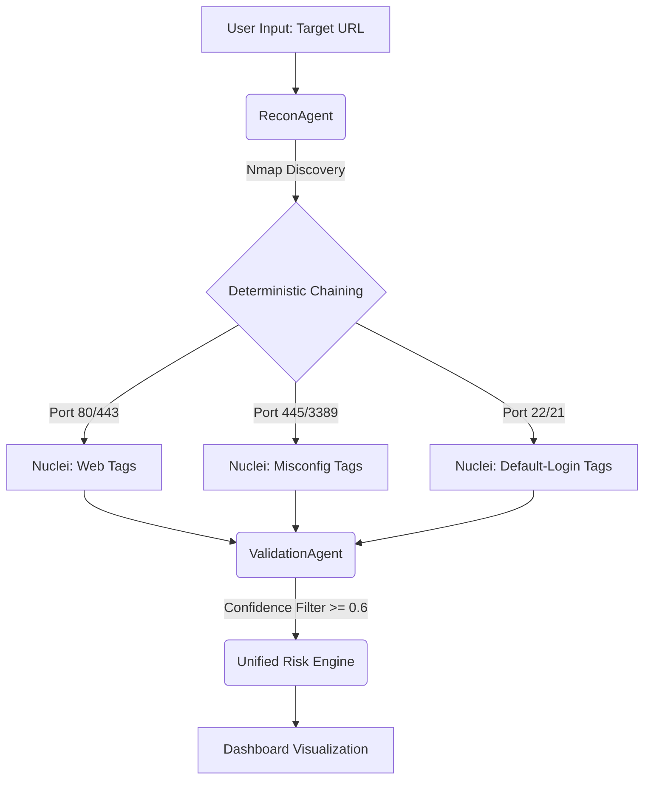
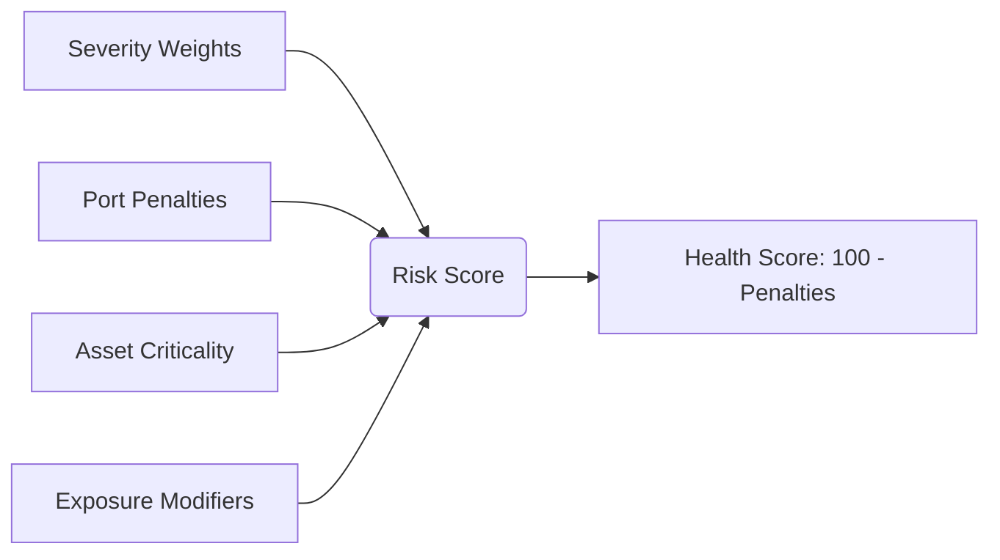
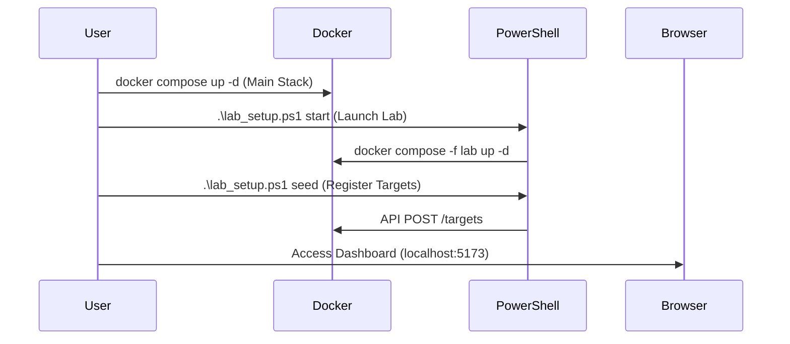

# Found 404: Zero-to-One Project Analysis
**Deterministic Security Orchestration for SMEs**

---

## 1. Executive Summary & Core Philosophy
**The "Why" Behind Found 404**

In the current cybersecurity landscape, Small and Medium Enterprises (SMEs) are frequently caught in a "protection gap." They lack the budget for a dedicated Security Operations Center (SOC) but face the same sophisticated threats as large enterprises. Most tools provide too many alerts with too little context, leading to **Alert Fatigue**.

**Core Philosophy:** 
Found 404 is built on the principle of **Deterministic Orchestration**. Unlike traditional scanners that indiscriminately fire tests at a target, Found 404 uses a structured, rule-based approach to "chain" tools. It prioritizes discovery and validation over raw volume, moving from *Information Discovery* to *Actionable Intelligence*.

---

## 2. Functional Mechanics
**Under the Hood: The Four-Stage Pipeline**

The system operates via the `AgentOrchestrator`, which manages a sequence of specialized agents to solve the problem of fragmented security data.

### The 4-Stage Agent Pipeline


*   **Discovery (ReconAgent):** Uses `Nmap` for infrastructure mapping and `Playwright` for web application crawling. It identifies the "attack surface" (ports, services, and URL endpoints).
*   **Targeted Chaining (AttackAgent):** This is the brain of the system. It maps discovered services (e.g., `ssh`, `http`, `smb`) to specific vulnerability templates in `Nuclei`.
    *   *Example:* If Port 445 (SMB) is found, it triggers SMB-specific configuration checks rather than wasting traffic on web-based SQLi tests.
*   **Validation (ValidationAgent):** Instead of reporting every potential hit, it applies a deterministic confidence filter (≥ 0.6) and uses AI to assist in weeding out false positives for complex cases (e.g., BOLA).
*   **Scoring (UnifiedRiskEngine):** Translates technical CVE data into business risk using a 0-100 scale.

### Risk Calculation Logic


---

## 3. Deployment & User Guide
**The Lab Environment: From Ground Zero to First Scan**

Found 404 is designed for containerized deployment, making it portable and easy to reset.

### First-Time Setup
### Deployment Workflow


1.  **Environment Preparation:** Ensure Docker and PowerShell are installed.
2.  **Launch the System:** 
    ```powershell
    docker compose up -d
    ```
    This starts the FastAPI backend, Postgres DB, Redis, and the Vite/React frontend.
3.  **Setup the Lab:**
    ```powershell
    .\lab_setup.ps1 start
    ```
    This launches the "Test Triples" (Juice Shop, Corporate Net, Exposed API).
4.  **Seed Targets:**
    ```powershell
    .\lab_setup.ps1 seed
    ```
    Registers the lab assets into the dashboard database via the API.
5.  **Access the Command Center:** Open `http://localhost:5173` in your browser.

---

## 4. Operational Workflow
**Lifecycle of a Security Scan**

1.  **Trigger:** User initiates a scan via the Dashboard UI (Vite/React).
2.  **Queueing:** The request hits the FastAPI endpoint and is pushed to `Celery` (running on `Redis`).
3.  **Execution:** The `AgentOrchestrator` instantiates the pipeline:
    *   `Nmap` scans the target IP range.
    *   Assets found (e.g., `172.30.0.50`) are stored in `ScanAsset`.
    *   `Nuclei` runs targeted tags against discovered services.
4.  **Processing:** Findings are ingested into the `Vulnerability` table.
5.  **Scoring:** The `UnifiedRiskEngine` runs `update_scan_risk()`, calculating the `risk_score`.
6.  **Action:** The engine generates `ActionItems` (REMEDIATION or CONFIGURATION) for the IT admin.
7.  **Closure:** The user views the pulsing nodes in the D3.js Network Graph and follows the AI-suggested remediation.

---

## 5. Orchestration & Automation
**Managing Complex technical Orchestration**

Automation resides primarily in the `AgentOrchestrator` and `Celery` task queue.

*   **Task Management:** Celery handles the asynchronous nature of scans, ensuring the UI remains responsive even when thousands of Nmap probes are in flight.
*   **Component Communication:**
    *   **Backend & Tools:** Python wrappers for `Nmap` and `Nuclei` parse stdout/JSON into structured SQLAlchemy models.
    *   **AI Integration:** The `IntelligenceAgent` (Gemini 1.5 Flash) acts as a **Technical Educator**, not a decision-maker. It explains *why* a risk matters and *how* to fix it, reducing the need for the human admin to be a security expert.
*   **Deterministic Logic:** The orchestration logic is "hard-coded" for reliability. The system follows strict maps like `SERVICE_TO_TEMPLATE` to ensure predictable behavior and minimized network noise.

---

## 6. Value Proposition
**The SME Efficiency Multiplier**

*   **Time Savings:** Automatically correlates "Nmap finds port" with "Nuclei finds bug," saving hours of manual tool hopping.
*   **Effort Reduction:** The `UnifiedRiskEngine` filters out noise. You don't see 1,000 logs; you see 5 **Action Items**.
*   **Centralized Operations:** Acts as a "Single Pane of Glass." From network topology visualization to PoC (Proof of Concept) scripts and remediation advice, everything lives in one dashboard.
*   **Risk Translation:** Converts abstract technical jargon (CVE-2023-XXXX) into business impact ("High Risk: Patient Data Exposure"), allowing solo admins to communicate priorities to non-technical stakeholders.

---
*Analysis prepared by Antigravity AI | Project Repo: the-dashboard-project-*
