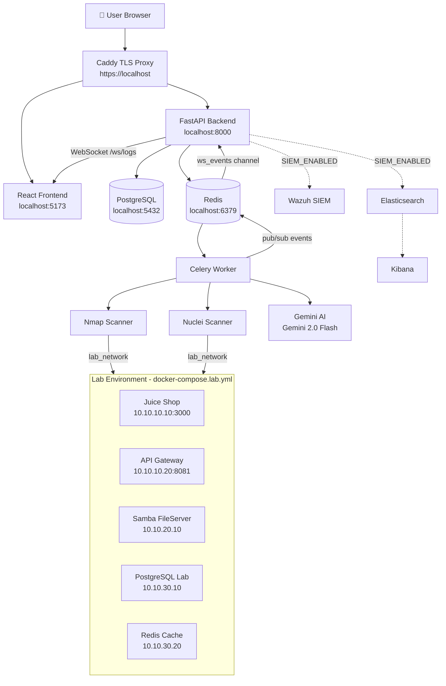

# Omar Tarek — Documentation & Presentation Lead
# عمر طارق — مسؤول التوثيق والعرض التقديمي

> **Sub-Team:** 4 — DevOps & QA | **الفريق الفرعي:** 4 — العمليات وضمان الجودة
> **Stack:** Markdown, Mermaid.js, PowerPoint/Google Slides, OBS Studio, Swagger/OpenAPI

---

## Role Summary | ملخص الدور

**English:** Omar Tarek owns everything that goes on paper and on screen during the presentation. He writes and maintains the academic project report, creates and manages the presentation slides, writes the demo script (what exactly to say and click), records the demo video, and ensures every API endpoint appears in the Swagger documentation. He is the team's "voice on paper" — if the code is the body of the project, the docs are its face.

**عربي:** عمر طارق يمتلك كل ما يُكتب على الورق ويُعرض على الشاشة خلال التقديم. يكتب ويحافظ على تقرير المشروع الأكاديمي، وينشئ ويدير شرائح العرض، ويكتب سكريبت العرض التوضيحي (ما يجب قوله بالضبط والنقر عليه)، ويسجّل الفيديو التوضيحي، ويضمن ظهور كل نقطة نهاية API في توثيق Swagger. هو "صوت الفريق على الورق" — إذا كان الكود جسم المشروع، فالتوثيق هو وجهه.

---

## Files He Owns | الملفات التي يمتلكها

| File | What it does | ماذا تفعل |
|------|-------------|-----------|
| `FYP_Documentation.md` | Main academic project report | تقرير المشروع الأكاديمي الرئيسي |
| `FYP_Figures.md` | Figures, diagrams, architecture images | الأرقام، المخططات، صور المعمارية |
| `PROJECT_OVERVIEW.md` | Non-technical project summary | ملخص المشروع غير التقني |
| `HOW_TO_RUN.md` | Setup guide (keep in sync with actual setup) | دليل الإعداد |
| `HARDENING_PLAN.md` | Security hardening decisions + rationale | قرارات التصلّب الأمني |

## Files to Create | الملفات التي يجب إنشاؤها

| File | Purpose | الغرض |
|------|---------|-------|
| `FINAL_PRESENTATION.md` | Slide outline + talking points per speaker | مخطط الشرائح + نقاط الحديث |
| `demo/demo_script.md` | Word-for-word demo script | سكريبت العرض الحرفي |
| `demo/demo_checklist.md` | Pre-demo checklist (docker up, lab ready, etc.) | قائمة تحقق ما قبل العرض |
| `docs/API_GUIDE.md` | Non-Swagger API guide for non-technical reviewers | دليل API لغير التقنيين |
| `docs/ARCHITECTURE_DIAGRAM.md` | Mermaid diagram of full system architecture | مخطط Mermaid للمعمارية الكاملة |

---

## Key Content Explained | شرح المحتوى الرئيسي

### `docs/ARCHITECTURE_DIAGRAM.md` — Mermaid System Diagram

**English:** Mermaid.js is a text-based diagram language — you write diagram code in Markdown and GitHub/many tools render it as a visual diagram. Omar Tarek must write the full architecture diagram showing how all services connect.

**عربي:** Mermaid.js هي لغة مخططات نصية — تكتب كود المخطط في Markdown وتُصيّره GitHub/أدوات كثيرة كمخطط بصري. يجب على عمر طارق كتابة مخطط المعمارية الكامل يُظهر كيف تتصل جميع الخدمات.



**عربي لمخطط Mermaid:**
```
المستخدم → Caddy (HTTPS) → Frontend (React) أو Backend (FastAPI)
Backend → PostgreSQL (بيانات) + Redis (قائمة مهام)
Redis → Celery Worker → Nmap + Nuclei + Gemini AI
Celery → Redis (pub/sub) → Backend → WebSocket → Frontend
Nmap/Nuclei → شبكة المختبر → حاويات ضعيفة (Juice Shop، SMB، Redis، إلخ)
```

---

### The 5-Section Academic Report Structure

**English:** The `FYP_Documentation.md` must follow academic report format. Omar Tarek writes and maintains all sections. Every team member contributes content to their own section, but Omar Tarek formats, edits, and assembles the final document.

**عربي:** يجب أن يتبع `FYP_Documentation.md` تنسيق التقرير الأكاديمي. عمر طارق يكتب ويحافظ على جميع الأقسام. كل عضو في الفريق يساهم بمحتوى قسمه الخاص، لكن عمر طارق يُنسّق ويحرّر ويجمع الوثيقة النهائية.

```markdown
# Orchestration Security Center — SME Cybersecurity Dashboard
# Final Year Project Report

## 1. Abstract (Omar Tarek writes this — 200 words)
One paragraph summarizing: what the problem is, what we built, 
how it works, what results we achieved.

## 2. Introduction
- 2.1 Problem Statement: SMEs lack dedicated security teams
- 2.2 Proposed Solution: Orchestration Security Center — AI-driven DAST platform
- 2.3 Project Scope: What we include and what we exclude
- 2.4 Report Structure: What each chapter covers

## 3. Literature Review
- Existing security tools (Nessus, Qualys, etc.) — why they don't work for SMEs
- AI in cybersecurity — current state of the art
- DAST vs. SAST — why we chose DAST

## 4. System Design & Architecture
- 4.1 System Architecture (include Mermaid diagram)
- 4.2 Database Schema (Reem provides this)
- 4.3 Agent Pipeline Design (Yousef provides this)
- 4.4 Lab Environment Design (Shahd provides this)

## 5. Implementation
- 5.1 Backend (Reem + Yousef + Shaban)
- 5.2 Frontend (Marize + Omnia + Rahma)
- 5.3 Security Engine (Shahd + Mariz)
- 5.4 DevOps & Infrastructure (Omar Kapil)

## 6. Testing & Results
- 6.1 Unit Tests (Yosef)
- 6.2 E2E Tests (Mazin)
- 6.3 Demo Results (scan results from lab)
- 6.4 Performance metrics

## 7. Conclusion & Future Work
- What we achieved vs. original goals
- Known limitations
- What the next version would add

## 8. References
- All cited papers, tools, and documentation
```

---

### `demo/demo_script.md` — The Word-for-Word Script

**English:** This is the most critical document Omar Tarek creates. Every team member follows this script during the presentation to ensure a smooth, professional demo. It specifies WHO speaks, WHAT they say, and WHAT they click.

**عربي:** هذا أهم وثيقة ينشئها عمر طارق. كل عضو في الفريق يتبع هذا السكريبت خلال التقديم لضمان عرض سلس واحترافي. يحدد من يتحدث، وما يقوله، وما ينقر عليه.

```markdown
# Orchestration Security Center — Final Demo Script
# July 2, 2026

## Pre-Demo Checklist (Omar Kapil runs this 30 minutes before)
- [ ] docker compose up -d → wait for "Application startup complete"
- [ ] lab_setup.ps1 start → verify 6 lab containers running
- [ ] https://localhost → dashboard loads (accept cert warning)
- [ ] http://localhost:3000 → Juice Shop loads
- [ ] All 5 scan targets visible in Targets tab

---

## Segment 1: Introduction (Omar Kapil — 3 minutes)

**SPEAKER:** Omar Kapil
**SLIDE:** Slide 1 — Project Title
**SAY:**
"Good morning. We are team Orchestration Security Center. 
 Small and medium enterprises make up 90% of businesses in Egypt, 
 but they cannot afford a dedicated security analyst. 
 Orchestration Security Center is our solution — an AI-driven security platform that 
 automatically discovers vulnerabilities, explains them in plain English, 
 and tells business owners exactly what to fix first.
 
 Today we will demonstrate the platform live against a simulated 
 SME network we built specifically for this purpose."

---

## Segment 2: Backend & AI Demo (Reem Amin — 5 minutes)

**SPEAKER:** Reem Amin
**SCREEN:** Browser open at http://localhost:8000/docs
**SAY:**
"This is the Orchestration Security Center API, built with FastAPI.
 It has 40+ endpoints organized by function:
 targets, scans, vulnerabilities, reports, and authentication.
 
 [CLICK on /scans/ai endpoint, expand it]
 
 This is our AI scan trigger — a POST request with just a target URL
 launches the entire 5-agent AI pipeline automatically."

---

## Segment 3: Live Demo (Omar Kapil — 10 minutes)

**SPEAKER:** Omar Kapil
**SCREEN:** https://localhost (dashboard)

Step 1: [CLICK on Targets tab]
**SAY:** "Here are our 5 lab targets — representing a real SME network."

Step 2: [CLICK Initiate Scan on lab_webserver (Juice Shop)]
**SAY:** "We're scanning the Juice Shop — our simulated e-commerce platform."

Step 3: [SWITCH to Orchestration Feed tab]
**SAY:** "Watch the AI agents working in real time..."
[POINT to log entries as they appear: RECON, ATTACK, VALIDATE, RISK]

Step 4: [WAIT for scan to complete — ~2-3 minutes]
**SAY:** "The scan is complete. Risk score: 95 out of 100 — Critical."

Step 5: [CLICK on the red node in Network Topology]
**SAY:** "Clicking on this node opens the Asset Detail Panel..."
[POINT to the AI advisory text]
"The AI explains: this is a public-facing e-commerce site with SQL injection
 and broken authentication vulnerabilities. A breach here would expose 
 customer payment data."

Step 6: [CLICK on Reports tab]
**SAY:** "One click exports a PDF report formatted for both
 the IT admin and the business owner."

Step 7: [SHOW Action Center]
**SAY:** "Instead of 200 raw vulnerability lines,
 Orchestration Security Center gives 5 prioritized action items.
 Item 1: Patch SQL injection in the user login endpoint. Immediate priority."
```

---

### Swagger/OpenAPI Documentation

**English:** FastAPI automatically generates Swagger docs at `http://localhost:8000/docs`. But Omar Tarek must ensure every endpoint has:
- A clear `summary` (one-line description)
- A `description` (what it does, when to use it)
- Example request/response bodies
- Correct `tags` (groups in the Swagger UI)

He checks these by reading the endpoint files and asking Reem to add descriptions where missing.

**عربي:** يولّد FastAPI تلقائيًا توثيق Swagger على `http://localhost:8000/docs`. لكن يجب على عمر طارق ضمان أن كل نقطة نهاية لديها:
- `summary` واضح (وصف من سطر واحد)
- `description` (ما تفعله، متى تستخدمها)
- أمثلة على نصوص الطلب/الاستجابة
- `tags` صحيحة (مجموعات في واجهة Swagger)

يتحقق من هذه بقراءة ملفات نقاط النهاية ويطلب من ريم إضافة وصف حيث يكون مفقودًا.

```python
# Example: What good FastAPI documentation looks like (Reem adds this, Omar Tarek checks)
@router.post(
    "/scans/ai",
    summary="Trigger AI-powered security scan",
    description="""
    Launches the full 5-agent AI scan pipeline against the specified target.
    
    The scan runs asynchronously in the background via Celery.
    This endpoint returns immediately with the scan ID — use GET /scans/{id}
    to poll for status, or connect to WebSocket /ws/logs for real-time progress.
    
    **Scan stages:** RECON → ATTACK → VALIDATE → RISK ENGINE → REPORT
    """,
    tags=["Scans"],
    response_model=ScanResponse,
)
async def trigger_ai_scan(body: ScanCreate, db: Session = Depends(get_db)):
    ...
```

---

## What Omar Tarek Must Learn | ما يجب على عمر طارق تعلّمه

| Topic | Why | لماذا |
|-------|-----|-------|
| Mermaid.js: `flowchart`, `sequenceDiagram`, `classDiagram` | Write architecture diagrams in Markdown | كتابة مخططات المعمارية |
| Swagger/OpenAPI: how to navigate the `/docs` page | Verify all endpoints are documented | التحقق من توثيق جميع نقاط النهاية |
| Academic report writing: abstract, methodology, results | Produce a professional FYP document | إنتاج وثيقة مشروع احترافية |
| OBS Studio (or Loom): screen recording | Record the 3-5 min demo video | تسجيل الفيديو التوضيحي |
| PowerPoint/Google Slides: layout, presenter notes | Create the presentation deck | إنشاء شرائح العرض |
| Git: reading commits, `git log --oneline` | Document what was built each phase | توثيق ما تم بناؤه |

**Resources | الموارد:**
- Mermaid.js: https://mermaid.js.org/syntax/flowchart.html
- FastAPI OpenAPI docs: https://fastapi.tiangolo.com/tutorial/path-operation-configuration/
- OBS Studio: https://obsproject.com/
- Academic writing guide: https://www.scribbr.com/category/dissertation/

---

## Phase 3–4 Timeline | الجدول الزمني للمرحلتين 3 و4

| Week | Task | المهمة |
|------|------|-------|
| 10 | Write `ARCHITECTURE_DIAGRAM.md` (full Mermaid diagram) | كتابة مخطط المعمارية |
| 11 | Draft `FINAL_PRESENTATION.md` outline; assign speakers | مسودة مخطط العرض؛ تعيين المتحدثين |
| 12 | Write `demo_script.md` step-by-step | كتابة سكريبت العرض خطوة بخطوة |
| 13 | Update `FYP_Documentation.md` with Phase 3 work | تحديث التقرير بعمل المرحلة 3 |
| 14 | Record demo video (3–5 min); first slide deck draft | تسجيل الفيديو؛ مسودة الشرائح |
| 15 | Apply dry-run feedback; finalize all documents | تطبيق ملاحظات التجربة؛ إنهاء الوثائق |
| 16 | **Presentation Day — manage slides, Q&A notes** | **يوم التقديم — إدارة الشرائح** |

---

## Presentation Duty | دور التقديم

**English:** Omar Tarek manages the slide deck during the presentation — he advances slides on cue from each speaker. He also keeps a notepad for Q&A: writing down questions the examiners ask so the team can reference them if needed.

**عربي:** عمر طارق يدير شرائح العرض أثناء التقديم — يُقدّم الشرائح بإشارة من كل متحدث. كما يحتفظ بدفتر ملاحظات للأسئلة والأجوبة: يكتب الأسئلة التي يطرحها الممتحنون حتى يتمكن الفريق من الرجوع إليها إذا لزم الأمر.
